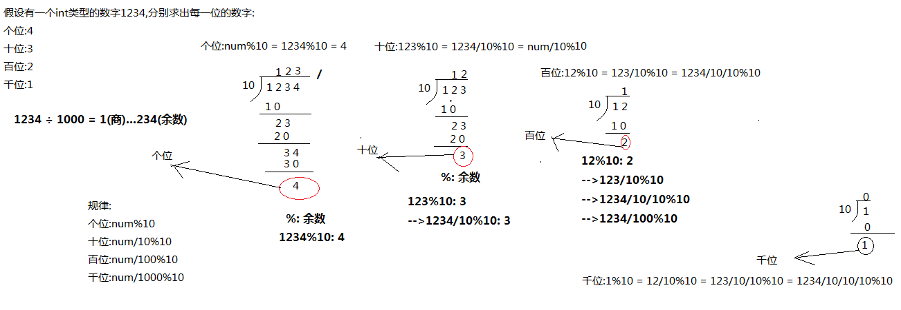

### 编程题一

```java
需求:
	身高是具有遗传性的，子女的身高和父母的身高有一定的关系。假定，父母和子女的身高遗传关系如下：
	儿子身高（厘米）＝(父亲身高＋母亲身高) ×1.08÷2
	女儿身高（厘米）＝(父亲身高×0.923＋母亲身高) ÷2
现有父亲身高177CM,母亲身高165CM。求子女身高分别预计为多少？
```


##### 您的代码:

```java
/*
    需求:
        身高是具有遗传性的，子女的身高和父母的身高有一定的关系。假定，父母和子女的身高遗传关系如下：
        儿子身高（厘米）＝(父亲身高＋母亲身高) ×1.08÷2
        女儿身高（厘米）＝(父亲身高×0.923＋母亲身高) ÷2
        现有父亲身高177CM,母亲身高165CM。求子女身高分别预计为多少？

    实现步骤:
        1.定义两个int变量h1和h2,代表父亲和母亲的身高,并初始化
        2.根据题目需求计算儿子身高,保存int变量h3中
        3.根据题目需求计算女儿身高,保存int变量h4中
        4.打印h3和h4的值
 */
public class Test01 {
    public static void main(String[] args) {
        //1.定义两个int变量h1和h2,代表父亲和母亲的身高,并初始化
        int h1 = 177, h2 = 165;
        //2.根据题目需求计算儿子身高,保存int变量h3中
        int h3 = (int) ((h1 + h2) * 1.08 / 2);
        //3.根据题目需求计算女儿身高,保存int变量h4中
        int h4 = (int) ((h1 * 0.923 + h2) / 2);
        //4.打印h3和h4的值
        System.out.println("儿子身高: " + h3 + "CM");
        System.out.println("女儿身高: " + h4 + "CM");
    }
}
```


### 编程题二

```java
需求:
	定义一个int类型的变量,初始化值为1234,求这个数的个位,十位,百位,千位分别是多少?
        
运行效果:
	1234的个位是4,十位是3,百位是2,千位是1
```


##### 您的代码:

```java
/*
    需求:
        定义一个int类型的变量,初始化值为1234,求这个数的个位,十位,百位,千位分别是多少?

    运行效果:
        1234的个位是4,十位是3,百位是2,千位是1

    实现步骤:
        1.定义int变量num,并初始化
        2.计算个位,十位,百位,千位分别保存int变量ge,shi,bai,qian中
        3.根据题目需求打印结果数据

        变量/常量.var: 自动分配变量
        new ...(..).var: 自动分配变量
        方法调用(..).var: 自动分配变量

        alt + 回车 和 ...var 具有相同的效果
 */
public class Test02 {
    public static void main(String[] args) {
        //1.定义int变量num,并初始化
        int num = 5678;
        //2.计算个位,十位,百位,千位分别保存int变量ge,shi,bai,qian中
        //计算个位
        int ge = num % 10;
        //计算十位
        int shi = num / 10 % 10;
        //计算百位
        int bai = num / 100 % 10;
        //计算千位
        int qian = num / 1000 % 10;
        //3.根据题目需求打印结果数据
        System.out.println(num + "的个位是" + ge + ",十位是" + shi + ",百位是" + bai + ",千位是" + qian);
    }
}
```

**以下图形中给出了解题思路**



### 题目三:

```
某外卖商家的菜品单价如下:
    1.鱼香肉丝每份24元,油炸花生米每份8元,米饭每份3元。
    2.优惠方式:
        总金额大于100元,总金额打9折,其它无折扣        
    3.需求:
        小明购买了3分鱼香肉丝,3份花生米,5份米饭,最终需要付多少钱?
```


##### 你的代码:

```java
/*
    需求:
        某外卖商家的菜品单价如下:
        1.鱼香肉丝每份24元,油炸花生米每份8元,米饭每份3元。
        2.优惠方式:
            总金额大于100元,总金额打9折,其它无折扣
        3.需求:
            小明购买了3分鱼香肉丝,3份花生米,5份米饭,最终需要付多少钱?

    实现步骤:
        1.定义三个int变量yxrs,yzhsm,mf,代表三个菜品的价格,并初始化
        2.根据小明的购买信息,计算优惠前的总价格,保存int变量price
        3.根据优惠方式计算小明购买菜品优惠后的价格,保存int变量afterPrice中
        4.打印输出结果数据
 */
public class Test03 {
    public static void main(String[] args) {
        //1.定义三个int变量yxrs,yzhsm,mf,代表三个菜品的价格,并初始化
        int yxrs = 24, yzhsm = 8, mf = 3;
        //2.根据小明的购买信息,计算优惠前的总价格,保存int变量price
        int price = yxrs * 3 + yzhsm * 3 + mf * 5;
        //3.根据优惠方式计算小明购买菜品优惠后的价格,保存int变量afterPrice中
        int afterPrice = (price > 100) ? (int) (price * 0.9) : price;
        //4.打印输出结果数据
        System.out.println("优惠前: " + price + "元, 优惠后: " + afterPrice + "元");
    }
}
```


### 题目四:

```
需求:
	动物园里有两只老虎，已知两只老虎的体重分别为180kg、200kg，
	请用程序实现判断两只老虎的体重是否相同。
```


##### 你的代码:

```java
/*
    需求:
        动物园里有两只老虎，已知两只老虎的体重分别为180kg、200kg，
	    请用程序实现判断两只老虎的体重是否相同

    实现步骤:
        1.定义两个int变量w1,w2,代表两只老虎的体重,并初始化
        2.使用三元运算符判断w1和w2是否相同,结果保存boolean变量result中
        3.打印结果数据result
 */
public class Test04 {
    public static void main(String[] args) {
        //1.定义两个int变量w1,w2,代表两只老虎的体重,并初始化
        int w1 = 180, w2 = 200;
        //2.使用三元运算符判断w1和w2是否相同,结果保存boolean变量result中
        boolean result = (w1 == w2) ? true : false;
        //3.打印结果数据result
        System.out.println("两只老虎体重是否相同呢? " + result);
        System.out.println("两只老虎体重是否相同呢? " + (w1 == w2));

        String str = (w1 == w2) ? "相等" : "不相等";

        System.out.println("两只老虎体重是否相同呢? " + str);
    }
}
```


### 题目五:

```java
需求:
	一座寺庙里住着三个和尚，已知他们的身高分别为150cm、210cm、165cm，
	请用程序实现获取这三个和尚的最高身高。
```


##### 你的代码:

```java
/*
    需求:
        一座寺庙里住着三个和尚，已知他们的身高分别为150cm、210cm、165cm，
	    请用程序实现获取这三个和尚的最小身高。

    实现步骤:
        1.创建键盘录入Scanner类的对象
        2.获取三个int数字,代表三个和尚的身高,分别保存int变量h1,h2,h3中
        3.使用三元运算符计算h1和h2的最小值,保存int变量temp中
        3.使用三元运算符计算temp和h3的最小值,保存int变量min中
        4.打印结果数据min
 */
public class Test05 {
    public static void main(String[] args) {
        //1.创建键盘录入Scanner类的对象
        Scanner sc = new Scanner(System.in);
        //2.获取三个int数字,代表三个和尚的身高,分别保存int变量h1,h2,h3中
        System.out.println("请输入第一个和尚的身高: ");
        int h1 = sc.nextInt();
        System.out.println("请输入第二个和尚的身高: ");
        int h2 = sc.nextInt();
        System.out.println("请输入第三个和尚的身高: ");
        int h3 = sc.nextInt();

        //3.使用三元运算符计算h1和h2的最小值,保存int变量temp中
        int temp = (h1 < h2) ? h1 : h2;
        //3.使用三元运算符计算temp和h3的最小值,保存int变量min中
        int min = (temp < h3) ? temp : h3;
        //4.打印结果数据min
        System.out.println("三个和尚的最小身高: " + min);
    }
}
```

### 注意:

​	**按需求完成以上题目一到题目五之后,请将五个题目中的数据获取方式全部改成从键盘获取数据**