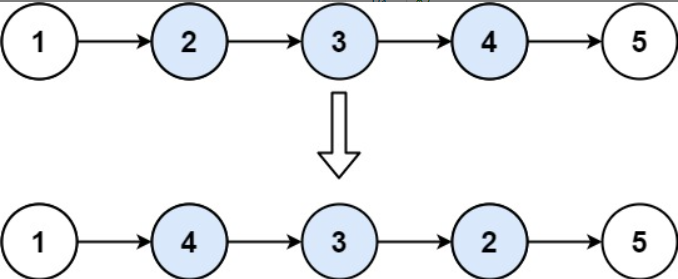

## **考试题目**

### 第一题（10分）

**需求**

目前有100名囚犯，每个囚犯的编号是1-200之间的随机数。现在要求依次随机生成100名囚犯的编号（要求这些囚犯的编号是不能重复的），然后让他们依次站成一排。(注：位置是从1开始计数的)，接下来，国王命令手下先干掉全部奇数位置处的人。剩下的人，又从新按位置1开始，再次干掉全部奇数位置处的人，依此类推，直到最后剩下一个人为止，剩下的这个人为幸存者。

**具体功能点的要求如下：**

请输出幸存者的编号，以及他第一次所占的位置值是多少。 

**评分细则**

* 能做出第一步：生产100个随机编号，且占位成功的，给3分。

* 能成功删除奇数位置处的数据的，给5分。

* 能正确获取结果的给2分。

  

### 第二题（14）

- User 实体类，包含如下属性 

  - private Long id;  // 用户id 名
  - private String gender;  //性别
  - private LocalDate birthday;  //生日
  - 注意需要提供 set和get方法，以及toString方法

- 新建测试类，类中 main 方法，在方法中完成如下业务逻辑：

  - **业务一：**

    - 有如下字符串，里面包含多个用户信息数据，现在需要你解析这个字符串，获取里面的用户数据，并封装到User对象中

    - 多个User对象在添加到List<User> 集合中

      ```java
      String userStrs = "10001:张三:男:1990-01-01#10002:李四:女:1989-01-09#10003:王五:男:1999-09-09#10004:刘备:男:1899-01-01#10005:孙悟空:男:1900-01-01#10006:张三:女:1999-01-01#10007:刘备:女:1999-01-01#10008:张三:女:2003-07-01#10009:猪八戒:男:1900-01-01";
      ```

    - 注意：

      - 字符串中的规则如下，多个用户用 # 拼接，用户的信息之间用 : 拼接。
      - 其中用户id和生日是需要进行类型转换的，其中id需要将String转成Long，生日需要将String转成LocalDate

  - **业务二：**

    - 遍历上面获取的List<User> 集合，统计里面每个名字出现的次数。
    - 封装到Map<String,Integer>集合中，集合的key就是名字，value就是名字出现的次数。
    - 最后遍历打印map数据，打印内容如下：
      - 张三：3次
      - 李四：5次


### 第三题（16）

**需求**：

某护士小花，作息规律为上二天班，休息一天，经常不确定休息日是否是周末（**注：首次休息日是2022年2月3日**）。

**具体功能点的要求如下**

1、请你开发一个程序，当小花输入年以及月后，立即显示出该月份的休息日详情。

示范（注意：示范信息重点在于参考格式，结果不一定是准确的，请自行确保计算结果正确性）：

**请小花输入查询的月份（月份必须是2022年2月之后的月份）： 2023-5 。**

**2023-5-1[休息]   2023-5-2   2023-5-3  2023-5-4[休息] ...** 

2、显示出该月份哪些休息日是周六或周日（请依次列出具体的日期和其星期信息）。

3、小花给自己设置了一个高考倒计时。高考的开始时间为：2023年06月07日 上午9：00 。**请利用给的素材代码（在Timer文件夹下）**，补全代码，产生一个如下的倒计时效果，倒计时格式如下图所示：


### 第四题（22分）

**需求：**

ArrayList集合是很重要的一种集合，请手工书写一个MyArrayList集合模拟ArrayList集合。

**具体功能点的要求如下：**

1、MyArrayList需要支持泛型，内部使用数组作为容器。

2、在MyArrayList中开发add方法，用于添加数据的，需要遵循ArrayList的扩容机制（自行设计代码，不需要与ArrayList的源代码一样，思想一致即可）

3、在MyArrayList中开发根据索引查询数据的get方法。

4、在MyArrayList中开发根据索引删除数据的remove方法。

5、在MyArrayList中开发一个获取集合大小的size ()方法。

6、能够在MyArrayList集合中开发一个forEach方法，这个方法支持使用Lambda进行遍历，至于函数式接口叫什么名称无所谓。

7、编写测试用例对自己编写的MyArrayList集合进行功能正确性测试。


### 第五题（16分）

**需求：**

给你一个按照非递减顺序排列的整数数组 `nums`，和一个目标值 `target`。请你找出给定目标值在数组中的开始位置和结束位置。

如果数组中不存在目标值 `target`，返回 `[-1, -1]`。

**注意：必须确保程序的时间复杂度是o(log2n)，否则不给分数**

**具体功能点的要求如下：**

```
数组 nums = [5,7,7,8,8,10], target = 8
得到结果是：[3,4]
```

```
数组：nums = [5,7,7,8,8,10], target = 6
得到结果是：[-1,-1]
```

```
数组：nums = [], target = 0
得到结果是：[-1,-1]
```

请设计一个方法完成以上需求，并编写测试代码完成上述测试。


### 第六题（22）

**需求**

给你单链表的头指针 head 和两个整数 left 和 right ，其中 left <= right 。请你反转从位置 left 到位置 right 的链表节点，并返回 反转后的链表 。

**示例 1：**



```
比如 head 指向的链表内容大致是 1,2,3,4,5 , left = 2, right = 4
反转后的链表就是 1,4,3,2,5

如果链表只有一个节点：head指向的是 5  ，left = 1, right = 1
反转后的链表就还是 5
```


**具体功能点的要求如下**

1、设计一个Node泛型类，用于代表链表的结点。每个结点包含（数据data，和下一个结点的地址值next） 3
2、开发一个类叫MyLinkedList，提供一个add方法可以让用户添加链表的结点，直到用户输入exit，则返回链表（返回链表实际上是返回链表的头结点） 5

3、提供一个reverse方法，接收头指针 head 和两个整数 left 和 right ，其中 left <= right，按上面的要求进行反转。反转后，返回新的链表 9

4、提供一个forEach方法，接收新链表，并对其进行遍历输出。 5

