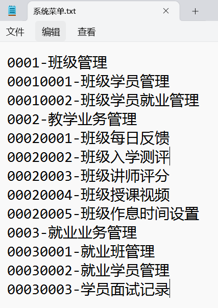

# 黑马黄埔班基础进阶考试

### 第一题（15）

**需求**

* 某小型商城系统的订单信息在**素材下的orders.xml文件中**，现在要求把xml中的订单信息，封装成一个一个的订单对象，将订单对象保存到ArrayList集合中。

**具体功能点要求**

1)   定义订单类Order，创 建ArrayList集合，用于存储订单Order对象 （解析XML 4分，封装成对象2分）

2）请使用Stream流找出今天之前的订单，并遍历输出。（3分）

3)   请使用Stream流找出集合中价格最贵的订流单，把这个订单的详细信息打印出来。（3分）

4)   请使用Stream流遍历集合中的每个订单，要求按照价格降序输出每个订单的详情。（3分）


### 第二题（10）

**需求**

* 某个班级组织团建活动，班长给出了几个去处给大家选择，分别是 “农家乐” , "轰趴"，“野外拓展”，“健身房”，本次活动每个学生是可以多选的。

* 现在有如下5名学生选择了如下去处。

```
张全蛋儿  农家乐,野外拓展
李二狗子  轰趴,野外拓展,健身房
翠花     野外拓展，
小帅     轰趴，健身房
有容     农家乐
```

**具体的功能点如下：**

1、请找出每个去处想去的人数是多少，并输出投票最多的去处是哪个。

2、请找出哪些人没有选择投票最多的去处，输出他们的名字。（**本案例用不用stream流做都给分**）

​		**比如：小帅，有容没有选择野外拓展。**


### 第三题 （15）

**需求**

* 黑马程序员教学管理系统的菜单信息如下（图1所示），菜单的详细数据存储在**给的素材文件“系统菜单.txt”中**。


**具体要实现的功能点如下所示**

1、请从**系统菜单.txt**中读取这些菜单信息，将这些菜单信息在控制台展示成图1的样子（必须确保展示的顺序是正确的）

2、将正确的菜单顺序，写出到一个新文件**"系统菜单2.txt"**中保存起来，详细格式如下



**评分细则**

* 能把数据读取出来：3分
* 能展示成控制台的样子：8分
* 能写出去：4分。

### 第四题（20）

**需求**

* 红包雨游戏，某企业有100名员工，员工的工号依次是1, 2，3, 4，..到100。现在公司举办了年会活动，活动中有一个红包雨环节，要求共计发出200个红包雨。其中小红包在[1 - 30]  元之间，总占比为80%，大红包[31-100]元，总占比为20%。

 **具体的功能点如下**

1、系统模拟上述要求产生200个红包。

2、模拟100个员工抢红包雨，需要输出哪个员工抢到哪个红包的过程，活动结束时需要提示活动结束。

3、活动结束后，请1对100名员工按照所抢红包的总金额进行降序排序展示，**例如：3号员工抢红包总计：293元、1号员工抢红包总计250元，....**

### 第五题（24）

**需求**

在实际开发中，很多系统都要完成用户登录和注册功能，但需要注意的是，用户注册的登录名和密码必须是发送给服务端进行保存的，**并且注册的登录名是不能重复的**，同时登录也是需要到服务端进行认证的。

**功能点具体要求**

1、开发一个客户端，具备注册，和登录功能，除非用户输入exit，否则不退出这个界面。

2、注册功能要求：可以发送登录名和密码给服务端，服务端要响应是否注册成功的结果给客户端。如果注册没有问题，服务端需要将用户注册的登录名和密码保存到文件中去。（**注：是什么文件，可自行确定**）

3、登录功能要求：用户输入登录名和密码，需要发送给服务端，服务端认证后需要把登录的结果发送给客户端接收。

**评分细则**

* 能开发出客户端，并成功发送注册信息给服务端接收  4
* 服务端能接收注册信息，并成功写出去到属性文件中去 9
* 客户端能正确收到服务端响应的注册信息。 2
* 客户端能成功发出登录信息，服务端能成功收到  3
* 服务端能正确认证登录是否成功  4
* 客户端能收到登录后的结果。 2


### 第六题 (16)  

**需求**

* **在素材demo6包下**，有生成链表的代码，目前Test类中已经为您创建了两个链表，分别是链表 **head1** ->  **2 → 4 → 1**，链表**head2** →  **4→ 1 → 3 。**

**具体功能点如下**

* 1、在MyLinkedList类中，开发一个sort方法，支持对链表进行升序排序，写完后需要分别测试对这两个链表排序，并分别遍历输出。

* 2、在MyLinkedList类中，开发一个mergeSort方法，支持将这两个升序排序的链表，再次合并成一个新链表，要求新链表中的节点仍然是递增排序的。

  示例1： 

  输入：head1 ->  **2 → 4 → 1**,      head2   →  **4 →  1  →  3**
  返回：head3 ->  **1->1->2->3->4->4**

**评分细则**

* 能正确排序并遍历链表：6分

* 能合并并排序：10分


