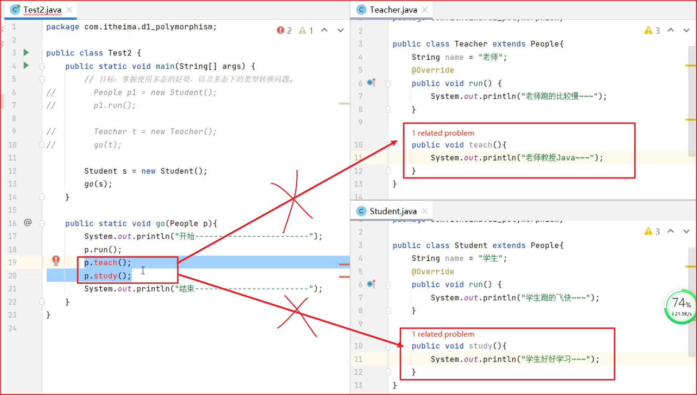
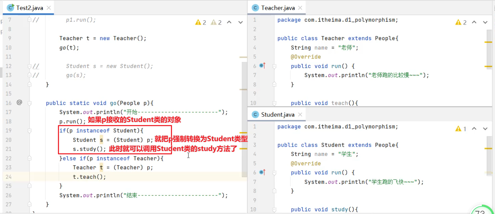
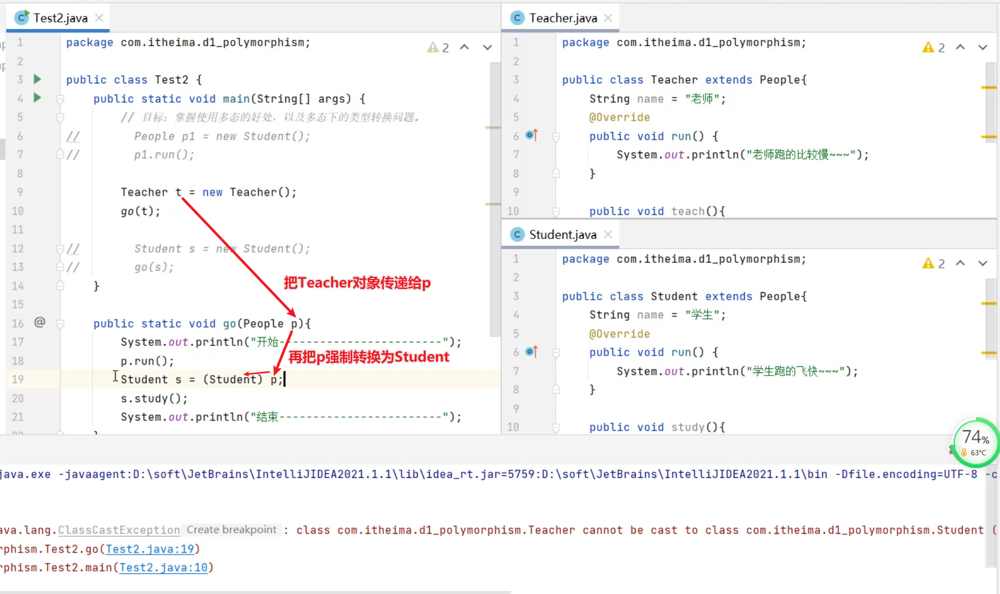
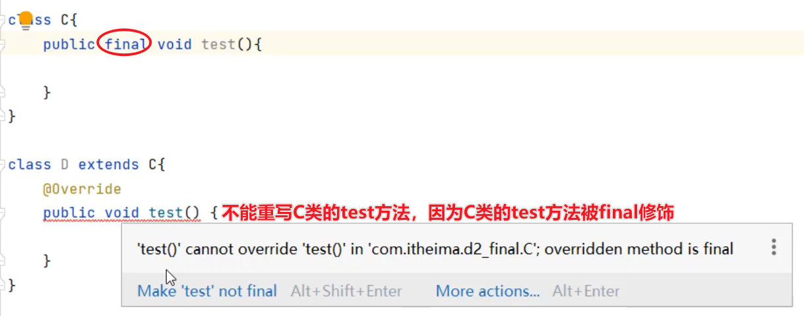
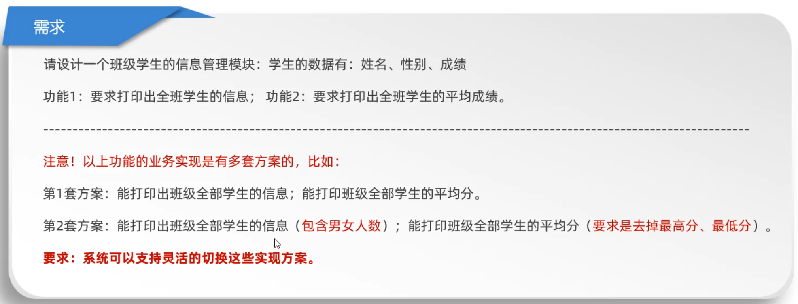

# day02——面向对象高级

今天我们继续学习面向对象的语法知识，我们今天学习的主要内容是：多态、抽象、接口。

学会这些语法知识，可以让我们编写代码更灵活，代码的复用性更高。

## 一、多态

接下来，我们学习面向对象三大特征的的最后一个特征——多态。

### 1.1 多态概述

> **什么是多态？**
>
> 多态是在继承、实现情况下的一种现象，表现为：对象多态、行为多态。

比如：Teacher和Student都是People的子类，代码可以写成下面的样子


### 1.2 多态的好处

各位同学，刚才我们认识了什么是多态。那么多态的写法有什么好处呢？

> 在多态形式下，右边的代码是解耦合的，更便于扩展和维护。

- 怎么理解这句话呢？比如刚开始p1指向Student对象，run方法执行的就是Student对象的业务；假如p1指向Student对象 ，run方法执行的自然是Student对象的业务。


> 定义方法时，使用父类类型作为形参，可以接收一切子类对象，扩展行更强，更便利。

```java
public class Test2 {
    public static void main(String[] args) {
        // 目标：掌握使用多态的好处
		Teacher t = new Teacher();
		go(t);

        Student s = new Student();
        go(s);
    }

    //参数People p既可以接收Student对象，也能接收Teacher对象。
    public static void go(People p){
        System.out.println("开始------------------------");
        p.run();
        System.out.println("结束------------------------");
    }
}
```


### 1.3 类型转换

虽然多态形式下有一些好处，但是也有一些弊端。在多态形式下，不能调用子类特有的方法，比如在Teacher类中多了一个teach方法，在Student类中多了一个study方法，这两个方法在多态形式下是不能直接调用的。



多态形式下不能直接调用子类特有方法，但是转型后是可以调用的。这里所说的转型就是把父类变量转换为子类类型。格式如下：

```java
//如果p接收的是子类对象
if(父类变量 instance 子类){
    //则可以将p转换为子类类型
    子类 变量名 = (子类)父类变量;
}
```



如果类型转换错了，就会出现类型转换异常ClassCastException，比如把Teacher类型转换成了Student类型.



关于多态转型问题，我们最终记住一句话：**原本是什么类型，才能还原成什么类型**


## 二、final关键字

各位同学，接下来我们学习一个在面向对象编程中偶尔会用到的一个关键字叫final，也是为后面学习抽象类和接口做准备的。

### 2.1 final修饰符的特点

我们先来认识一下final的特点，final关键字是最终的意思，可以修饰类、修饰方法、修饰变量。

```java
- final修饰类：该类称为最终类，特点是不能被继承
- final修饰方法：该方法称之为最终方法，特点是不能被重写。
- final修饰变量：该变量只能被赋值一次。
```

- 接下来我们分别演示一下，先看final修饰类的特点


- 再来演示一下final修饰方法的特点

  

- 再演示一下final修饰变量的特点

  - 情况一

  

  - 情况二

  

  - 情况三

  

  


### 2.2 补充知识：常量

刚刚我们学习了final修饰符的特点，在实际运用当中经常使用final来定义常量。先说一下什么是Java中的常量？

- 被 static final 修饰的成员变量，称之为常量。
- 通常用于记录系统的配置信息

接下来我们用代码来演示一下

```java
public class Constant {
    //常量: 定义一个常量表示学校名称
    //为了方便在其他类中被访问所以一般还会加上public修饰符
    //常量命名规范：建议都采用大写字母命名，多个单词之前有_隔开
    public static final String SCHOOL_NAME = "传智教育";
}
```

```java
public class FinalDemo2 {
    public static void main(String[] args) {
        //由于常量是static的所以，在使用时直接用类名就可以调用
        System.out.println(Constant.SCHOOL_NAME);
        System.out.println(Constant.SCHOOL_NAME);
        System.out.println(Constant.SCHOOL_NAME);
        System.out.println(Constant.SCHOOL_NAME);
        System.out.println(Constant.SCHOOL_NAME);
        System.out.println(Constant.SCHOOL_NAME);
        System.out.println(Constant.SCHOOL_NAME);
    }
}
```

- 关于常量的原理，同学们也可以了解一下：在程序编译后，常量会“宏替换”，出现常量的地方，全都会被替换为其记住的字面量。把代码反编译后，其实代码是下面的样子

```java
public class FinalDemo2 {
    public static void main(String[] args) {
        System.out.println("传智教育");
        System.out.println("传智教育"E);
        System.out.println("传智教育");
        System.out.println("传智教育");
        System.out.println("传智教育");
        System.out.println("传智教育");
        System.out.println("传智教育");
    }
}
```


## 三、抽象

同学们，接下来我们学习Java中一种特殊的类，叫抽象类。为了让同学们掌握抽象类，会先让同学们认识一下什么是抽象类以及抽象类的特点，再学习一个抽象类的常见应用场景。

### 3.1 认识抽象类

我们先来认识一下什么是抽象类，以及抽象类有什么特点。

- 在Java中有一个关键字叫abstract，它就是抽象的意思，它可以修饰类也可以修饰方法。

```java
- 被abstract修饰的类，就是抽象类
- 被abstract修饰的方法，就是抽象方法（不允许有方法体）
```

接下来用代码来演示一下抽象类和抽象方法

```java
//abstract修饰类，这个类就是抽象类
public abstract class A{
    //abstract修饰方法，这个方法就是抽象方法
    public abstract void test();
}
```

- 类的成员（成员变量、成员方法、构造器），类的成员都可以有。如下面代码

```java
// 抽象类
public abstract class A {
    //成员变量
    private String name;
    static String schoolName;

    //构造方法
    public A(){

    }

    //抽象方法
    public abstract void test();

    //实例方法
    public String getName() {
        return name;
    }

    public void setName(String name) {
        this.name = name;
    }
}
```

- 抽象类是不能创建对象的，如果抽象类的对象就会报错


- 抽象类虽然不能创建对象，但是它可以作为父类让子类继承。而且子类继承父类必须重写父类的所有抽象方法。

```java
//B类继承A类，必须复写test方法
public class B extends A {
    @Override
    public void test() {

    }
}
```

- 子类继承父类如果不复写父类的抽象方法，要想不出错，这个子类也必须是抽象类

```java
//B类基础A类，此时B类也是抽象类，这个时候就可以不重写A类的抽象方法
public abstract class B extends A {

}
```


### 3.2 抽象类的好处

接下来我们用一个案例来说一下抽象类的应用场景和好处。需求如下图所示


分析需求发现，该案例中猫和狗都有名字这个属性，也都有叫这个行为，所以我们可以将共性的内容抽取成一个父类，Animal类，但是由于猫和狗叫的声音不一样，于是我们在Animal类中将叫的行为写成抽象的。代码如下

```java
public abstract class Animal {
    private String name;

    //动物叫的行为：不具体，是抽象的
    public abstract void cry();

    public String getName() {
        return name;
    }

    public void setName(String name) {
        this.name = name;
    }
}
```

接着写一个Animal的子类，Dog类。代码如下

```java
public class Dog extends Animal{
    public void cry(){
        System.out.println(getName() + "汪汪汪的叫~~");
    }
}
```

然后，再写一个Animal的子类，Cat类。代码如下

```java
public class Cat extends Animal{
    public void cry(){
        System.out.println(getName() + "喵喵喵的叫~~");
    }
}
```

最后，再写一个测试类，Test类。

```java
public class Test2 {
    public static void main(String[] args) {
        // 目标：掌握抽象类的使用场景和好处.
        Animal a = new Dog();
        a.cry();	//这时执行的是Dog类的cry方法
    }
}
```

再学一招，假设现在系统有需要加一个Pig类，也有叫的行为，这时候也很容易原有功能扩展。只需要让Pig类继承Animal，复写cry方法就行。

```java
public class Pig extends Animal{
    @Override
    public void cry() {
        System.out.println(getName() + "嚯嚯嚯~~~");
    }
}
```

此时，创建对象时，让Animal接收Pig，就可以执行Pig的cry方法

```java
public class Test2 {
    public static void main(String[] args) {
        // 目标：掌握抽象类的使用场景和好处.
        Animal a = new Pig();
        a.cry();	//这时执行的是Pig类的cry方法
    }
}
```

综上所述，我们总结一下抽象类的使用场景和好处

```java
1.用抽象类可以把父类中相同的代码，包括方法声明都抽取到父类，这样能更好的支持多态，一提高代码的灵活性。

2.反过来用，我们不知道系统未来具体的业务实现时，我们可以先定义抽象类，将来让子类去实现，以方便系统的扩展。
```


### 3.3 模板方法模式

学习完抽象类的语法之后，接下来，我们学习一种利用抽象类实现的一种设计模式。先解释下一什么是设计模式？**设计模式是解决某一类问题的最优方案**。

设计模式在一些源码中经常会出现，还有以后面试的时候偶尔也会被问到，所以在合适的机会，就会给同学们介绍一下设计模式的知识。

那模板方法设计模式解决什么问题呢？**模板方法模式主要解决方法中存在重复代码的问题**

比如A类和B类都有sing()方法，sing()方法的开头和结尾都是一样的，只是中间一段内容不一样。此时A类和B类的sing()方法中就存在一些相同的代码。


怎么解决上面的重复代码问题呢？ 我们可以写一个抽象类C类，在C类中写一个doSing()的抽象方法。再写一个sing()方法，代码如下：

```java
// 模板方法设计模式
public abstract class C {
    // 模板方法
    public final void sing(){
        System.out.println("唱一首你喜欢的歌：");

        doSing();

        System.out.println("唱完了!");
    }

    public abstract void doSing();
}
```

然后，写一个A类继承C类，复写doSing()方法，代码如下

```java
public class A extends C{
    @Override
    public void doSing() {
        System.out.println("我是一只小小小小鸟，想要飞就能飞的高~~~");
    }
}
```

接着，再写一个B类继承C类，也复写doSing()方法，代码如下

```java
public class B extends C{
    @Override
    public void doSing() {
        System.out.println("我们一起学猫叫，喵喵喵喵喵喵喵~~");
    }
}
```

最后，再写一个测试类Test

```java
public class Test {
    public static void main(String[] args) {
        // 目标：搞清楚模板方法设计模式能解决什么问题，以及怎么写。
        B b = new B();
        b.sing();
    }
}
```

综上所述：模板方法模式解决了多个子类中有相同代码的问题。具体实现步骤如下

```java
第1步：定义一个抽象类，把子类中相同的代码写成一个模板方法。
第2步：把模板方法中不能确定的代码写成抽象方法，并在模板方法中调用。
第3步：子类继承抽象类，只需要父类抽象方法就可以了。
```


## 四、接口

同学们，接下来我们学习一个比抽象类抽象得更加彻底的一种特殊结构，叫做接口。在学习接口是什么之前，有一些事情需要给大家交代一下：Java已经发展了20多年了，在发展的过程中不同JDK版本的接口也有一些变化，所以我们在学习接口时，先以老版本为基础，学习完老版本接口的特性之后，再顺带着了解一些新版本接口的特性就可以了。

### 4.1 认识接口

我们先来认识一下接口？Java提供了一个关键字interface，用这个关键字来定义接口这种特殊结构。格式如下

```java
public interface 接口名{
    //成员变量（常量）
    //成员方法（抽象方法）
}
```

按照接口的格式，我们定义一个接口看看

```java
public interface A{
    //这里public static final可以加，可以不加。
    public static final String SCHOOL_NAME = "黑马程序员";
    
    //这里的public abstract可以加，可以不加。
    public abstract void test();
}
```

写好A接口之后，在写一个测试类，用一下

```java
public class Test{
    public static void main(String[] args){
        //打印A接口中的常量
        System.out.println(A.SCHOOL_NAME);
        
        //接口是不能创建对象的
        A a = new A();
    }
}
```

我们发现定义好接口之后，是不能创建对象的。那接口到底什么使用呢？需要我注意下面两点

- **接口是用来被类实现（implements）的，我们称之为实现类。**
- **一个类是可以实现多个接口的（接口可以理解成干爹），类实现接口必须重写所有接口的全部抽象方法，否则这个类也必须是抽象类**

比如，再定义一个B接口，里面有两个方法testb1()，testb2()

```java
public interface B {
    void testb1();
    void testb2();
}
```

接着，再定义一个C接口，里面有两个方法testc1(), testc2()

```java
public interface C {
    void testc1();
    void testc2();
}
```

然后，再写一个实现类D，同时实现B接口和C接口，此时就需要复写四个方法，如下代码

```java
// 实现类
public class D implements B, C{
    @Override
    public void testb1() {

    }

    @Override
    public void testb2() {

    }

    @Override
    public void testc1() {

    }

    @Override
    public void testc2() {

    }
}
```

最后，定义一个测试类Test

```java
public class Test {
    public static void main(String[] args) {
        // 目标：认识接口。
        System.out.println(A.SCHOOL_NAME);

        // A a = new A();
        D d = new D();
    }
}
```

### 4.2 接口的好处

同学们，刚刚上面我们学习了什么是接口，以及接口的基本特点。那使用接口到底有什么好处呢？主要有下面的两点

- 弥补了类单继承的不足，一个类同时可以实现多个接口。
- 让程序可以面向接口编程，这样程序员可以灵活方便的切换各种业务实现。

我们看一个案例演示，假设有一个Studnet学生类，还有一个Driver司机的接口，还有一个Singer歌手的接口。

现在要写一个A类，想让他既是学生，偶然也是司机能够开车，偶尔也是歌手能够唱歌。那我们代码就可以这样设计，如下：

```java
class Student{

}

interface Driver{
    void drive();
}

interface Singer{
    void sing();
}

//A类是Student的子类，同时也实现了Dirver接口和Singer接口
class A extends Student implements Driver, Singer{
    @Override
    public void drive() {

    }

    @Override
    public void sing() {

    }
}

public class Test {
    public static void main(String[] args) {
        //想唱歌的时候，A类对象就表现为Singer类型
        Singer s = new A();
        s.sing();
		
        //想开车的时候，A类对象就表现为Driver类型
        Driver d = new A();
        d.drive();
    }
}
```

综上所述：接口弥补了单继承的不足，同时可以轻松实现在多种业务场景之间的切换。


### 4.3 接口的案例

各位同学，关于接口的特点以及接口的好处我们都已经学习完了。接下来我们做一个案例，先来看一下案例需求.



首先我们写一个学生类，用来描述学生的相关信息

```java
public class Student {
    private String name;
    private char sex;
    private double score;

    public Student() {
    }

    public Student(String name, char sex, double score) {
        this.name = name;
        this.sex = sex;
        this.score = score;
    }

    public String getName() {
        return name;
    }

    public void setName(String name) {
        this.name = name;
    }

    public char getSex() {
        return sex;
    }

    public void setSex(char sex) {
        this.sex = sex;
    }

    public double getScore() {
        return score;
    }

    public void setScore(double score) {
        this.score = score;
    }
}
```

接着，写一个StudentOperator接口，表示学生信息管理系统的两个功能。

```java
public interface StudentOperator {
    void printAllInfo(ArrayList<Student> students);
    void printAverageScore(ArrayList<Student> students);
}
```

然后，写一个StudentOperator接口的实现类StudentOperatorImpl1，采用第1套方案对业务进行实现。

```java
public class StudentOperatorImpl1 implements StudentOperator{
    @Override
    public void printAllInfo(ArrayList<Student> students) {
        System.out.println("----------全班全部学生信息如下--------------");
        for (int i = 0; i < students.size(); i++) {
            Student s = students.get(i);
            System.out.println("姓名：" + s.getName() + ", 性别：" + s.getSex() + ", 成绩：" + s.getScore());
        }
        System.out.println("-----------------------------------------");
    }

    @Override
    public void printAverageScore(ArrayList<Student> students) {
        double allScore = 0.0;
        for (int i = 0; i < students.size(); i++) {
            Student s = students.get(i);
            allScore += s.getScore();
        }
        System.out.println("平均分：" + (allScore) / students.size());
    }
}
```

接着，再写一个StudentOperator接口的实现类StudentOperatorImpl2，采用第2套方案对业务进行实现。

```java
public class StudentOperatorImpl2 implements StudentOperator{
    @Override
    public void printAllInfo(ArrayList<Student> students) {
        System.out.println("----------全班全部学生信息如下--------------");
        int count1 = 0;
        int count2 = 0;
        for (int i = 0; i < students.size(); i++) {
            Student s = students.get(i);
            System.out.println("姓名：" + s.getName() + ", 性别：" + s.getSex() + ", 成绩：" + s.getScore());
            if(s.getSex() == '男'){
                count1++;
            }else {
                count2 ++;
            }
        }
        System.out.println("男生人数是：" + count1  + ", 女士人数是：" + count2);
        System.out.println("班级总人数是：" + students.size());
        System.out.println("-----------------------------------------");
    }

    @Override
    public void printAverageScore(ArrayList<Student> students) {
        double allScore = 0.0;
        double max = students.get(0).getScore();
        double min = students.get(0).getScore();
        for (int i = 0; i < students.size(); i++) {
            Student s = students.get(i);
            if(s.getScore() > max) max = s.getScore();
            if(s.getScore() < min) min = s.getScore();
            allScore += s.getScore();
        }
        System.out.println("学生的最高分是：" + max);
        System.out.println("学生的最低分是：" + min);
        System.out.println("平均分：" + (allScore - max - min) / (students.size() - 2));
    }
}
```

再写一个班级管理类ClassManager，在班级管理类中使用StudentOperator的实现类StudentOperatorImpl1对学生进行操作

```java
public class ClassManager {
    private ArrayList<Student> students = new ArrayList<>();
    private StudentOperator studentOperator = new StudentOperatorImpl1();

    public ClassManager(){
        students.add(new Student("迪丽热巴", '女', 99));
        students.add(new Student("古力娜扎", '女', 100));
        students.add(new Student("马尔扎哈", '男', 80));
        students.add(new Student("卡尔扎巴", '男', 60));
    }

    // 打印全班全部学生的信息
    public void printInfo(){
        studentOperator.printAllInfo(students);
    }

    // 打印全班全部学生的平均分
    public void printScore(){
        studentOperator.printAverageScore(students);
    }
}
```

最后，再写一个测试类Test，在测试类中使用ClassMananger完成班级学生信息的管理。

```java
public class Test {
    public static void main(String[] args) {
        // 目标：完成班级学生信息管理的案例。
        ClassManager clazz = new ClassManager();
        clazz.printInfo();
        clazz.printScore();
    }
}
```

注意：如果想切换班级管理系统的业务功能，随时可以将StudentOperatorImpl1切换为StudentOperatorImpl2。自己试试


### 4.4 接口JDK8的新特性

各位同学，对于接口最常见的特性我们都学习完了。随着JDK版本的升级，在JDK8版本以后接口中能够定义的成员也做了一些更新，从JDK8开始，接口中新增的三种方法形式。

我们看一下这三种方法分别有什么特点？

```java
public interface A {
    /**
     * 1、默认方法：必须使用default修饰，默认会被public修饰
     * 实例方法：对象的方法，必须使用实现类的对象来访问。
     */
    default void test1(){
        System.out.println("===默认方法==");
        test2();
    }

    /**
     * 2、私有方法：必须使用private修饰。(JDK 9开始才支持的)
     *   实例方法：对象的方法。
     */
    private void test2(){
        System.out.println("===私有方法==");
    }

    /**
     * 3、静态方法：必须使用static修饰，默认会被public修饰
     */
     static void test3(){
        System.out.println("==静态方法==");
     }

     void test4();
     void test5();
     default void test6(){

     }
}
```

接下来我们写一个B类，实现A接口。B类作为A接口的实现类，只需要重写抽象方法就尅了，对于默认方法不需要子类重写。代码如下：

```java
public class B implements A{
    @Override
    public void test4() {

    }

    @Override
    public void test5() {

    }
}
```

最后，写一个测试类，观察接口中的三种方法，是如何调用的

```java
public class Test {
    public static void main(String[] args) {
        // 目标：掌握接口新增的三种方法形式
        B b = new B();
        b.test1();	//默认方法使用对象调用
        // b.test2();	//A接口中的私有方法，B类调用不了
        A.test3();	//静态方法，使用接口名调用
    }
}
```

综上所述：JDK8对接口新增的特性，有利于对程序进行扩展。


### 4.5 接口的其他细节

最后，给同学们介绍一下使用接口的其他细节，或者说注意事项：

- 一个接口可以继承多个接口

```java
public class Test {
    public static void main(String[] args) {
        // 目标：理解接口的多继承。
    }
}

interface A{
    void test1();
}
interface B{
    void test2();
}
interface C{}

//比如：D接口继承C、B、A
interface D extends C, B, A{

}

//E类在实现D接口时，必须重写D接口、以及其父类中的所有抽象方法。
class E implements D{
    @Override
    public void test1() {

    }

    @Override
    public void test2() {

    }
}
```

接口除了上面的多继承特点之外，在多实现、继承和实现并存时，有可能出现方法名冲突的问题，需要了解怎么解决（仅仅只是了解一下，实际上工作中几乎不会出现这种情况）

```java
1.一个接口继承多个接口，如果多个接口中存在相同的方法声明，则此时不支持多继承
2.一个类实现多个接口，如果多个接口中存在相同的方法声明，则此时不支持多实现
3.一个类继承了父类，又同时实现了接口，父类中和接口中有同名的默认方法，实现类会有限使用父类的方法
4.一个类实现类多个接口，多个接口中有同名的默认方法，则这个类必须重写该方法。
```

综上所述：一个接口可以继承多个接口，接口同时也可以被类实现。


