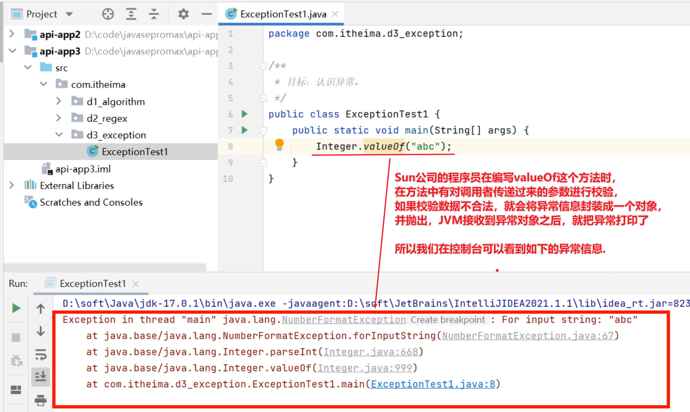
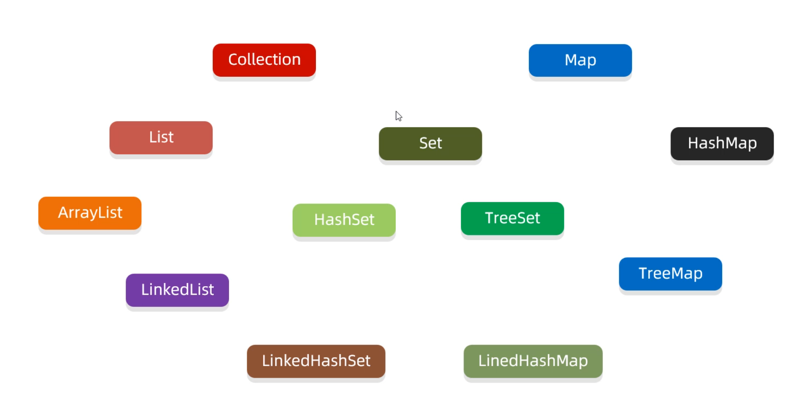
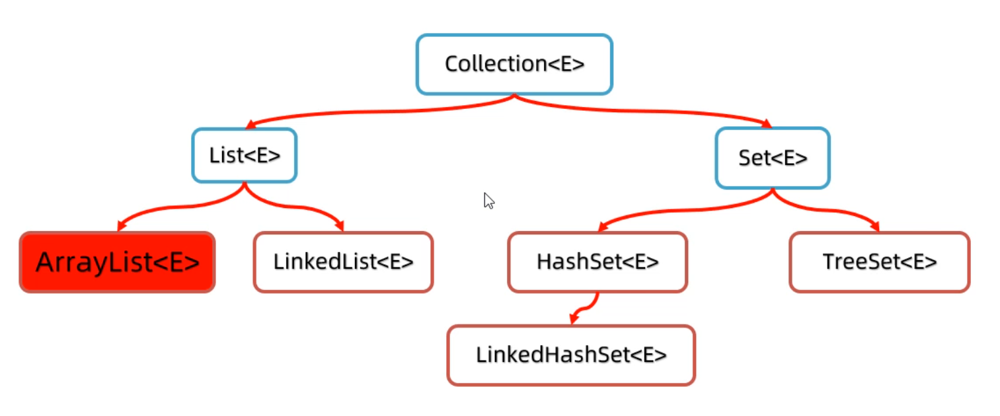
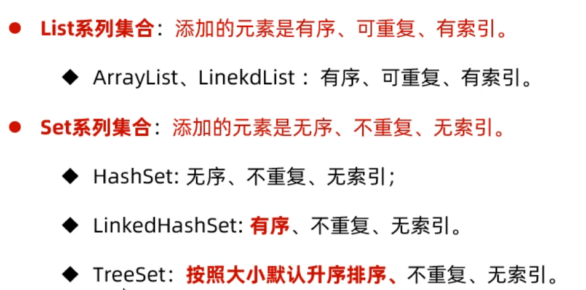
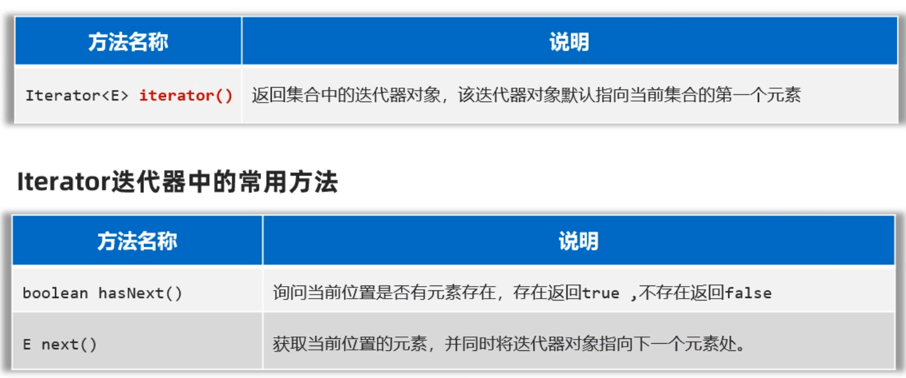
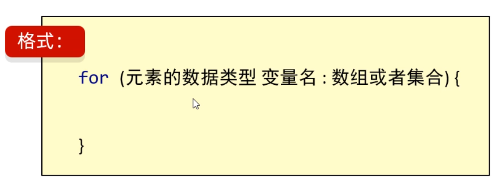
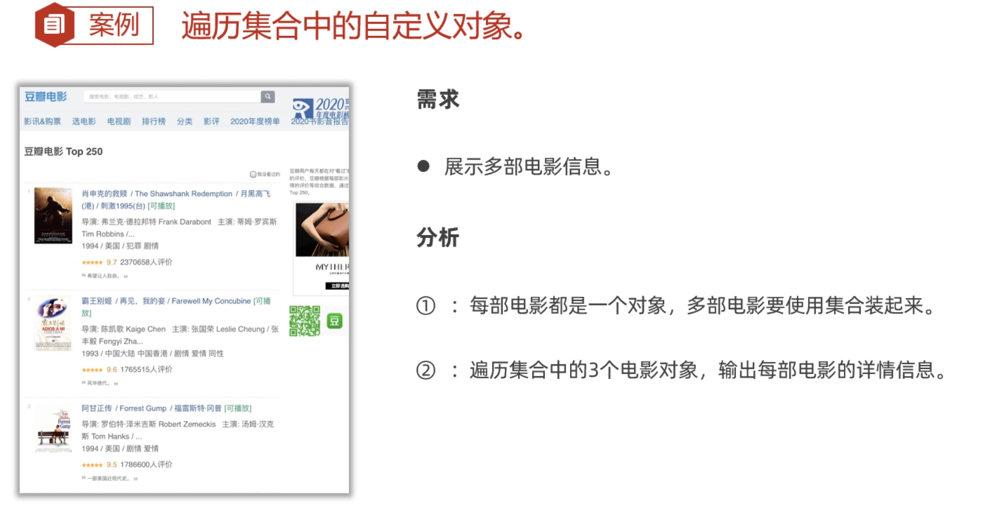
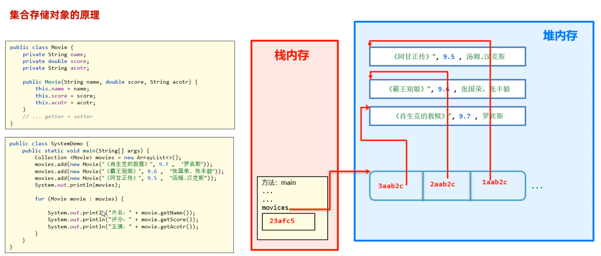
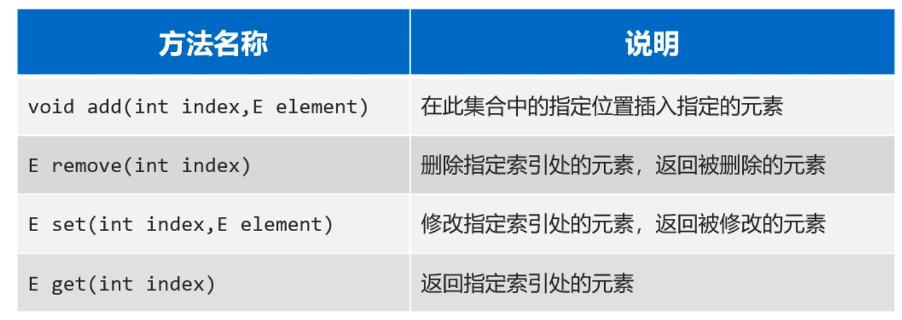

# day06—集合进阶（异常、集合）

## 一、异常

### 1.1 认识异常

接下来，我们学习一下异常，学习异常有利于我们处理程序中可能出现的问题。我先带着同学们认识一下，什么是异常？

我们阅读下面的代码，通过这段代码来认识异常。 我们调用一个方法时，经常一部小心就出异常了，然后在控制台打印一些异常信息。其实打印的这些异常信息，就叫做异常。

那肯定有同学就纳闷了，我写代码天天出异常，我知道这是异常啊！我们这里学习异常，其实是为了告诉你异常是怎么产生的？只有你知道异常是如何产生的，才能避免出现异常。以及产生异常之后如何处理。




因为写代码时经常会出现问题，Java的设计者们早就为我们写好了很多个异常类，来描述不同场景下的问题。而有些类是有共性的所以就有了异常的继承体系


> **先来演示一个运行时异常产生**

```java
int[] arr = {11,22,33};
//5是一个不存在的索引，所以此时产生ArrayIndexOutOfBoundsExcpetion
System.out.println(arr[5]); 
```

下图是API中对ArrayIndexOutOfBoundsExcpetion类的继承体系，以及告诉我们它在什么情况下产生。


> **再来演示一个编译时异常**

我们在调用SimpleDateFormat对象的parse方法时，要求传递的参数必须和指定的日期格式一致，否则就会出现异常。 Java比较贴心，它为了更加强烈的提醒方法的调用者，设计了编译时异常，它把异常的提醒提前了，你调用方法是否真的有问题，只要可能有问题就给你报出异常提示（红色波浪线）。

 **编译时异常的目的：意思就是告诉你，你小子注意了！！，这里小心点容易出错，仔细检查一下**


有人说，我检查过了，我确认我的代码没问题，为了让它不报错，继续将代码写下去。我们这里有两种解决方案。

- 第一种：使用throws在方法上声明，意思就是告诉下一个调用者，这里面可能有异常啊，你调用时注意一下。

```java
/**
 * 目标：认识异常。
 */
public class ExceptionTest1 {
    public static void main(String[] args) throws ParseException{
        SimpleDateFormat sdf = new SimpleDateFormat("yyyy-MM-dd HH:mm:ss");
        Date d = sdf.parse("2028-11-11 10:24");
        System.out.println(d);
    }
}
```

- 第二种：使用try...catch语句块异常进行处理。

```java
public class ExceptionTest1 {
    public static void main(String[] args) throws ParseException{
        try {
            SimpleDateFormat sdf = new SimpleDateFormat("yyyy-MM-dd HH:mm:ss");
            Date d = sdf.parse("2028-11-11 10:24");
            System.out.println(d);
        } catch (ParseException e) {
            e.printStackTrace();
        }
    }
}
```

好了，关于什么是异常，我们就先认识到这里。


### 1.2 自定义异常

同学们经过刚才的学习已经认识了什么是异常了，但是无法为这个世界上的全部问题都提供异常类，如果企业自己的某种问题，想通过异常来表示，那就需要自己来定义异常类了。

我们通过一个实际场景，来给大家演示自定义异常。

> 需求：写一个saveAge(int age)方法，在方法中对参数age进行判断，如果age<0或者>=150就认为年龄不合法，如果年龄不合法，就给调用者抛出一个年龄非法异常。
>
> 分析：Java的API中是没有年龄非常这个异常的，所以我们可以自定义一个异常类，用来表示年龄非法异常，然后再方法中抛出自定义异常即可。

- 先写一个异常类AgeIllegalException（这是自己取的名字，名字取得很奈斯），继承

```java
// 1、必须让这个类继承自Exception，才能成为一个编译时异常类。
public class AgeIllegalException extends Exception{
    public AgeIllegalException() {
    }

    public AgeIllegalException(String message) {
        super(message);
    }
}
```

- 再写一个测试类，在测试类中定义一个saveAge(int age)方法，对age判断如果年龄不在0~150之间，就抛出一个AgeIllegalException异常对象给调用者。

```java
public class ExceptionTest2 {
    public static void main(String[] args) {
        // 需求：保存一个合法的年
        try {
            saveAge2(225);
            System.out.println("saveAge2底层执行是成功的！");
        } catch (AgeIllegalException e) {
            e.printStackTrace();
            System.out.println("saveAge2底层执行是出现bug的！");
        }
    }

	//2、在方法中对age进行判断，不合法则抛出AgeIllegalException
    public static void saveAge(int age){
        if(age > 0 && age < 150){
            System.out.println("年龄被成功保存： " + age);
        }else {
            // 用一个异常对象封装这个问题
            // throw 抛出去这个异常对象
            throw new AgeIllegalRuntimeException("/age is illegal, your age is " + age);
        }
    }
}
```

- 注意咯，自定义异常可能是编译时异常，也可以是运行时异常

```java
1.如果自定义异常类继承Excpetion，则是编译时异常。
	特点：方法中抛出的是编译时异常，必须在方法上使用throws声明，强制调用者处理。
	
2.如果自定义异常类继承RuntimeException，则运行时异常。
	特点：方法中抛出的是运行时异常，不需要在方法上用throws声明。
```


### 1.3 异常处理

同学们，通过前面两小节的学习，我们已经认识了什么是异常，以及异常的产生过程。接下来就需要告诉同学们，出现异常该如何处理了。

比如有如下的场景：A调用用B，B调用C；C中有异常产生抛给B，B中有异常产生又抛给A；异常到了A这里就不建议再抛出了，因为最终抛出被JVM处理程序就会异常终止，并且给用户看异常信息，用户也看不懂，体验很不好。

此时比较好的做法就是：1.将异常捕获，将比较友好的信息显示给用户看；2.尝试重新执行，看是是否能修复这个问题。


我们看一个代码，main方法调用test1方法，test1方法调用test2方法，test1和test2方法中多有扔异常。

- 第一种处理方式是，在main方法中对异常进行try...catch捕获处理了，给出友好提示。

```java
public class ExceptionTest3 {
    public static void main(String[] args)  {
        try {
            test1();
        } catch (FileNotFoundException e) {
            System.out.println("您要找的文件不存在！！");
            e.printStackTrace(); // 打印出这个异常对象的信息。记录下来。
        } catch (ParseException e) {
            System.out.println("您要解析的时间有问题了！");
            e.printStackTrace(); // 打印出这个异常对象的信息。记录下来。
        }
    }

    public static void test1() throws FileNotFoundException, ParseException {
        SimpleDateFormat sdf = new SimpleDateFormat("yyyy-MM-dd HH:mm:ss");
        Date d = sdf.parse("2028-11-11 10:24:11");
        System.out.println(d);
        test2();
    }

    public static void test2() throws FileNotFoundException {
        // 读取文件的。
        InputStream is = new FileInputStream("D:/meinv.png");
    }
}
```

- 第二种处理方式是：在main方法中对异常进行捕获，并尝试修复

```java
/**
 * 目标：掌握异常的处理方式：捕获异常，尝试修复。
 */
public class ExceptionTest4 {
    public static void main(String[] args) {
        // 需求：调用一个方法，让用户输入一个合适的价格返回为止。
        // 尝试修复
        while (true) {
            try {
                System.out.println(getMoney());
                break;
            } catch (Exception e) {
                System.out.println("请您输入合法的数字！！");
            }
        }
    }

    public static double getMoney(){
        Scanner sc = new Scanner(System.in);
        while (true) {
            System.out.println("请您输入合适的价格：");
            double money = sc.nextDouble();
            if(money >= 0){
                return money;
            }else {
                System.out.println("您输入的价格是不合适的！");
            }
        }
    }
}
```

好了，到此我们关于异常的知识就全部学习完了。


## 二、集合概述和分类

### 2.1 集合的分类

同学们，前面我们已经学习过了ArrayList集合，但是除了ArrayList集合，Java还提供了很多种其他的集合，如下图所示：



我想你的第一感觉是这些集合好多呀！但是，我们学习时会对这些集合进行分类学习，如下图所示：一类是单列集合元素是一个一个的，另一类是双列集合元素是一对一对的。


在今天的课程中，主要学习Collection单列集合。Collection是单列集合的根接口，Collection接口下面又有两个子接口List接口、Set接口，List和Set下面分别有不同的实现类，如下图所示：



上图中各种集合的特点如下图所示：



可以自己写代码验证一下，各种集合的特点

```java
//简单确认一下Collection集合的特点
ArrayList<String> list = new ArrayList<>(); //存取顺序一致，可以重复，有索引
list.add("java1");
list.add("java2");
list.add("java1");
list.add("java2");
System.out.println(list); //[java1, java2, java1, java2] 

HashSet<String> list = new HashSet<>(); //存取顺序不一致，不重复，无索引
list.add("java1");
list.add("java2");
list.add("java1");
list.add("java2");
list.add("java3");
System.out.println(list); //[java3, java2, java1] 
```


### 2.2 Collection集合的常用方法

接下来，我们学习一下Collection集合的一些常用方法，这些方法所有Collection实现类都可以使用。 这里我们以创建ArrayList为例，来演示

```java
Collection<String> c = new ArrayList<>();
//1.public boolean add(E e): 添加元素到集合
c.add("java1");
c.add("java1");
c.add("java2");
c.add("java2");
c.add("java3");
System.out.println(c); //打印: [java1, java1, java2, java2, java3]

//2.public int size(): 获取集合的大小
System.out.println(c.size()); //5

//3.public boolean contains(Object obj): 判断集合中是否包含某个元素
System.out.println(c.contains("java1")); //true
System.out.println(c.contains("Java1")); //false

//4.pubilc boolean remove(E e): 删除某个元素，如果有多个重复元素只能删除第一个
System.out.println(c.remove("java1")); //true
System.out.println(c); //打印: [java1,java2, java2, java3]

//5.public void clear(): 清空集合的元素
c.clear(); 
System.out.println(c); //打印：[]

//6.public boolean isEmpty(): 判断集合是否为空 是空返回true 反之返回false
System.out.println(c.isEmpty()); //true

//7.public Object[] toArray(): 把集合转换为数组
Object[] array = c.toArray();
System.out.println(Arrays.toString(array)); //[java1,java2, java2, java3]

//8.如果想把集合转换为指定类型的数组，可以使用下面的代码
String[] array1 = c.toArray(new String[c.size()]);
System.out.println(Arrays.toString(array1)); //[java1,java2, java2, java3]

//9.还可以把一个集合中的元素，添加到另一个集合中
Collection<String> c1 = new ArrayList<>();
c1.add("java1");
c1.add("java2");
Collection<String> c2 = new ArrayList<>();
c2.add("java3");
c2.add("java4");
c1.addAll(c2); //把c2集合中的全部元素，添加到c1集合中去
System.out.println(c1); //[java1, java2, java3, java4]
```

最后，我们总结一下Collection集合的常用功能有哪些，ArrayList、LinkedList、HashSet、LinkedHashSet、TreeSet集合都可以调用下面的方法。


## 三、Collection遍历方式

各位同学，接下来我们学习一下Collection集合的遍历方式。有同学说：“集合的遍历之前不是学过吗？就用普通的for循环啊? “  没错！之前是学过集合遍历，但是之前学习过的遍历方式，只能遍历List集合，不能遍历Set集合，因为以前的普通for循环遍历需要索引，只有List集合有索引，而Set集合没有索引。

所以我们需要有一种通用的遍历方式，能够遍历所有集合。

### 3.1 迭代器遍历集合

 接下来学习的迭代器就是一种集合的通用遍历方式。

代码写法如下：

```java
Collection<String> c = new ArrayList<>();
c.add("赵敏");
c.add("小昭");
c.add("素素");
c.add("灭绝");
System.out.println(c); //[赵敏, 小昭, 素素, 灭绝]

//第一步：先获取迭代器对象
//解释：Iterator就是迭代器对象，用于遍历集合的工具)
Iterator<String> it = c.iterator();

//第二步：用于判断当前位置是否有元素可以获取
//解释：hasNext()方法返回true，说明有元素可以获取；反之没有
while(it.hasNext()){
    //第三步：获取当前位置的元素，然后自动指向下一个元素.
    String e = it.next();
    System.out.println(s);
}
```

迭代器代码的原理如下：

- 当调用iterator()方法获取迭代器时，当前指向第一个元素
- hasNext()方法则判断这个位置是否有元素，如果有则返回true，进入循环
- 调用next()方法获取元素，并将当月元素指向下一个位置，
- 等下次循环时，则获取下一个元素，依此内推


最后，我们再总结一下，使用迭代器遍历集合用到哪些方法




### 3.2 增强for遍历集合

同学们刚才我们学习了迭代器遍历集合，但是这个代码其实还有一种更加简化的写法，叫做增强for循环。

格式如下：



需要注意的是，增强for不光可以遍历集合，还可以遍历数组。接下来我们用代码演示一em.o下：

```java
Collection<String> c = new ArrayList<>();
c.add("赵敏");
c.add("小昭");
c.add("素素");
c.add("灭绝");

//1.使用增强for遍历集合
for(String s: c){
    System.out.println(s); 
}

//2.再尝试使用增强for遍历数组
String[] arr = {"迪丽热巴", "古力娜扎", "稀奇哈哈"};
for(String name: arr){
    System.out.println(name);
}
```


### 3.3 forEach遍历集合

在JDK8版本以后还提供了一个forEach方法也可以遍历集合，如果下图所示：


我们发现forEach方法的参数是一个Consumer接口，而Consumer是一个函数式接口，所以可以传递Lambda表达式

```java
Collection<String> c = new ArrayList<>();
c.add("赵敏");
c.add("小昭");
c.add("素素");
c.add("灭绝");

//调用forEach方法
//由于参数是一个Consumer接口，所以可以传递匿名内部类
c.forEach(new Consumer<String>{
    @Override
    public void accept(String s){
        System.out.println(s);
    }
});


//也可以使用lambda表达式对匿名内部类进行简化
c.forEach(s->System.out.println(s)); //[赵敏, 小昭, 素素, 灭绝]
```

### 3.4 遍历集合案例

接下来，我们看一个案例，在集合中存储自定义的对象，并遍历。具体要求如下



首先，我们得写一个电影类，用来描述每一步电影应该有哪些信息。

```java
public class Movie{
    private String name; //电影名称
    private double score; //评分
    private String actor; //演员
    //无参数构造方法
    public Movie(){}
    //全参数构造方法
    public Movie(String name, double score, String actor){
        this.name=name;
        this.score=score;
        this.actor=actor;
    }
    //...get、set、toString()方法自己补上..
}
```

接着，再创建一个测试类，完成上面的需求

```java
public class Test{
    public static void main(String[] args){
        Collection<Movie> movies = new ArrayList<>();
        movies.add(new MOvie("《肖申克的救赎》", 9.7, "罗宾斯"));
        movies.add(new MOvie("《霸王别姬》", 9.6, "张国荣、张丰毅"));
        movies.add(new MOvie("《阿甘正传》", 9.5, "汤姆汉克斯"));
        
        for(Movie movie : movies){
            System.out.println("电影名：" + movie.getName());
            System.out.println("评分：" + movie.getScore());
            System.out.println("主演：" + movie.getActor());
        }
    }
}
```

以上代码的内存原理如下图所示：当往集合中存对象时，实际上存储的是对象的地址值




## 四、List系列集合

前面我们已经把Collection通用的功能学习完了，接下来我们学习Collection下面的一个子体系List集合。如下图所示：


### 4.1 List集合的常用方法

List集合是索引的，所以多了一些有索引操作的方法，如下图所示：



接下来，我们用代码演示一下这几个方法的效果

```java
//1.创建一个ArrayList集合对象（有序、有索引、可以重复）
List<String> list = new ArrayList<>();
list.add("蜘蛛精");
list.add("至尊宝");
list.add("至尊宝");
list.add("牛夫人"); 
System.out.println(list); //[蜘蛛精, 至尊宝, 至尊宝, 牛夫人]

//2.public void add(int index, E element): 在某个索引位置插入元素
list.add(2, "紫霞仙子");
System.out.println(list); //[蜘蛛精, 至尊宝, 紫霞仙子, 至尊宝, 牛夫人]

//3.public E remove(int index): 根据索引删除元素, 返回被删除的元素
System.out.println(list.remove(2)); //紫霞仙子
System.out.println(list);//[蜘蛛精, 至尊宝, 至尊宝, 牛夫人]

//4.public E get(int index): 返回集合中指定位置的元素
System.out.println(list.get(3));

//5.public E set(int index, E e): 修改索引位置处的元素，修改后，会返回原数据
System.out.println(list.set(3,"牛魔王")); //牛夫人
System.out.println(list); //[蜘蛛精, 至尊宝, 至尊宝, 牛魔王]
```


### 4.2 List集合的遍历方式

List集合相比于前面的Collection多了一种可以通过索引遍历的方式，所以List集合遍历方式一共有四种：

- 普通for循环（只因为List有索引）
- 迭代器
- 增强for
- Lambda表达式

```java
List<String> list = new ArrayList<>();
list.add("蜘蛛精");
list.add("至尊宝");
list.add("糖宝宝");

//1.普通for循环
for(int i = 0; i< list.size(); i++){
    //i = 0, 1, 2
    String e = list.get(i);
    System.out.println(e);
}

//2.增强for遍历
for(String s : list){
    System.out.println(s);
}

//3.迭代器遍历
Iterator<String> it = list.iterator();
while(it.hasNext()){
    String s = it.next();
    System.out.println(s);
}

//4.lambda表达式遍历
list.forEach(s->System.out.println(s));
```


### 4.3 ArrayList底层的原理

为了让同学们更加透彻的理解ArrayList集合，接下来，学习一下ArrayList集合的底层原理。

ArrayList集合底层是基于数组结构实现的，也就是说当你往集合容器中存储元素时，底层本质上是往数组中存储元素。 特点如下：


我们知道数组的长度是固定的，但是集合的长度是可变的，这是怎么做到的呢？原理如下：


数组扩容，并不是在原数组上扩容（原数组是不可以扩容的），底层是创建一个新数组，然后把原数组中的元素全部复制到新数组中去。


### 4.4 LinkedList底层原理

学习完ArrayList底层原理之后，接下来我们看一下LinkedList集合的底层原理。

LinkedList底层是链表结构，链表结构是由一个一个的节点组成，一个节点由数据值、下一个元素的地址组成。如下图所示


假如，现在要在B节点和D节点中间插入一个元素，只需要把B节点指向D节点的地址断掉，重新指向新的节点地址就可以了。如下图所示：


假如，现在想要把D节点删除，只需要让C节点指向E节点的地址，然后把D节点指向E节点的地址断掉。此时D节点就会变成垃圾，会把垃圾回收器清理掉。


上面的链表是单向链表，它的方向是从头节点指向尾节点的，只能从左往右查找元素，这样查询效率比较慢；还有一种链表叫做双向链表，不光可以从做往右找，还可以从右往左找。如下图所示：


LinkedList集合是基于双向链表实现了，所以相对于ArrayList新增了一些可以针对头尾进行操作的方法，如下图示所示：


### 4.5 LinkedList集合的应用场景

刚才我们学习了LinkedList集合，那么LInkedList集合有什么用呢？可以用它来设计栈结构、队列结构。

- 我们先来认识一下队列结构，队列结构你可以认为是一个上端开口，下端也开口的管子的形状。元素从上端入队列，从下端出队列。


入队列可以调用LinkedList集合的addLast方法，出队列可以调用removeFirst()方法.

```java
//1.创建一个队列：先进先出、后进后出
LinkedList<String> queue = new LinkedList<>();
//入对列
queue.addLast("第1号人");
queue.addLast("第2号人");
queue.addLast("第3号人");
queue.addLast("第4号人");
System.out.println(queue);

//出队列
System.out.println(queue.removeFirst());	//第4号人
System.out.println(queue.removeFirst());	//第3号人
System.out.println(queue.removeFirst());	//第2号人
System.out.println(queue.removeFirst());	//第1号人
```

- 接下来，我们再用LinkedList集合来模拟一下栈结构的效果。还是先来认识一下栈结构长什么样。栈结构可以看做是一个上端开头，下端闭口的水杯的形状。

  元素永远是上端进，也从上端出，先进入的元素会压在最底下，所以**栈结构的特点是先进后出，后进先出**


有没有感觉栈结构很像，手枪的子弹夹呀！！第一个压进入的子弹在最底下，最后一个才能打出来，最后一个压进入的子弹在最顶上，第一个打出来。


接着，我们就用LinkedList来模拟下栈结构，代码如下：

```java
//1.创建一个栈对象
LinkedList<String> stack = new ArrayList<>();
//压栈(push) 等价于 addFirst()
stack.push("第1颗子弹");
stack.push("第2颗子弹");
stack.push("第3颗子弹");
stack.push("第4颗子弹");
System.out.println(stack); //[第4颗子弹, 第3颗子弹, 第2颗子弹,第1颗子弹]

//弹栈(pop) 等价于 removeFirst()
System.out.println(statck.pop()); //第4颗子弹
System.out.println(statck.pop()); //第3颗子弹
System.out.println(statck.pop()); //第2颗子弹
System.out.println(statck.pop()); //第1颗子弹

//弹栈完了，集合中就没有元素了
System.out.println(list); //[]
```


