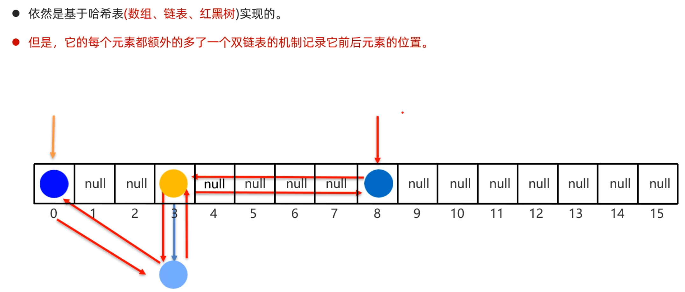
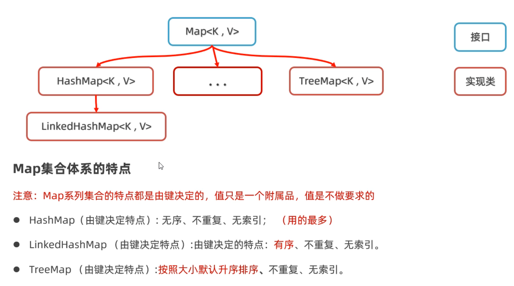
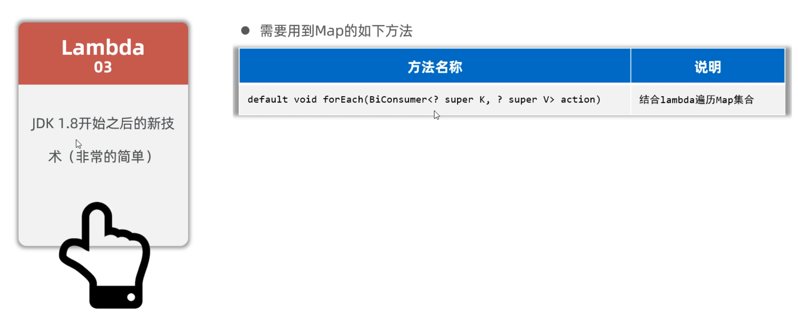

# day07——集合进阶（Set、Map集合）

## 一、Set系列集合

### 1.1 认识Set集合的特点

Set集合是属于Collection体系下的另一个分支，它的特点如下图所示


下面我们用代码简单演示一下，每一种Set集合的特点。

```java
//Set<Integer> set = new HashSet<>();	//无序、无索引、不重复
//Set<Integer> set = new LinkedHashSet<>(); //有序、无索引、不重复
Set<Integer> set = new TreeSet<>(); //可排序(升序)、无索引、不重复
set.add(666);
set.add(555);
set.add(555);
set.add(888);
set.add(888);
set.add(777);
set.add(777);
System.out.println(set); //[555, 666, 777, 888]
```


### 1.2 HashSet集合底层原理

接下来，为了让同学们更加透彻的理解HashSet为什么可以去重，我们来看一下它的底层原理。

HashSet集合底层是基于哈希表实现的，哈希表根据JDK版本的不同，也是有点区别的

- JDK8以前：哈希表 = 数组+链表
- JDK8以后：哈希表 = 数组+链表+红黑树


我们发现往HashSet集合中存储元素时，底层调用了元素的两个方法：一个是hashCode方法获取元素的hashCode值（哈希值）；另一个是调用了元素的equals方法，用来比较新添加的元素和集合中已有的元素是否相同。 

- 只有新添加元素的hashCode值和集合中以后元素的hashCode值相同、新添加的元素调用equals方法和集合中已有元素比较结果为true, 才认为元素重复。
- 如果hashCode值相同，equals比较不同，则以链表的形式连接在数组的同一个索引为位置（如上图所示）

在JDK8开始后，为了提高性能，当链表的长度超过8时，就会把链表转换为红黑树，如下图所示：


### 1.3 HashSet去重原理

前面我们学习了HashSet存储元素的原理，依赖于两个方法：一个是hashCode方法用来确定在底层数组中存储的位置，另一个是用equals方法判断新添加的元素是否和集合中已有的元素相同。

要想保证在HashSet集合中没有重复元素，我们需要重写元素类的hashCode和equals方法。比如以下面的Student类为例，假设把Student类的对象作为HashSet集合的元素，想要让学生的姓名和年龄相同，就认为元素重复。

```java
public class Student{
    private String name; //姓名
    private int age; //年龄
    private double height; //身高
 
    //无参数构造方法
    public Student(){}
    //全参数构造方法
    public Student(String name, int age, double height){
        this.name=name;
        this.age=age;
        this.height=height;
    }
    //...get、set、toString()方法自己补上..
    
    //按快捷键生成hashCode和equals方法
    //alt+insert 选择 hashCode and equals
    @Override
    public boolean equals(Object o) {
        if (this == o) return true;
        if (o == null || getClass() != o.getClass()) return false;

        Student student = (Student) o;

        if (age != student.age) return false;
        if (Double.compare(student.height, height) != 0) return false;
        return name != null ? name.equals(student.name) : student.name == null;
    }

    @Override
    public int hashCode() {
        int result;
        long temp;
        result = name != null ? name.hashCode() : 0;
        result = 31 * result + age;
        temp = Double.doubleToLongBits(height);
        result = 31 * result + (int) (temp ^ (temp >>> 32));
        return result;
    }
}
```

接着，写一个测试类，往HashSet集合中存储Student对象。

```java
public class Test{
    public static void main(String[] args){
        Set<Student> students = new HashSet<>();
        Student s1 = new Student("至尊宝",20, 169.6);
        Student s2 = new Student("蜘蛛精",23, 169.6);
        Student s3 = new Student("蜘蛛精",23, 169.6);
        Student s4 = new Student("牛魔王",48, 169.6);
        
        students.add(s1);
        students.add(s2);
        students.add(s3);
        students.add(s4);
        
        for(Student s : students){
            System.out.println(s);
        }
    }
}
```

打印结果如下，我们发现存了两个蜘蛛精，当时实际打印出来只有一个，而且是无序的。

```java
Student{name='牛魔王', age=48, height=169.6}
Student{name='至尊宝', age=20, height=169.6}
Student{name='蜘蛛精', age=23, height=169.6}
```


### 1.4 LinkedHashSet底层原理

接下来，我们再学习一个HashSet的子类LinkedHashSet类。LinkedHashSet它底层采用的是也是哈希表结构，只不过额外新增了一个双向链表来维护元素的存取顺序。如下下图所示：



每次添加元素，就和上一个元素用双向链表连接一下。第一个添加的元素是双向链表的头节点，最后一个添加的元素是双向链表的尾节点。

把上个案例中的集合改成LinkedList集合，我们观察效果怎样

```java
public class Test{
    public static void main(String[] args){
        Set<Student> students = new LinkedHashSet<>();
        Student s1 = new Student("至尊宝",20, 169.6);
        Student s2 = new Student("蜘蛛精",23, 169.6);
        Student s3 = new Student("蜘蛛精",23, 169.6);
        Student s4 = new Student("牛魔王",48, 169.6);
        
        students.add(s1);
        students.add(s2);
        students.add(s3);
        students.add(s4);
        
        for(Student s : students){
            System.out.println(s);
        }
    }
}
```

打印结果如下

```java
Student{name='至尊宝', age=20, height=169.6}
Student{name='蜘蛛精', age=23, height=169.6}
Student{name='牛魔王', age=48, height=169.6}
```


### 1.5 TreeSet集合

最后，我们学习一下TreeSet集合。TreeSet集合的特点是可以对元素进行排序，但是必须指定元素的排序规则。

如果往集合中存储String类型的元素，或者Integer类型的元素，它们本身就具备排序规则，所以直接就可以排序。

```java
Set<Integer> set1= new TreeSet<>();
set1.add(8);
set1.add(6);
set1.add(4);
set1.add(3);
set1.add(7);
set1.add(1);
set1.add(5);
set1.add(2);
System.out.println(set1); //[1,2,3,4,5,6,7,8]

Set<Integer> set2= new TreeSet<>();
set2.add("a");
set2.add("c");
set2.add("e");
set2.add("b");
set2.add("d");
set2.add("f");
set2.add("g");
System.out.println(set1); //[a,b,c,d,e,f,g]
```


如果往TreeSet集合中存储自定义类型的元素，比如说Student类型，则需要我们自己指定排序规则，否则会出现异常。

```java
//创建TreeSet集合，元素为Student类型
Set<Student> students = new TreeSet<>();

//创建4个Student对象
Student s1 = new Student("至尊宝",20, 169.6);
Student s2 = new Student("紫霞",23, 169.8);
Student s3 = new Student("蜘蛛精",23, 169.6);
Student s4 = new Student("牛魔王",48, 169.6);

//添加Studnet对象到集合
students.add(s1);
students.add(s2);
students.add(s3);
students.add(s4);
System.out.println(students); 
```

此时运行代码，会直接报错。原因是TreeSet不知道按照什么条件对Student对象来排序。


我们想要告诉TreeSet集合按照指定的规则排序，有两种办法：

> 第一种：让元素的类实现Comparable接口，重写compareTo方法

> 第二种：在创建TreeSet集合时，通过构造方法传递Compartor比较器对象

- **排序方式1：**我们先来演示第一种排序方式

```java
//第一步：先让Student类，实现Comparable接口
//注意：Student类的对象是作为TreeSet集合的元素的
public class Student implements Comparable<Student>{
    private String name;
    private int age;
    private double height;
	//无参数构造方法
    public Student(){}
    //全参数构造方法
    public Student(String name, int age, double height){
        this.name=name;
        this.age=age;
        this.height=height;
    }
    //...get、set、toString()方法自己补上..
    
    //第二步：重写compareTo方法
    //按照年龄进行比较，只需要在方法中让this.age和o.age相减就可以。
    /*
    原理：
    在往TreeSet集合中添加元素时，add方法底层会调用compareTo方法，根据该方法的
    结果是正数、负数、还是零，决定元素放在后面、前面还是不存。
    */
    @Override
    public int compareTo(Student o) {
        //this：表示将要添加进去的Student对象
        //o: 表示集合中已有的Student对象
        return this.age-o.age;
    }
}
```

此时，再运行测试类，结果如下

```java
Student{name='至尊宝', age=20, height=169.6}
Student{name='紫霞', age=20, height=169.8}
Student{name='蜘蛛精', age=23, height=169.6}
Student{name='牛魔王', age=48, height=169.6}
```


- **排序方式2：**接下来演示第二种排序方式

```java
//创建TreeSet集合时，传递比较器对象排序
/*
原理：当调用add方法时，底层会先用比较器，根据Comparator的compare方是正数、负数、还是零，决定谁在后，谁在前，谁不存。
*/
//下面代码中是按照学生的年龄升序排序
Set<Student> students = new TreeSet<>(new Comparator<Student>{
    @Override
    public int compare(Student o1, Student o2){
        //需求：按照学生的身高排序
        return Double.compare(o1,o2); 
    }
});

//创建4个Student对象
Student s1 = new Student("至尊宝",20, 169.6);
Student s2 = new Student("紫霞",23, 169.8);
Student s3 = new Student("蜘蛛精",23, 169.6);
Student s4 = new Student("牛魔王",48, 169.6);

//添加Studnet对象到集合
students.add(s1);
students.add(s2);
students.add(s3);
students.add(s4);
System.out.println(students); 
```

### 1.6 总结Collection集合

最后，将所有的Collection集合总结一下，要求大家掌握每一种集合的特点，以及他们的体系结构。


好了，关于Collection集合，到这里就学习完了。

### 1.7 并发修改异常

学完Collection集合后，还有一个小问题需要给同学们补充说明一下，那就是在使用迭代器遍历集合时，可能存在并发修改异常。

我们先把这个异常用代码演示出来，再解释一下为什么会有这个异常产生

```java
List<String> list = new ArrayList<>();
list.add("王麻子");
list.add("小李子");
list.add("李爱花");
list.add("张全蛋");
list.add("晓李");
list.add("李玉刚");
System.out.println(list); // [王麻子, 小李子, 李爱花, 张全蛋, 晓李, 李玉刚]

//需求：找出集合中带"李"字的姓名，并从集合中删除
Iterator<String> it = list.iterator();
while(it.hasNext()){
    String name = it.next();
    if(name.contains("李")){
        list.remove(name);
    }
}
System.out.println(list);
```

运行上面的代码，会出现下面的异常。这就是并发修改异常


为什么会出现这个异常呢？那是因为迭代器遍历机制，规定迭代器遍历集合的同时，不允许集合自己去增删元素，否则就会出现这个异常。

怎么解决这个问题呢？不使用集合的删除方法，而是使用迭代器的删除方法，代码如下：

```java
List<String> list = new ArrayList<>();
list.add("王麻子");
list.add("小李子");
list.add("李爱花");
list.add("张全蛋");
list.add("晓李");
list.add("李玉刚");
System.out.println(list); // [王麻子, 小李子, 李爱花, 张全蛋, 晓李, 李玉刚]

//需求：找出集合中带"李"字的姓名，并从集合中删除
Iterator<String> it = list.iterator();
while(it.hasNext()){
    String name = it.next();
    if(name.contains("李")){
        //list.remove(name);
        it.remove(); //当前迭代器指向谁，就删除谁
    }
}
System.out.println(list);
```


## 二、Collection的其他操作

各位同学，前面我们已经把Collection家族的集合都学习完了。为了更加方便的对Collection集合进行操作，今天我们还要学习一个操作Collection集合的工具类，叫做Collections。但是Collections工具类中需要用到一个没有学过的小知识点，叫做可变参数，所以必须先学习这个前置知识可变参数，再学习Collections工具类，最后再利用这个工具类做一个综合案例。


### 2.1 可变参数

首先，我们来学习一下可变参数。关于可变参数我们首先要知道它是什么，然后要知道它的本质。搞清楚这两个问题，可变参数就算你学明白了。

> - **可变参数是一种特殊的形式参数，定义在方法、构造器的形参列表处，它可以让方法接收多个同类型的实际参数。**
>
> - **可变参数在方法内部，本质上是一个数组**

接下来，我们编写代码来演示一下

```java
public class ParamTest{
    public static void main(String[] args){
        //不传递参数，下面的nums长度则为0, 打印元素是[]
        test();	
        
        //传递3个参数，下面的nums长度为3，打印元素是[10, 20, 30]
        test(10,20,30); 
        
        //传递一个数组，下面数组长度为4，打印元素是[10,20,30,40] 
        int[] arr = new int[]{10,20,30,40}
        test(arr); 
    }
    
    public static void test(int...nums){
        //可变参数在方法内部，本质上是一个数组
        System.out.println(nums.length);
        System.out.println(Arrays.toString(nums));
        System.out.println("----------------");
    }
}
```

最后还有一些错误写法，需要让大家写代码时注意一下，不要这么写哦！！！

> - **一个形参列表中，只能有一个可变参数；否则会报错**
>
> - **一个形参列表中如果多个参数，可变参数需要写在最后；否则会报错**


### 2.2 Collections工具类

有了可变参数的基础，我们再学习Collections这个工具类就好理解了，因为这个工具类的方法中会用到可变参数。

注意Collections并不是集合，它比Collection多了一个s，一般后缀为s的类很多都是工具类。这里的Collections是用来操作Collection的工具类。它提供了一些好用的静态方法，如下


我们把这些方法用代码来演示一下：

```java
public class CollectionsTest{
    public static void main(String[] args){
        //1.public static <T> boolean addAll(Collection<? super T> c, T...e)
        List<String> names = new ArrayList<>();
        Collections.addAll(names, "张三","王五","李四", "张麻子");
        System.out.println(names);
        
        //2.public static void shuffle(List<?> list)：对集合打乱顺序
        Collections.shuffle(names);
        System.out.println(names);
        
        //3.public static <T> void short(List<T list): 对List集合排序
        List<Integer> list = new ArrayList<>();
        list.add(3);
        list.add(5);
        list.add(2);
        Collections.sort(list);
        System.out.println(list);
    }
}
```

上面我们往集合中存储的元素要么是Stirng类型，要么是Integer类型，他们本来就有一种自然顺序所以可以直接排序。但是如果我们往List集合中存储Student对象，这个时候想要对List集合进行排序自定义比较规则的。指定排序规则有两种方式，如下：

> **排序方式1：让元素实现Comparable接口，重写compareTo方法**

比如现在想要往集合中存储Studdent对象，首先需要准备一个Student类，实现Comparable接口。

```java
public class Student implements Comparable<Student>{
    private String name;
    private int age;
    private double height;
    
     //排序时：底层会自动调用此方法，this和o表示需要比较的两个对象
    @Override
    public int compareTo(Student o){
        //需求：按照年龄升序排序
        //如果返回正数：说明左边对象的年龄>右边对象的年龄
        //如果返回负数：说明左边对象的年龄<右边对象的年龄，
        //如果返回0：说明左边对象的年龄和右边对象的年龄相同
        return this.age - o.age;
    }
    
    //...getter、setter、constructor..
}
```

然后再使用`Collections.sort(list集合)`对List集合排序，如下：

```java
//3.public static <T> void short(List<T list): 对List集合排序
List<Student> students = new ArrayList<>();
students.add(new Student("蜘蛛精",23,169.7));
students.add(new Student("紫霞",22,169.8));
students.add(new Student("紫霞",22,169.8));
students.add(new Student("至尊宝",26,169.5));

/*
原理：sort方法底层会遍历students集合中的每一个元素，采用排序算法，将任意两个元素两两比较；
	每次比较时，会用一个Student对象调用compareTo方法和另一个Student对象进行比较；
	根据compareTo方法返回的结果是正数、负数，零来决定谁大，谁小，谁相等，重新排序元素的位置
	
	注意：这些都是sort方法底层自动完成的，想要完全理解，必须要懂排序算法才行；
*/
Collections.sort(students);	
System.out.println(students);
```

> **排序方式2：使用调用sort方法是，传递比较器**

```java
/*
原理：sort方法底层会遍历students集合中的每一个元素，采用排序算法，将任意两个元素两两比较；
	每次比较，会将比较的两个元素传递给Comparator比较器对象的compare方法的两个参数o1和o2,
	根据compare方法的返回结果是正数，负数，或者0来决定谁大，谁小，谁相等，重新排序元素的位置
	
	注意：这些都是sort方法底层自动完成的，不需要我们完全理解，想要理解它必须要懂排序算法才行.
*/
Collections.sort(students, new Comparator<Student>(){
    @Override
    public int compare(Student o1, Student o2){
        return o1.getAge()-o2.getAge();
    }
});	
System.out.println(students);
```


### 2.3 斗地主案例


我们先分析一下业务需求：

- 总共有54张牌，每一张牌有花色和点数两个属性、为了排序还可以再加一个序号
- 点数可以是：`“3”,"4","5","6","7","8","9","10","J","Q","K","A","2"`
- 花色可以是：`“♣”,"♠","♥","♦"`
- 斗地主时：三个玩家没人手里17张牌，剩余3张牌作为底牌

```java
第一步：为了表示每一张牌有哪些属性，首先应该新建一个扑克牌的类
第二步：启动游戏时，就应该提前准备好54张牌
第三步：接着再完全洗牌、发牌、捋牌、看牌的业务逻辑
```

> **先来完成第一步，定义一个扑克类Card**

```java
public class Card {
    private String number;
    private String color;
    // 每张牌是存在大小的。
    private int size; // 0 1 2 ....

    public Card() {
    }

    public Card(String number, String color, int size) {
        this.number = number;
        this.color = color;
        this.size = size;
    }

    public String getNumber() {
        return number;
    }

    public void setNumber(String number) {
        this.number = number;
    }

    public String getColor() {
        return color;
    }

    public void setColor(String color) {
        this.color = color;
    }

    public int getSize() {
        return size;
    }

    public void setSize(int size) {
        this.size = size;
    }

    @Override
    public String toString() {
        return color + number ;
    }
}
```

> **再完成第二步，定义一个房间类，初始化房间时准备好54张牌**

```java
public class Room {
    // 必须有一副牌。
    private List<Card> allCards = new ArrayList<>();

    public Room(){
        // 1、做出54张牌，存入到集合allCards
        // a、点数：个数确定了，类型确定。
        String[] numbers = {"3","4","5","6","7","8","9","10","J","Q","K","A","2"};
        // b、花色：个数确定了，类型确定。
        String[] colors = {"♠", "♥", "♣", "♦"};
        int size = 0; // 表示每张牌的大小
        // c、遍历点数，再遍历花色，组织牌
        for (String number : numbers) {
            // number = "3"
            size++; // 1 2 ....
            for (String color : colors) {
                // 得到一张牌
                Card c = new Card(number, color, size);
                allCards.add(c); // 存入了牌
            }
        }
        // 单独存入小大王的。
        Card c1 = new Card("",  "🃏" , ++size);
        Card c2 = new Card("", "👲" , ++size);
        Collections.addAll(allCards, c1, c2);
        System.out.println("新牌：" + allCards);
    }
}
```

> **最后完成第三步，定义一个启动游戏的方法，完成洗牌、发牌、捋牌、看牌的业务逻辑**

  ```java
/**
* 游戏启动
*/
public void start() {
    // 1、洗牌： allCards
    Collections.shuffle(allCards);
    System.out.println("洗牌后：" + allCards);

    // 2、发牌，首先肯定要定义 三个玩家。 List(ArrayList)  Set(TreeSet)
    List<Card> linHuChong = new ArrayList<>();
    List<Card> jiuMoZhi = new ArrayList<>();
    List<Card> renYingYing = new ArrayList<>();
    // 正式发牌给这三个玩家，依次发出51张牌，剩余3张做为底牌。
    // allCards = [♥3, ♣10, ♣4, ♥K, ♦Q, ♣2, 🃏, ♣8, ....
    //             0     1   2   3   4   5   6 ...   % 3
    for (int i = 0; i < allCards.size() - 3; i++) {
        Card c = allCards.get(i);
        // 判断牌发给谁
        if(i % 3 == 0){
            // 请啊冲接牌
            linHuChong.add(c);
        }else if(i % 3 == 1){
            // 请啊鸠来接牌
            jiuMoZhi.add(c);
        }else if(i % 3 == 2){
            // 请盈盈接牌
            renYingYing.add(c);
        }
    }

    // 3、对3个玩家的牌进行排序
    sortCards(linHuChong);
    sortCards(jiuMoZhi);
    sortCards(renYingYing);
    // 4、看牌
    System.out.println("啊冲：" + linHuChong);
    System.out.println("啊鸠：" + jiuMoZhi);
    System.out.println("盈盈：" + renYingYing);
    List<Card> lastThreeCards = allCards.subList(allCards.size() - 3, allCards.size()); // 51 52 53
    System.out.println("底牌：" + lastThreeCards);
    jiuMoZhi.addAll(lastThreeCards);
    sortCards(jiuMoZhi);
    System.out.println("啊鸠抢到地主后：" + jiuMoZhi);
}

/**
     * 集中进行排序
     * @param cards
     */
private void sortCards(List<Card> cards) {
    Collections.sort(cards, new Comparator<Card>() {
        @Override
        public int compare(Card o1, Card o2) {
            // return o1.getSize() - o2.getSize(); // 升序排序
            return o2.getSize() - o1.getSize(); // 降序排序
        }
    });
}
  ```

不要忘记了写测试类了，

```java
public class GameDemo {
    public static void main(String[] args) {
        //  1、牌类。
        //  2、房间
        Room m = new Room();
        //  3、启动游戏
        m.start();
    }
}
```


## 三、Map集合

### 3.1 Map概述体系

各位同学，前面我们已经把单列集合学习完了，接下来我们要学习的是双列集合。首先我们还是先认识一下什么是双列集合。

所谓双列集合，就是说集合中的元素是一对一对的。Map集合中的每一个元素是以`key=value`的形式存在的，一个`key=value`就称之为一个键值对，而且在Java中有一个类叫Entry类，Entry的对象用来表示键值对对象。

所有的Map集合有如下的特点：**键不能重复，值可以重复，每一个键只能找到自己对应的值。**


下面我们先写一个Map集合，保存几个键值对，体验一下Map集合的特点

```java
public class MapTest1 {
    public static void main(String[] args) {
        // Map<String, Integer> map = new HashMap<>(); // 一行经典代码。 按照键 无序，不重复，无索引。
        Map<String, Integer> map = new LinkedHashMap<>(); // 有序，不重复，无索引。
        map.put("手表", 100);
        map.put("手表", 220); // 后面重复的数据会覆盖前面的数据（键）
        map.put("手机", 2);
        map.put("Java", 2);
        map.put(null, null);
        System.out.println(map);

        Map<Integer, String> map1 = new TreeMap<>(); // 可排序，不重复，无索引
        map1.put(23, "Java");
        map1.put(23, "MySQL");
        map1.put(19, "李四");
        map1.put(20, "王五");
        System.out.println(map1);
    }
}
```

Map集合也有很多种，在Java中使用不同的类来表示的，每一种Map集合其键的特点是有些差异的，值是键的一个附属值，所以我们只关注键的特点就可以了。



关于Map集合是什么，以及Map集合的体系我们先了解到这里，接下来就具体学习一下Map集合的通用方法。


### 3.2 Map集合的常用方法

各位同学，上节课我们已经认识了Map集合，接下来我们学习一下Map集合提供了那些方法供我们使用。由于Map是所有双列集合的父接口，所以我们只需要学习Map接口中每一个方法是什么含义，那么所有的Map集合方法你就都会用了。


```java
public class MapTest2 {
    public static void main(String[] args) {
        // 1.添加元素: 无序，不重复，无索引。
        Map<String, Integer> map = new HashMap<>();
        map.put("手表", 100);
        map.put("手表", 220);
        map.put("手机", 2);
        map.put("Java", 2);
        map.put(null, null);
        System.out.println(map);
        // map = {null=null, 手表=220, Java=2, 手机=2}

        // 2.public int size():获取集合的大小
        System.out.println(map.size());

        // 3、public void clear():清空集合
        //map.clear();
        //System.out.println(map);

        // 4.public boolean isEmpty(): 判断集合是否为空，为空返回true ,反之！
        System.out.println(map.isEmpty());

        // 5.public V get(Object key)：根据键获取对应值
        int v1 = map.get("手表");
        System.out.println(v1);
        System.out.println(map.get("手机")); // 2
        System.out.println(map.get("张三")); // null

        // 6. public V remove(Object key)：根据键删除整个元素(删除键会返回键的值)
        System.out.println(map.remove("手表"));
        System.out.println(map);

        // 7.public  boolean containsKey(Object key): 判断是否包含某个键 ，包含返回true ,反之
        System.out.println(map.containsKey("手表")); // false
        System.out.println(map.containsKey("手机")); // true
        System.out.println(map.containsKey("java")); // false
        System.out.println(map.containsKey("Java")); // true

        // 8.public boolean containsValue(Object value): 判断是否包含某个值。
        System.out.println(map.containsValue(2)); // true
        System.out.println(map.containsValue("2")); // false

        // 9.public Set<K> keySet(): 获取Map集合的全部键。
        Set<String> keys = map.keySet();
        System.out.println(keys);

        // 10.public Collection<V> values(); 获取Map集合的全部值。
        Collection<Integer> values = map.values();
        System.out.println(values);

        // 11.把其他Map集合的数据倒入到自己集合中来。(拓展)
        Map<String, Integer> map1 = new HashMap<>();
        map1.put("java1",  10);
        map1.put("java2",  20);
        Map<String, Integer> map2 = new HashMap<>();
        map2.put("java3",  10);
        map2.put("java2",  222);
        map1.putAll(map2); // putAll：把map2集合中的元素全部倒入一份到map1集合中去。
        System.out.println(map1);
        System.out.println(map2);
    }
}
```

### 3.3 Map集合遍历方式1

Map集合一共有三种遍历方式，我们先来学习第一种，他需要用到下面的两个方法


```java
/**
 *  目标：掌握Map集合的遍历方式1：键找值
 */
public class MapTest1 {
    public static void main(String[] args) {
        // 准备一个Map集合。
        Map<String, Double> map = new HashMap<>();
        map.put("蜘蛛精", 162.5);
        map.put("蜘蛛精", 169.8);
        map.put("紫霞", 165.8);
        map.put("至尊宝", 169.5);
        map.put("牛魔王", 183.6);
        System.out.println(map);
        // map = {蜘蛛精=169.8, 牛魔王=183.6, 至尊宝=169.5, 紫霞=165.8}

        // 1、获取Map集合的全部键
        Set<String> keys = map.keySet();
        // System.out.println(keys);
        // [蜘蛛精, 牛魔王, 至尊宝, 紫霞]
        //         key
        // 2、遍历全部的键，根据键获取其对应的值
        for (String key : keys) {
            // 根据键获取对应的值
            double value = map.get(key);
            System.out.println(key + "=====>" + value);
        }
    }
}
```

### 3.4 Map集合遍历方式2

各位同学，接下来我们学习Map集合的第二种遍历方式，这种遍历方式更加符合面向对象的思维。

前面我们给大家介绍过，Map集合是用来存储键值对的，而每一个键值对实际上是一个Entry对象。

**这里Map集合的第二种方式，是直接获取每一个Entry对象，把Entry存储扫Set集合中去，再通过Entry对象获取键和值。**


```java
/**
 * 目标：掌握Map集合的第二种遍历方式：键值对。
 */
public class MapTest2 {
    public static void main(String[] args) {
        Map<String, Double> map = new HashMap<>();
        map.put("蜘蛛精", 169.8);
        map.put("紫霞", 165.8);
        map.put("至尊宝", 169.5);
        map.put("牛魔王", 183.6);
        System.out.println(map);
        // map = {蜘蛛精=169.8, 牛魔王=183.6, 至尊宝=169.5, 紫霞=165.8}
        // entries = [(蜘蛛精=169.8), (牛魔王=183.6), (至尊宝=169.5), (紫霞=165.8)]
        // entry = (蜘蛛精=169.8)
        // entry = (牛魔王=183.6)
        // ...
		
        // 1、调用Map集合提供entrySet方法，把Map集合转换成键值对类型的Set集合
        Set<Map.Entry<String, Double>> entries = map.entrySet();
        for (Map.Entry<String, Double> entry : entries) {
            String key = entry.getKey();
            double value = entry.getValue();
            System.out.println(key + "---->" + value);
        }
    }
}
```


### 3.5 Map集合遍历方式3

Map集合的第三种遍历方式，需要用到下面的一个方法forEach，而这个方法是JDK8版本以后才有的。调用起来非常简单，最好是结合的lambda表达式一起使用。



```java
/**
 * 目标：掌握Map集合的第二种遍历方式：键值对。
 */
public class MapTest3 {
    public static void main(String[] args) {
        Map<String, Double> map = new HashMap<>();
        map.put("蜘蛛精", 169.8);
        map.put("紫霞", 165.8);
        map.put("至尊宝", 169.5);
        map.put("牛魔王", 183.6);
        System.out.println(map);
        // map = {蜘蛛精=169.8, 牛魔王=183.6, 至尊宝=169.5, 紫霞=165.8}


		//遍历map集合，传递匿名内部类
        map.forEach(new BiConsumer<String, Double>() {
            @Override
            public void accept(String k, Double v) {
                System.out.println(k + "---->" + v);
            }
        });
		//遍历map集合，传递Lambda表达式
        map.forEach(( k,  v) -> {
            System.out.println(k + "---->" + v);
        });
    }
}
```


### 3.6 Map集合案例

学习完Map集合的基本用法之后，接下来我们做一个综合案例，将Map集合运用一下。


先分析需求，再考虑怎么用代码实现

```java
1.首先可以将80个学生选择的景点放到一个集合中去（也就是说，集合中的元素是80个任意的ABCD元素）
2.准备一个Map集合用来存储景点，以及景点被选择的次数
3.遍历80个学生选择景点的集合，得到每一个景点，判断Map集合中是否包含该景点
	如果不包含，则存储"景点=1"
    如果包含，则存获取该景点原先的值，再存储"景点=原来的值+1"; 此时新值会覆盖旧值
```

```java
/**
 * 目标：完成Map集合的案例：统计投票人数。
 */
public class MapDemo4 {
    public static void main(String[] args) {
        // 1、把80个学生选择的景点数据拿到程序中来。
        List<String> data = new ArrayList<>();
        String[] selects = {"A", "B", "C", "D"};
        Random r = new Random();
        for (int i = 1; i <= 80; i++) {
            // 每次模拟一个学生选择一个景点，存入到集合中去。
            int index = r.nextInt(4); // 0 1 2 3
            data.add(selects[index]);
        }
        System.out.println(data);

        // 2、开始统计每个景点的投票人数
        // 准备一个Map集合用于统计最终的结果
        Map<String, Integer> result = new HashMap<>();

        // 3、开始遍历80个景点数据
        for (String s : data) {
            // 问问Map集合中是否存在该景点
            if(result.containsKey(s)){
                // 说明这个景点之前统计过。其值+1. 存入到Map集合中去
                result.put(s, result.get(s) + 1);
            }else {
                // 说明这个景点是第一次统计，存入"景点=1"
                result.put(s, 1);
            }
        }
        System.out.println(result);
    }
}
```

