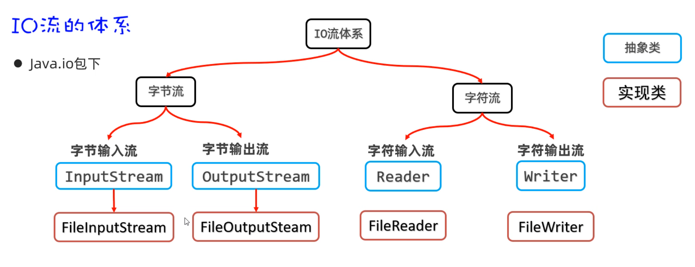

# day09-字符集、IO流（一）

各位同学，前面我们已经学习了File类，通过File类的对象可以对文件进行操作，但是不能操作文件中的内容。要想操作文件中的内容，我们还得学习IO流。但是在正式学习IO流之前，我们还需要学习一个前置知识叫做字符集，只有我们把字符集搞明白了，再学习IO流才会更加丝滑。

## 一、字符集

### 1.1 字符集的来历

所以，接下来我们正式学习一下字符集。先来带着同学们，了解一下字符集的来历。

我们知道计算机是美国人发明的，由于计算机能够处理的数据只能是0和1组成的二进制数据，为了让计算机能够处理字符，于是美国人就把他们会用到的每一个字符进行了编码（**所谓编码，就是为一个字符编一个二进制数据**），如下图所示：


美国人常用的字符有英文字母、标点符号、数字以及一些特殊字符，这些字符一共也不到128个，所以他们用1个字节来存储1字符就够了。 美国人把他们用到的字符和字符对应的编码总结成了一张码表，这张码表叫做ASCII码表（也叫ASCII字符集）。

其实计算机只在美国用是没有问题的，但是计算机慢慢的普及到全世界，当普及到中国的时候，在计算机中想要存储中文，那ASCII字符集就不够用了，因为中文太多了，随便数一数也有几万个字符。

于是中国人为了在计算机中存储中文，也编了一个中国人用的字符集叫做GBK字符集，这里面包含2万多个汉字字符，**GBK中一个汉字采用两个字节来存储**，为了能够显示英文字母，GBK字符集也兼容了ASCII字符集，**在GBK字符集中一个字母还是采用一个字节来存储**。

### 1.2 汉字和字母的编码特点

讲到这里，可能有同学有这么一个疑问： 如果一个文件中既有中文，也有英文，那计算机怎么知道哪几个字节表示一个汉字，哪几个字节表示一个字母呢？

其实这个问题问当想当有水平，接下来，就带着同学们了解一下，计算机是怎么识别中文和英文的。

比如：在文件中存储一个`我a你`，底层其实存储的是这样的二进制数据。

**需要我们注意汉字和字母的编码特点：**

- 1. 如果是存储字母，采用1个字节来存储，一共8位，其中第1位是0
  2. 如果是存储汉字，采用2个字节来存储，一共16位，其中第1位是1


**当读取文件中的字符时，通过识别读取到的第1位是0还是1来判断是字母还是汉字**

- 如果读取到第1位是0，就认为是一个字母，此时往后读1个字节。
- 如果读取到第1位是1，就认为是一个汉字，此时往后读2个字节。


### 1.3 Unicode字符集

同学们注意了，咱们国家可以用GBK字符集来表示中国人使用的文字，那世界上还有很多其他的国家，他们也有自己的文字，他们也想要自己国家的文字在计算机中处理，于是其他国家也在搞自己的字符集，就这样全世界搞了上百个字符集，而且各个国家的字符集互不兼容。 这样其实很不利于国际化的交流，可能一个文件在我们国家的电脑上打开好好的，但是在其他国家打开就是乱码了。

为了解决各个国家字符集互不兼容的问题，由国际化标准组织牵头，设计了一套全世界通用的字符集，叫做Unicode字符集。在Unicode字符集中包含了世界上所有国家的文字，一个字符采用4个自己才存储。

在Unicode字符集中，采用一个字符4个字节的编码方案，又造成另一个问题：如果是说英语的国家，他们只需要用到26大小写字母，加上一些标点符号就够了，本身一个字节就可以表示完，用4个字节就有点浪费。

于是又对Unicode字符集中的字符进行了重新编码，一共设计了三种编码方案。分别是UTF-32、UTF-16、UTF-8;  **其中比较常用的编码方案是UTF-8**

下面我们详细介绍一下UTF-8这种编码方案的特点。

```java
1.UTF-8是一种可变长的编码方案，工分为4个长度区
2.英文字母、数字占1个字节兼容(ASCII编码)
3.汉字字符占3个字节
4.极少数字符占4个字节
```


### 1.4 字符集小结

最后，我们将前面介绍过的字符集小结一下

```java
ASCII字符集：《美国信息交换标准代码》，包含英文字母、数字、标点符号、控制字符
	特点：1个字符占1个字节

GBK字符集：中国人自己的字符集，兼容ASCII字符集，还包含2万多个汉字
	特点：1个字母占用1个字节；1个汉字占用2个字节

Unicode字符集：包含世界上所有国家的文字，有三种编码方案，最常用的是UTF-8
    UTF-8编码方案：英文字母、数字占1个字节兼容(ASCII编码)、汉字字符占3个字节
```


### 1.5 编码和解码

搞清楚字符集的知识之后，我们接下来再带着同学们使用Java代码完成编码和解码的操作。

其实String类类中就提供了相应的方法，可以完成编码和解码的操作。

- 编码：把字符串按照指定的字符集转换为字节数组
- 解码：把字节数组按照指定的字符集转换为字符串

```java
/**
 * 目标：掌握如何使用Java代码完成对字符的编码和解码。
 */
public class Test {
    public static void main(String[] args) throws Exception {
        // 1、编码
        String data = "a我b";
        byte[] bytes = data.getBytes(); // 默认是按照平台字符集（UTF-8）进行编码的。
        System.out.println(Arrays.toString(bytes));

        // 按照指定字符集进行编码。
        byte[] bytes1 = data.getBytes("GBK");
        System.out.println(Arrays.toString(bytes1));

        // 2、解码
        String s1 = new String(bytes); // 按照平台默认编码（UTF-8）解码
        System.out.println(s1);

        String s2 = new String(bytes1, "GBK");
        System.out.println(s2);
    }
}
```


## 二、IO流（字节流）

### 2.1 IO流概述

各位小伙伴，在前面我们已经学习过File类。但是我们知道File只能操作文件，但是不能操作文件中的内容。我们也学习了字符集，不同的字符集存字符数据的原理是不一样的。有了前面两个知识的基础，接下来我们再学习IO流，就可以对文件中的数据进行操作了。

IO流的作用：就是可以对文件或者网络中的数据进行读、写的操作。如下图所示

- 把数据从磁盘、网络中读取到程序中来，用到的是输入流。
- 把程序中的数据写入磁盘、网络中，用到的是输出流。
- **简单记：输入流（读数据）、输出流（写数据）**


IO流在Java中有很多种，不同的流来干不同的事情。Java把各种流用不同的类来表示，这些流的继承体系如下图所示：

```java
IO流分为两大派系：
	1.字节流：字节流又分为字节输入流、字节输出流
	2.字符流：字符流由分为字符输入流、字符输出流
```




### 2.2 FileInputStream读取一个字节

同学们，在上节课认识了什么是IO流，接下来我们学习字节流中的字节输入流，用InputStream来表示。但是InputStream是抽象类，我们用的是它的子类，叫FileInputStream。


需要用到的方法如下图所示：有构造方法、成员方法


使用FileInputStream读取文件中的字节数据，步骤如下

```java
第一步：创建FileInputStream文件字节输入流管道，与源文件接通。
第二步：调用read()方法开始读取文件的字节数据。
第三步：调用close()方法释放资源
```

代码如下：

```java
/**
 * 目标：掌握文件字节输入流，每次读取一个字节。
 */
public class FileInputStreamTest1 {
    public static void main(String[] args) throws Exception {
        // 1、创建文件字节输入流管道，与源文件接通。
        InputStream is = new FileInputStream(("file-io-app\\src\\itheima01.txt"));

        // 2、开始读取文件的字节数据。
        // public int read():每次读取一个字节返回，如果没有数据了，返回-1.
        int b; // 用于记住读取的字节。
        while ((b = is.read()) != -1){
            System.out.print((char) b);
        }
        
        //3、流使用完毕之后，必须关闭！释放系统资源！
        is.close();
    }
}
```

这里需要注意一个问题：由于一个中文在UTF-8编码方案中是占3个字节，采用一次读取一个字节的方式，读一个字节就相当于读了1/3个汉字，此时将这个字节转换为字符，是会有乱码的。


### 2.3 FileInputStream读取多个字节

各位同学，在上一节我们学习了FileInputStream调用read()方法，可以一次读取一个字节。但是这种读取方式效率太太太太慢了。 为了提高效率，我们可以使用另一个read(byte[] bytes)的重载方法，可以一次读取多个字节，至于一次读多少个字节，就在于你传递的数组有多大。

使用FileInputStream一次读取多个字节的步骤如下

```java
第一步：创建FileInputStream文件字节输入流管道，与源文件接通。
第二步：调用read(byte[] bytes)方法开始读取文件的字节数据。
第三步：调用close()方法释放资源
```

代码如下：

```java
/**
 * 目标：掌握使用FileInputStream每次读取多个字节。
 */
public class FileInputStreamTest2 {
    public static void main(String[] args) throws Exception {
        // 1、创建一个字节输入流对象代表字节输入流管道与源文件接通。
        InputStream is = new FileInputStream("file-io-app\\src\\itheima02.txt");

        // 2、开始读取文件中的字节数据：每次读取多个字节。
        //  public int read(byte b[]) throws IOException
        //  每次读取多个字节到字节数组中去，返回读取的字节数量，读取完毕会返回-1.

        // 3、使用循环改造。
        byte[] buffer = new byte[3];
        int len; // 记住每次读取了多少个字节。  abc 66
        while ((len = is.read(buffer)) != -1){
            // 注意：读取多少，倒出多少。
            String rs = new String(buffer, 0 , len);
            System.out.print(rs);
        }
        // 性能得到了明显的提升！！
        // 这种方案也不能避免读取汉字输出乱码的问题！！

        is.close(); // 关闭流
    }
}
```

- 需要我们注意的是：**read(byte[] bytes)它的返回值，表示当前这一次读取的字节个数。**

假设有一个a.txt文件如下：

```java
abcde
```

每次读取过程如下

```java
也就是说，并不是每次读取的时候都把数组装满，比如数组是 byte[] bytes = new byte[3];
第一次调用read(bytes)读取了3个字节(分别是97,98,99)，并且往数组中存，此时返回值就是3
第二次调用read(bytes)读取了2个字节(分别是99,100),并且往数组中存，此时返回值是2
第三次调用read(bytes)文件中后面已经没有数据了，此时返回值为-1
```

- 还需要注意一个问题：采用一次读取多个字节的方式，也是可能有乱码的。因为也有可能读取到半个汉字的情况。


### 2.4 FileInputStream读取全部字节

同学们，前面我们到的读取方式，不管是一次读取一个字节，还是一次读取多个字节，都有可能有乱码。那么接下来我们介绍一种，不出现乱码的读取方式。

我们可以一次性读取文件中的全部字节，然后把全部字节转换为一个字符串，就不会有乱码了。


```java
// 1、一次性读取完文件的全部字节到一个字节数组中去。
// 创建一个字节输入流管道与源文件接通
InputStream is = new FileInputStream("file-io-app\\src\\itheima03.txt");

// 2、准备一个字节数组，大小与文件的大小正好一样大。
File f = new File("file-io-app\\src\\itheima03.txt");
long size = f.length();
byte[] buffer = new byte[(int) size];

int len = is.read(buffer);
System.out.println(new String(buffer));

//3、关闭流
is.close(); 
```


```java
// 1、一次性读取完文件的全部字节到一个字节数组中去。
// 创建一个字节输入流管道与源文件接通
InputStream is = new FileInputStream("file-io-app\\src\\itheima03.txt");

//2、调用方法读取所有字节，返回一个存储所有字节的字节数组。
byte[] buffer = is.readAllBytes();
System.out.println(new String(buffer));

//3、关闭流
is.close(); 
```

最后，还是要注意一个问题：**一次读取所有字节虽然可以解决乱码问题，但是文件不能过大，如果文件过大，可能导致内存溢出。**


### 2.5 FileOutputStream写字节

各位同学，前面我们学习了使用FIleInputStream读取文件中的字节数据。然后有同学就迫不及待的想学习往文件中写入数据了。

往文件中写数据需要用到OutputStream下面的一个子类FileOutputStream。写输入的流程如下图所示


使用FileOutputStream往文件中写数据的步骤如下：

```java
第一步：创建FileOutputStream文件字节输出流管道，与目标文件接通。
第二步：调用wirte()方法往文件中写数据
第三步：调用close()方法释放资源
```

代码如下：

```java
/**
 * 目标：掌握文件字节输出流FileOutputStream的使用。
 */
public class FileOutputStreamTest4 {
    public static void main(String[] args) throws Exception {
        // 1、创建一个字节输出流管道与目标文件接通。
        // 覆盖管道：覆盖之前的数据
//        OutputStream os =
//                new FileOutputStream("file-io-app/src/itheima04out.txt");

        // 追加数据的管道
        OutputStream os =
                new FileOutputStream("file-io-app/src/itheima04out.txt", true);

        // 2、开始写字节数据出去了
        os.write(97); // 97就是一个字节，代表a
        os.write('b'); // 'b'也是一个字节
        // os.write('磊'); // [ooo] 默认只能写出去一个字节

        byte[] bytes = "我爱你中国abc".getBytes();
        os.write(bytes);

        os.write(bytes, 0, 15);

        // 换行符
        os.write("\r\n".getBytes());

        os.close(); // 关闭流
    }
}
```


### 2.6 字节流复制文件

同学们，我们在前面已经把字节输入流和字节输出流都学习完了。现在我们就可以用这两种流配合起来使用，做一个文件复制的综合案例。

比如：我们要复制一张图片，从磁盘`D:/resource/meinv.png`的一个位置，复制到`C:/data/meinv.png`位置。

复制文件的思路如下图所示：

```java
1.需要创建一个FileInputStream流与源文件接通，创建FileOutputStream与目标文件接通
2.然后创建一个数组，使用FileInputStream每次读取一个字节数组的数据，存如数组中
3.然后再使用FileOutputStream把字节数组中的有效元素，写入到目标文件中
```


代码如下：

```java
/**
 * 目标：使用字节流完成对文件的复制操作。
 */
public class CopyTest5 {
    public static void main(String[] args) throws Exception {
        // 需求：复制照片。
        // 1、创建一个字节输入流管道与源文件接通
        InputStream is = new FileInputStream("D:/resource/meinv.png");
        // 2、创建一个字节输出流管道与目标文件接通。
        OutputStream os = new FileOutputStream("C:/data/meinv.png");

        System.out.println(10 / 0);
        // 3、创建一个字节数组，负责转移字节数据。
        byte[] buffer = new byte[1024]; // 1KB.
        // 4、从字节输入流中读取字节数据，写出去到字节输出流中。读多少写出去多少。
        int len; // 记住每次读取了多少个字节。
        while ((len = is.read(buffer)) != -1){
            os.write(buffer, 0, len);
        }

        os.close();
        is.close();
        System.out.println("复制完成！！");
    }
}
```


## 三、IO流资源释放

各位同学，前面我们已经学习了字节流，也给同学们强调过，流使用完之后一定要释放资源。但是我们之前的代码并不是很专业。


我们现在知道这个问题了，那这个问题怎么解决呢？ 在JDK7以前，和JDK7以后分别给出了不同的处理方案。

### 3.1 JDK7以前的资源释放

在JDK7版本以前，我们可以使用try...catch...finally语句来处理。格式如下

```java
try{
    //有可能产生异常的代码
}catch(异常类 e){
    //处理异常的代码
}finally{
    //释放资源的代码
    //finally里面的代码有一个特点，不管异常是否发生，finally里面的代码都会执行。
}
```

改造上面的低吗：

```java
public class Test2 {
    public static void main(String[] args)  {
        InputStream is = null;
        OutputStream os = null;
        try {
            System.out.println(10 / 0);
            // 1、创建一个字节输入流管道与源文件接通
            is = new FileInputStream("file-io-app\\src\\itheima03.txt");
            // 2、创建一个字节输出流管道与目标文件接通。
            os = new FileOutputStream("file-io-app\\src\\itheima03copy.txt");

            System.out.println(10 / 0);

            // 3、创建一个字节数组，负责转移字节数据。
            byte[] buffer = new byte[1024]; // 1KB.
            // 4、从字节输入流中读取字节数据，写出去到字节输出流中。读多少写出去多少。
            int len; // 记住每次读取了多少个字节。
            while ((len = is.read(buffer)) != -1){
                os.write(buffer, 0, len);
            }
            System.out.println("复制完成！！");
        } catch (IOException e) {
            e.printStackTrace();
        } finally {
            // 释放资源的操作
            try {
                if(os != null) os.close();
            } catch (IOException e) {
                e.printStackTrace();
            }
            try {
                if(is != null) is.close();
            } catch (IOException e) {
                e.printStackTrace();
            }
        }
    }
}
```

代码写到这里，有很多同学就已经看不下去了。是的，我也看不下去，本来几行代码就写完了的，加上try...catch...finally之后代码多了十几行，而且阅读性并不高。难受....


### 3.2 JDK7以后的资源释放

刚才很多同学已经发现了try...catch...finally处理异常，并释放资源代码比较繁琐。Java在JDK7版本为我们提供了一种简化的是否资源的操作，它会自动是否资源。代码写起来也想当简单。

格式如下：

```java
try(资源对象1; 资源对象2;){
    使用资源的代码
}catch(异常类 e){
    处理异常的代码
}

//注意：注意到没有，这里没有释放资源的代码。它会自动是否资源
```

代码如下：

```java
/**
 * 目标：掌握释放资源的方式：try-with-resource
 */
public class Test3 {
    public static void main(String[] args)  {
    	try (
          // 1、创建一个字节输入流管道与源文件接通
          InputStream is = new FileInputStream("D:/resource/meinv.png");
          // 2、创建一个字节输出流管道与目标文件接通。
          OutputStream os = new FileOutputStream("C:/data/meinv.png");
        ){
            // 3、创建一个字节数组，负责转移字节数据。
            byte[] buffer = new byte[1024]; // 1KB.
            // 4、从字节输入流中读取字节数据，写出去到字节输出流中。读多少写出去多少。
            int len; // 记住每次读取了多少个字节。
            while ((len = is.read(buffer)) != -1){
                os.write(buffer, 0, len);
            }
            System.out.println(conn);
            System.out.println("复制完成！！");

        } catch (Exception e) {
            e.printStackTrace();
        }
    }
}
```


