# day10-IO流（二）

## 一、字符流

同学们，前面我们学习了字节流，使用字节流可以读取文件中的字节数据。但是如果文件中有中文，使用字节流来读取，就有可能读到半个汉字的情况，这样会导致乱码。虽然使用读取全部字节的方法不会出现乱码，但是如果文件过大又不太合适。

所以Java专门为我们提供了另外一种流，叫字符流，可以字符流是专门为读取文本数据而生的。

### 1.1 FileReader类

先类学习字符流中的FileReader类，这是字符输入流，用来将文件中的字符数据读取到程序中来。

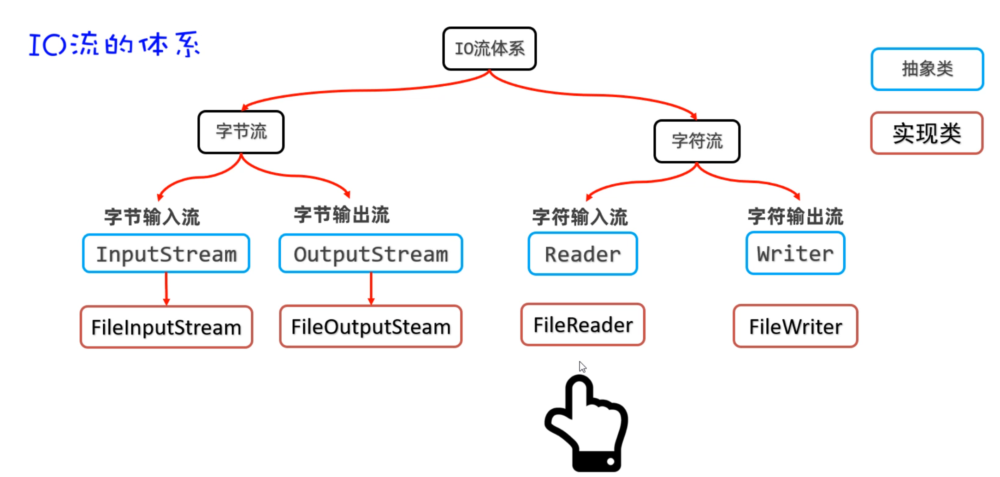

FileReader读取文件的步骤如下：

```java
第一步：创建FileReader对象与要读取的源文件接通
第二步：调用read()方法读取文件中的字符
第三步：调用close()方法关闭流
```


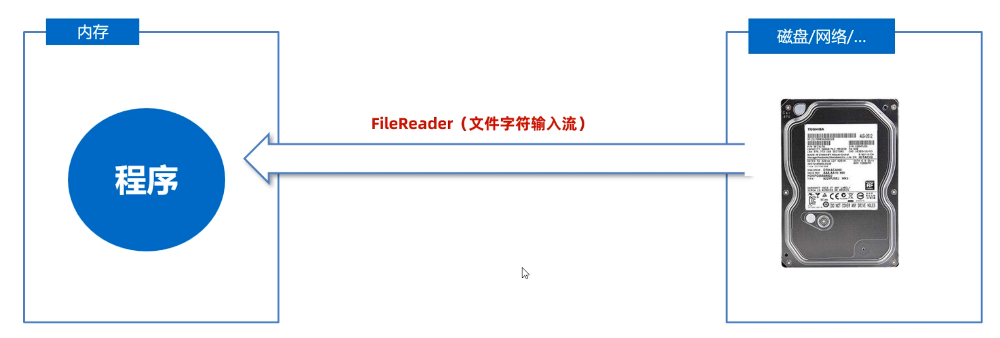

需要用到的方法：先通过构造器创建对象，再通过read方法读取数据（**注意：两个read方法的返回值，含义不一样**）

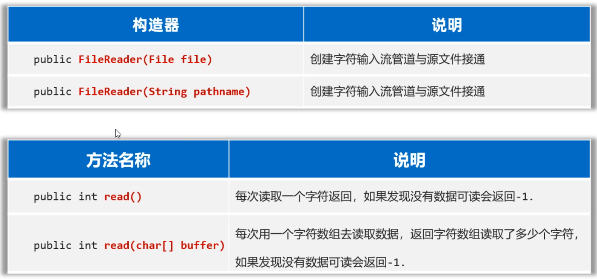

```java
/**
 * 目标：掌握文件字符输入流。
 */
public class FileReaderTest1 {
    public static void main(String[] args)  {
        try (
                // 1、创建一个文件字符输入流管道与源文件接通
                Reader fr = new FileReader("io-app2\\src\\itheima01.txt");
                ){
            // 2、一个字符一个字符的读（性能较差）
//            int c; // 记住每次读取的字符编号。
//            while ((c = fr.read()) != -1){
//                System.out.print((char) c);
//            }
            // 每次读取一个字符的形式，性能肯定是比较差的。

            // 3、每次读取多个字符。（性能是比较不错的！）
            char[] buffer = new char[3];
            int len; // 记住每次读取了多少个字符。
            while ((len = fr.read(buffer)) != -1){
                // 读取多少倒出多少
                System.out.print(new String(buffer, 0, len));
            }
        } catch (Exception e) {
            e.printStackTrace();
        }
    }
}
```


### 1.2 FileWriter类

在上节课，我们学习了FileReader，它可以将文件中的字符数据读取到程序中来。接下来，我们就要学习FileWriter了，它可以将程序中的字符数据写入文件。

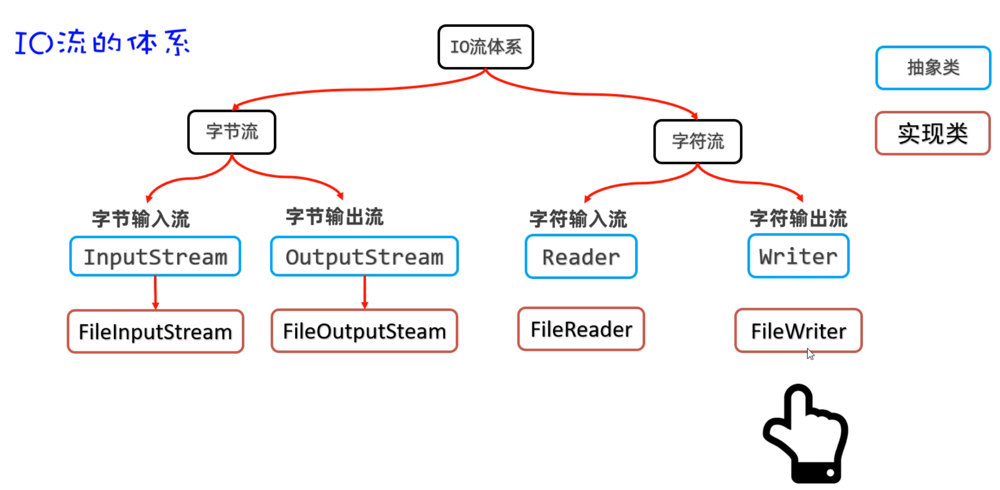

FileWriter往文件中写字符数据的步骤如下：

```java
第一步：创建FileWirter对象与要读取的目标文件接通
第二步：调用write(字符数据/字符数组/字符串)方法读取文件中的字符
第三步：调用close()方法关闭流
```

需要用到的方法如下：构造器是用来创建FileWriter对象的，有了对象才能调用write方法写数据到文件。

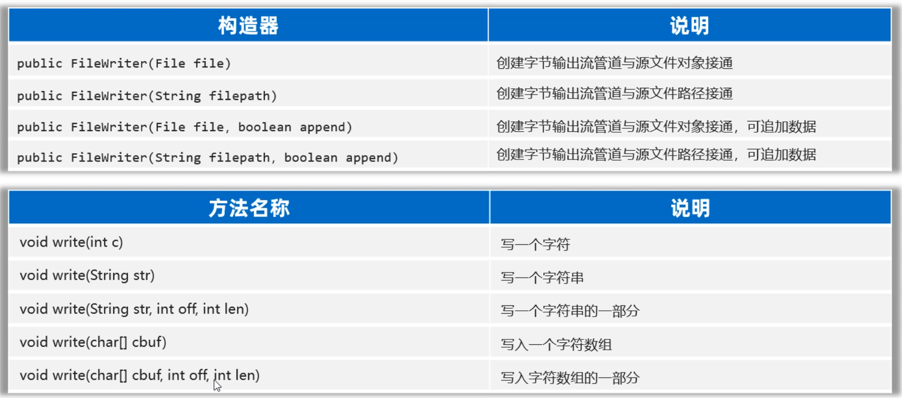

接下来，用代码演示一下：

```java
/**
 * 目标：掌握文件字符输出流：写字符数据出去
 */
public class FileWriterTest2 {
    public static void main(String[] args) {
        try (
                // 0、创建一个文件字符输出流管道与目标文件接通。
                // 覆盖管道
                // Writer fw = new FileWriter("io-app2/src/itheima02out.txt");
                // 追加数据的管道
                Writer fw = new FileWriter("io-app2/src/itheima02out.txt", true);
                ){
            // 1、public void write(int c):写一个字符出去
            fw.write('a');
            fw.write(97);
            //fw.write('磊'); // 写一个字符出去
            fw.write("\r\n"); // 换行

            // 2、public void write(String c)写一个字符串出去
            fw.write("我爱你中国abc");
            fw.write("\r\n");

            // 3、public void write(String c ,int pos ,int len):写字符串的一部分出去
            fw.write("我爱你中国abc", 0, 5);
            fw.write("\r\n");

            // 4、public void write(char[] buffer):写一个字符数组出去
            char[] buffer = {'黑', '马', 'a', 'b', 'c'};
            fw.write(buffer);
            fw.write("\r\n");

            // 5、public void write(char[] buffer ,int pos ,int len):写字符数组的一部分出去
            fw.write(buffer, 0, 2);
            fw.write("\r\n");
        } catch (Exception e) {
            e.printStackTrace();
        }
    }
}
```


### 1.3 FileWriter写的注意事项

各位同学，刚才我们已经学习了FileWriter字符输出流的基本使用。但是，这里有一个小问题需要和同学们说下一：**FileWriter写完数据之后，必须刷新或者关闭，写出去的数据才能生效。**

比如：下面的代码只调用了写数据的方法，没有关流的方法。当你打开目标文件时，是看不到任何数据的。

```java
//1.创建FileWriter对象
Writer fw = new FileWriter("io-app2/src/itheima03out.txt");

//2.写字符数据出去
fw.write('a');
fw.write('b');
fw.write('c');
```

而下面的代码，加上了flush()方法之后，数据就会立即到目标文件中去。

```java
//1.创建FileWriter对象
Writer fw = new FileWriter("io-app2/src/itheima03out.txt");

//2.写字符数据出去
fw.write('a');
fw.write('b');
fw.write('c');

//3.刷新
fw.flush(); 
```

下面的代码，调用了close()方法，数据也会立即到文件中去。因为close()方法在关闭流之前，会将内存中缓存的数据先刷新到文件，再关流。

```java
//1.创建FileWriter对象
Writer fw = new FileWriter("io-app2/src/itheima03out.txt");

//2.写字符数据出去
fw.write('a');
fw.write('b');
fw.write('c');

//3.关闭流
fw.close(); //会先刷新，再关流
```

但是需要注意的是，关闭流之后，就不能在对流进行操作了。否则会出异常

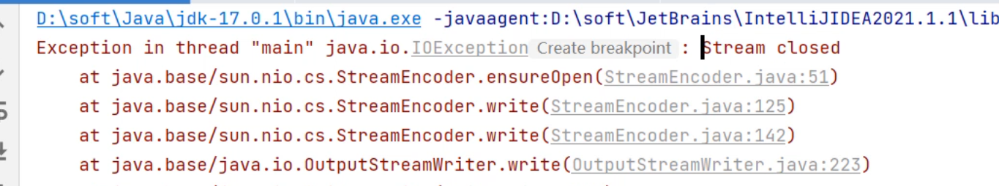


## 二、缓冲流

学习完字符流之后，接下来我们学习一下缓冲流。我们还是先来认识一下缓存流，再来说一下它的作用。缓冲流有四种，如下图所示

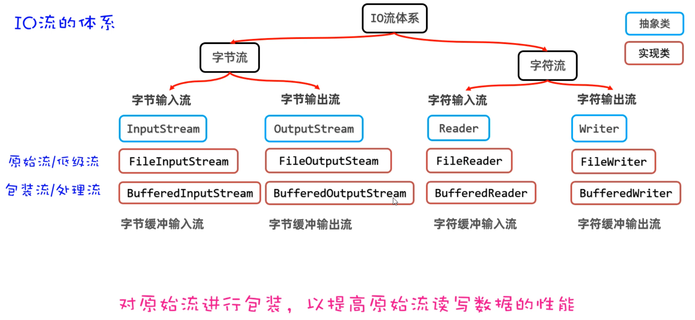

**缓冲流的作用**：可以对原始流进行包装，提高原始流读写数据的性能。

### 2.1 缓冲字节流

我们先来学习字节缓冲流是如何提高读写数据的性能的，原理如下图所示。是因为在缓冲流的底层自己封装了一个长度为8KB（8129byte）的字节数组，但是缓冲流不能单独使用，它需要依赖于原始流。

- **读数据时：**它先用原始字节输入流一次性读取8KB的数据存入缓冲流内部的数组中（ps: 先一次多囤点货），再从8KB的字节数组中读取一个字节或者多个字节（把消耗屯的货）。

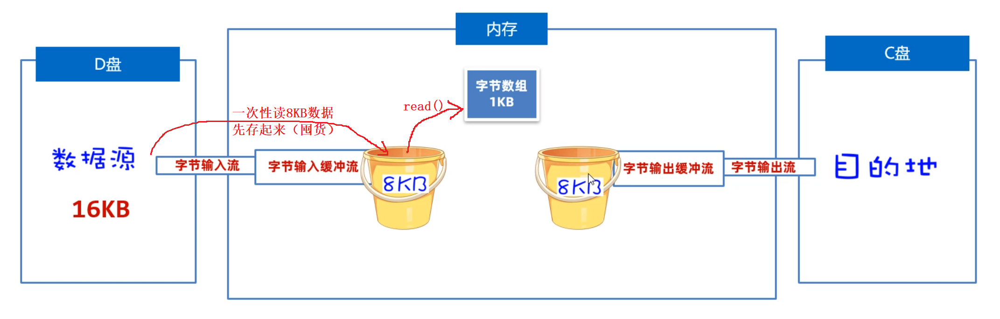

- **写数据时：** 它是先把数据写到缓冲流内部的8BK的数组中（ps: 先攒一车货），等数组存满了，再通过原始的字节输出流，一次性写到目标文件中去（把囤好的货，一次性运走）。

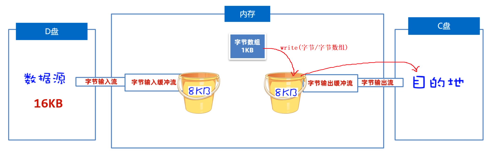


在创建缓冲字节流对象时，需要封装一个原始流对象进来。构造方法如下

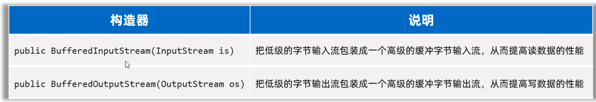

如果我们用缓冲流复制文件，代码写法如下:

```java
public class BufferedInputStreamTest1 {
    public static void main(String[] args) {
        try (
                InputStream is = new FileInputStream("io-app2/src/itheima01.txt");
                // 1、定义一个字节缓冲输入流包装原始的字节输入流
                InputStream bis = new BufferedInputStream(is);

                OutputStream os = new FileOutputStream("io-app2/src/itheima01_bak.txt");
                // 2、定义一个字节缓冲输出流包装原始的字节输出流
                OutputStream bos = new BufferedOutputStream(os);
        ){

            byte[] buffer = new byte[1024];
            int len;
            while ((len = bis.read(buffer)) != -1){
                bos.write(buffer, 0, len);
            }
            System.out.println("复制完成！！");

        } catch (Exception e) {
            e.printStackTrace();
        }
    }
}
```


### 2.2 字符缓冲流

接下来，我们学习另外两个缓冲流——字符缓冲流。它的原理和字节缓冲流是类似的，它底层也会有一个8KB的数组，但是这里是字符数组。字符缓冲流也不能单独使用，它需要依赖于原始字符流一起使用。

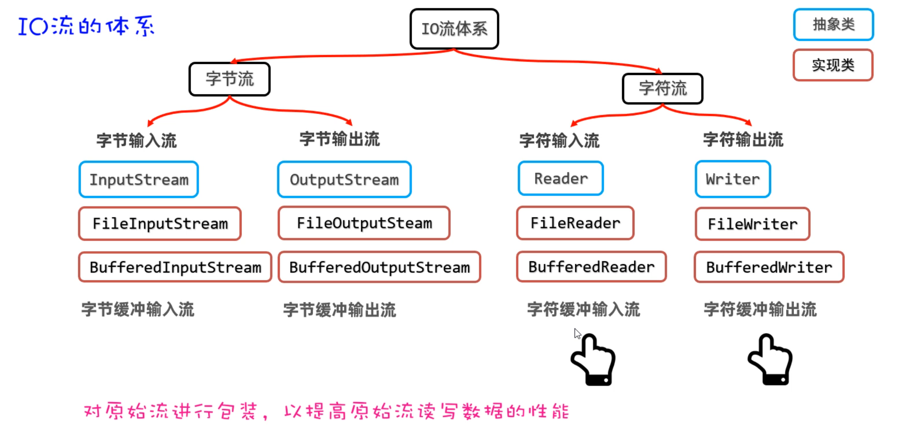

- **BufferedReader读数据时：**它先原始字符输入流一次性读取8KB的数据存入缓冲流内部的数组中（ps: 先一次多囤点货），再从8KB的字符数组中读取一个字符或者多个字符（把消耗屯的货）。

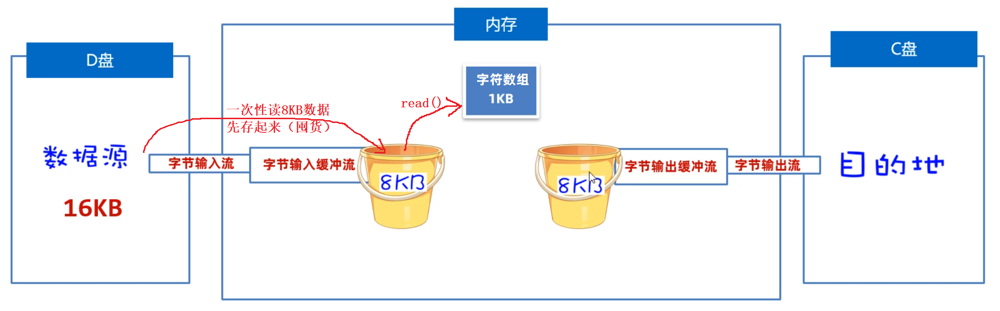

创建BufferedReader对象需要用到BufferedReader的构造方法，内部需要封装一个原始的字符输入流，我们可以传入FileReader.


而且BufferedReader还要特有的方法，一次可以读取文本文件中的一行

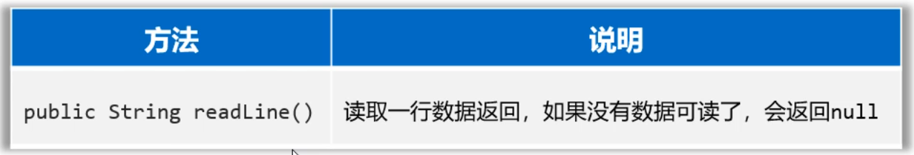

使用BufferedReader读取数据的代码如下

```java
public class BufferedReaderTest2 {
    public static void main(String[] args)  {
        try (
                Reader fr = new FileReader("io-app2\\src\\itheima04.txt");
                // 创建一个字符缓冲输入流包装原始的字符输入流
                BufferedReader br = new BufferedReader(fr);
        ){
//            char[] buffer = new char[3];
//            int len;
//            while ((len = br.read(buffer)) != -1){
//                System.out.print(new String(buffer, 0, len));
//            }
//            System.out.println(br.readLine());
//            System.out.println(br.readLine());
//            System.out.println(br.readLine());
//            System.out.println(br.readLine());

            String line; // 记住每次读取的一行数据
            while ((line = br.readLine()) != null){
                System.out.println(line);
            }
        } catch (Exception e) {
            e.printStackTrace();
        }
    }
}
```


- **BufferedWriter写数据时：** 它是先把数据写到字符缓冲流内部的8BK的数组中（ps: 先攒一车货），等数组存满了，再通过原始的字符输出流，一次性写到目标文件中去（把囤好的货，一次性运走）。如下图所示

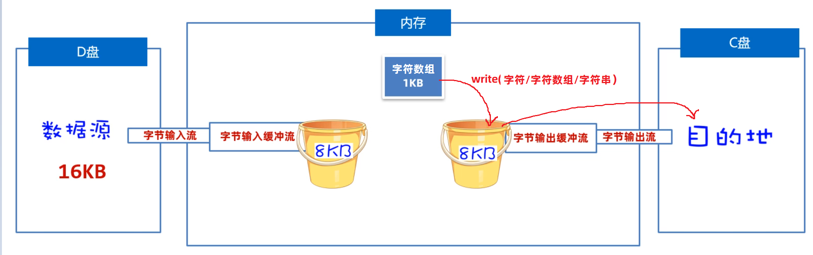

创建BufferedWriter对象时需要用到BufferedWriter的构造方法，而且内部需要封装一个原始的字符输出流，我们这里可以传递FileWriter。


而且BufferedWriter新增了一个功能，可以用来写一个换行符


接下来，用代码演示一下，使用BufferedWriter往文件中写入字符数据。

```java
public class BufferedWriterTest3 {
    public static void main(String[] args) {
        try (
                Writer fw = new FileWriter("io-app2/src/itheima05out.txt", true);
                // 创建一个字符缓冲输出流管道包装原始的字符输出流
                BufferedWriter bw = new BufferedWriter(fw);
        ){

            bw.write('a');
            bw.write(97);
            bw.write('磊');
            bw.newLine();

            bw.write("我爱你中国abc");
            bw.newLine();

        } catch (Exception e) {
            e.printStackTrace();
        }
    }
}
```


### 2.3 缓冲流性能分析

我们说缓冲流内部多了一个数组，可以提高原始流的读写性能。讲到这一定有同学有这么一个疑问，它和我们使用原始流，自己加一个8BK数组不是一样的吗？ 缓冲流就一定能提高性能吗？先告诉同学们答案，**缓冲流不一定能提高性能**。

> 下面我们用一个比较大文件（889MB）复制，做性能测试，分别使用下面四种方式来完成文件复制，并记录文件复制的时间。

① 使用低级流一个字节一个字节的复制

② 使用低级流按照字节数组的形式复制

③ 使用缓冲流一个字节一个字节的复制

④ 使用缓冲流按照字节数组的形式复制

```java
低级流一个字节复制: 慢得简直让人无法忍受
低级流按照字节数组复制(数组长度1024): 12.117s
缓冲流一个字节复制: 11.058s
缓冲流按照字节数组复制(数组长度1024): 2.163s
【注意：这里的测试只能做一个参考，和电脑性能也有直接关系】
```

经过上面的测试，我们可以得出一个结论：**默认情况下，采用一次复制1024个字节，缓冲流完胜。**


> 但是，缓冲流就一定性能高吗？我们采用一次复制8192个字节试试

```java
低级流按照字节数组复制(数组长度8192): 2.535s
缓冲流按照字节数组复制(数组长度8192): 2.088s
```

经过上面的测试，我们可以得出一个结论：**一次读取8192个字节时，低级流和缓冲流性能相当。**相差的那几毫秒可以忽略不计。


> 继续把数组变大，看一看缓冲流就一定性能高吗？现在采用一次读取1024*32个字节数据试试

```java
低级流按照字节数组复制(数组长度8192): 1.128s
缓冲流按照字节数组复制(数组长度8192): 1.133s
```

经过上面的测试，我们可以得出一个结论：**数组越大性能越高，低级流和缓冲流性能相当。**相差的那几秒可以忽略不计。


> 继续把数组变大，看一看缓冲流就一定性能高吗？现在采用一次读取1024*6个字节数据试试

```java
低级流按照字节数组复制(数组长度8192): 1.039s
缓冲流按照字节数组复制(数组长度8192): 1.151s
```

此时你会发现，当数组大到一定程度，性能已经提高了多少了，甚至缓冲流的性能还没有低级流高。

最终总结一下：**缓冲流的性能不一定比低级流高，其实低级流自己加一个数组，性能其实是不差。**只不过缓冲流帮你加了一个相对而言大小比较合理的数组 。


## 三、转换流

前面我们学习过FileReader读取文件中的字符，但是同学们注意了，FileReader默认只能读取UTF-8编码格式的文件。如果使用FileReader读取GBK格式的文件，可能存在乱码，因为FileReader它遇到汉字默认是按照3个字节来读取的，而GBK格式的文件一个汉字是占2个字节，这样就会导致乱码。

Java给我们提供了另外两种流InputStreamReader，OutputStreamWriter，这两个流我们把它叫做转换流。它们可以将字节流转换为字符流，并且可以指定编码方案。

### 3.1 InputStreamReader类

接下来，我们先学习InputStreamReader类，你看这个类名就比较有意思，前面是InputStream表示字节输入流，后面是Reader表示字符输入流，合在一起意思就是表示可以把InputStream转换为Reader，最终InputStreamReader其实也是Reader的子类，所以也算是字符输入流。

InputStreamReader也是不能单独使用的，它内部需要封装一个InputStream的子类对象，再指定一个编码表，如果不指定编码表，默认会按照UTF-8形式进行转换。

> 需求：我们可以先准备一个GBK格式的文件，然后使用下面的代码进行读取，看是是否有乱码。

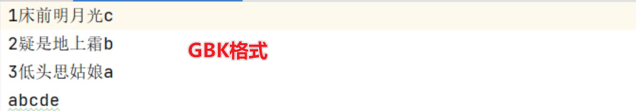

```java
public class InputStreamReaderTest2 {
    public static void main(String[] args) {
        try (
                // 1、得到文件的原始字节流（GBK的字节流形式）
                InputStream is = new FileInputStream("io-app2/src/itheima06.txt");
                // 2、把原始的字节输入流按照指定的字符集编码转换成字符输入流
                Reader isr = new InputStreamReader(is, "GBK");
                // 3、把字符输入流包装成缓冲字符输入流
                BufferedReader br = new BufferedReader(isr);
                ){
            String line;
            while ((line = br.readLine()) != null){
                System.out.println(line);
            }


        } catch (Exception e) {
            e.printStackTrace();
        }
    }
}
```

执行完之后，你会发现没有乱码。


### 3.2 OutputStreamWriter类

接下来，我们先学习OutputStreamWriter类，你看这个类名也比较有意思，前面是OutputStream表示字节输出流，后面是Writer表示字符输出流，合在一起意思就是表示可以把OutputStream转换为Writer，最终OutputStreamWriter其实也是Writer的子类，所以也算是字符输出流。

OutputStreamReader也是不能单独使用的，它内部需要封装一个OutputStream的子类对象，再指定一个编码表，如果不指定编码表，默认会按照UTF-8形式进行转换。

> 需求：我们可以先准备一个GBK格式的文件，使用下面代码往文件中写字符数据。

```java
public class OutputStreamWriterTest3 {
    public static void main(String[] args) {
        // 指定写出去的字符编码。
        try (
                // 1、创建一个文件字节输出流
                OutputStream os = new FileOutputStream("io-app2/src/itheima07out.txt");
                // 2、把原始的字节输出流，按照指定的字符集编码转换成字符输出转换流。
                Writer osw = new OutputStreamWriter(os, "GBK");
                // 3、把字符输出流包装成缓冲字符输出流
                BufferedWriter bw = new BufferedWriter(osw);
                ){
            bw.write("我是中国人abc");
            bw.write("我爱你中国123");

        } catch (Exception e) {
            e.printStackTrace();
        }
    }
}
```


## 四、打印流

接下来，我们学习打印流，其实打印流我们从开学第一天就一直再使用，只是没有学到你感受不到而已。打印流可以实现更加方便，更加高效的写数据的方式。

### 4.1 打印流基本使用

打印流，这里所说的打印其实就是写数据的意思，它和普通的write方法写数据还不太一样，一般会使用打印流特有的方法叫`print(数据)`或者`println(数据)`，它打印啥就输出啥。

打印流有两个，一个是字节打印流PrintStream，一个是字符打印流PrintWriter，如下图所示

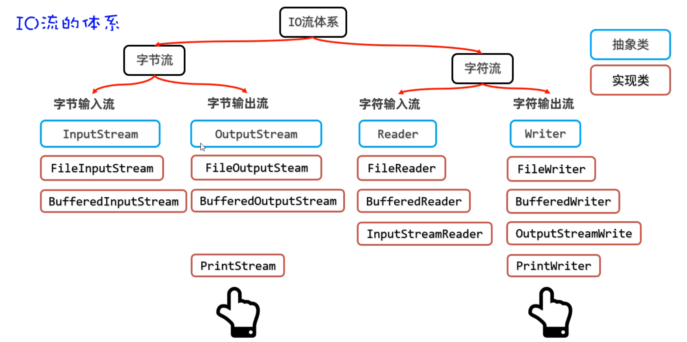

**PrintStream和PrintWriter的用法是一样的，所以这里就一块演示了。**

```java
public class PrintTest1 {
    public static void main(String[] args) {
        try (
                // 1、创建一个打印流管道
//                PrintStream ps =
//                        new PrintStream("io-app2/src/itheima08.txt", Charset.forName("GBK"));
//                PrintStream ps =
//                        new PrintStream("io-app2/src/itheima08.txt");
                PrintWriter ps =
                        new PrintWriter(new FileOutputStream("io-app2/src/itheima08.txt", true));
                ){
                ps.print(97);	//文件中显示的就是:97
                ps.print('a'); //文件中显示的就是:a
                ps.println("我爱你中国abc");	//文件中显示的就是:我爱你中国abc
                ps.println(true);//文件中显示的就是:true
                ps.println(99.5);//文件中显示的就是99.5

                ps.write(97); //文件中显示a，发现和前面println方法的区别了吗？

        } catch (Exception e) {
            e.printStackTrace();
        }
    }
}
```


### 4.2 重定向输出语句

其实我们开学第一课，就给同学们讲过`System.out.println()`这句话表示打印输出，但是至于为什么能够输出，其实我们一直不清楚。

以前是因为知识储备还不够，无法解释，到现在就可以给同学们揭晓谜底了，因为System里面有一个静态变量叫out，out的数据类型就是PrintStream，它就是一个打印流，而且这个打印流的默认输出目的地是控制台，所以我们调用`System.out.pirnln()`就可以往控制台打印输出任意类型的数据，而且打印啥就输出啥。

而且System还提供了一个方法，可以修改底层的打印流，这样我们就可以重定向打印语句的输出目的地了。我们玩一下, 直接上代码。

```java
public class PrintTest2 {
    public static void main(String[] args) {
        System.out.println("老骥伏枥");
        System.out.println("志在千里");

        try ( PrintStream ps = new PrintStream("io-app2/src/itheima09.txt"); ){
            // 把系统默认的打印流对象改成自己设置的打印流
            System.setOut(ps);

            System.out.println("烈士暮年");	
            System.out.println("壮心不已");
        } catch (Exception e) {
            e.printStackTrace();
        }
    }
}
```

此时打印语句，将往文件中打印数据，而不在控制台。


## 五、数据流

同学们，接下我们再学习一种流，这种流在开发中偶尔也会用到。比如，我们想把数据和数据的类型一并写到文件中去，读取的时候也将数据和数据类型一并读出来。这就可以用到数据流，有两个DataInputStream和DataOutputStream.

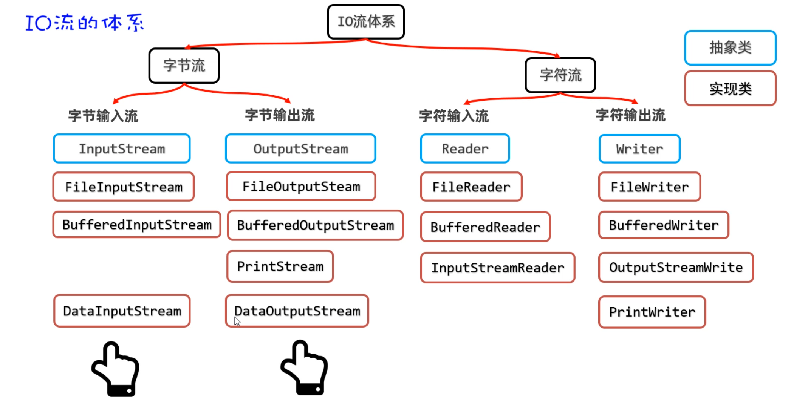

### 5.1 DataOutputStream类

我们先学习DataOutputStream类，它也是一种包装流，创建DataOutputStream对象时，底层需要依赖于一个原始的OutputStream流对象。然后调用它的wirteXxx方法，写的是特定类型的数据。

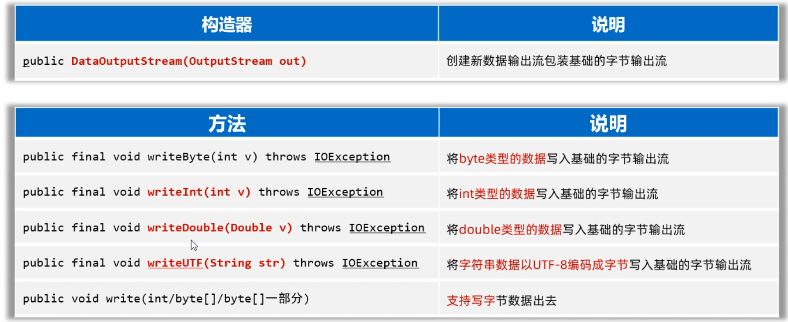

代码如下：往文件中写整数、小数、布尔类型数据、字符串数据

```java
public class DataOutputStreamTest1 {
    public static void main(String[] args) {
        try (
                // 1、创建一个数据输出流包装低级的字节输出流
                DataOutputStream dos =
                        new DataOutputStream(new FileOutputStream("io-app2/src/itheima10out.txt"));
                ){
            dos.writeInt(97);
            dos.writeDouble(99.5);
            dos.writeBoolean(true);
            dos.writeUTF("黑马程序员666！");

        } catch (Exception e) {
            e.printStackTrace();
        }
    }
}
```


### 5.2 DataInputStream类

学习完DataOutputStream后，再学习DataIntputStream类，它也是一种包装流，创建DataInputStream对象时，底层需要依赖于一个原始的InputStream流对象。然后调用它的readXxx()方法就可以读取特定类型的数据。

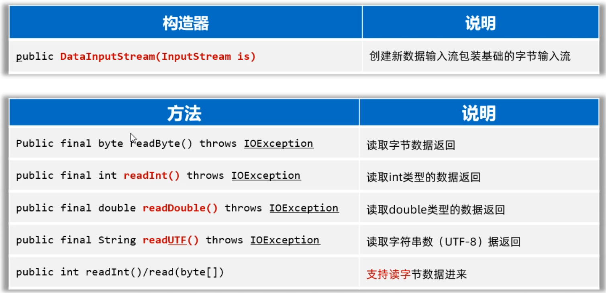

代码如下：读取文件中特定类型的数据（整数、小数、字符串等）

```java
public class DataInputStreamTest2 {
    public static void main(String[] args) {
        try (
                DataInputStream dis =
                        new DataInputStream(new FileInputStream("io-app2/src/itheima10out.txt"));
                ){
            int i = dis.readInt();
            System.out.println(i);

            double d = dis.readDouble();
            System.out.println(d);

            boolean b = dis.readBoolean();
            System.out.println(b);

            String rs = dis.readUTF();
            System.out.println(rs);
        } catch (Exception e) {
            e.printStackTrace();
        }
    }
}
```


## 六、序列化流

各位同学同学，还有最后一个流要学习，叫做序列化流。序列化流是干什么用的呢？ 我们知道字节流是以字节为单位来读写数据、字符流是按照字符为单位来读写数据、而对象流是以对象为单位来读写数据。也就是把对象当做一个整体，可以写一个对象到文件，也可以从文件中把对象读取出来。

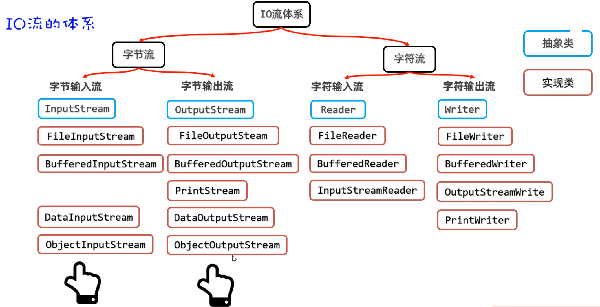

这里有一个新词 序列化，第一次听同学们可能还比较陌生，我来给同学们解释一下

```java
序列化：意思就是把对象写到文件或者网络中去。（简单记：写对象）
反序列化：意思就是把对象从文件或者网络中读取出来。（简单记：读对象）
```

### 6.1 ObjectOutputStraem类

接下来，先学习ObjectOutputStream流，它也是一个包装流，不能单独使用，需要结合原始的字节输出流使用。

代码如下：将一个User对象写到文件中去

- 第一步：先准备一个User类，必须让其实现Serializable接口。

```java
// 注意：对象如果需要序列化，必须实现序列化接口。
public class User implements Serializable {
    private String loginName;
    private String userName;
    private int age;
    // transient 这个成员变量将不参与序列化。
    private transient String passWord;

    public User() {
    }

    public User(String loginName, String userName, int age, String passWord) {
        this.loginName = loginName;
        this.userName = userName;
        this.age = age;
        this.passWord = passWord;
    }

    @Override
    public String toString() {
        return "User{" +
                "loginName='" + loginName + '\'' +
                ", userName='" + userName + '\'' +
                ", age=" + age +
                ", passWord='" + passWord + '\'' +
                '}';
    }
}
```

- 第二步：再创建ObjectOutputStream流对象，调用writeObject方法对象到文件。

```java
public class Test1ObjectOutputStream {
    public static void main(String[] args) {
        try (
                // 2、创建一个对象字节输出流包装原始的字节 输出流。
                ObjectOutputStream oos =
                        new ObjectOutputStream(new FileOutputStream("io-app2/src/itheima11out.txt"));
                ){
            // 1、创建一个Java对象。
            User u = new User("admin", "张三", 32, "666888xyz");

            // 3、序列化对象到文件中去
            oos.writeObject(u);
            System.out.println("序列化对象成功！！");

        } catch (Exception e) {
            e.printStackTrace();
        }
    }
}
```

**注意：写到文件中的对象，是不能用记事本打开看的。因为对象本身就不是文本数据，打开是乱码**

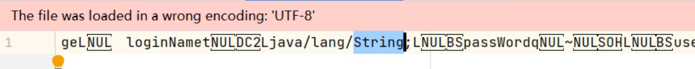

怎样才能读懂文件中的对象是什么呢？这里必须用反序列化，自己写代码读。


### 6.2 ObjectInputStream类

接下来，学习ObjectInputStream流，它也是一个包装流，不能单独使用，需要结合原始的字节输入流使用。

接着前面的案例，文件中已经有一个Student对象，现在要使用ObjectInputStream读取出来。称之为反序列化。

```java
public class Test2ObjectInputStream {
    public static void main(String[] args) {
        try (
            // 1、创建一个对象字节输入流管道，包装 低级的字节输入流与源文件接通
            ObjectInputStream ois = new ObjectInputStream(new FileInputStream("io-app2/src/itheima11out.txt"));
        ){
            User u = (User) ois.readObject();
            System.out.println(u);
        } catch (Exception e) {
            e.printStackTrace();
        }
    }
}
```


## 七、补充知识：IO框架

最后，再给同学们补充讲解一个知识，叫做IO框架。它有什么用呢？有同学经常问老师，我们只学习了IO流对文件复制，能不能复制文件夹呀？ 

当然是可以咯，但是如果让我们自己写复制文件夹的代码需要用到递归，还是比较麻烦的。为了简化对IO操作，**由apache开源基金组织提供了一组有关IO流小框架，可以提高IO流的开发效率。**

这个框架的名字叫commons-io：其本质是别人写好的一些字节码文件（class文件），打包成了一个jar包。我们只需要把jar包引入到我们的项目中，就可以直接用了。 

这里给同学们介绍一个jar包中提供的工具类叫FileUtils，它的部分功能如下，很方便，你一看名字就知道怎么用了。

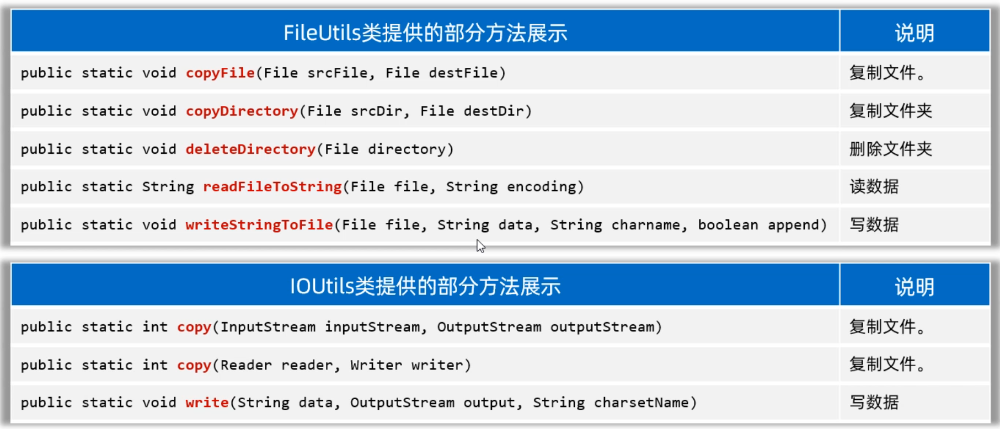

在写代码之前，先需要引入jar包，具体步骤如下

```java
1.在模块的目录下，新建一个lib文件夹
2.把jar包复制粘贴到lib文件夹下
3.选择lib下的jar包，右键点击Add As Library，然后就可以用了。
```

代码如下：

```java
public class CommonsIOTest1 {
    public static void main(String[] args) throws Exception {
        //1.复制文件
        FileUtils.copyFile(new File("io-app2\\src\\itheima01.txt"), new File("io-app2/src/a.txt"));
        
        //2.复制文件夹
        FileUtils.copyDirectory(new File("D:\\resource\\私人珍藏"), new File("D:\\resource\\私人珍藏3"));
        
        //3.删除文件夹
        FileUtils.deleteDirectory(new File("D:\\resource\\私人珍藏3"));

        // Java提供的原生的一行代码搞定很多事情
         Files.copy(Path.of("io-app2\\src\\itheima01.txt"), Path.of("io-app2\\src\\b.txt"));
        System.out.println(Files.readString(Path.of("io-app2\\src\\itheima01.txt")));
    }
}
```

