# day13-网络编程

## 一、网络编程概述

同学们，今天我们学习的课程内容叫网络编程。意思就是编写的应用程序可以与网络上其他设备中的应用程序进行数据交互。

网络编程有什么用呢？这个就不言而喻了，比如我们经常用的微信收发消息就需要用到网络通信的技术、在比如我们打开浏览器可以浏览各种网络、视频等也需要用到网络编程的技术。

我们知道什么是网络编程、也知道网络编程能干什么后了，那Java给我们提供了哪些网络编程的解决方案呢？

Java提供的网络编程的解决方案都是在java.net包下。在正式学习Java网络编程技术之前，我们还需要学习一些网络通信的前置知识理论知识，只有这些前置知识做基础，我们学习网络编程代码编写才起来才能继续下去。

首先和同学们聊聊网络通信的基本架构。通信的基本架构主要有两种形式：一种是CS架构（Client 客户端/Server服务端）、一种是BS架构（Brower 浏览器/Server服务端）。

- **CS架构的特点：**CS架构需要用户在自己的电脑或者手机上安装客户端软件，然后由客户端软件通过网络连接服务器程序，由服务器把数据发给客户端，客户端就可以在页面上看到各种数据了。

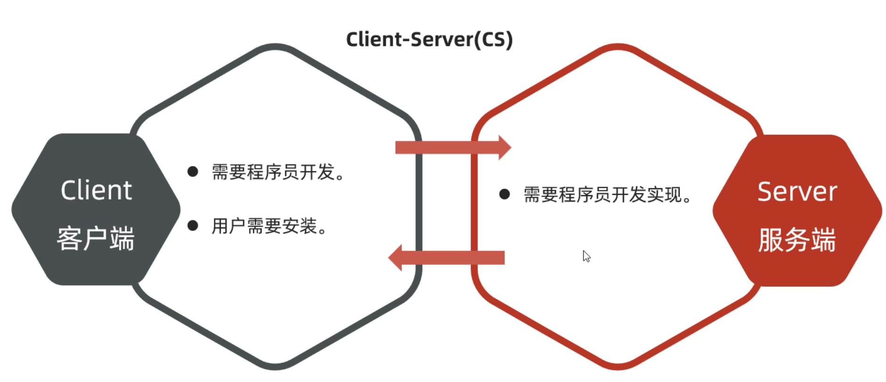

- **BS架构的特点：**BS架构不需要开发客户端软件，用户只需要通过浏览器输入网址就可以直接从服务器获取数据，并由服务器将数据返回给浏览器，用户在页面上就可以看到各种数据了。

  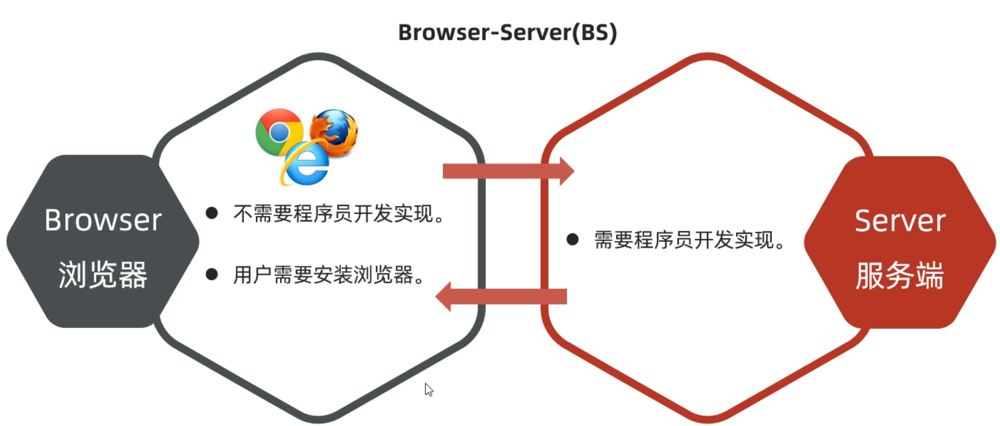

这两种结构不管是CS、还是BS都是需要用到网络编程的相关技术。我们学习Java的程序员，以后从事的工作方向主要还是BS架构的。


## 二、网络编程三要素

各位小伙伴，我们前面已经知道什么是网络编程了。接下来我们还需要学习一些网络编程的基本概念，才能去编写网络编程的应用程序。

有哪三要素呢？分别是IP地址、端口号、通信协议

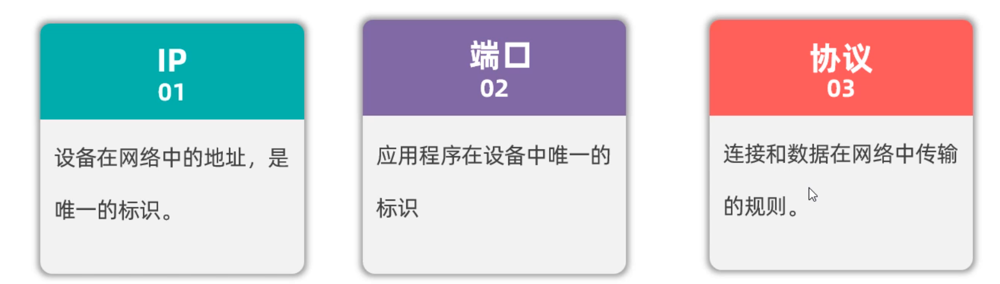

1. IP地址：表示设备在网络中的地址，是网络中设备的唯一标识

2. 端口号：应用程序在设备中唯一的标识
3. 协议：连接和数据在网络中传输的规则。

如下图所示：假设现在要从一台电脑中的微信上，发一句“你愁啥？”到其他电脑的微信上，流程如下

```java
1.先通过ip地址找到对方的电脑
2.再通过端口号找到对方的电脑上的应用程序
3.按照双方约定好的规则发送、接收数据
```

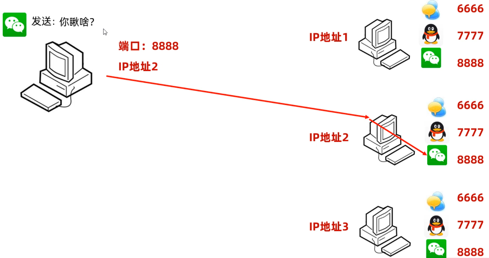

### 2.1 IP地址

接下来，我们详细介绍一下IP地址。**IP（Ineternet Protocol）全称互联网协议地址，是分配给网络设备的唯一表示。**IP地址分为：IPV4地址、IPV6地址

IPV4地址由32个比特位（4个字节）组成，如果下图所示，但是由于采用二进制太不容易阅读了，于是就将每8位看成一组，把每一组用十进制表示（叫做点分十进制表示法）。所以就有了我们经常看到的IP地址形式，如：192.168.1.66

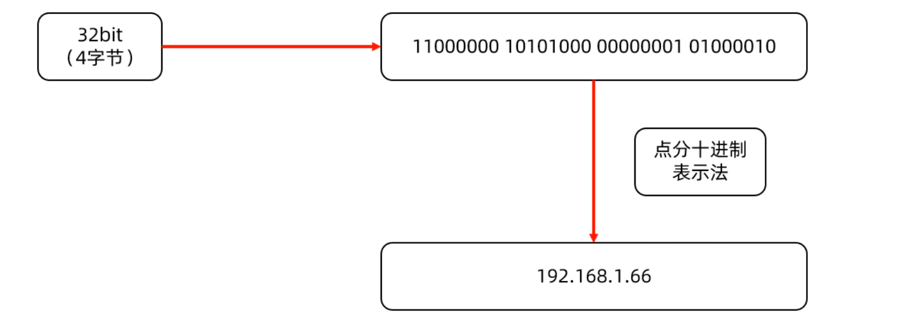

如果想查看本机的IP地址，可以在命令行窗口，输入`ipconfig`命令查看，如下图所示

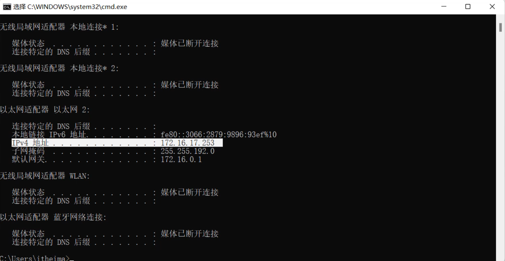

经过不断的发展，现在越来越多的设备需要联网，IPV4地址已经不够用了，所以扩展出来了IPV6地址。

IPV6采用128位二进制数据来表示（16个字节），号称可以为地球上的每一粒沙子编一个IP地址，

IPV6比较长，为了方便阅读，每16位编成一组，每组采用十六进制数据表示，然后用冒号隔开（称为冒分十六进制表示法），如下图所示

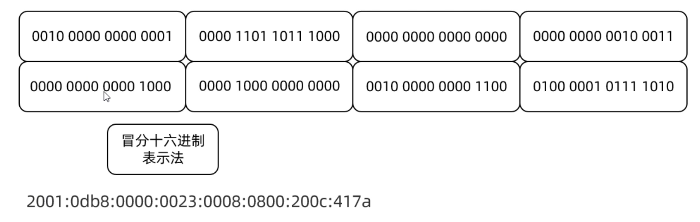

我们在命令行窗口输入`ipconfig`命令，同样可以看到ipv6地址，如下图所示

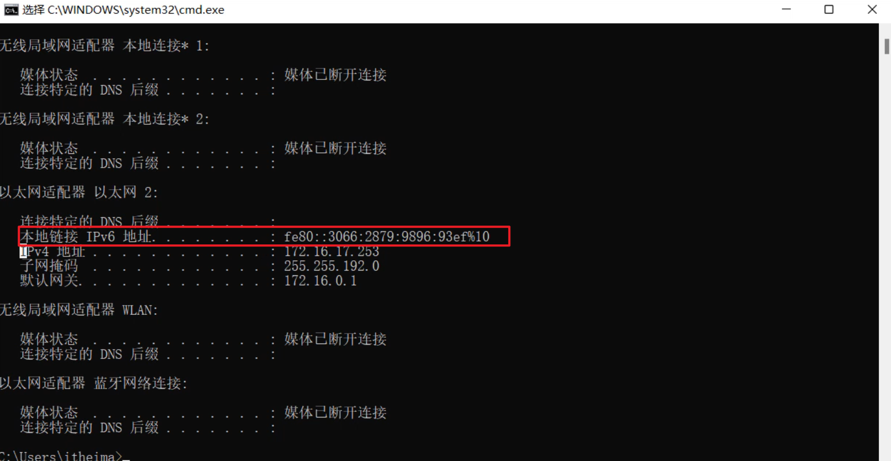

现在的网络设备，一般IPV4和IPV6地址都是支持的。

---

聊完什么是IP地址和IP地址分类之后，接下来再给大家介绍一下和IP地址相关的一个东西，叫做域名。

我们在浏览器上访问某一个网站是，就需要在浏览器的地址栏输入网址，这个网址的专业说法叫做域名。比如：传智播客的域名是`http://www.itcast.cn`。

域名和IP其实是一一对应的，由运营商来管理域名和IP的对应关系。我们在浏览器上敲一个域名时，首先由运营商的域名解析服务，把域名转换为ip地址，再通过IP地址去访问对应的服务器设备。

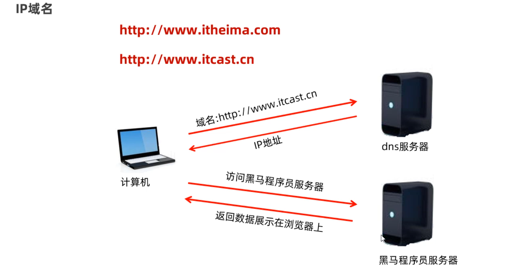

关于IP地址，还有一个特殊的地址需要我们记住一下。就是我们在学习阶段进行测试时，经常会自己给自己消息，需要用到一个本地回送地址：`127.0.0.1`

最后给同学们介绍，两个和IP地址相关的命令

```java
ipconfig: 查看本机的ip地址
pring 域名/ip  检测当前电脑与指定的ip是否连通
```

ping命令出现以下的提示，说明网络是通过的

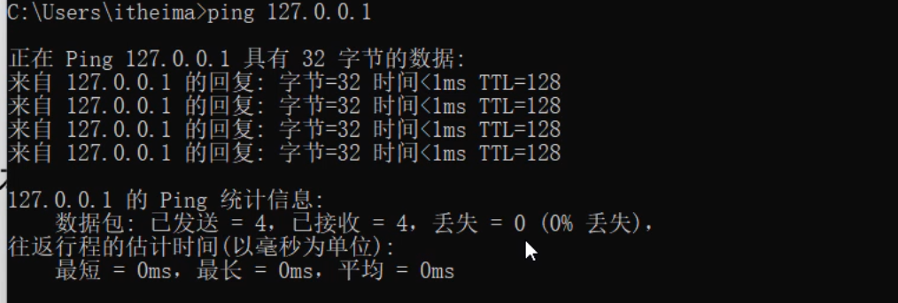


### 2.2 InetAddress类

各位小伙伴，在上一节课我们学习了网络编程的三要素之一，IP地址。按照面向对象的设计思想，Java中也有一个类用来表IP地址，这个类是InetAddress类。我们在开发网络通信程序的时候，可能有时候会获取本机的IP地址，以及测试与其他地址是否连通，这个时候就可以使用InetAddress类来完成。下面学习几个InetAddress的方法。

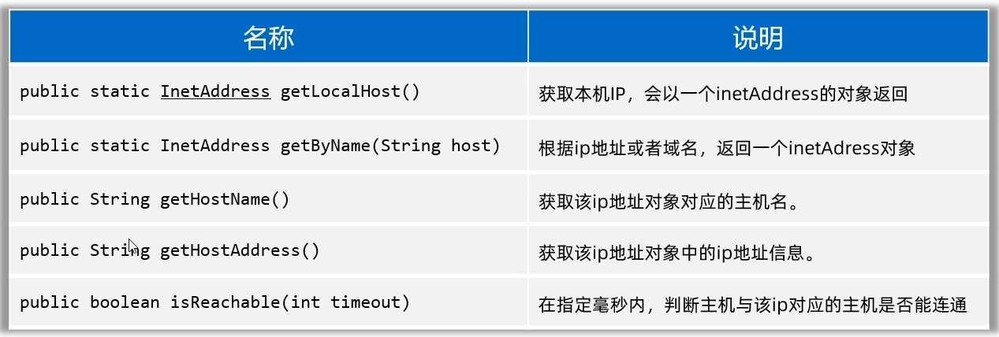

演示上面几个方法的效果

```java
public class InetAddressTest {
    public static void main(String[] args) throws Exception {
        // 1、获取本机IP地址对象的
        InetAddress ip1 = InetAddress.getLocalHost();
        System.out.println(ip1.getHostName());
        System.out.println(ip1.getHostAddress());

        // 2、获取指定IP或者域名的IP地址对象。
        InetAddress ip2 = InetAddress.getByName("www.baidu.com");
        System.out.println(ip2.getHostName());
        System.out.println(ip2.getHostAddress());

        // ping www.baidu.com
        System.out.println(ip2.isReachable(6000));
    }
}
```


### 2.3 端口号

端口号：指的是计算机设备上运行的应用程序的标识，被规定为一个16位的二进制数据，范围（0~65535）

端口号分为一下几类（了解一下）

- 周知端口：0~1023，被预先定义的知名应用程序占用（如：HTTP占用80，FTP占用21）
- 注册端口：1024~49151，分配给用户经常或者某些应用程序
- 动态端口：49152~65536，之所以称为动态端口，是因为它一般不固定分配给某进程，而是动态分配的。

需要我们注意的是，同一个计算机设备中，不能出现两个应用程序，用同一个端口号

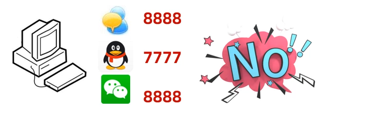

### 2.4 协议

各位同学，前面我们已经学习了IP地址和端口号，但是想要完成数据通信还需要有通信协议。

**网络上通信的设备，事先规定的连接规则，以及传输数据的规则被称为网络通信协议。**


为了让世界上各种上网设备能够互联互通，肯定需要有一个组织出来，指定一个规则，大家都遵守这个规则，才能进行数据通信。

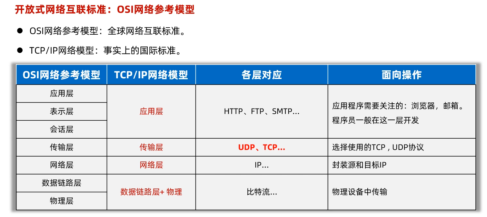

只要按照OSI网络参考模型制造的设备，就可以在国际互联网上互联互通。其中传输层有两个协议，是我们今天会接触到的（UDP协议、TCP协议）

- **UDP协议特点**

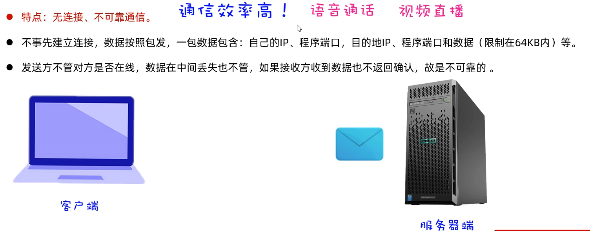

- **TPC协议特点**

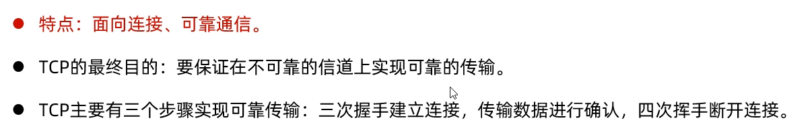

三次握手如下图所示**：目的是确认通信双方，手法消息都是正常没问题的**

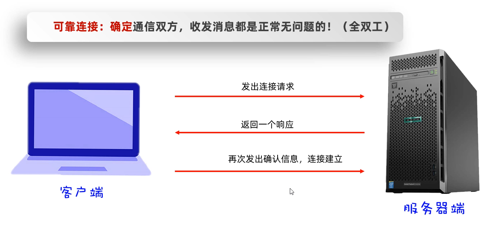

四次挥手如下图所示：**目的是确保双方数据的收发已经完成，没有数据丢失**

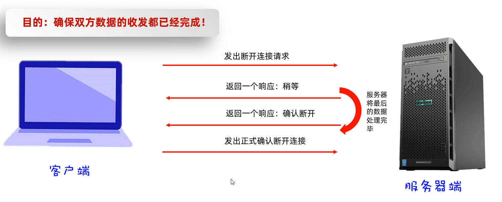

## 三、UDP通信代码（入门案例）

有了网络编程的三要素基础知识之后，我们就可以开始学习编写网络通信的程序了。首先学习基于UDP协议通信的代码编写。

UDP是面向无连接的、不需要确认双方是否存在，所以它是不可靠的协议。Java提供了一个类叫DatagramSocket来完成基于UDP协议的收发数据。使用DatagramSocket收发数据时，数据要以数据包的形式体现，一个数据包限制在64KB以内

具体流程如下图所示：假设我们把DatagramSocket看做是街道两天的人，现在左边的人要扔一盘韭菜到右边，这里的韭菜就是数据，但是数据需要用一个盘子装起来，这里的盘子就是DatagramPacket数据包的意思。通信双方都需要有DatagramSocket(扔、接韭菜人)，还需要有DatagramPacket(装韭菜的盘子)

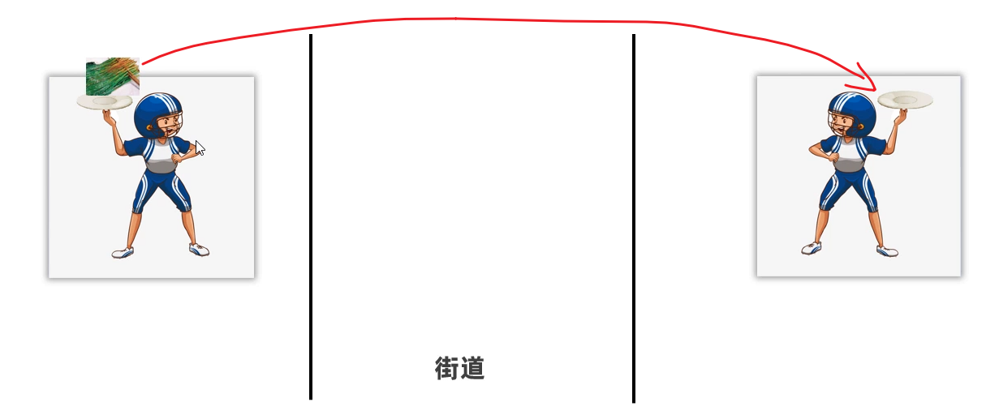

下面我们看一个案例，需要有两个程序，一个表示客户端程序，一个表示服务端程序。

需求：客户端程序发一个字符串数据给服务端，服务端程序接收数据并打印。

### 3.1 客户端程序

```java
/**
 * 目标：完成UDP通信快速入门：实现1发1收。
 */
public class Client {
    public static void main(String[] args) throws Exception {
        // 1、创建客户端对象（发韭菜出去的人）
        DatagramSocket socket = new DatagramSocket(7777);

        // 2、创建数据包对象封装要发出去的数据（创建一个韭菜盘子）
       /* public DatagramPacket(byte buf[], int length,
             InetAddress address, int port)
               参数一：封装要发出去的数据。
               参数二：发送出去的数据大小（字节个数）
               参数三：服务端的IP地址（找到服务端主机）
               参数四：服务端程序的端口。
             */
        byte[] bytes = "我是快乐的客户端，我爱你abc".getBytes();
        DatagramPacket packet = new DatagramPacket(bytes, bytes.length
                , InetAddress.getLocalHost(),  6666);

        // 3、开始正式发送这个数据包的数据出去了
        socket.send(packet);

        System.out.println("客户端数据发送完毕~~~");
        socket.close(); // 释放资源！
    }
}
```

### 3.2 服务端程序

```java
public class Server {
    public static void main(String[] args) throws Exception {
        System.out.println("----服务端启动----");
        // 1、创建一个服务端对象（创建一个接韭菜的人） 注册端口
        DatagramSocket socket = new DatagramSocket(6666);

        // 2、创建一个数据包对象，用于接收数据的（创建一个韭菜盘子）
        byte[] buffer = new byte[1024 * 64]; // 64KB.
        DatagramPacket packet = new DatagramPacket(buffer, buffer.length);

        // 3、开始正式使用数据包来接收客户端发来的数据
        socket.receive(packet);

        // 4、从字节数组中，把接收到的数据直接打印出来
        // 接收多少就倒出多少
        // 获取本次数据包接收了多少数据。
        int len = packet.getLength();

        String rs = new String(buffer, 0 , len);
        System.out.println(rs);

        System.out.println(packet.getAddress().getHostAddress());
        System.out.println(packet.getPort());

        socket.close(); // 释放资源
    }
}
```


## 四、UDP通信代码（多发多收）

刚才的案例，我们只能客户端发一次，服务端接收一次就结束了。下面我们想把这个代码改进一下，

需求：实现客户端不断的发数据，而服务端能不断的接收数据，客户端发送exit时客户端程序退出。

### 4.1 客户端程序

```java
/**
 * 目标：完成UDP通信快速入门：实现客户端反复的发。
 */
public class Client {
    public static void main(String[] args) throws Exception {
        // 1、创建客户端对象（发韭菜出去的人）
        DatagramSocket socket = new DatagramSocket();

        // 2、创建数据包对象封装要发出去的数据（创建一个韭菜盘子）
       /* public DatagramPacket(byte buf[], int length,
             InetAddress address, int port)
               参数一：封装要发出去的数据。
               参数二：发送出去的数据大小（字节个数）
               参数三：服务端的IP地址（找到服务端主机）
               参数四：服务端程序的端口。
             */
        Scanner sc = new Scanner(System.in);
        while (true) {
            System.out.println("请说：");
            String msg = sc.nextLine();

            // 一旦发现用户输入的exit命令，就退出客户端
            if("exit".equals(msg)){
                System.out.println("欢迎下次光临！退出成功！");
                socket.close(); // 释放资源
                break; // 跳出死循环
            }

            byte[] bytes = msg.getBytes();
            DatagramPacket packet = new DatagramPacket(bytes, bytes.length
                    , InetAddress.getLocalHost(),  6666);

            // 3、开始正式发送这个数据包的数据出去了
            socket.send(packet);
        }
    }
}
```


### 4.2 服务端程序

```java
/**
 * 目标：完成UDP通信快速入门-服务端反复的收
 */
public class Server {
    public static void main(String[] args) throws Exception {
        System.out.println("----服务端启动----");
        // 1、创建一个服务端对象（创建一个接韭菜的人） 注册端口
        DatagramSocket socket = new DatagramSocket(6666);

        // 2、创建一个数据包对象，用于接收数据的（创建一个韭菜盘子）
        byte[] buffer = new byte[1024 * 64]; // 64KB.
        DatagramPacket packet = new DatagramPacket(buffer, buffer.length);

        while (true) {
            // 3、开始正式使用数据包来接收客户端发来的数据
            socket.receive(packet);

            // 4、从字节数组中，把接收到的数据直接打印出来
            // 接收多少就倒出多少
            // 获取本次数据包接收了多少数据。
            int len = packet.getLength();

            String rs = new String(buffer, 0 , len);
            System.out.println(rs);

            System.out.println(packet.getAddress().getHostAddress());
            System.out.println(packet.getPort());
            System.out.println("--------------------------------------");
        }
    }
}
```


## 五、TCP通信（一发一收）

学习完UDP通信的代码编写之后，接下来我们学习TCP通信的代码如何编写。Java提供了一个java.net.Socket类来完成TCP通信。

我们先讲一下Socket完成TCP通信的流程，再讲代码怎么编写就很好理解了。如下图所示

1. 当创建Socket对象时，就会在客户端和服务端创建一个数据通信的管道，在客户端和服务端两边都会有一个Socket对象来访问这个通信管道。
2. 现在假设客户端要发送一个“在一起”给服务端，客户端这边先需要通过Socket对象获取到一个字节输出流，通过字节输出流写数据到服务端
3. 然后服务端这边通过Socket对象可以获取字节输入流，通过字节输入流就可以读取客户端写过来的数据，并对数据进行处理。
4. 服务端处理完数据之后，假设需要把“没感觉”发给客户端端，那么服务端这边再通过Socket获取到一个字节输出流，将数据写给客户端
5. 客户端这边再获取输入流，通过字节输入流来读取服务端写过来的数据。


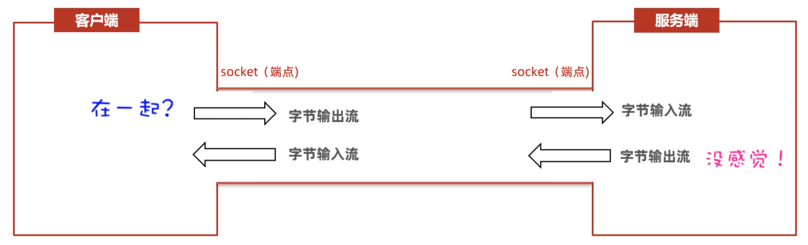

### 5.1 TCP客户端

下面我们写一个客户端，用来往服务端发数据。由于原始的字节流不是很好用，这里根据我的经验，我原始的OutputStream包装为DataOutputStream是比较好用的。

```java
/**
 *  目标：完成TCP通信快速入门-客户端开发：实现1发1收。
 */
public class Client {
    public static void main(String[] args) throws Exception {
        // 1、创建Socket对象，并同时请求与服务端程序的连接。
        Socket socket = new Socket("127.0.0.1", 8888);

        // 2、从socket通信管道中得到一个字节输出流，用来发数据给服务端程序。
        OutputStream os = socket.getOutputStream();

        // 3、把低级的字节输出流包装成数据输出流
        DataOutputStream dos = new DataOutputStream(os);

        // 4、开始写数据出去了
        dos.writeUTF("在一起，好吗？");
        dos.close();

        socket.close(); // 释放连接资源
    }
}
```


### 5.2 TCP服务端

上面我们只是写了TCP客户端，还没有服务端，接下来我们把服务端写一下。这里的服务端用来接收客户端发过来的数据。

```java
/**
 *  目标：完成TCP通信快速入门-服务端开发：实现1发1收。
 */
public class Server {
    public static void main(String[] args) throws Exception {
        System.out.println("-----服务端启动成功-------");
        // 1、创建ServerSocket的对象，同时为服务端注册端口。
        ServerSocket serverSocket = new ServerSocket(8888);

        // 2、使用serverSocket对象，调用一个accept方法，等待客户端的连接请求
        Socket socket = serverSocket.accept();

        // 3、从socket通信管道中得到一个字节输入流。
        InputStream is = socket.getInputStream();

        // 4、把原始的字节输入流包装成数据输入流
        DataInputStream dis = new DataInputStream(is);

        // 5、使用数据输入流读取客户端发送过来的消息
        String rs = dis.readUTF();
        System.out.println(rs);
        // 其实我们也可以获取客户端的IP地址
        System.out.println(socket.getRemoteSocketAddress());

        dis.close();
        socket.close();
    }
}
```


## 六、TCP通信（多发多收）

到目前为止，我们已经完成了客户端发送消息、服务端接收消息，但是客户端只能发一次，服务端只能接收一次。现在我想要客户端能过一直发消息，服务端能够一直接收消息。

下面我们把客户端代码改写一下，采用键盘录入的方式发消息，为了让客户端能够一直发，我们只需要将发送消息的代码套一层循环就可以了，当用户输入exit时，客户端退出循环并结束客户端。

### 6.1 TCP客户端

```java
/**
 *  目标：完成TCP通信快速入门-客户端开发：实现客户端可以反复的发消息出去
 */
public class Client {
    public static void main(String[] args) throws Exception {
        // 1、创建Socket对象，并同时请求与服务端程序的连接。
        Socket socket = new Socket("127.0.0.1", 8888);

        // 2、从socket通信管道中得到一个字节输出流，用来发数据给服务端程序。
        OutputStream os = socket.getOutputStream();

        // 3、把低级的字节输出流包装成数据输出流
        DataOutputStream dos = new DataOutputStream(os);

        Scanner sc = new Scanner(System.in);
        while (true) {
            System.out.println("请说：");
            String msg = sc.nextLine();

            // 一旦用户输入了exit，就退出客户端程序
            if("exit".equals(msg)){
                System.out.println("欢迎您下次光临！退出成功！");
                dos.close();
                socket.close();
                break;
            }

            // 4、开始写数据出去了
            dos.writeUTF(msg);
            dos.flush();
        }
    }
}
```


### 6.2 TCP服务端

为了让服务端能够一直接收客户端发过来的消息，服务端代码也得改写一下。我们只需要将读取数据的代码加一个循环就可以了。

但是需要我们注意的时，如果客户端Socket退出之后，就表示连接客户端与服务端的数据通道被关闭了，这时服务端就会出现异常。服务端可以通过出异常来判断客户端下线了，所以可以用try...catch把读取客户端数据的代码套一起来，catch捕获到异常后，打印客户端下线。

```java
/**
 *  目标：完成TCP通信快速入门-服务端开发：实现服务端反复发消息
 */
public class Server {
    public static void main(String[] args) throws Exception {
        System.out.println("-----服务端启动成功-------");
        // 1、创建ServerSocket的对象，同时为服务端注册端口。
        ServerSocket serverSocket = new ServerSocket(8888);

        // 2、使用serverSocket对象，调用一个accept方法，等待客户端的连接请求
        Socket socket = serverSocket.accept();

        // 3、从socket通信管道中得到一个字节输入流。
        InputStream is = socket.getInputStream();

        // 4、把原始的字节输入流包装成数据输入流
        DataInputStream dis = new DataInputStream(is);

        while (true) {
            try {
                // 5、使用数据输入流读取客户端发送过来的消息
                String rs = dis.readUTF();
                System.out.println(rs);
            } catch (Exception e) {
                System.out.println(socket.getRemoteSocketAddress() + "离线了！");
                dis.close();
                socket.close();
                break;
            }
        }
    }
}
```


## 七、TCP通信（多线程改进）

上一个案例中我们写的服务端程序只能和一个客户端通信，如果有多个客户端连接服务端，此时服务端是不支持的。

为了让服务端能够支持多个客户端通信，就需要用到多线程技术。具体的实现思路如下图所示：每当有一个客户端连接服务端，在服务端这边就为Socket开启一条线程取执行读取数据的操作，来多少个客户端，就有多少条线程。按照这样的设计，服务端就可以支持多个客户端连接了。

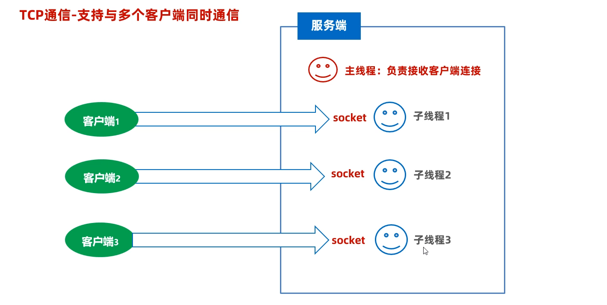

按照上面的思路，改写服务端代码。

### 7.1 多线程改进

首先，我们需要写一个服务端的读取数据的线程类，代码如下

```java
public class ServerReaderThread extends Thread{
    private Socket socket;
    public ServerReaderThread(Socket socket){
        this.socket = socket;
    }
    @Override
    public void run() {
        try {
            InputStream is = socket.getInputStream();
            DataInputStream dis = new DataInputStream(is);
            while (true){
                try {
                    String msg = dis.readUTF();
                    System.out.println(msg);

                } catch (Exception e) {
                    System.out.println("有人下线了：" + socket.getRemoteSocketAddress());
                    dis.close();
                    socket.close();
                    break;
                }
            }
        } catch (Exception e) {
            e.printStackTrace();
        }
    }
}
```

接下来，再改写服务端的主程序代码，如下：

```java
/**
 *  目标：完成TCP通信快速入门-服务端开发：要求实现与多个客户端同时通信。
 */
public class Server {
    public static void main(String[] args) throws Exception {
        System.out.println("-----服务端启动成功-------");
        // 1、创建ServerSocket的对象，同时为服务端注册端口。
        ServerSocket serverSocket = new ServerSocket(8888);

        while (true) {
            // 2、使用serverSocket对象，调用一个accept方法，等待客户端的连接请求
            Socket socket = serverSocket.accept();

            System.out.println("有人上线了：" + socket.getRemoteSocketAddress());

            // 3、把这个客户端对应的socket通信管道，交给一个独立的线程负责处理。
            new ServerReaderThread(socket).start();
        }
    }
}
```


### 7.2 案例拓展（群聊）

接着前面的案例，下面我们案例再次拓展一下，这个并不需要同学们必须掌握，主要是为了锻炼同学们的编程能力、和编程思维。

我们想把刚才的案例，改进成全能够实现群聊的效果，就是一个客户端发的消息，其他的每一个客户端都可以收到。

刚才我们写的多个客户端可以往服务端发现消息，但是客户端和客户端是不能直接通信的。想要试下全群聊的效果，我们还是必须要有服务端在中间做中转。 具体实现方案如下图所示：

我们可以在服务端创建一个存储Socket的集合，每当一个客户端连接服务端，就可以把客户端Socket存储起来；当一个客户端给服务端发消息时，再遍历集合通过每个Socket将消息再转发给其他客户端。

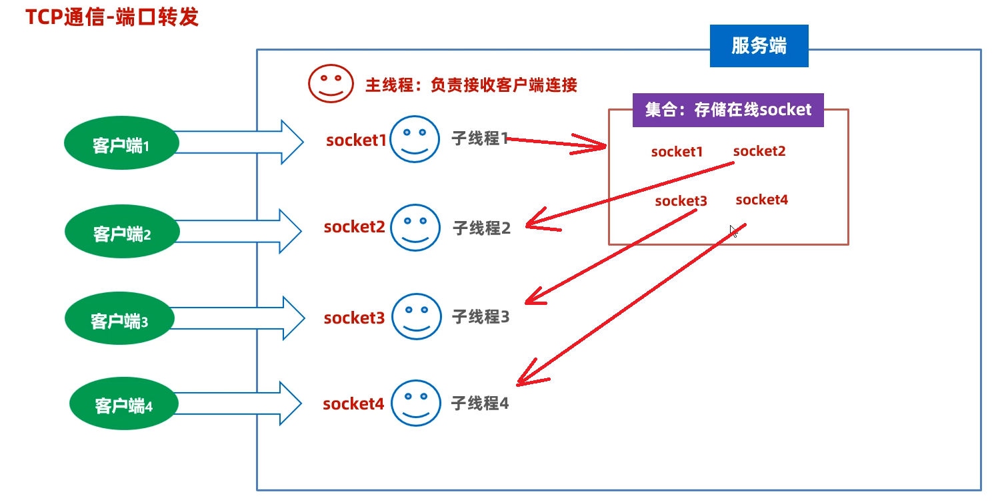

下面我们改造服务端代码，由于服务端读取数据是在线程类中完成的，所以我们改`SerReaderThread`类就可以了。服务端的主程序不用改。

```java
public class ServerReaderThread extends Thread{
    private Socket socket;
    public ServerReaderThread(Socket socket){
        this.socket = socket;
    }
    @Override
    public void run() {
        try {
            InputStream is = socket.getInputStream();
            DataInputStream dis = new DataInputStream(is);
            while (true){
                try {
                    String msg = dis.readUTF();
                    System.out.println(msg);
                    // 把这个消息分发给全部客户端进行接收。
                    sendMsgToAll(msg);
                } catch (Exception e) {
                    System.out.println("有人下线了：" + socket.getRemoteSocketAddress());
                    Server.onLineSockets.remove(socket);
                    dis.close();
                    socket.close();
                    break;
                }
            }
        } catch (Exception e) {
            e.printStackTrace();
        }
    }

    private void sendMsgToAll(String msg) throws IOException {
        // 发送给全部在线的socket管道接收。
        for (Socket onLineSocket : Server.onLineSockets) {
            OutputStream os = onLineSocket.getOutputStream();
            DataOutputStream dos = new DataOutputStream(os);
            dos.writeUTF(msg);
            dos.flush();
        }
    }
}
```


## 八、BS架构程序（简易版）

前面我们所写的代码都是基于CS架构的。我们说网络编程还可以编写BS架构的程序，为了让同学们体验一下BS架构通信，这里我们写一个简易版的程序。仅仅只是体验下一，后期我们会详细学习BS架构的程序如何编写。

BS架构程序的实现原理，如下图所示：不需要开发客户端程序，此时浏览器就相当于是客户端，此时我们只需要写服务端程序就可以了。

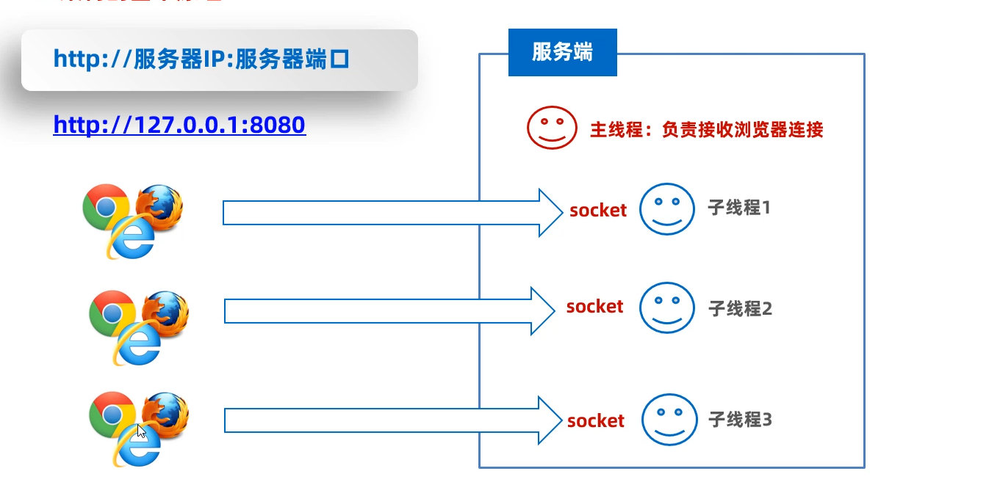

在BS结构的程序中，浏览器和服务器通信是基于HTTP协议来完成的，浏览器给客户端发送数据需要按照HTTP协议规定好的数据格式发给服务端，服务端返回数据时也需要按照HTTP协议规定好的数据给是发给浏览器，只有这两双方才能完成一次数据交互。

客户端程序不需要我们编写（浏览器就是），所以我们只需要写服务端就可以了。

服务端给客户端响应数据的数据格式（HTTP协议规定数据格式）如下图所示：左图是数据格式，右图是示例。

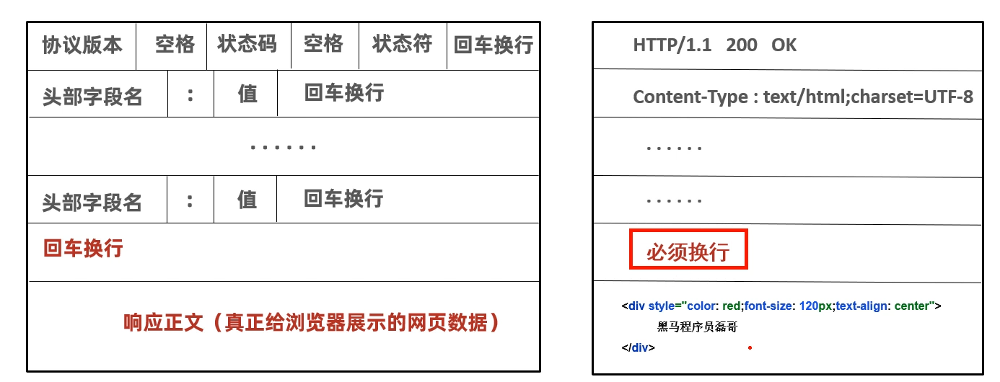

接下来，我们写一个服务端程序按照右图示例的样子，给浏览器返回数据。**注意：数据是由多行组成的，必须按照规定的格式来写。**

### 8.1 服务端程序

先写一个线程类，用于按照HTTP协议的格式返回数据

```java
public class ServerReaderThread extends Thread{
    private Socket socket;
    public ServerReaderThread(Socket socket){
        this.socket = socket;
    }
    @Override
    public void run() {
        //  立即响应一个网页内容：“黑马程序员”给浏览器展示。
        try {
            OutputStream os = socket.getOutputStream();
            PrintStream ps = new PrintStream(os);
            ps.println("HTTP/1.1 200 OK");
            ps.println("Content-Type:text/html;charset=UTF-8");
            ps.println(); // 必须换行
            ps.println("<div style='color:red;font-size:120px;text-align:center'>黑马程序员666<div>");
            ps.close();
            socket.close();
        } catch (Exception e) {
            e.printStackTrace();
        }
    }
}
```

再写服务端的主程序

```java
/**
 *  目标：完成TCP通信快速入门-服务端开发：要求实现与多个客户端同时通信。
 */
public class Server {
    public static void main(String[] args) throws Exception {
        System.out.println("-----服务端启动成功-------");
        // 1、创建ServerSocket的对象，同时为服务端注册端口。
        ServerSocket serverSocket = new ServerSocket(8080);

        while (true) {
            // 2、使用serverSocket对象，调用一个accept方法，等待客户端的连接请求
            Socket socket = serverSocket.accept();

            System.out.println("有人上线了：" + socket.getRemoteSocketAddress());

            // 3、把这个客户端对应的socket通信管道，交给一个独立的线程负责处理。
            new ServerReaderThread(socket).start();
        }
    }
}
```


### 8.2 服务端主程序用线程池改进

为了避免服务端创建太多的线程，可以把服务端用线程池改进，提高服务端的性能。

先写一个给浏览器响应数据的线程任务

```java
public class ServerReaderRunnable implements Runnable{
    private Socket socket;
    public ServerReaderRunnable(Socket socket){
        this.socket = socket;
    }
    @Override
    public void run() {
        //  立即响应一个网页内容：“黑马程序员”给浏览器展示。
        try {
            OutputStream os = socket.getOutputStream();
            PrintStream ps = new PrintStream(os);
            ps.println("HTTP/1.1 200 OK");
            ps.println("Content-Type:text/html;charset=UTF-8");
            ps.println(); // 必须换行
            ps.println("<div style='color:red;font-size:120px;text-align:center'>黑马程序员666<div>");
            ps.close();
            socket.close();
        } catch (Exception e) {
            e.printStackTrace();
        }
    }
}
```

再改写服务端的主程序，使用ThreadPoolExecutor创建一个线程池，每次接收到一个Socket就往线程池中提交任务就行。

```java
public class Server {
    public static void main(String[] args) throws Exception {
        System.out.println("-----服务端启动成功-------");
        // 1、创建ServerSocket的对象，同时为服务端注册端口。
        ServerSocket serverSocket = new ServerSocket(8080);

        // 创建出一个线程池，负责处理通信管道的任务。
        ThreadPoolExecutor pool = new ThreadPoolExecutor(16 * 2, 16 * 2, 0, TimeUnit.SECONDS,
                new ArrayBlockingQueue<>(8) , Executors.defaultThreadFactory(),
                new ThreadPoolExecutor.AbortPolicy());

        while (true) {
            // 2、使用serverSocket对象，调用一个accept方法，等待客户端的连接请求
            Socket socket = serverSocket.accept();

            // 3、把这个客户端对应的socket通信管道，交给一个独立的线程负责处理。
            pool.execute(new ServerReaderRunnable(socket));
        }
    }
}
```


