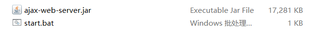
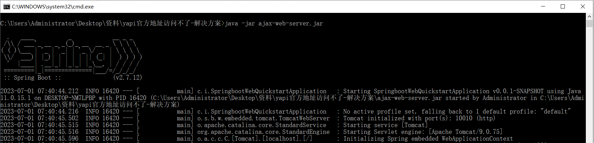
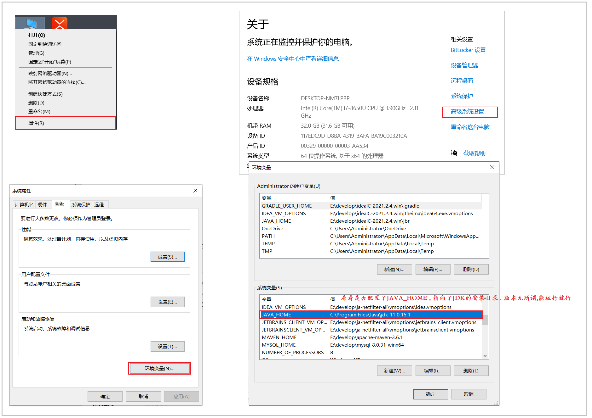

## 1. 问题说明

由于百度提供的Yapi平台，不能再访问了，两个服务端地址访问不到了，两个地址分别为：

GET请求：http://yapi.smart-xwork.cn/mock/169327/emp/list

POST请求： http://yapi.smart-xwork.cn/mock/169327/emp/deleteById


现在我们可以通过如下方案，在我们自己的本地服务器启动一个服务端来测试。


## 2. 解决方案

自己启动一个准备好的服务端，然后ajax请求我们自己的服务端进行测试即可。 

 


具体的步骤如下：


### 2.1 启动服务

双击资料中提供的 start.bat 脚本启动一个本地服务，启动后界面如下所示：

 


注意： 如果双击 start.bat 发现自己的黑窗口一闪而过，那说明我们自己的本地 JAVA_HOME 环境变量有问题，检查一下系统环境变量中是否正确配置了JAVA_HOME 。

 


### 2.2 Ajax访问

由于现在启动的服务，是我们本地的服务，所以在ajax请求的时候，需要将请求地址改成我们本地的地址，也就是将上述两个Yapi平台的地址替换为： 

GET请求： http://localhost:10010/emp/list

POST请求:  http://localhost:10010/emp/deleteById


Ajax示例如下: 

```html
<script>
    function get(){
        axios.get("http://localhost:10010/emp/list").then((result) => {
            console.log(result.data);  
        });
    }

    function post(){
        axios.post("http://localhost:10010/emp/deleteById", "id=1").then((result) => {
            console.log(result.data);  
        });
    }
</script>
```


