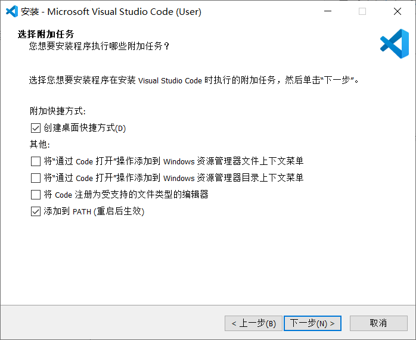
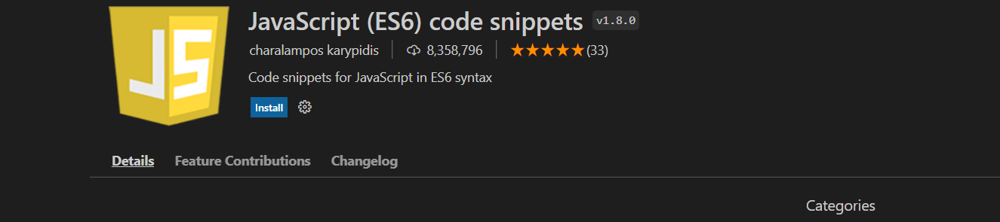
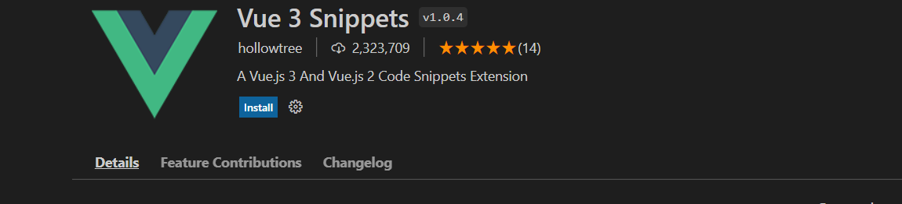
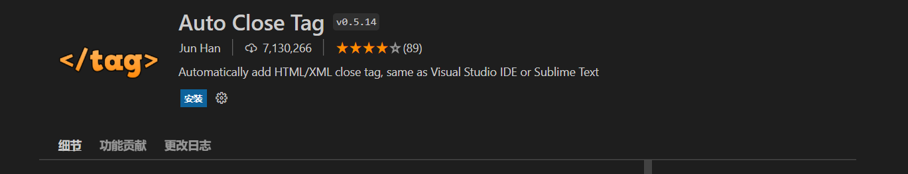
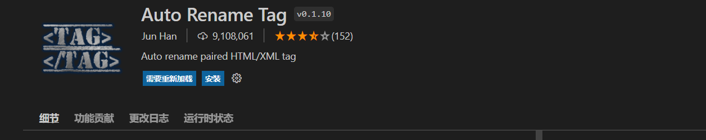
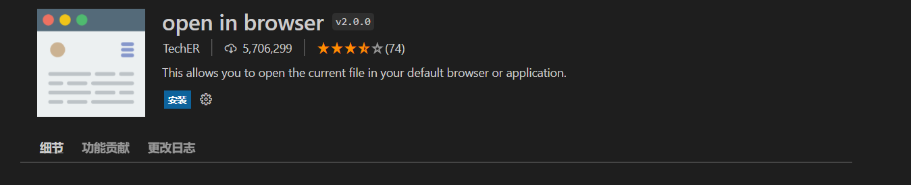
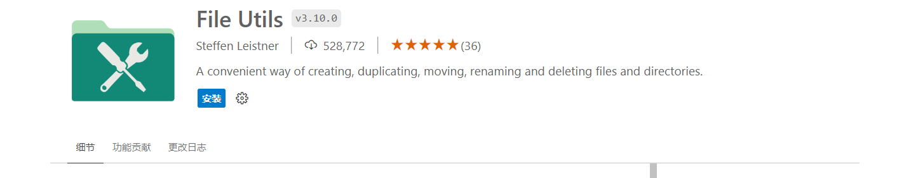
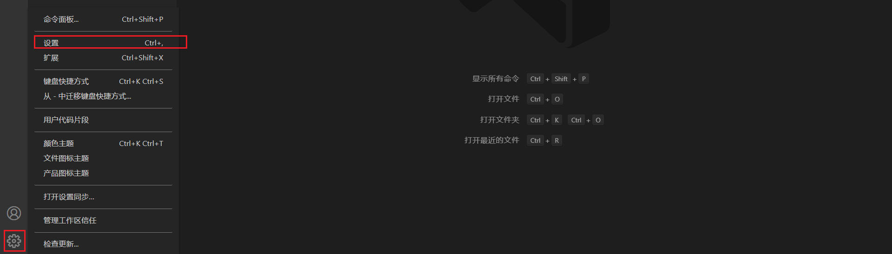

## VS Code 安装文档

### 一、下载

进入VS Code官网：https://code.visualstudio.com，点击 `DownLoad for Windows`下载windows版本

 

当然也可以点击旁边的箭头，下载Windows版本 或 Mac OS 版本

 

- Stable：稳定版
- Insiders：内测版

### 二、安装

  

双击安装包，选择`我同意此协议`，再点击`下一步`

 

选择安装路径，点击`下一步` 。也可以使用默认值: C:\Users\super\AppData\Local\Programs\Microsoft VS Code

 

继续点击下一步

 

可以勾选创建桌面快捷方式，如果不想使用vscode作为代码默认打开方式，可以取消`将code注册为受支持的文件类型的编辑器`，点击下一步

 

点击安装，开始安装 

 

 

 

安装完成，运行VS Code。

### 三、VS Code插件安装

 

VS Code提供了非常丰富的插件功能，根据你的需要，安装对应的插件可以大大提高开发效率。

完成前端开发，常见插件介绍：

#### 1、Chinese (Simplified) Language Pack

适用于 VS Code 的中文（简体）语言包

 

#### 2、Code Spell Checker

拼写检查器。比如 banana 单词写错成 banane ，会提示你是否修改成 banana ，也可以将 banane 添加至检查器的字典中。

 

#### 3、HTML CSS Support

在编写样式表的时候，自动补全功能大大缩减了编写时间。

 

#### 4、JavaScript (ES6) code snippets

支持ES6语法提示

 

#### 5、Mithril Emmet

一个能大幅度提高前端开发效率的一个工具，用于补全代码

 

#### 6、Path Intellisense

路径提示插件

 

#### 7、Vue 3 Snippets

在 Vue 2 或者 Vue 3 开发中提供代码片段，语法高亮和格式化的 VS Code 插件，能极大提高你的开发效率。

 

#### 8、VueHelper

vscode最好的vue代码提示插件，不仅包括了vue2所有api，还含有vue-router2和vuex2的代码

 

#### 9、Auto Close Tag

自动闭合HTML/XML标签

 

#### 10、Auto Rename Tag

自动完成另一侧标签的同步修改

 

#### 11、Beautify

格式化 html ,js,css

 

安装过程中, 如果提示是否需要继续安装, 选择 "仍要安装"。

#### 12、Bracket Pair Colorizer

给括号加上不同的颜色，便于区分不同的区块，使用者可以定义不同括号类型和不同颜色 

 

安装过程中, 如果提示是否需要继续安装, 选择 "仍要安装"。

#### 13、open in browser

vscode不像IDE一样能够直接在浏览器中打开html，而该插件支持快捷键与鼠标右键快速在浏览器中打开html文件，支持自定义打开指定的浏览器，包括：Firefox，Chrome，Opera，IE以及Safari

 

#### 14、Vetur

Vue多功能集成插件，包括：语法高亮，智能提示，emmet，错误提示，格式化，自动补全，debugger。vscode官方钦定Vue插件，Vue开发者必备。 

 

#### 15、File Utils

File Utils插件,可以方便快捷的来创建、复制、移动、重命名文件和目录。

 

#### 16、IntelliJ IDEA Keybindings

安装VSCode的插件 IntelliJ IDEA Keybindings 即可在VSCode中使用IDEA的快捷键。

 

### 四、VS Code 配置

打开配置面板，根据自己的喜好，可以修改字体、背景样式等偏好设置

### 五、VS Code 快捷键

 