# 1 Ajax

## 1.1 Ajax介绍

### 1.1.1 Ajax概述

我们前端页面中的数据，如下图所示的表格中的学生信息，应该来自于后台，那么我们的后台和前端是互不影响的2个程序，那么我们前端应该如何从后台获取数据呢？因为是2个程序，所以必须涉及到2个程序的交互，所以这就需要用到我们接下来学习的Ajax技术。

 

Ajax: 全称Asynchronous JavaScript And XML，异步的JavaScript和XML。其作用有如下2点：

- 与服务器进行数据交换：通过Ajax可以给服务器发送请求，并获取服务器响应的数据。
- 异步交互：可以在**不重新加载整个页面**的情况下，与服务器交换数据并**更新部分网页**的技术，如：搜索联想、用户名是否可用的校验等等。


### 1.1.2 Ajax作用

我们详细的解释一下Ajax技术的2个作用

- 与服务器进行数据交互

  如下图所示前端资源被浏览器解析，但是前端页面上缺少数据，前端可以通过Ajax技术，向后台服务器发起请求，后台服务器接受到前端的请求，从数据库中获取前端需要的资源，然后响应给前端，前端在通过我们学习的vue技术，可以将数据展示到页面上，这样用户就能看到完整的页面了。此处可以对比JavaSE中的网络编程技术来理解。

  

- 异步交互：可以在**不重新加载整个页面**的情况下，与服务器交换数据并**更新部分网页**的技术。

  如下图所示，当我们再百度搜索java时，下面的联想数据是通过Ajax请求从后台服务器得到的，在整个过程中，我们的Ajax请求不会导致整个百度页面的重新加载，并且只针对搜索栏这局部模块的数据进行了数据的更新，不会对整个页面的其他地方进行数据的更新，这样就大大提升了页面的加载速度，用户体验高。

    

 

### 1.1.3 同步异步

针对于上述Ajax的局部刷新功能是因为Ajax请求是异步的，与之对应的有同步请求。接下来我们介绍一下异步请求和同步请求的区别。

- 同步请求发送过程如下图所示：

  

  浏览器页面在发送请求给服务器，在服务器处理请求的过程中，浏览器页面不能做其他的操作。只能等到服务器响应结束后才能，浏览器页面才能继续做其他的操作。 

- 异步请求发送过程如下图所示：

   

  浏览器页面发送请求给服务器，在服务器处理请求的过程中，浏览器页面还可以做其他的操作。


## 1.2 原生Ajax

对于Ajax技术有了充分的认知了，我们接下来通过代码来演示Ajax的效果。此处我们先采用原生的Ajax代码来演示。因为Ajax请求是基于客户端发送请求，服务器响应数据的技术。所以为了完成快速入门案例，我们需要提供服服务器端和编写客户端。

- 服务器端

  因为我们暂时还没学过服务器端的代码，所以此处已经直接提供好了服务器端的请求地址，我们前端直接通过Ajax请求访问该地址即可。**后台服务器地址**：http://yapi.smart-xwork.cn/mock/169327/emp/list

  上述地址我们也可以直接通过浏览器来访问，访问结果如图所示：只截取部分数据

  

- 客户端

  客户端的Ajax请求代码如下有如下4步，接下来我们跟着步骤一起操作一下。

  第一步：首先我们再VS Code中创建AJAX的文件夹，并且创建名为01. Ajax-原生方式.html的文件，提供如下代码，主要是按钮绑定单击事件，我们希望点击按钮，来发送ajax请求

  ~~~html
  <!DOCTYPE html>
  <html lang="en">
  <head>
      <meta charset="UTF-8">
      <meta http-equiv="X-UA-Compatible" content="IE=edge">
      <meta name="viewport" content="width=device-width, initial-scale=1.0">
      <title>原生Ajax</title>
  </head>
  <body>
      
      <input type="button" value="获取数据" onclick="getData()">
  
      <div id="div1"></div>
      
  </body>
  <script>
      function getData(){
       
      }
  </script>
  </html>
  ~~~

  第二步：创建XMLHttpRequest对象，用于和服务器交换数据，也是原生Ajax请求的核心对象，提供了各种方法。代码如下：

  ~~~js
  //1. 创建XMLHttpRequest 
  var xmlHttpRequest  = new XMLHttpRequest();
  ~~~

  第三步：调用对象的open()方法设置请求的参数信息，例如请求地址，请求方式。然后调用send()方法向服务器发送请求，代码如下：

  ~~~js
  //2. 发送异步请求
  xmlHttpRequest.open('GET','http://yapi.smart-xwork.cn/mock/169327/emp/list');
  xmlHttpRequest.send();//发送请求
  ~~~

  第四步：我们通过绑定事件的方式，来获取服务器响应的数据。

  ~~~js
  //3. 获取服务响应数据
  xmlHttpRequest.onreadystatechange = function(){
      //此处判断 4表示浏览器已经完全接受到Ajax请求得到的响应， 200表示这是一个正确的Http请求，没有错误
      if(xmlHttpRequest.readyState == 4 && xmlHttpRequest.status == 200){
          document.getElementById('div1').innerHTML = xmlHttpRequest.responseText;
      }
  }
  ~~~


  最后我们通过浏览器打开页面，请求点击按钮，发送Ajax请求，最终显示结果如下图所示：

  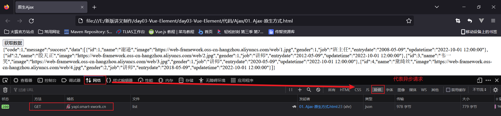 

  并且通过浏览器的f12抓包，我们点击网络中的XHR请求，发现可以抓包到我们发送的Ajax请求。XHR代表的就是异步请求


## 1.3 Axios

上述原生的Ajax请求的代码编写起来还是比较繁琐的，所以接下来我们学习一门更加简单的发送Ajax请求的技术Axios 。Axios是对原生的AJAX进行封装，简化书写。Axios官网是：`https://www.axios-http.cn`

### 1.3.1 Axios的基本使用

Axios的使用比较简单，主要分为2步：

- 引入Axios文件

  ~~~html
  <script src="js/axios-0.18.0.js"></script>
  ~~~

- 使用Axios发送请求，并获取响应结果，官方提供的api很多，此处给出2种，如下

  - 发送 get 请求

    ~~~js
    axios({
        method:"get",
        url:"http://localhost:8080/ajax-demo1/aJAXDemo1?username=zhangsan"
    }).then(function (resp){
        alert(resp.data);
    })
    ~~~

  - 发送 post 请求

    ```js
    axios({
        method:"post",
        url:"http://localhost:8080/ajax-demo1/aJAXDemo1",
        data:"username=zhangsan"
    }).then(function (resp){
        alert(resp.data);
    });
    ```

  axios()是用来发送异步请求的，小括号中使用 js的JSON对象传递请求相关的参数：

  - method属性：用来设置请求方式的。取值为 get 或者 post。
  - url属性：用来书写请求的资源路径。如果是 get 请求，需要将请求参数拼接到路径的后面，格式为： url?参数名=参数值&参数名2=参数值2。
  - data属性：作为请求体被发送的数据。也就是说如果是 post 请求的话，数据需要作为 data 属性的值。

  then() 需要传递一个匿名函数。我们将 then()中传递的匿名函数称为 **回调函数**，意思是该匿名函数在发送请求时不会被调用，而是在成功响应后调用的函数。而该回调函数中的 resp 参数是对响应的数据进行封装的对象，通过 resp.data 可以获取到响应的数据。

  

### 1.3.2 Axios快速入门

- 后端实现

  查询所有员工信息服务器地址：http://yapi.smart-xwork.cn/mock/169327/emp/list 

  根据员工id删除员工信息服务器地址：http://yapi.smart-xwork.cn/mock/169327/emp/deleteById

- 前端实现

  首先在VS Code中创建js文件夹，与html同级，然后将**资料/axios-0.18.0.js** 文件拷贝到js目录下，然后创建名为02. Ajax-Axios.html的文件，工程结果如图所示：

   

   

  然后在html中引入axios所依赖的js文件，并且提供2个按钮，绑定单击事件，分别用于点击时发送ajax请求，完整代码如下：

  ~~~html
  <!DOCTYPE html>
  <html lang="en">
  <head>
      <meta charset="UTF-8">
      <meta http-equiv="X-UA-Compatible" content="IE=edge">
      <meta name="viewport" content="width=device-width, initial-scale=1.0">
      <title>Ajax-Axios</title>
      <script src="js/axios-0.18.0.js"></script>
  </head>
  <body>
      
      <input type="button" value="获取数据GET" onclick="get()">
  
      <input type="button" value="删除数据POST" onclick="post()">
  
  </body>
  <script>
      function get(){
          //通过axios发送异步请求-get
      }
  
      function post(){
          //通过axios发送异步请求-post
      }
  </script>
  </html>
  ~~~

  然后分别使用Axios的方法，完整get请求和post请求的发送

  get请求代码如下：

  ~~~js
  //通过axios发送异步请求-get
   axios({
       method: "get",
       url: "http://yapi.smart-xwork.cn/mock/169327/emp/list"
   }).then(result => {
       console.log(result.data);
   })
  ~~~

  post请求代码如下：

  ~~~js
  //通过axios发送异步请求-post
   axios({
       method: "post",
       url: "http://yapi.smart-xwork.cn/mock/169327/emp/deleteById",
       data: "id=1"
   }).then(result => {
       console.log(result.data);
   })
  ~~~

  浏览器打开，f12抓包，然后分别点击2个按钮，查看控制台效果如下：

   

  

  完整代码如下：

  ~~~html
  <!DOCTYPE html>
  <html lang="en">
  <head>
      <meta charset="UTF-8">
      <meta http-equiv="X-UA-Compatible" content="IE=edge">
      <meta name="viewport" content="width=device-width, initial-scale=1.0">
      <title>Ajax-Axios</title>
      <script src="js/axios-0.18.0.js"></script>
  </head>
  <body>
      
      <input type="button" value="获取数据GET" onclick="get()">
  
      <input type="button" value="删除数据POST" onclick="post()">
  
  </body>
  <script>
      function get(){
          //通过axios发送异步请求-get
          axios({
              method: "get",
              url: "http://yapi.smart-xwork.cn/mock/169327/emp/list"
          }).then(result => {
              console.log(result.data);
          })
  
  
      }
  
      function post(){
         // 通过axios发送异步请求-post
          axios({
              method: "post",
              url: "http://yapi.smart-xwork.cn/mock/169327/emp/deleteById",
              data: "id=1"
          }).then(result => {
              console.log(result.data);
          })
  
      }
  </script>
  </html>
  ~~~


### 1.3.3 请求方法的别名

Axios还针对不同的请求，提供了别名方式的api,具体如下：

| 方法                               | 描述           |
| ---------------------------------- | -------------- |
| axios.get(url [, config])          | 发送get请求    |
| axios.delete(url [, config])       | 发送delete请求 |
| axios.post(url [, data[, config]]) | 发送post请求   |
| axios.put(url [, data[, config]])  | 发送put请求    |

我们目前只关注get和post请求，所以在上述的入门案例中，我们可以将get请求代码改写成如下：

~~~js
axios.get("http://yapi.smart-xwork.cn/mock/169327/emp/list").then(result => {
    console.log(result.data);
})
~~~

post请求改写成如下：

~~~js
axios.post("http://yapi.smart-xwork.cn/mock/169327/emp/deleteById","id=1").then(result => {
    console.log(result.data);
})
~~~


### 1.3.4 案例

- 需求：基于Vue及Axios完成数据的动态加载展示，如下图所示

  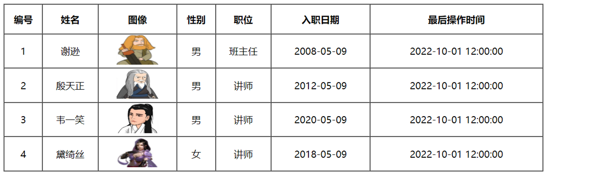 

  其中数据是来自于后台程序的，地址是：http://yapi.smart-xwork.cn/mock/169327/emp/list

  

- 分析：

  前端首先是一张表格，我们缺少数据，而提供数据的地址已经有了，所以意味这我们需要使用Ajax请求获取后台的数据。但是Ajax请求什么时候发送呢？页面的数据应该是页面加载完成，自动发送请求，展示数据，所以我们需要借助vue的mounted钩子函数。那么拿到数据了，我们该怎么将数据显示表格中呢？这里就得借助v-for指令来遍历数据，展示数据。

- 步骤：

  1. 首先创建文件，提前准备基础代码，包括表格以及vue.js和axios.js文件的引入
  2. 我们需要在vue的mounted钩子函数中发送ajax请求，获取数据
  3. 拿到数据，数据需要绑定给vue的data属性
  4. 在&lt;tr&gt;标签上通过v-for指令遍历数据，展示数据

- 代码实现：

  1. 首先创建文件，提前准备基础代码，包括表格以及vue.js和axios.js文件的引入

     

     提供初始代码如下：

     ~~~html
     <!DOCTYPE html>
     <html lang="en">
     <head>
         <meta charset="UTF-8">
         <meta http-equiv="X-UA-Compatible" content="IE=edge">
         <meta name="viewport" content="width=device-width, initial-scale=1.0">
         <title>Ajax-Axios-案例</title>
         <script src="js/axios-0.18.0.js"></script>
         <script src="js/vue.js"></script>
     </head>
     <body>
         <div id="app">
             <table border="1" cellspacing="0" width="60%">
                 <tr>
                     <th>编号</th>
                     <th>姓名</th>
                     <th>图像</th>
                     <th>性别</th>
                     <th>职位</th>
                     <th>入职日期</th>
                     <th>最后操作时间</th>
                 </tr>
     
                 <tr align="center" >
                     <td>1</td>
                     <td>Tom</td>
                     <td>
                         
                     </td>
                     <td>
                         <span>男</span>
                        <!-- <span>女</span>-->
                     </td>
                     <td>班主任</td>
                     <td>2009-08-09</td>
                     <td>2009-08-09 12:00:00</td>
                 </tr>
             </table>
         </div>
     </body>
     <script>
         new Vue({
            el: "#app",
            data: {
             
            }
         });
     </script>
     </html>
     ~~~

  2. 在vue的mounted钩子函数，编写Ajax请求，请求数据，代码如下：

     ~~~js
     mounted () {
         //发送异步请求,加载数据
         axios.get("http://yapi.smart-xwork.cn/mock/169327/emp/list").then(result => {
             
         })
     }
     ~~~

  3. ajax请求的数据我们应该绑定给vue的data属性，之后才能进行数据绑定到视图；并且浏览器打开后台地址，数据返回格式如下图所示：

      

     因为服务器响应的json中的data属性才是我们需要展示的信息，所以我们应该将员工列表信息赋值给vue的data属性，代码如下：

     ~~~js
      //发送异步请求,加载数据
     axios.get("http://yapi.smart-xwork.cn/mock/169327/emp/list").then(result => {
         this.emps = result.data.data;
     })
     ~~~

     其中，data中生命emps变量，代码如下：

     ~~~js
     data: {
         emps:[]
     },
     ~~~

  4. 在&lt;tr&gt;标签上通过v-for指令遍历数据，展示数据，其中需要注意的是图片的值，需要使用vue的属性绑定，男女的展示需要使用条件判断，其代码如下：

     ~~~html
     <tr align="center" v-for="(emp,index) in emps">
         <td>{{index + 1}}</td>
         <td>{{emp.name}}</td>
         <td>
             
         </td>
         <td>
             <span v-if="emp.gender == 1">男</span>
             <span v-if="emp.gender == 2">女</span>
         </td>
         <td>{{emp.job}}</td>
         <td>{{emp.entrydate}}</td>
         <td>{{emp.updatetime}}</td>
     </tr>
     ~~~

完整代码如下：

~~~html
<!DOCTYPE html>
<html lang="en">
<head>
    <meta charset="UTF-8">
    <meta http-equiv="X-UA-Compatible" content="IE=edge">
    <meta name="viewport" content="width=device-width, initial-scale=1.0">
    <title>Ajax-Axios-案例</title>
    <script src="js/axios-0.18.0.js"></script>
    <script src="js/vue.js"></script>
</head>
<body>
    <div id="app">
        <table border="1" cellspacing="0" width="60%">
            <tr>
                <th>编号</th>
                <th>姓名</th>
                <th>图像</th>
                <th>性别</th>
                <th>职位</th>
                <th>入职日期</th>
                <th>最后操作时间</th>
            </tr>

            <tr align="center" v-for="(emp,index) in emps">
                <td>{{index + 1}}</td>
                <td>{{emp.name}}</td>
                <td>
                    
                </td>
                <td>
                    <span v-if="emp.gender == 1">男</span>
                    <span v-if="emp.gender == 2">女</span>
                </td>
                <td>{{emp.job}}</td>
                <td>{{emp.entrydate}}</td>
                <td>{{emp.updatetime}}</td>
            </tr>
        </table>
    </div>
</body>
<script>
    new Vue({
       el: "#app",
       data: {
         emps:[]
       },
       mounted () {
          //发送异步请求,加载数据
          axios.get("http://yapi.smart-xwork.cn/mock/169327/emp/list").then(result => {
            console.log(result.data);
            this.emps = result.data.data;
          })
       }
    });
</script>
</html>
~~~


# 2 前后台分离开发

## 2.1 前后台分离开发介绍

在之前的课程中，我们介绍过，前端开发有2种方式：**前后台混合开发**和**前后台分离开发**。

前后台混合开发，顾名思义就是前台后台代码混在一起开发，如下图所示：

 

这种开发模式有如下缺点：

- 沟通成本高：后台人员发现前端有问题，需要找前端人员修改，前端修改成功，再交给后台人员使用
- 分工不明确：后台开发人员需要开发后台代码，也需要开发部分前端代码。很难培养专业人才
- 不便管理：所有的代码都在一个工程中
- 不便维护和扩展：前端代码更新，和后台无关，但是需要整个工程包括后台一起重新打包部署。


所以我们目前基本都是采用的前后台分离开发方式，如下图所示：

 

我们将原先的工程分为前端工程和后端工程这2个工程，然后前端工程交给专业的前端人员开发，后端工程交给专业的后端人员开发。前端页面需要数据，可以通过发送异步请求，从后台工程获取。但是，我们前后台是分开来开发的，那么前端人员怎么知道后台返回数据的格式呢？后端人员开发，怎么知道前端人员需要的数据格式呢？所以针对这个问题，我们前后台统一指定一套规范！我们前后台开发人员都需要遵循这套规范开发，这就是我们的**接口文档**。接口文档有离线版和在线版本，接口文档示可以查询今天提供**资料/接口文档示例**里面的资料。那么接口文档的内容怎么来的呢？是我们后台开发者根据产品经理提供的产品原型和需求文档所撰写出来的，产品原型示例可以参考今天提供**资料/页面原型**里面的资料。

那么基于前后台分离开发的模式下，我们后台开发者开发一个功能的具体流程如何呢？如下图所示：

 

1. 需求分析：首先我们需要阅读需求文档，分析需求，理解需求。
2. 接口定义：查询接口文档中关于需求的接口的定义，包括地址，参数，响应数据类型等等
3. 前后台并行开发：各自按照接口文档进行开发，实现需求
4. 测试：前后台开发完了，各自按照接口文档进行测试
5. 前后段联调测试：前段工程请求后端工程，测试功能


## 2.2 YAPI

### 2.2.1 YAPI介绍

前后台分离开发中，我们前后台开发人员都需要遵循接口文档，所以接下来我们介绍一款撰写接口文档的平台。

YApi 是高效、易用、功能强大的 api 管理平台，旨在为开发、产品、测试人员提供更优雅的接口管理服务。

其官网地址：http://yapi.smart-xwork.cn/

YApi主要提供了2个功能：

- API接口管理：根据需求撰写接口，包括接口的地址，参数，响应等等信息。
- Mock服务：模拟真实接口，生成接口的模拟测试数据，用于前端的测试。

### 2.2.2 接口文档管理

接下来我们演示一下YApi是如何管理接口文档的。

首先我们登录YAPI的官网，然后使用github或者百度账号登录，没有的话去注册一个，如下图所示：

 

登录进去后，在个人空间中，选择项目列表->添加测试项目，效果如图所示：

 

然后点击创建的项目，进入到项目中，紧接着先添加接口的分类，如下图所示

 

然后我们选择当前创建的分类，创建接口信息，如下图所示：

 

紧接着，我们来到接口的编辑界面，对接口做生层次的定制，例如：接口的参数，接口的返回值等等，效果图下图所示：

 

添加接口的请求参数，如下图所示：


添加接口的返回值，如下图所示：

 

然后保存上述设置，紧接着我们可以来到接口的预览界面，查询接口的信息，其效果如下图所示：篇幅有限，只截取部分

 

最后，我们还可以设置接口的mock信息，

 

来到接口的Mock设置窗口，如下图所示：

 

紧接着我们来到接口的预览界面，直接点击Mock地址，如下图所示：


我们发现浏览器直接打开，并返回如下数据：


如上步骤就是YAPI接口平台中对于接口的配置步骤。


# 3 前端工程化

## 3.1 前端工程化介绍

我们目前的前端开发中，当我们需要使用一些资源时，例如：vue.js，和axios.js文件，都是直接再工程中导入的，如下图所示：


但是上述开发模式存在如下问题：

- 每次开发都是从零开始，比较麻烦
- 多个页面中的组件共用性不好
- js、图片等资源没有规范化的存储目录，没有统一的标准，不方便维护


所以现在企业开发中更加讲究前端工程化方式的开发，主要包括如下4个特点

- 模块化：将js和css等，做成一个个可复用模块
- 组件化：我们将UI组件，css样式，js行为封装成一个个的组件，便于管理
- 规范化：我们提供一套标准的规范的目录接口和编码规范，所有开发人员遵循这套规范
- 自动化：项目的构建，测试，部署全部都是自动完成

所以对于前端工程化，说白了，就是在企业级的前端项目开发中，把前端开发所需要的工具、技术、流程、经验进行规范化和标准化。从而提升开发效率，降低开发难度等等。接下来我们就需要学习vue的官方提供的脚手架帮我们完成前端的工程化。


## 3.2 前端工程化入门

### 3.2.1 环境准备

我们的前端工程化是通过vue官方提供的脚手架Vue-cli来完成的，用于快速的生成一个Vue的项目模板。Vue-cli主要提供了如下功能：

- 统一的目录结构
- 本地调试
- 热部署
- 单元测试
- 集成打包上线

我们需要运行Vue-cli，需要依赖NodeJS，NodeJS是前端工程化依赖的环境。所以我们需要先安装NodeJS，然后才能安装Vue-cli

- NodeJS安装和Vue-cli安装

  详细安装步骤，请参考**资料/NodeJS安装文档/NodeJS安装文档.md**文件

   

  


### 3.2.2 Vue项目简介

环境准备好了，接下来我们需要通过Vue-cli创建一个vue项目，然后再学习一下vue项目的目录结构。Vue-cli提供了如下2种方式创建vue项目:

- 命令行：直接通过命令行方式创建vue项目

  ~~~
  vue create vue-project01
  ~~~

  

- 图形化界面：通过命令先进入到图形化界面，然后再进行vue工程的创建

  ~~~
  vue ui
  ~~~

  图形化界面如下：

   


#### 3.2.2.1 创建vue项目

此处我们通过第二种图形化界面方式给大家演示。

首先，我们再桌面创建vue文件夹，然后双击进入文件夹，来到地址目录，输入cmd，然后进入到vue文件夹的cmd窗口界面，如下图所示：


然后进入如下界面：


然后再当前目录下，直接输入命令`vue ui`进入到vue的图形化界面，如下图所示：

 

然后我门选择创建按钮，在vue文件夹下创建项目，如下图所示：


然后来到如下界面，进行vue项目的创建


然后预设模板选择手动，如下图所示：

  

然后再功能页面开启路由功能，如下图所示：

 

然后再配置页面选择语言版本和语法检查规范，如下图所示：

 

然后创建项目，进入如下界面：


最后我们只需要等待片刻，即可进入到创建创建成功的界面，如下图所示：

 

 到此，vue项目创建结束


#### 3.2.2.2 vue项目目录结构介绍

我们通过VS Code打开之前创建的vue文件夹，打开之后，呈现如下图所示页面：


vue项目的标准目录结构以及目录对应的解释如下图所示:


其中我们平时开发代码就是在**src目录**下


#### 3.2.2.3 运行vue项目

那么vue项目开发好了，我们应该怎么运行vue项目呢？主要提供了2种方式

- 第一种方式：通过VS Code提供的图形化界面 ，如下图所示：（注意：NPM脚本窗口默认不显示，可以参考本节的最后调试出来）

  

  点击之后，我们等待片刻，即可运行，在终端界面中，我们发现项目是运行在本地服务的8080端口，我们直接通过浏览器打开地址

   

  最终浏览器打开后，呈现如下界面，表示项目运行成功

  

  其实此时访问的是 **src/App.vue**这个根组件，此时我们打开这个组件，修改代码：添加内容Vue

  

  只要我们保存更新的代码，我们直接打开浏览器，不需要做任何刷新，发现页面呈现内容发生了变化，如下图所示：

  

  这就是我们vue项目的热更新功能 

  对于8080端口，经常被占用，所以我们可以去修改默认的8080端口。我们修改vue.config.js文件的内容，添加如下代码：

  ~~~json
  devServer:{
      port:7000
  }
  ~~~

  如下图所示，然后我们关闭服务器，并且重新启动，

  

​       重新启动如下图所示：

​	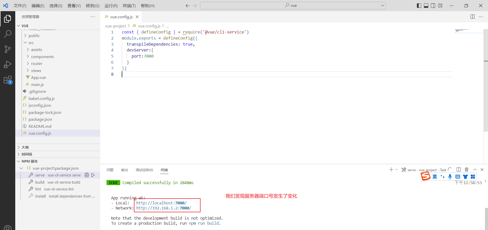 

​	端口更改成功，可以通过浏览器访问7000端口来访问我们之前的项目

- 第二种方式：命令行方式

  直接基于cmd命令窗口，在vue目录下，执行输入命令`npm run serve`即可，如下图所示：

   


补充：NPM脚本窗口调试出来

第一步：通过**设置/用户设置/扩展/MPM**更改NPM默认配置，如下图所示


然后重启VS Code，并且**双击打开package.json文件**，然后点击**资源管理器处的3个小点**，**勾选npm脚本选项**，如图所示

 

然后就能都显示NPM脚本小窗口了。


### 3.2.3 Vue项目开发流程

那么我们访问的首页是index.html，但是我们找到public/index.html文件，打开之后发现，里面没有什么代码，但是能够呈现内容丰富的首页：如下图所示：

 

我们自习观察发现，index.html的代码很简洁，但是浏览器所呈现的index.html内容却很丰富，代码和内容不匹配，所以vue是如何做到的呢？接下来我们学习一下vue项目的开发流程。

对于vue项目，index.html文件默认是引入了入口函数main.js文件，我们找到**src/main.js**文件，其代码如下：

~~~js
import Vue from 'vue'
import App from './App.vue'
import router from './router'

Vue.config.productionTip = false

new Vue({
  router,
  render: h => h(App)
}).$mount('#app')

~~~

上述代码中，包括如下几个关键点：

- import: 导入指定文件，并且重新起名。例如上述代码`import App from './App.vue'`导入当前目录下得App.vue并且起名为App
- new Vue(): 创建vue对象
- $mount('#app');将vue对象创建的dom对象挂在到id=app的这个标签区域中，作用和之前学习的vue对象的le属性一致。
- router:  路由，详细在后面的小节讲解
- render: 主要使用视图的渲染的。


来到**public/index.html**中，我们**删除div的id=app属性**，打开浏览器，发现之前访问的首页一片空白，如下图所示，这样就证明了，我们main.js中通过代码挂在到index.html的id=app的标签区域的。


此时我们知道了vue创建的dom对象挂在到id=app的标签区域，但是我们还是没有解决最开始的问题：首页内容如何呈现的？这就涉及到render中的App了，如下图所示：

 

那么这个App对象怎么回事呢，我们打开App.vue,注意的是.vue结尾的都是vue组件。而vue的组件文件包含3个部分：

- template: 模板部分，主要是HTML代码，用来展示页面主体结构的
- script: js代码区域，主要是通过js代码来控制模板的数据来源和行为的
- style: css样式部分，主要通过css样式控制模板的页面效果得

如下图所示就是一个vue组件的小案例：

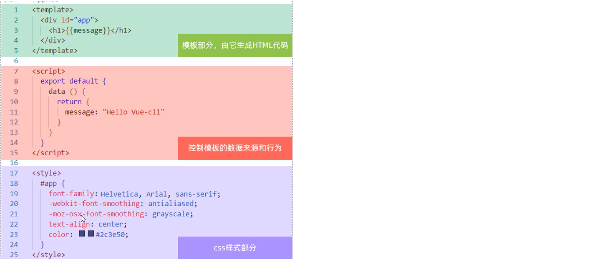


此时我们可以打开App.vue，观察App.vue的代码，其中可以发现，App.vue组件的template部分内容，和我们浏览器访问的首页内容是一致的，如下图所示：


接下来我们可以简化模板部分内容，添加script部分的数据模型，删除css样式，完整代码如下：

~~~html
<template>
  <div id="app">
    {{message}}
  </div>
</template>

<script>
export default {
  data(){
    return {
      "message":"hello world"
    }
  }
}
</script>
<style>

</style>
~~~


保存直接，回到浏览器，我们发现首页展示效果发生了变化，如下图所示：


# 4 Vue组件库Element

## 4.1 Element介绍

不知道同学们还否记得我们之前讲解的前端开发模式MVVM，我们之前学习的vue是侧重于VM开发的，主要用于数据绑定到视图的，那么接下来我们学习的ElementUI就是一款侧重于V开发的前端框架，主要用于开发美观的页面的。

Element：是饿了么公司前端开发团队提供的一套基于 Vue 的网站组件库，用于快速构建网页。

Element 提供了很多组件（组成网页的部件）供我们使用。例如 超链接、按钮、图片、表格等等。如下图所示就是我们开发的页面和ElementUI提供的效果对比：可以发现ElementUI提供的各式各样好看的按钮

 

ElementUI的学习方式和我们之前的学习方式不太一样，对于ElementUI，我们作为一个后台开发者，只需要**学会如何从ElementUI的官网拷贝组件到我们自己的页面中，并且做一些修改即可**。其官网地址：https://element.eleme.cn/#/zh-CN，我们主要学习的是ElementUI中提供的常用组件，至于其他组件同学们可以通过我们这几个组件的学习掌握到ElementUI的学习技巧，然后课后自行学习。


## 4.2 快速入门

首先我们要掌握ElementUI的快速入门，接下来同学们就一起跟着步骤来操作一下。

首先，我们先要安装ElementUI的组件库，打开VS Code，停止之前的项目，然后在命令行输入如下命令：

~~~
npm install element-ui@2.15.3 
~~~

具体操作如下图所示：

 

然后我们需要在main.js这个入口js文件中引入ElementUI的组件库，其代码如下：

~~~js
import ElementUI from 'element-ui';
import 'element-ui/lib/theme-chalk/index.css';

Vue.use(ElementUI);
~~~

具体操作如图所示：


然后我们需要按照vue项目的开发规范，在**src/views**目录下创建一个vue组件文件，注意组件名称后缀是.vue，并且在组件文件中编写之前介绍过的基本组件语法，代码如下：

~~~html
<template>

</template>

<script>
export default {

}
</script>

<style>

</style>
~~~

具体操作如图所示：

 

最后我们只需要去ElementUI的官网，找到组件库，然后找到按钮组件，抄写代码即可，具体操作如下图所示：


然后找到按钮的代码，如下图所示：

 


紧接着我们复制组件代码到我们的vue组件文件中，操作如下图所示：


最后，我们需要在默认访问的根组件**src/App.vue**中引入我们自定义的组件，具体操作步骤如下：

 

然后App.vue组件中的具体代码如下，**代码是我们通过上述步骤引入element-view组件时自动生成的**。

~~~html
<template>
  <div id="app">
    <!-- {{message}} -->
    <element-view></element-view>
  </div>
</template>

<script>
import ElementView from './views/Element/ElementView.vue'
export default {
  components: { ElementView },
  data(){
    return {
      "message":"hello world"
    }
  }
}
</script>
<style>

</style>

~~~

然后运行我们的vue项目，浏览器直接访问之前的7000端口，展示效果如下图所示：


到此，我们ElementUI的入门程序编写成功


## 4.3 Element组件

接下来我们来学习一下ElementUI的常用组件，对于组件的学习比较简单，我们只需要参考官方提供的代码，然后复制粘贴即可。

### 4.3.1 Table表格

#### 4.3.1.1 组件演示

Table 表格：用于展示多条结构类似的数据，可对数据进行排序、筛选、对比或其他自定义操作。

接下来我们通过代码来演示。

首先我们需要来到ElementUI的组件库中，找到表格组件，如下图所示：


然后复制代码到我们之前的ElementVue.vue组件中，需要注意的是，我们组件包括了3个部分，如果官方有除了template部分之外的style和script都需要复制。具体操作如下图所示：

template模板部分：

 

script脚本部分


ElementView.vue组件文件整体代码如下：

~~~html
<template>
    <div>
    <!-- Button按钮 -->
        <el-row>
            <el-button>默认按钮</el-button>
            <el-button type="primary">主要按钮</el-button>
            <el-button type="success">成功按钮</el-button>
            <el-button type="info">信息按钮</el-button>
            <el-button type="warning">警告按钮</el-button>
            <el-button type="danger">危险按钮</el-button>
        </el-row>

        <!-- Table表格 -->
        <el-table
        :data="tableData"
        style="width: 100%">
            <el-table-column
                prop="date"
                label="日期"
                width="180">
            </el-table-column>
            <el-table-column
                prop="name"
                label="姓名"
                width="180">
            </el-table-column>
            <el-table-column
                prop="address"
                label="地址">
            </el-table-column>
        </el-table>
    </div>
</template>

<script>
export default {
     data() {
        return {
          tableData: [{
            date: '2016-05-02',
            name: '王小虎',
            address: '上海市普陀区金沙江路 1518 弄'
          }, {
            date: '2016-05-04',
            name: '王小虎',
            address: '上海市普陀区金沙江路 1517 弄'
          }, {
            date: '2016-05-01',
            name: '王小虎',
            address: '上海市普陀区金沙江路 1519 弄'
          }, {
            date: '2016-05-03',
            name: '王小虎',
            address: '上海市普陀区金沙江路 1516 弄'
          }]
        }
      }
}
</script>

<style>

</style>

~~~

此时回到浏览器，我们页面呈现如下效果：

 


#### 4.3.1.2 组件属性详解

那么我们的ElementUI是如何将数据模型绑定到视图的呢？主要通过如下几个属性：

- data: 主要定义table组件的数据模型
- prop: 定义列的数据应该绑定data中定义的具体的数据模型
- label: 定义列的标题
- width: 定义列的宽度

其具体示例含义如下图所示：

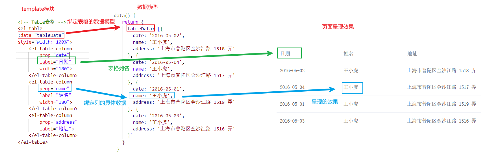 

**PS:Element组件的所有属性都可以在组件页面的最下方找到**，如下图所示：

 


### 4.3.2 Pagination分页

#### 4.3.2.1 组件演示

Pagination: 分页组件，主要提供分页工具条相关功能。其展示效果图下图所示：

 

接下来我们通过代码来演示功能。

首先在官网找到分页组件，我们选择带背景色分页组件，如下图所示：

 


然后复制代码到我们的ElementView.vue组件文件的template中，拷贝如下代码：

~~~html
<el-pagination
    background
    layout="prev, pager, next"
    :total="1000">
</el-pagination>
~~~

浏览器打开呈现如下效果：

 


#### 4.3.2.2 组件属性详解

对于分页组件我们需要关注的是如下几个重要属性（可以通过查阅官网组件中最下面的组件属性详细说明得到）：

- background: 添加北京颜色，也就是上图蓝色背景色效果。
- layout: 分页工具条的布局，其具体值包含`sizes`, `prev`, `pager`, `next`, `jumper`, `->`, `total`, `slot` 这些值
- total: 数据的总数量


然后根据官方分页组件提供的layout属性说明，如下图所示：

 

我们修改layout属性如下：

~~~js
 layout="sizes,prev, pager, next,jumper,total"
~~~

浏览器打开呈现如下效果：


发现在原来的功能上，添加了一些额外的功能，其具体对应关系如下图所示：

 


#### 4.3.2.3 组件事件详解

对于分页组件，除了上述几个属性，还有2个非常重要的事件我们需要去学习：

- size-change ： pageSize 改变时会触发 
- current-change ：currentPage 改变时会触发 

其官方详细解释含义如下图所示：

 

对于这2个事件的参考代码，我们同样可以通过官方提供的完整案例中找到，如下图所示：

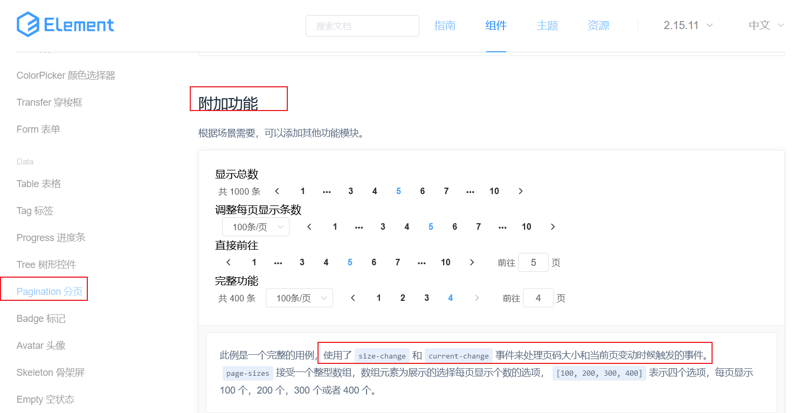 


然后我们找到对应的代码，首先复制事件，复制代码如下：

~~~js
@size-change="handleSizeChange"
@current-change="handleCurrentChange"
~~~

此时Panigation组件的template完整代码如下：

~~~html
<!-- Pagination分页 -->
<el-pagination
               @size-change="handleSizeChange"
               @current-change="handleCurrentChange"
               background
               layout="sizes,prev, pager, next,jumper,total"
               :total="1000">
</el-pagination>
~~~


紧接着需要复制事件需要的2个函数，需要注意methods属性和data同级，其代码如下：

~~~json
methods: {
      handleSizeChange(val) {
        console.log(`每页 ${val} 条`);
      },
      handleCurrentChange(val) {
        console.log(`当前页: ${val}`);
      }
    },
~~~

此时Panigation组件的script部分完整代码如下：

~~~html
<script>
export default {
    methods: {
      handleSizeChange(val) {
        console.log(`每页 ${val} 条`);
      },
      handleCurrentChange(val) {
        console.log(`当前页: ${val}`);
      }
    },
     data() {
        return {
          tableData: [{
            date: '2016-05-02',
            name: '王小虎',
            address: '上海市普陀区金沙江路 1518 弄'
          }, {
            date: '2016-05-04',
            name: '王小虎',
            address: '上海市普陀区金沙江路 1517 弄'
          }, {
            date: '2016-05-01',
            name: '王小虎',
            address: '上海市普陀区金沙江路 1519 弄'
          }, {
            date: '2016-05-03',
            name: '王小虎',
            address: '上海市普陀区金沙江路 1516 弄'
          }]
        }
      }
}
</script>
~~~

回到浏览器中，我们f12打开开发者控制台，然后切换当前页码和切换每页显示的数量，呈现如下效果：

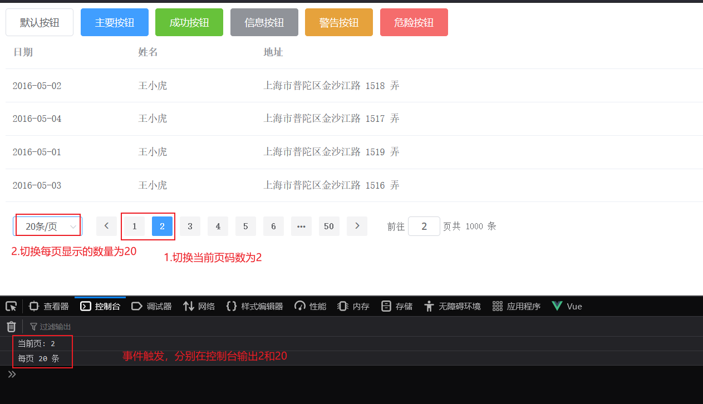 


### 4.3.3 Dialog对话框

#### 4.3.3.1 组件演示

Dialog: 在保留当前页面状态的情况下，告知用户并承载相关操作。其企业开发应用场景示例如下图所示：


首先我们需要在ElementUI官方找到Dialog组件，如下图所示：

 


然后复制如下代码到我们的组件文件的template模块中

~~~html
<br><br>
<!--Dialog 对话框 -->
<!-- Table -->
<el-button type="text" @click="dialogTableVisible = true">打开嵌套表格的 Dialog</el-button>

<el-dialog title="收货地址" :visible.sync="dialogTableVisible">
    <el-table :data="gridData">
        <el-table-column property="date" label="日期" width="150"></el-table-column>
        <el-table-column property="name" label="姓名" width="200"></el-table-column>
        <el-table-column property="address" label="地址"></el-table-column>
    </el-table>
</el-dialog>
~~~


并且复制数据模型script模块中：

~~~
 gridData: [{
          date: '2016-05-02',
          name: '王小虎',
          address: '上海市普陀区金沙江路 1518 弄'
        }, {
          date: '2016-05-04',
          name: '王小虎',
          address: '上海市普陀区金沙江路 1518 弄'
        }, {
          date: '2016-05-01',
          name: '王小虎',
          address: '上海市普陀区金沙江路 1518 弄'
        }, {
          date: '2016-05-03',
          name: '王小虎',
          address: '上海市普陀区金沙江路 1518 弄'
        }],
        dialogTableVisible: false,
~~~

其完整的script部分代码如下：

~~~html
<script>
export default {
    methods: {
      handleSizeChange(val) {
        console.log(`每页 ${val} 条`);
      },
      handleCurrentChange(val) {
        console.log(`当前页: ${val}`);
      }
    },
     data() {
        return {
        gridData: [{
          date: '2016-05-02',
          name: '王小虎',
          address: '上海市普陀区金沙江路 1518 弄'
        }, {
          date: '2016-05-04',
          name: '王小虎',
          address: '上海市普陀区金沙江路 1518 弄'
        }, {
          date: '2016-05-01',
          name: '王小虎',
          address: '上海市普陀区金沙江路 1518 弄'
        }, {
          date: '2016-05-03',
          name: '王小虎',
          address: '上海市普陀区金沙江路 1518 弄'
        }],
        dialogTableVisible: false,
        tableData: [{
            date: '2016-05-02',
            name: '王小虎',
            address: '上海市普陀区金沙江路 1518 弄'
          }, {
            date: '2016-05-04',
            name: '王小虎',
            address: '上海市普陀区金沙江路 1517 弄'
          }, {
            date: '2016-05-01',
            name: '王小虎',
            address: '上海市普陀区金沙江路 1519 弄'
          }, {
            date: '2016-05-03',
            name: '王小虎',
            address: '上海市普陀区金沙江路 1516 弄'
          }]
        }
      }
}
</script>
~~~

然后我们打开浏览器，点击按钮，呈现如下效果：

 


#### 4.3.3.2 组件属性详解

那么ElementUI是如何做到对话框的显示与隐藏的呢？是通过如下的属性：

- visible.sync ：是否显示 Dialog 

具体释意如下图所示：

 

visible属性绑定的dialogTableVisble属性一开始默认是false，所以对话框隐藏；然后我们点击按钮，触发事件，修改属性值为true，

然后对话框visible属性值为true，所以对话框呈现出来。


### 4.3.4 Form表单

#### 4.3.4.1 组件演示

Form 表单：由输入框、选择器、单选框、多选框等控件组成，用以收集、校验、提交数据。 

表单在我们前端的开发中使用的还是比较多的，接下来我们学习这个组件，与之前的流程一样，我们首先需要在ElementUI的官方找到对应的组件示例：如下图所示：

 

我们的需求效果是：在对话框中呈现表单内容，类似如下图所示：


所以，首先我们先要根据上一小结所学习的内容，制作一个新的对话框，其代码如下：

~~~html
<br><br>
<!-- Dialog对话框-Form表单 -->
<el-button type="text" @click="dialogFormVisible = true">打开嵌套Form的 Dialog</el-button>

<el-dialog title="Form表单" :visible.sync="dialogFormVisible">

</el-dialog>
~~~

还需要注意的是，针对这个新的对话框，我们需要在data中声明新的变量dialogFormVisible来控制对话框的隐藏与显示，代码如下：

~~~
 dialogFormVisible: false,
~~~

打开浏览器，此时呈现如图所示的效果：

 


然后我们**复制官网提供的template部分代码到我们的vue组件文件的Dialog组件中**，但是，此处官方提供的表单项标签太多，所以我们只需要保留前面3个表单项组件，其他多余的删除，所以最终template部分代码如下：

~~~html
<el-dialog title="Form表单" :visible.sync="dialogFormVisible">
            
            <el-form ref="form" :model="form" label-width="80px">
                <el-form-item label="活动名称">
                    <el-input v-model="form.name"></el-input>
                </el-form-item>
                <el-form-item label="活动区域">
                    <el-select v-model="form.region" placeholder="请选择活动区域">
                    <el-option label="区域一" value="shanghai"></el-option>
                    <el-option label="区域二" value="beijing"></el-option>
                    </el-select>
                </el-form-item>
                <el-form-item label="活动时间">
                    <el-col :span="11">
                    <el-date-picker type="date" placeholder="选择日期" v-model="form.date1" style="width: 100%;"></el-date-picker>
                    </el-col>
                    <el-col class="line" :span="2">-</el-col>
                    <el-col :span="11">
                    <el-time-picker placeholder="选择时间" v-model="form.date2" style="width: 100%;"></el-time-picker>
                    </el-col>
                </el-form-item>
            
                <el-form-item>
                    <el-button type="primary" @click="onSubmit">立即创建</el-button>
                    <el-button>取消</el-button>
                </el-form-item>
            </el-form>
        </el-dialog>
~~~

观察上述代码，我们发现其中表单项标签使用了v-model双向绑定，所以我们需要在vue的数据模型中声明变量，同样可以从官方提供的代码中复制粘贴，但是我们需要去掉我们不需要的属性，通过观察上述代码，我们发现双向绑定的属性有4个，分别是form.name,form.region,form.date1,form.date2,所以最终数据模型如下：


~~~
 form: {
          name: '',
          region: '',
          date1: '',
          date2:''
        },
~~~

同样，官方的代码中，在script部分中，还提供了onSubmit函数，表单的立即创建按钮绑定了此函数，我们可以输入表单的内容，而表单的内容是双向绑定到form对象的，所以我们修改官方的onSubmit函数如下即可，而且我们还需要关闭对话框，最终函数代码如下：

 


~~~
 onSubmit() {
       console.log(this.form); //输出表单内容到控制台
        this.dialogFormVisible=false; //关闭表案例的对话框
      }
~~~

然后打开浏览器，我们打开对话框，并且输入表单内容，点击立即创建按钮，呈现如下效果；

 


最终vue组件完整代码如下，同学们可以针对form表单案例，参考该案例对应的template部分和script部分代码

~~~html
<template>
    <div>
    <!-- Button按钮 -->
        <el-row>
            <el-button>默认按钮</el-button>
            <el-button type="primary">主要按钮</el-button>
            <el-button type="success">成功按钮</el-button>
            <el-button type="info">信息按钮</el-button>
            <el-button type="warning">警告按钮</el-button>
            <el-button type="danger">危险按钮</el-button>
        </el-row>

        <!-- Table表格 -->
        <el-table
        :data="tableData"
        style="width: 100%">
            <el-table-column
                prop="date"
                label="日期"
                width="180">
            </el-table-column>
            <el-table-column
                prop="name"
                label="姓名"
                width="180">
            </el-table-column>
            <el-table-column
                prop="address"
                label="地址">
            </el-table-column>
        </el-table>

        <br>
        <!-- Pagination分页 -->
        <el-pagination
            @size-change="handleSizeChange"
            @current-change="handleCurrentChange"
            background
            layout="sizes,prev, pager, next,jumper,total"
            :total="1000">
        </el-pagination>

        <br><br>
        <!--Dialog 对话框 -->
        <!-- Table -->
        <el-button type="text" @click="dialogTableVisible = true">打开嵌套表格的 Dialog</el-button>

        <el-dialog title="收货地址" :visible.sync="dialogTableVisible">
        <el-table :data="gridData">
            <el-table-column property="date" label="日期" width="150"></el-table-column>
            <el-table-column property="name" label="姓名" width="200"></el-table-column>
            <el-table-column property="address" label="地址"></el-table-column>
        </el-table>
        </el-dialog>

        <br><br>
        <!-- Dialog对话框-Form表单 -->
        <el-button type="text" @click="dialogFormVisible = true">打开嵌套Form的 Dialog</el-button>

        <el-dialog title="Form表单" :visible.sync="dialogFormVisible">
            
            <el-form ref="form" :model="form" label-width="80px">
                <el-form-item label="活动名称">
                    <el-input v-model="form.name"></el-input>
                </el-form-item>
                <el-form-item label="活动区域">
                    <el-select v-model="form.region" placeholder="请选择活动区域">
                    <el-option label="区域一" value="shanghai"></el-option>
                    <el-option label="区域二" value="beijing"></el-option>
                    </el-select>
                </el-form-item>
                <el-form-item label="活动时间">
                    <el-col :span="11">
                    <el-date-picker type="date" placeholder="选择日期" v-model="form.date1" style="width: 100%;"></el-date-picker>
                    </el-col>
                    <el-col class="line" :span="2">-</el-col>
                    <el-col :span="11">
                    <el-time-picker placeholder="选择时间" v-model="form.date2" style="width: 100%;"></el-time-picker>
                    </el-col>
                </el-form-item>
            
                <el-form-item>
                    <el-button type="primary" @click="onSubmit">立即创建</el-button>
                    <el-button>取消</el-button>
                </el-form-item>
            </el-form>
        </el-dialog>
    </div>
</template>

<script>
export default {
    methods: {
      handleSizeChange(val) {
        console.log(`每页 ${val} 条`);
      },
      handleCurrentChange(val) {
        console.log(`当前页: ${val}`);
      },
      //表单案例的提交事件
      onSubmit() {
        console.log(this.form); //输出表单内容到控制台
        this.dialogFormVisible=false; //关闭表案例的对话框
      }
    },
     data() {
        return {
        //表单案例的数据双向绑定
        form: {
          name: '',
          region: '',
          date1: '',
          date2:''
        },
        gridData: [{
          date: '2016-05-02',
          name: '王小虎',
          address: '上海市普陀区金沙江路 1518 弄'
        }, {
          date: '2016-05-04',
          name: '王小虎',
          address: '上海市普陀区金沙江路 1518 弄'
        }, {
          date: '2016-05-01',
          name: '王小虎',
          address: '上海市普陀区金沙江路 1518 弄'
        }, {
          date: '2016-05-03',
          name: '王小虎',
          address: '上海市普陀区金沙江路 1518 弄'
        }],
        dialogTableVisible: false,
        dialogFormVisible: false, //控制form表单案例的对话框
        tableData: [{
            date: '2016-05-02',
            name: '王小虎',
            address: '上海市普陀区金沙江路 1518 弄'
          }, {
            date: '2016-05-04',
            name: '王小虎',
            address: '上海市普陀区金沙江路 1517 弄'
          }, {
            date: '2016-05-01',
            name: '王小虎',
            address: '上海市普陀区金沙江路 1519 弄'
          }, {
            date: '2016-05-03',
            name: '王小虎',
            address: '上海市普陀区金沙江路 1516 弄'
          }]
        }
      }
}
</script>

<style>

</style>

~~~


## 4.4 案例

### 4.4.1 案例需求

参考 **资料/页面原型/tlias智能学习辅助系统/首页.html** 文件，浏览器打开，点击页面中的左侧栏的员工管理，如下所示：

 

需求说明：

1. 制作类似格式的页面

   即上面是标题，左侧栏是导航，右侧是数据展示区域

2. 右侧需要展示搜索表单

3. 右侧表格数据是动态展示的，数据来自于后台

4. 实际示例效果如下图所示：

   


数据Mock地址：http://yapi.smart-xwork.cn/mock/169327/emp/list，浏览器打开，数据格式如下图所示：

 

通过观察数据，我们发现返回的json数据的data属性中，才是返回的人员列表信息


### 4.4.2 案例分析

整个案例相对来说功能比较复杂，需求较多，所以我们需要先整体，后局部细节。整个页面我们可以分为3个部分，如下图所示：


一旦这样拆分，那么我们的思路就清晰了，主要步骤如下：

1. 创建页面，完成页面的整体布局规划
2. 然后分别针对3个部分进行各自组件的具体实现
3. 针对于右侧核心内容展示区域，需要使用异步加载数据，以表格渲染数据

### 4.4.3 代码实现

#### 4.4.3.1 环境搭建

首先我们来到VS Code中，在views目录下创建 tlias/EmpView.vue这个vue组件，并且编写组件的基本模板代码，其效果如下图所示：其中模板代码在之前的案例中已经提供，此处不再赘述

 

并且需要注意的是，我们默认访问的是App.vue这个组件，而我们App.vue这个组件之前是引入了element-view这个组件，此时我们需要修改成引入emp-view这个组件，并且注释掉之前的element-view这个组件，此时App.vue整体代码如下：

~~~html
<template>
  <div id="app">
    <!-- {{message}} -->
    <!-- <element-view></element-view> -->
    <emp-view></emp-view>
  </div>
</template>

<script>
import EmpView  './views/tlias/EmpView.vue'
// import ElementView  './views/Element/ElementView.vue'
export default {
  components: {EmpView },
  data(){
    return {
      "message":"hello world"
    }
  }
}
</script>
<style>

</style>

~~~

打开浏览器，我们发现之前的element案例内容没了，从而呈现的是一片空白，那么接下来我们就可以继续开发了。


#### 4.4.3.2 整体布局

此处肯定不需要我们自己去布局的，我们直接来到ElementUI的官网，找到布局组件，如下图所示：

 

从官网提供的示例，我们发现由现成的满足我们需求的布局，所以我们只需要做一位代码搬运工即可。拷贝官方提供的如下代码直接粘贴到我们EmpView.vue组件的template模块中即可：

~~~html
<el-container>
    <el-header>Header</el-header>
    <el-container>
        <el-aside width="200px">Aside</el-aside>
        <el-main>Main</el-main>
    </el-container>
</el-container>
~~~

打开浏览器，此时呈现如下效果：


因为我们没有拷贝官方提供的css样式，所以和官方案例的效果不太一样，但是我们需要的布局格式已经有，具体内容我们有自己的安排。首先我们需要调整整体布局的高度，所以我们需要在&lt;el-container&gt;上添加一些样式，代码如下：

~~~html
<!-- 设置最外层容器高度为700px,在加上一个很细的边框 -->
<el-container style="height: 700px; border: 1px solid #eee">
~~~

到此我们布局功能就完成了

#### 4.4.3.3 顶部标题

对于顶部，我们需要实现的效果如下图所示：


所以我们需要修改顶部的文本内容，并且提供背景色的css样式，具体代码如下：

~~~html
<el-header style="font-size:40px;background-color: rgb(238, 241, 246)">tlias 智能学习辅助系统</el-header>
~~~

此时浏览器打开，呈现效果如下图所示：

 

至此，我们的顶部标题就搞定了

此时整体代码如下：

~~~html
<template>
    <div>
        <!-- 设置最外层容器高度为700px,在加上一个很细的边框 -->
        <el-container style="height: 700px; border: 1px solid #eee">
            <el-header style="font-size:40px;background-color: rgb(238, 241, 246)">tlias 智能学习辅助系统</el-header>
            <el-container>
                <el-aside width="200px">Aside</el-aside>
                <el-main>Main</el-main>
            </el-container>
        </el-container>
    </div>
</template>

<script>
export default {
    
}
</script>

<style>

</style>

~~~


#### 4.4.3.4 左侧导航栏

接下来我们来实现左侧导航栏，那么还是在上述布局组件中提供的案例，找到左侧栏的案例，如下图所示：

 

所以我们依然只需要搬运代码，然后做简单修改即可。官方提供的导航太多，我们不需要，所以我们需要做删减，在我们的左侧导航栏中粘贴如下代码即可：

~~~html
<el-menu :default-openeds="['1', '3']">
    <el-submenu index="1">
        <template slot="title"><i class="el-icon-message"></i>导航一</template>

        <el-menu-item index="1-1">选项1</el-menu-item>
        <el-menu-item index="1-2">选项2</el-menu-item>


    </el-submenu>
</el-menu>
~~~

删减前后对比图：


然后我们打开浏览器，展示如下内容：


最后我们只需要替换文字内容即可。

此时整体代码如下：

~~~html
<template>
    <div>
        <!-- 设置最外层容器高度为700px,在加上一个很细的边框 -->
        <el-container style="height: 700px; border: 1px solid #eee">
            <el-header style="font-size:40px;background-color: rgb(238, 241, 246)">tlias 智能学习辅助系统</el-header>
            <el-container>
                <el-aside width="200px">
                     <el-menu :default-openeds="['1', '3']">
                        <el-submenu index="1">
                            <template slot="title"><i class="el-icon-message"></i>系统信息管理</template>
                          
                            <el-menu-item index="1-1">部门管理</el-menu-item>
                            <el-menu-item index="1-2">员工管理</el-menu-item>
                          
                     
                        </el-submenu>
                     </el-menu>
                </el-aside>
                <el-main>
                  
                </el-main>
            </el-container>
        </el-container>
    </div>
</template>

<script>
export default {
   
}
</script>

<style>

</style>

~~~


#### 4.4.3.5 右侧核心内容

##### 4.4.3.5.1 表格编写

右侧显示的是表单和表格，首先我们先来完成表格的制作，我们同样在官方直接找表格组件，也可以直接通过我们上述容器组件中提供的案例中找到表格相关的案例，如下图所示：

 

然后找到表格的代码，复制到我们布局容器的主题区域，template模块代码如下：

~~~html
<el-table :data="tableData">
        <el-table-column prop="date" label="日期" width="140">
        </el-table-column>
        <el-table-column prop="name" label="姓名" width="120">
        </el-table-column>
        <el-table-column prop="address" label="地址">
        </el-table-column>
</el-table>
~~~

表格是有数据模型的绑定的，所以我们需要继续拷贝数据模型，代码如下：

~~~js
  data() {
      return {
        tableData: [
            {
                date: '2016-05-02',
                name: '王小虎',
                address: '上海市普陀区金沙江路 1518 弄'
            }
        ]
      }
~~~

浏览器打开，呈现如下效果：

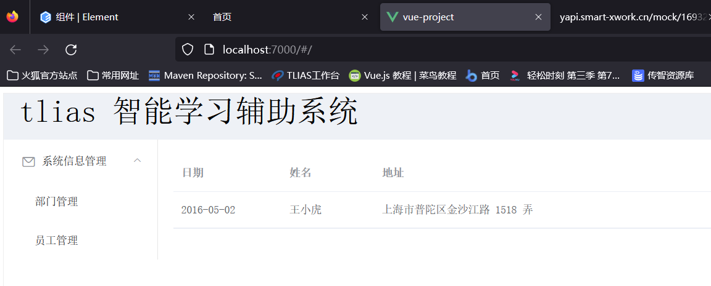 

但是这样的表格和数据并不是我们所需要的，所以，接下来我们需要修改表格，添加列，并且修改列名。代码如下：

~~~html
<el-table-column prop="name" label="姓名" width="180"></el-table-column>
<el-table-column prop="image" label="图像" width="180"></el-table-column>
<el-table-column prop="gender" label="性别" width="140"></el-table-column>
<el-table-column prop="job" label="职位" width="140"></el-table-column>
<el-table-column prop="entrydate" label="入职日期" width="180"></el-table-column>
<el-table-column prop="updatetime" label="最后操作时间" width="230"></el-table-column>
<el-table-column label="操作" >
    <el-button type="primary" size="mini">编辑</el-button>
    <el-button type="danger" size="mini">删除</el-button>
</el-table-column>
~~~

需要注意的是，我们列名的prop属性值得内容并不是乱写的，因为我们将来需要绑定后台的数据的，所以如下图所示：


并且此时我们data中之前的数据模型就不可用了，所以需要清空数据，设置为空数组，代码 如下：

~~~js
 data() {
      return {
        tableData: [
           
        ]
      }
    }
~~~

此时打开浏览器，呈现如下效果：

 

此时整体页面代码如下：

~~~html
<template>
    <div>
        <!-- 设置最外层容器高度为700px,在加上一个很细的边框 -->
        <el-container style="height: 700px; border: 1px solid #eee">
            <el-header style="font-size:40px;background-color: rgb(238, 241, 246)">tlias 智能学习辅助系统</el-header>
            <el-container>
                <el-aside width="200px">
                     <el-menu :default-openeds="['1', '3']">
                        <el-submenu index="1">
                            <template slot="title"><i class="el-icon-message"></i>系统信息管理</template>
                          
                            <el-menu-item index="1-1">部门管理</el-menu-item>
                            <el-menu-item index="1-2">员工管理</el-menu-item>
                          
                     
                        </el-submenu>
                     </el-menu>
                </el-aside>
                <el-main>
                    <el-table :data="tableData">
                        <el-table-column prop="name"      label="姓名" width="180"></el-table-column>
                        <el-table-column prop="image"     label="图像" width="180"></el-table-column>
                        <el-table-column prop="gender"    label="性别" width="140"></el-table-column>
                        <el-table-column prop="job"       label="职位" width="140"></el-table-column>
                        <el-table-column prop="entrydate" label="入职日期" width="180"></el-table-column>
                        <el-table-column prop="updatetime" label="最后操作时间" width="230"></el-table-column>
                        <el-table-column label="操作" >
                            <el-button type="primary" size="mini">编辑</el-button>
                            <el-button type="danger" size="mini">删除</el-button>
                        </el-table-column>
                    </el-table>

                </el-main>
            </el-container>
        </el-container>
    </div>
</template>

<script>
export default {
     data() {
      return {
        tableData: [
           
        ]
      }
    }
}
</script>

<style>

</style>

~~~


##### 4.4.3.5.2 表单编写

在表格的上方，还需要如下图所示的表单：


所以接下来我们需要去ElementUI官网，在表单组件中找到与之类似的示例，加以修改从而打成我们希望的效果，官方示例如下图所示：


所以我们直接拷贝代码主体区域的table组件的上方即可，并且我们需要修改数据绑定的的变量名，最终代码如下：

~~~html
      <!-- 表单 -->
<el-form :inline="true" :model="searchForm" class="demo-form-inline">
    <el-form-item label="姓名">
        <el-input v-model="searchForm.name" placeholder="姓名"></el-input>
    </el-form-item>
    <el-form-item label="性别">
        <el-select v-model="searchForm.gender" placeholder="性别">
            <el-option label="男" value="1"></el-option>
            <el-option label="女" value="2"></el-option>
        </el-select>
    </el-form-item>
    <el-form-item>
        <el-button type="primary" @click="onSubmit">查询</el-button>
    </el-form-item>
</el-form>
~~~


代码修改前后对比图：


既然我们表单使用v-model进行数据的双向绑定了，所以我们紧接着需要在data中定义searchForm的数据模型，代码如下：

~~~js
  data() {
      return {
        tableData: [
           
        ],
        searchForm:{
            name:'',
            gender:''
        }
      }
    }
~~~

而且，表单的提交按钮，绑定了onSubmit函数，所以我们还需要在methods中定义onSubmit函数，代码如下：

注意的是methods属性需要和data属性同级

~~~
 methods:{
        onSubmit:function(){
            console.log(this.searchForm);
        }
}
~~~

浏览器打开如图所示：


可以发现我们还缺少一个时间，所以可以从elementUI官网找到日期组件，如下图所示：


参考官方代码，然后在我们之前的表单中添加一个日期表单，具体代码如下：

~~~html
 </el-form-item>
    <el-form-item label="入职日期">
        <el-date-picker
                        v-model="searchForm.entrydate"
                        type="daterange"
                        range-separator="至"
                        start-placeholder="开始日期"
                        end-placeholder="结束日期">
        </el-date-picker>
 </el-form-item>
~~~


我们添加了双向绑定，所以我们需要在data的searchForm中定义出来，需要注意的是这个日期包含2个值，所以我们定义为数组，代码如下：

~~~
 searchForm:{
            name:'',
            gender:'',
            entrydate:[]
}
~~~

此时我们打开浏览器，填写表单，并且点击查询按钮，查看浏览器控制台，可以看到表单的内容，效果如下图所示：


此时完整代码如下所示：

~~~html
<template>
    <div>
        <!-- 设置最外层容器高度为700px,在加上一个很细的边框 -->
        <el-container style="height: 700px; border: 1px solid #eee">
            <el-header style="font-size:40px;background-color: rgb(238, 241, 246)">tlias 智能学习辅助系统</el-header>
            <el-container>
                <el-aside width="200px">
                     <el-menu :default-openeds="['1', '3']">
                        <el-submenu index="1">
                            <template slot="title"><i class="el-icon-message"></i>系统信息管理</template>
                          
                            <el-menu-item index="1-1">部门管理</el-menu-item>
                            <el-menu-item index="1-2">员工管理</el-menu-item>
                          
                     
                        </el-submenu>
                     </el-menu>
                </el-aside>
                <el-main>
                    <!-- 表单 -->
                    <el-form :inline="true" :model="searchForm" class="demo-form-inline">
                        <el-form-item label="姓名">
                            <el-input v-model="searchForm.name" placeholder="姓名"></el-input>
                        </el-form-item>
                        <el-form-item label="性别">
                            <el-select v-model="searchForm.gender" placeholder="性别">
                            <el-option label="男" value="1"></el-option>
                            <el-option label="女" value="2"></el-option>
                            </el-select>
                        </el-form-item>
                          <el-form-item label="入职日期">
                             <el-date-picker
                                v-model="searchForm.entrydate"
                                type="daterange"
                                range-separator="至"
                                start-placeholder="开始日期"
                                end-placeholder="结束日期">
                            </el-date-picker>
                        </el-form-item>
                        <el-form-item>
                            <el-button type="primary" @click="onSubmit">查询</el-button>
                        </el-form-item>
                    </el-form>
                    <!-- 表格 -->
                    <el-table :data="tableData">
                        <el-table-column prop="name"      label="姓名" width="180"></el-table-column>
                        <el-table-column prop="image"     label="图像" width="180"></el-table-column>
                        <el-table-column prop="gender"    label="性别" width="140"></el-table-column>
                        <el-table-column prop="job"       label="职位" width="140"></el-table-column>
                        <el-table-column prop="entrydate" label="入职日期" width="180"></el-table-column>
                        <el-table-column prop="updatetime" label="最后操作时间" width="230"></el-table-column>
                        <el-table-column label="操作" >
                            <el-button type="primary" size="mini">编辑</el-button>
                            <el-button type="danger" size="mini">删除</el-button>
                        </el-table-column>
                    </el-table>

                </el-main>
            </el-container>
        </el-container>
    </div>
</template>

<script>
export default {
     data() {
      return {
        tableData: [
           
        ],
        searchForm:{
            name:'',
            gender:'',
            entrydate:[]
        }
      }
    },
    methods:{
        onSubmit:function(){
            console.log(this.searchForm);
        }
    }
}
</script>

<style>

</style>

~~~


##### 4.4.3.5.3 分页工具栏

分页条我们之前做过，所以我们直接找到之前的案例，复制即可，代码如下：

其中template模块代码如下：

~~~html
 <!-- Pagination分页 -->
<el-pagination
               @size-change="handleSizeChange"
               @current-change="handleCurrentChange"
               background
               layout="sizes,prev, pager, next,jumper,total"
               :total="1000">
</el-pagination>
~~~

同时methods中需要声明2个函数，代码如下：

~~~js
handleSizeChange(val) {
            console.log(`每页 ${val} 条`);
        },
        handleCurrentChange(val) {
            console.log(`当前页: ${val}`);
        }
~~~

此时打开浏览器，效果如下图所示：

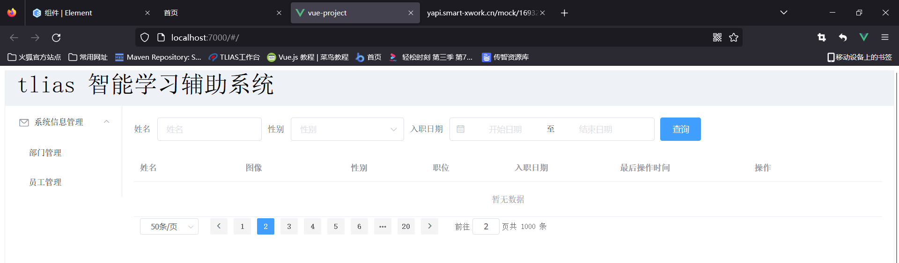

此时整体代码如下：

~~~html
<template>
    <div>
        <!-- 设置最外层容器高度为700px,在加上一个很细的边框 -->
        <el-container style="height: 700px; border: 1px solid #eee">
            <el-header style="font-size:40px;background-color: rgb(238, 241, 246)">tlias 智能学习辅助系统</el-header>
            <el-container>
                <el-aside width="200px">
                     <el-menu :default-openeds="['1', '3']">
                        <el-submenu index="1">
                            <template slot="title"><i class="el-icon-message"></i>系统信息管理</template>
                          
                            <el-menu-item index="1-1">部门管理</el-menu-item>
                            <el-menu-item index="1-2">员工管理</el-menu-item>
                          
                     
                        </el-submenu>
                     </el-menu>
                </el-aside>
                <el-main>
                    <!-- 表单 -->
                    <el-form :inline="true" :model="searchForm" class="demo-form-inline">
                        <el-form-item label="姓名">
                            <el-input v-model="searchForm.name" placeholder="姓名"></el-input>
                        </el-form-item>
                        <el-form-item label="性别">
                            <el-select v-model="searchForm.gender" placeholder="性别">
                            <el-option label="男" value="1"></el-option>
                            <el-option label="女" value="2"></el-option>
                            </el-select>
                        </el-form-item>
                          <el-form-item label="入职日期">
                             <el-date-picker
                                v-model="searchForm.entrydate"
                                type="daterange"
                                range-separator="至"
                                start-placeholder="开始日期"
                                end-placeholder="结束日期">
                            </el-date-picker>
                        </el-form-item>
                        <el-form-item>
                            <el-button type="primary" @click="onSubmit">查询</el-button>
                        </el-form-item>
                    </el-form>
                    <!-- 表格 -->
                    <el-table :data="tableData">
                        <el-table-column prop="name"      label="姓名" width="180"></el-table-column>
                        <el-table-column prop="image"     label="图像" width="180"></el-table-column>
                        <el-table-column prop="gender"    label="性别" width="140"></el-table-column>
                        <el-table-column prop="job"       label="职位" width="140"></el-table-column>
                        <el-table-column prop="entrydate" label="入职日期" width="180"></el-table-column>
                        <el-table-column prop="updatetime" label="最后操作时间" width="230"></el-table-column>
                        <el-table-column label="操作" >
                            <el-button type="primary" size="mini">编辑</el-button>
                            <el-button type="danger" size="mini">删除</el-button>
                        </el-table-column>
                    </el-table>

                    <!-- Pagination分页 -->
                    <el-pagination
                        @size-change="handleSizeChange"
                        @current-change="handleCurrentChange"
                        background
                        layout="sizes,prev, pager, next,jumper,total"
                        :total="1000">
                    </el-pagination>
                </el-main>
            </el-container>
        </el-container>
    </div>
</template>

<script>
export default {
     data() {
      return {
        tableData: [
           
        ],
        searchForm:{
            name:'',
            gender:'',
            entrydate:[]
        }
      }
    },
    methods:{
        onSubmit:function(){
            console.log(this.searchForm);
        },
        handleSizeChange(val) {
            console.log(`每页 ${val} 条`);
        },
        handleCurrentChange(val) {
            console.log(`当前页: ${val}`);
        }
    }
}
</script>

<style>

</style>

~~~


#### 4.4.3.6 异步数据加载

##### 4.4.3.6.1 异步加载数据

对于案例，我们只差最后的数据了，而数据的mock地址已经提供：http://yapi.smart-xwork.cn/mock/169327/emp/list

我们最后要做的就是异步加载数据，所以我们需要使用axios发送ajax请求。

在vue项目中，对于axios的使用，分为如下2步：

1. 安装axios: npm install axios
2. 需要使用axios时，导入axios:  import axios  'axios'


接下来我们先来到项目的执行终端，然后输入命令，安装axios，具体操作如下图所示：

 

然后**重启项目**，来到我们的EmpView.vue组件页面，通过import命令导入axios，代码如下：

~~~
import axios  'axios';
~~~

那么我们什么时候发送axios请求呢？页面加载完成，自动加载，所以可以使用之前的mounted钩子函数，并且我们需要将得到的员工数据要展示到表格，所以数据需要赋值给数据模型tableData，所以我们编写如下代码：

~~~js
 mounted(){
        axios.get("http://yapi.smart-xwork.cn/mock/169327/emp/list")
        .then(resp=>{
            this.tableData=resp.data.data; //响应数据赋值给数据模型
        });
    }
~~~

此时浏览器打开，呈现如下效果：

 

但是很明显，性别和图片的内容显示不正确，所以我们需要修复。

##### 4.4.3.6.2 性别内容展示修复

首先我们来到ElementUI提供的表格组件，找到如下示例：


我们仔细对比效果和功能实现代码，发现其中涉及2个非常重要的点：

- &lt;template&gt; : 用于自定义列的内容
  - slot-scope: 通过属性的row获取当前行的数据

所以接下来，我们可以通过上述的标签自定义列的内容即可，修改性别列的内容代码如下：

~~~html
 <el-table-column prop="gender"    label="性别" width="140">
     <template slot-scope="scope">
    	 {{scope.row.gender==1?"男":"女"}}
     </template>
 </el-table-column>
~~~

此时打开浏览器，效果如下图所示：性别一列的值修复成功


##### 4.4.3.6.3 图片内容展示修复

图片内容的修复和上述一致，需要借助&lt;template&gt;标签自定义列的内容，需要需要展示图片，直接借助&lt;img&gt;标签即可，并且需要设置图片的宽度和高度，所以直接修改图片列的代码如下：

~~~html
<el-table-column prop="image"     label="图像" width="180">
    <template slot-scope="scope">
        
    </template>
</el-table-column>
~~~

此时回到浏览器，效果如下图所示：图片展示修复成功

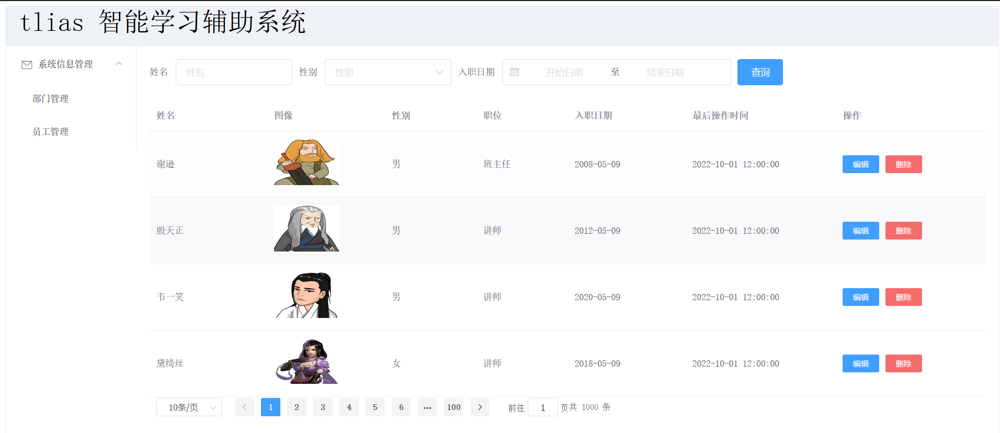 


此时整个案例完整，其完整代码如下：

~~~html
<template>
    <div>
        <!-- 设置最外层容器高度为700px,在加上一个很细的边框 -->
        <el-container style="height: 700px; border: 1px solid #eee">
            <el-header style="font-size:40px;background-color: rgb(238, 241, 246)">tlias 智能学习辅助系统</el-header>
            <el-container>
                <el-aside width="230px"  style="border: 1px solid #eee">
                     <el-menu :default-openeds="['1', '3']">
                        <el-submenu index="1">
                            <template slot="title"><i class="el-icon-message"></i>系统信息管理</template>
                          
                            <el-menu-item index="1-1">部门管理</el-menu-item>
                            <el-menu-item index="1-2">员工管理</el-menu-item>
                          
                     
                        </el-submenu>
                     </el-menu>
                </el-aside>
                <el-main>
                    <!-- 表单 -->
                    <el-form :inline="true" :model="searchForm" class="demo-form-inline">
                        <el-form-item label="姓名">
                            <el-input v-model="searchForm.name" placeholder="姓名"></el-input>
                        </el-form-item>
                        <el-form-item label="性别">
                            <el-select v-model="searchForm.gender" placeholder="性别">
                            <el-option label="男" value="1"></el-option>
                            <el-option label="女" value="2"></el-option>
                            </el-select>
                        </el-form-item>
                          <el-form-item label="入职日期">
                             <el-date-picker
                                v-model="searchForm.entrydate"
                                type="daterange"
                                range-separator="至"
                                start-placeholder="开始日期"
                                end-placeholder="结束日期">
                            </el-date-picker>
                        </el-form-item>
                        <el-form-item>
                            <el-button type="primary" @click="onSubmit">查询</el-button>
                        </el-form-item>
                    </el-form>
                    <!-- 表格 -->
                    <el-table :data="tableData">
                        <el-table-column prop="name"      label="姓名" width="180"></el-table-column>
                        <el-table-column prop="image"     label="图像" width="180">
                            <template slot-scope="scope">
                                
                            </template>
                        </el-table-column>
                        <el-table-column prop="gender"    label="性别" width="140">
                            <template slot-scope="scope">
                                {{scope.row.gender==1?"男":"女"}}
                            </template>
                        </el-table-column>
                        <el-table-column prop="job"       label="职位" width="140"></el-table-column>
                        <el-table-column prop="entrydate" label="入职日期" width="180"></el-table-column>
                        <el-table-column prop="updatetime" label="最后操作时间" width="230"></el-table-column>
                        <el-table-column label="操作" >
                            <el-button type="primary" size="mini">编辑</el-button>
                            <el-button type="danger" size="mini">删除</el-button>
                        </el-table-column>
                    </el-table>

                    <!-- Pagination分页 -->
                    <el-pagination
                        @size-change="handleSizeChange"
                        @current-change="handleCurrentChange"
                        background
                        layout="sizes,prev, pager, next,jumper,total"
                        :total="1000">
                    </el-pagination>
                </el-main>
            </el-container>
        </el-container>
    </div>
</template>

<script>
import axios  'axios'
export default {
     data() {
      return {
        tableData: [
           
        ],
        searchForm:{
            name:'',
            gender:'',
            entrydate:[]
        }
      }
    },
    methods:{
        onSubmit:function(){
            console.log(this.searchForm);
        },
        handleSizeChange(val) {
            console.log(`每页 ${val} 条`);
        },
        handleCurrentChange(val) {
            console.log(`当前页: ${val}`);
        }
    },
    mounted(){
        axios.get("http://yapi.smart-xwork.cn/mock/169327/emp/list")
        .then(resp=>{
            this.tableData=resp.data.data;
        });
    }
}
</script>

<style>

</style>

~~~


# 5 Vue路由

## 5.1 路由介绍

将资代码/vue-project(路由)/vue-project/src/views/tlias/DeptView.vue拷贝到我们当前EmpView.vue同级，其结构如下：

 

此时我们希望基于4.4案例中的功能，实现点击侧边栏的部门管理，显示部门管理的信息，点击员工管理，显示员工管理的信息，效果如下图所示：


这就需要借助我们的vue的路由功能了。

前端路由：URL中的hash(#号之后的内容）与组件之间的对应关系，如下图所示：


当我们点击左侧导航栏时，浏览器的地址栏会发生变化，路由自动更新显示与url所对应的vue组件。


而我们vue官方提供了路由插件Vue Router,其主要组成如下：

- VueRouter：路由器类，根据路由请求在路由视图中动态渲染选中的组件
- &lt;router-link&gt;：请求链接组件，浏览器会解析成&lt;a&gt;
- &lt;router-view&gt;：动态视图组件，用来渲染展示与路由路径对应的组件


其工作原理如下图所示：


首先VueRouter根据我们配置的url的hash片段和路由的组件关系去维护一张路由表;

然后我们页面提供一个&lt;router-link&gt;组件,用户点击，发出路由请求;

接着我们的VueRouter根据路由请求，在路由表中找到对应的vue组件；

最后VueRouter会切换&lt;router-view&gt;中的组件，从而进行视图的更新


## 5.2 路由入门

接下来我们来演示vue的路由功能。

首先我们需要先安装vue-router插件，可以通过如下命令

~~~
npm install vue-router@3.5.1
~~~

**但是我们不需要安装，因为当初我们再创建项目时，已经勾选了路由功能，已经安装好了。**

然后我们需要在**src/router/index.js**文件中定义路由表，根据其提供的模板代码进行修改，最终代码如下：

~~~js
import Vue  'vue'
import VueRouter  'vue-router'

Vue.use(VueRouter)

const routes = [
  {
    path: '/emp',  //地址hash
    name: 'emp',
    component:  () => import('../views/tlias/EmpView.vue')  //对应的vue组件
  },
  {
    path: '/dept',
    name: 'dept',
    component: () => import('../views/tlias/DeptView.vue')
  }
]

const router = new VueRouter({
  routes
})

export default router

~~~

注意需要去掉没有引用的import模块。

在main.js中，我们已经引入了router功能，如下图所示：


路由基本信息配置好了，路由表已经被加载，此时我们还缺少2个东西，就是&lt;router-lin&gt;和&lt;router-view&gt;,所以我们需要修改2个页面（EmpView.vue和DeptView.vue）我们左侧栏的2个按钮为router-link,其代码如下：

~~~html
<el-menu-item index="1-1">
    <router-link to="/dept">部门管理</router-link>
</el-menu-item>
<el-menu-item index="1-2">
    <router-link to="/emp">员工管理</router-link>
</el-menu-item>
~~~

然后我们还需要在内容展示区域即App.vue中定义route-view，作为组件的切换，其App.vue的完整代码如下：

~~~html
<template>
  <div id="app">
    <!-- {{message}} -->
    <!-- <element-view></element-view> -->
    <!-- <emp-view></emp-view> -->
    <router-view></router-view>
  </div>
</template>

<script>
// import EmpView  './views/tlias/EmpView.vue'
// import ElementView  './views/Element/ElementView.vue'
export default {
  components: { },
  data(){
    return {
      "message":"hello world"
    }
  }
}
</script>
<style>

</style>

~~~

但是我们浏览器打开地址： http://localhost:7000/ ，发现一片空白，因为我们默认的路由路径是/,但是路由配置中没有对应的关系，

所以我们需要在路由配置中/对应的路由组件，代码如下：

~~~js
const routes = [
  {
    path: '/emp',
    name: 'emp',
    component:  () => import('../views/tlias/EmpView.vue')
  },
  {
    path: '/dept',
    name: 'dept',
    component: () => import('../views/tlias/DeptView.vue')
  },
  {
    path: '/',
    redirect:'/emp' //表示重定向到/emp即可
  },
]
~~~

此时我们打开浏览器，访问http://localhost:7000 发现直接访问的是emp的页面，并且能够进行切换了，其具体如下图所示：

 

到此我们的路由实现成功。


# 6 打包部署

我们的前端工程开发好了，但是我们需要发布，那么如何发布呢？主要分为2步：

1. 前端工程打包
2. 通过nginx服务器发布前端工程

## 6.1 前端工程打包

接下来我们先来对前端工程进行打包

我们直接通过VS Code的NPM脚本中提供的build按钮来完整，如下图所示，直接点击即可：

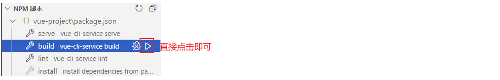

然后会在工程目录下生成一个dist目录，用于存放需要发布的前端资源，如下图所示：


## 6.2 部署前端工程

### 6.2.1 nginx介绍

nginx: Nginx是一款轻量级的Web服务器/反向代理服务器及电子邮件（IMAP/POP3）代理服务器。其特点是占有内存少，并发能力强，在各大型互联网公司都有非常广泛的使用。

niginx在windows中的安装是比较方便的，直接解压即可。所以我们直接将资料中的nginx-1.22.0.zip压缩文件拷贝到**无中文的目录下**，直接解压即可，如下图所示就是nginx的解压目录以及目录结构说明：


**很明显，我们如果要发布，直接将资源放入到html目录中。**


### 6.2.2 部署

将我们之前打包的前端工程dist目录下得内容拷贝到nginx的html目录下，如下图所示：


然后我们通过双击nginx下得nginx.exe文件来启动nginx，如下图所示：

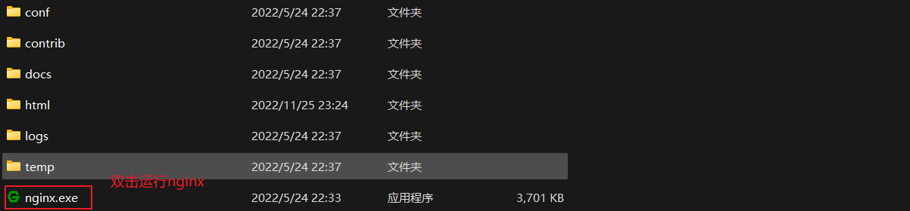

nginx服务器的端口号是80，所以启动成功之后，我们浏览器直接访问http://localhost:80 即可，其中80端口可以省略，其浏览器展示效果如图所示：

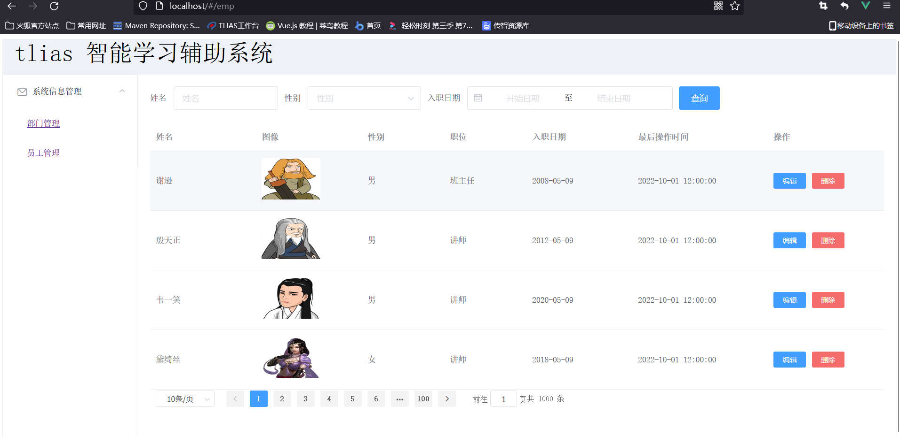

到此，我们的前端工程发布成功。


PS: 如果80端口被占用，我们需要通过**conf/nginx.conf**配置文件来修改端口号。如下图所示：


