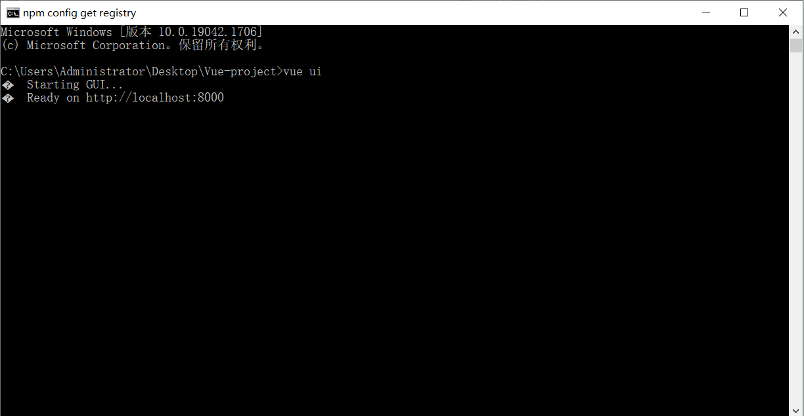
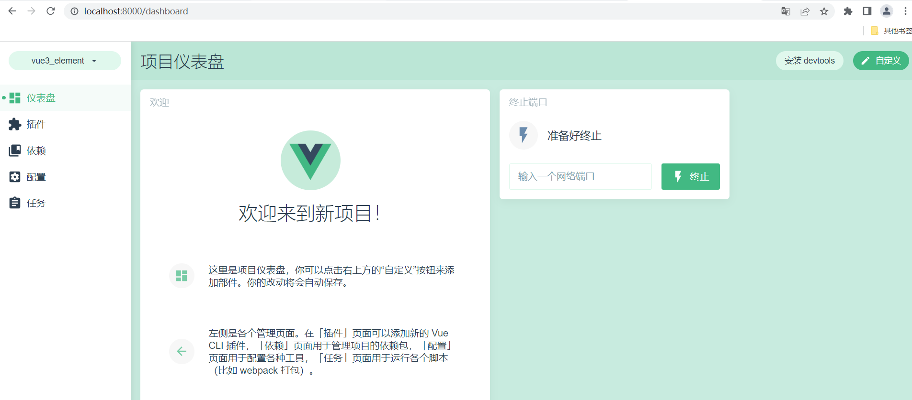
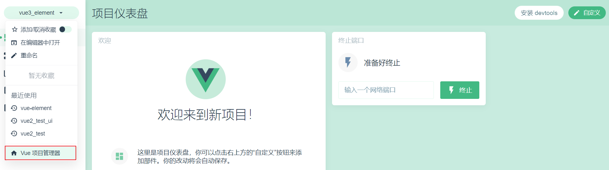
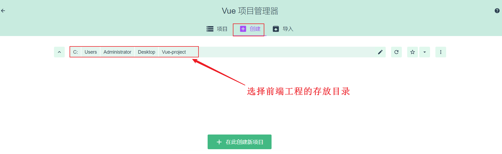
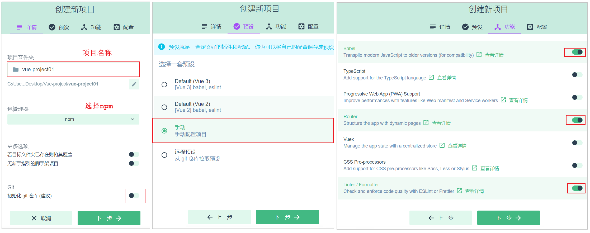
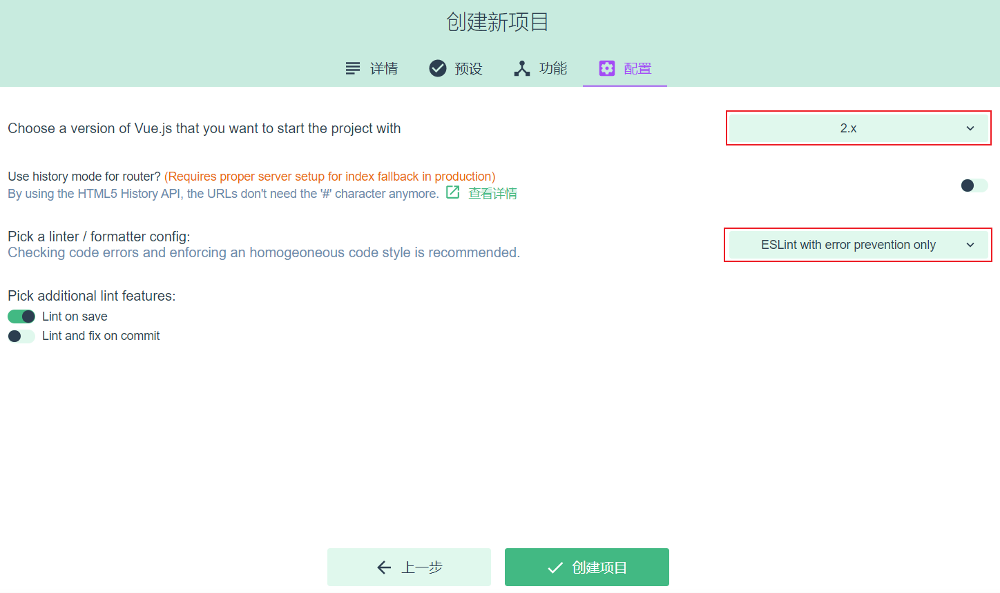
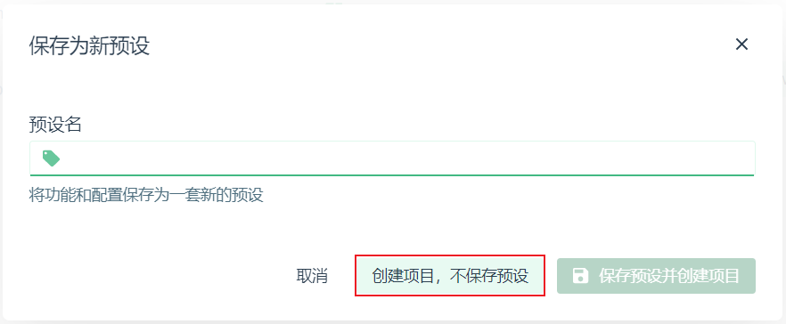
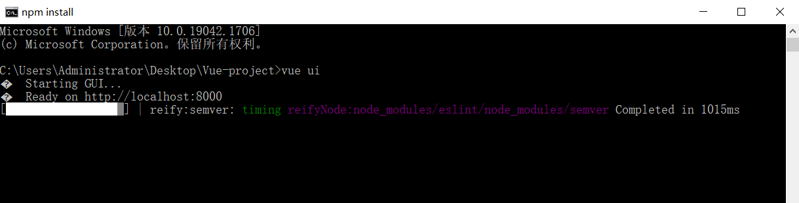
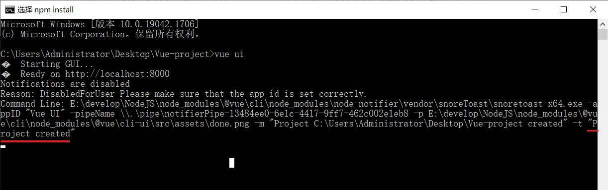

# Vue项目创建


## 1. 打开UI界面

在命令行中，执行如下指令：

```
 vue ui
```




 


## 2. 打开项目管理器

 


  


## 3. 创建项目

 


 


 


创建项目的过程，需要联网进行，这可能会耗时比较长的时间，请耐心等待。 windows的命令行，容易卡顿，我们可以虽然敲击一下键盘。

 


如果出现如下字样，就说明前端工程已经创建完毕了。

 


创建完毕后，就可以直接关闭页面和命令行了，到此工程创建完毕。


