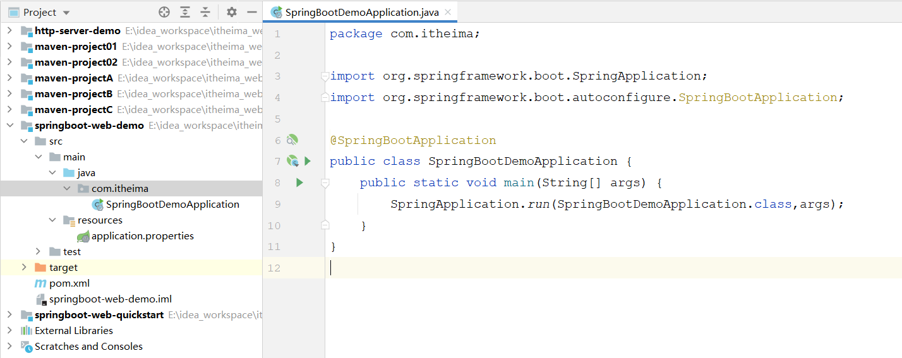

# SpringBoot项目-手动构建

## 1. 创建maven项目

在idea中创建一个maven项目，正常填写项目的坐标信息。如下图所示：

 


输入项目的基本信息之后，点击finish，就可以创建一个maven项目。

 


但是这个maven项目目前并不是springboot项目，我们还需要做如下两步操作。


## 2. pom.xml配置

1). 在pom.xml中指定springboot的父工程

```xml
<!-- springboot父工程-->
<parent>
    <groupId>org.springframework.boot</groupId>
    <artifactId>spring-boot-starter-parent</artifactId>
    <version>2.7.4</version>
    <relativePath/> <!-- lookup parent from repository -->
</parent>
```


2). 添加springboot项目的起步依赖以及maven插件

```xml
<dependencies>
    <dependency>
        <groupId>org.springframework.boot</groupId>
        <artifactId>spring-boot-starter-web</artifactId>
    </dependency>
	
    <dependency>
        <groupId>org.springframework.boot</groupId>
        <artifactId>spring-boot-starter-test</artifactId>
        <scope>test</scope>
    </dependency>
</dependencies>

<build>
    <plugins>
        <plugin>
            <groupId>org.springframework.boot</groupId>
            <artifactId>spring-boot-maven-plugin</artifactId>
        </plugin>
    </plugins>
</build>
```


## 3. 基本结构

1). 创建基本的包结构 com.itheima，并创建启动类 SpringBootDemoApplication

2). 并在resources目录下准备一份配置文件，application.properties (创建一个新的file文件，命名为application.properties)

 


到此呢，我们就手动创建好了这样一个springboot项目~ 


