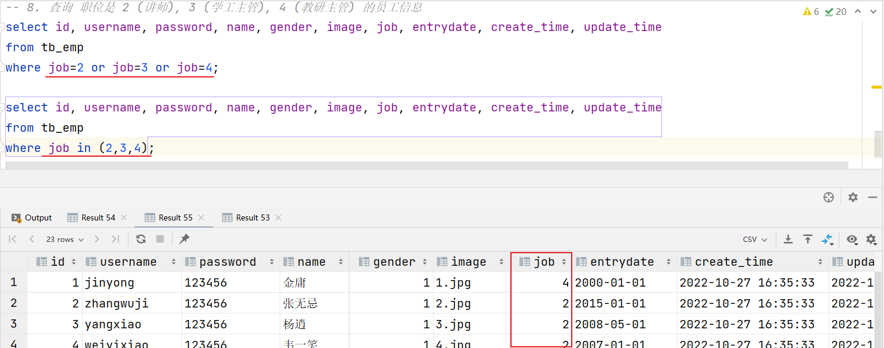
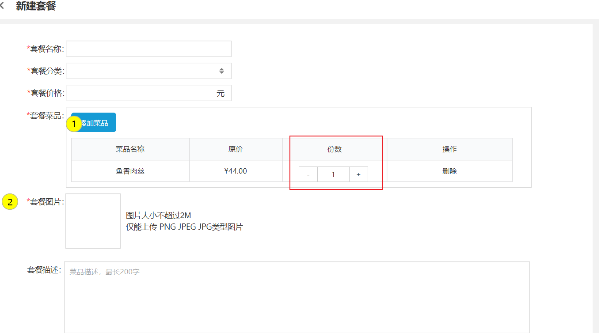

# 数据库开发-MySQL

在上次学习的内容中，我们讲解了：

- 使用DDL语句来操作数据库以及表结构（数据库设计）
- 使用DML语句来完成数据库中数据的增、删、改操作（数据库操作）

我们今天还是继续学习数据库操作方面的内容：查询（DQL语句）。

查询操作我们分为两部分学习：

- DQL语句-单表操作
- DQL语句-多表操作


## 1. 数据库操作-DQL

### 1.1 介绍

DQL英文全称是Data Query Language(数据查询语言)，用来查询数据库表中的记录。

查询关键字：SELECT

查询操作是所有SQL语句当中最为常见，也是最为重要的操作。在一个正常的业务系统中，查询操作的使用频次是要远高于增删改操作的。当我们打开某个网站或APP所看到的展示信息，都是通过从数据库中查询得到的，而在这个查询过程中，还会涉及到条件、排序、分页等操作。

 


### 1.2 语法

DQL查询语句，语法结构如下：

```mysql
SELECT
	字段列表
FROM
	表名列表
WHERE
	条件列表
GROUP  BY
	分组字段列表
HAVING
	分组后条件列表
ORDER BY
	排序字段列表
LIMIT
	分页参数
```

我们今天会将上面的完整语法拆分为以下几个部分学习：

- 基本查询（不带任何条件）
- 条件查询（where）
- 分组查询（group by）
- 排序查询（order by）
- 分页查询（limit）


准备一些测试数据用于查询操作：

~~~mysql
create database db02; -- 创建数据库
use db02; -- 切换数据库
-- 员工管理(带约束)
create table tb_emp (
    id int unsigned primary key auto_increment comment 'ID',
    username varchar(20) not null unique comment '用户名',
    password varchar(32) default '123456' comment '密码',
    name varchar(10) not null comment '姓名',
    gender tinyint unsigned not null comment '性别, 说明: 1 男, 2 女',
    image varchar(300) comment '图像',
    job tinyint unsigned comment '职位, 说明: 1 班主任,2 讲师, 3 学工主管, 4 教研主管',
    entrydate date comment '入职时间',
    create_time datetime not null comment '创建时间',
    update_time datetime not null comment '修改时间'
) comment '员工表';

-- 准备测试数据
INSERT INTO tb_emp (id, username, password, name, gender, image, job, entrydate, create_time, update_time) VALUES
    (1, 'jinyong', '123456', '金庸', 1, '1.jpg', 4, '2000-01-01', '2022-10-27 16:35:33', '2022-10-27 16:35:35'),
    (2, 'zhangwuji', '123456', '张无忌', 1, '2.jpg', 2, '2015-01-01', '2022-10-27 16:35:33', '2022-10-27 16:35:37'),
    (3, 'yangxiao', '123456', '杨逍', 1, '3.jpg', 2, '2008-05-01', '2022-10-27 16:35:33', '2022-10-27 16:35:39'),
    (4, 'weiyixiao', '123456', '韦一笑', 1, '4.jpg', 2, '2007-01-01', '2022-10-27 16:35:33', '2022-10-27 16:35:41'),
    (5, 'changyuchun', '123456', '常遇春', 1, '5.jpg', 2, '2012-12-05', '2022-10-27 16:35:33', '2022-10-27 16:35:43'),
    (6, 'xiaozhao', '123456', '小昭', 2, '6.jpg', 3, '2013-09-05', '2022-10-27 16:35:33', '2022-10-27 16:35:45'),
    (7, 'jixiaofu', '123456', '纪晓芙', 2, '7.jpg', 1, '2005-08-01', '2022-10-27 16:35:33', '2022-10-27 16:35:47'),
    (8, 'zhouzhiruo', '123456', '周芷若', 2, '8.jpg', 1, '2014-11-09', '2022-10-27 16:35:33', '2022-10-27 16:35:49'),
    (9, 'dingminjun', '123456', '丁敏君', 2, '9.jpg', 1, '2011-03-11', '2022-10-27 16:35:33', '2022-10-27 16:35:51'),
    (10, 'zhaomin', '123456', '赵敏', 2, '10.jpg', 1, '2013-09-05', '2022-10-27 16:35:33', '2022-10-27 16:35:53'),
    (11, 'luzhangke', '123456', '鹿杖客', 1, '11.jpg', 2, '2007-02-01', '2022-10-27 16:35:33', '2022-10-27 16:35:55'),
    (12, 'hebiweng', '123456', '鹤笔翁', 1, '12.jpg', 2, '2008-08-18', '2022-10-27 16:35:33', '2022-10-27 16:35:57'),
    (13, 'fangdongbai', '123456', '方东白', 1, '13.jpg', 1, '2012-11-01', '2022-10-27 16:35:33', '2022-10-27 16:35:59'),
    (14, 'zhangsanfeng', '123456', '张三丰', 1, '14.jpg', 2, '2002-08-01', '2022-10-27 16:35:33', '2022-10-27 16:36:01'),
    (15, 'yulianzhou', '123456', '俞莲舟', 1, '15.jpg', 2, '2011-05-01', '2022-10-27 16:35:33', '2022-10-27 16:36:03'),
    (16, 'songyuanqiao', '123456', '宋远桥', 1, '16.jpg', 2, '2010-01-01', '2022-10-27 16:35:33', '2022-10-27 16:36:05'),
    (17, 'chenyouliang', '12345678', '陈友谅', 1, '17.jpg', null, '2015-03-21', '2022-10-27 16:35:33', '2022-10-27 16:36:07'),
    (18, 'zhang1', '123456', '张一', 1, '2.jpg', 2, '2015-01-01', '2022-10-27 16:35:33', '2022-10-27 16:36:09'),
    (19, 'zhang2', '123456', '张二', 1, '2.jpg', 2, '2012-01-01', '2022-10-27 16:35:33', '2022-10-27 16:36:11'),
    (20, 'zhang3', '123456', '张三', 1, '2.jpg', 2, '2018-01-01', '2022-10-27 16:35:33', '2022-10-27 16:36:13'),
    (21, 'zhang4', '123456', '张四', 1, '2.jpg', 2, '2015-01-01', '2022-10-27 16:35:33', '2022-10-27 16:36:15'),
    (22, 'zhang5', '123456', '张五', 1, '2.jpg', 2, '2016-01-01', '2022-10-27 16:35:33', '2022-10-27 16:36:17'),
    (23, 'zhang6', '123456', '张六', 1, '2.jpg', 2, '2012-01-01', '2022-10-27 16:35:33', '2022-10-27 16:36:19'),
    (24, 'zhang7', '123456', '张七', 1, '2.jpg', 2, '2006-01-01', '2022-10-27 16:35:33', '2022-10-27 16:36:21'),
    (25, 'zhang8', '123456', '张八', 1, '2.jpg', 2, '2002-01-01', '2022-10-27 16:35:33', '2022-10-27 16:36:23'),
    (26, 'zhang9', '123456', '张九', 1, '2.jpg', 2, '2011-01-01', '2022-10-27 16:35:33', '2022-10-27 16:36:25'),
    (27, 'zhang10', '123456', '张十', 1, '2.jpg', 2, '2004-01-01', '2022-10-27 16:35:33', '2022-10-27 16:36:27'),
    (28, 'zhang11', '123456', '张十一', 1, '2.jpg', 2, '2007-01-01', '2022-10-27 16:35:33', '2022-10-27 16:36:29'),
    (29, 'zhang12', '123456', '张十二', 1, '2.jpg', 2, '2020-01-01', '2022-10-27 16:35:33', '2022-10-27 16:36:31');
~~~


### 1.3 基本查询

在基本查询的DQL语句中，不带任何的查询条件，语法如下：

- 查询多个字段

  ~~~mysql
  select 字段1, 字段2, 字段3 from  表名;
  ~~~

- 查询所有字段（通配符）

  ~~~mysql
  select *  from  表名;
  ~~~

- 设置别名

  ~~~mysql
  select 字段1 [ as 别名1 ] , 字段2 [ as 别名2 ]  from  表名;
  ~~~

- 去除重复记录

  ~~~mysql
  select distinct 字段列表 from  表名;
  ~~~


案例1：查询指定字段 name，entrydate并返回

~~~mysql
select name,entrydate from tb_emp;
~~~


案例2：查询返回所有字段

~~~mysql
select * from tb_emp;
~~~

> `*`号代表查询所有字段，在实际开发中尽量少用（不直观、影响效率）


案例3：查询所有员工的 name,entrydate，并起别名(姓名、入职日期)

~~~mysql
-- 方式1：
select name AS 姓名, entrydate AS 入职日期 from tb_emp;
-- 方式2： 别名中有特殊字符时，使用''或""包含
select name AS '姓 名', entrydate AS '入职日期' from tb_emp;
-- 方式3：
select name AS "姓名", entrydate AS "入职日期" from tb_emp;
~~~


案例4：查询已有的员工关联了哪几种职位(不要重复)

~~~mysql
select distinct job from tb_emp;
~~~


### 1.4 条件查询

**语法：**

```sql
select  字段列表  from   表名   where   条件列表 ; -- 条件列表：意味着可以有多个条件
```

学习条件查询就是学习条件的构建方式，而在SQL语句当中构造条件的运算符分为两类：

- 比较运算符
- 逻辑运算符

常用的比较运算符如下: 

| **比较运算符**       | **功能**                                 |
| -------------------- | ---------------------------------------- |
| >                    | 大于                                     |
| >=                   | 大于等于                                 |
| <                    | 小于                                     |
| <=                   | 小于等于                                 |
| =                    | 等于                                     |
| <> 或 !=             | 不等于                                   |
| between ...  and ... | 在某个范围之内(含最小、最大值)           |
| in(...)              | 在in之后的列表中的值，多选一             |
| like 占位符          | 模糊匹配(_匹配单个字符, %匹配任意个字符) |
| is null              | 是null                                   |

常用的逻辑运算符如下:

| **逻辑运算符** | **功能**                    |
| -------------- | --------------------------- |
| and 或 &&      | 并且 (多个条件同时成立)     |
| or 或 \|\|     | 或者 (多个条件任意一个成立) |
| not 或 !       | 非 , 不是                   |


案例1：查询 姓名 为 杨逍 的员工

~~~mysql
select id, username, password, name, gender, image, job, entrydate, create_time, update_time
from tb_emp
where name = '杨逍'; -- 字符串使用''或""包含
~~~


案例2：查询 id小于等于5 的员工信息

~~~mysql
select id, username, password, name, gender, image, job, entrydate, create_time, update_time
from tb_emp
where id <=5;
~~~


案例3：查询 没有分配职位 的员工信息

~~~mysql
select id, username, password, name, gender, image, job, entrydate, create_time, update_time
from tb_emp
where job is null ;
~~~


> 注意：查询为NULL的数据时，不能使用 `= null`
>
> 


案例4：查询 有职位 的员工信息

~~~mysql
select id, username, password, name, gender, image, job, entrydate, create_time, update_time
from tb_emp
where job is not null ;
~~~


案例5：查询 密码不等于 '123456' 的员工信息

~~~mysql
-- 方式1：
select id, username, password, name, gender, image, job, entrydate, create_time, update_time
from tb_emp
where password <> '123456';
-- 方式2：
select id, username, password, name, gender, image, job, entrydate, create_time, update_time
from tb_emp
where password != '123456';
~~~


案例6：查询 入职日期 在 '2000-01-01' (包含) 到 '2010-01-01'(包含) 之间的员工信息

~~~mysql
-- 方式1：
select id, username, password, name, gender, image, job, entrydate, create_time, update_time
from tb_emp
where entrydate>='2000-01-01' and entrydate<='2010-01-01';
-- 方式2： between...and
select id, username, password, name, gender, image, job, entrydate, create_time, update_time
from tb_emp
where entrydate between '2000-01-01' and '2010-01-01';
~~~


案例7：查询 入职时间 在 '2000-01-01' (包含) 到 '2010-01-01'(包含) 之间 且 性别为女 的员工信息

~~~mysql
select id, username, password, name, gender, image, job, entrydate, create_time, update_time
from tb_emp
where entrydate between '2000-01-01' and '2010-01-01'
      and gender = 2;
~~~


案例8：查询 职位是 2 (讲师), 3 (学工主管), 4 (教研主管) 的员工信息

~~~mysql
-- 方式1：使用or连接多个条件
select id, username, password, name, gender, image, job, entrydate, create_time, update_time
from tb_emp
where job=2 or job=3 or job=4;
-- 方式2：in关键字
select id, username, password, name, gender, image, job, entrydate, create_time, update_time
from tb_emp
where job in (2,3,4);
~~~




案例9：查询 姓名 为两个字的员工信息

~~~mysql
select id, username, password, name, gender, image, job, entrydate, create_time, update_time
from tb_emp
where name like '__';  # 通配符 "_" 代表任意1个字符
~~~


案例10：查询 姓 '张' 的员工信息

~~~mysql
select id, username, password, name, gender, image, job, entrydate, create_time, update_time
from tb_emp
where name like '张%'; # 通配符 "%" 代表任意个字符（0个 ~ 多个）
~~~


### 1.5 聚合函数

之前我们做的查询都是横向查询，就是根据条件一行一行的进行判断，而使用聚合函数查询就是纵向查询，它是对一列的值进行计算，然后返回一个结果值。（将一列数据作为一个整体，进行纵向计算）

语法：

~~~mysql
select  聚合函数(字段列表)  from  表名 ;
~~~

> 注意 : 聚合函数会忽略空值，对NULL值不作为统计。


常用聚合函数：

| **函数** | **功能** |
| -------- | -------- |
| count    | 统计数量 |
| max      | 最大值   |
| min      | 最小值   |
| avg      | 平均值   |
| sum      | 求和     |

> count ：按照列去统计有多少行数据。
>
> - 在根据指定的列统计的时候，如果这一列中有null的行，该行不会被统计在其中。
>
> sum ：计算指定列的数值和，如果不是数值类型，那么计算结果为0
>
> max ：计算指定列的最大值
>
> min ：计算指定列的最小值
>
> avg ：计算指定列的平均值


案例1：统计该企业员工数量

~~~mysql
# count(字段)
select count(id) from tb_emp;-- 结果：29
select count(job) from tb_emp;-- 结果：28 （聚合函数对NULL值不做计算）

# count(常量)
select count(0) from tb_emp;
select count('A') from tb_emp;

# count(*)  推荐此写法（MySQL底层进行了优化）
select count(*) from tb_emp;
~~~


案例2：统计该企业最早入职的员工

~~~mysql
select min(entrydate) from tb_emp;
~~~


案例3：统计该企业最迟入职的员工

~~~mysql
select max(entrydate) from tb_emp;
~~~


案例4：统计该企业员工 ID 的平均值

~~~mysql
select avg(id) from tb_emp;
~~~


案例5：统计该企业员工的 ID 之和

~~~mysql
select sum(id) from tb_emp;
~~~


### 1.6 分组查询

分组： 按照某一列或者某几列，把相同的数据进行合并输出。

> 分组其实就是按列进行分类(指定列下相同的数据归为一类)，然后可以对分类完的数据进行合并计算。
>
> 分组查询通常会使用聚合函数进行计算。

语法：

~~~mysql
select  字段列表  from  表名  [where 条件]  group by 分组字段名  [having 分组后过滤条件];
~~~


案例1：根据性别分组 , 统计男性和女性员工的数量

~~~mysql
select gender, count(*)
from tb_emp
group by gender; -- 按照gender字段进行分组（gender字段下相同的数据归为一组）
~~~


案例2：查询入职时间在 '2015-01-01' (包含) 以前的员工 , 并对结果根据职位分组 , 获取员工数量大于等于2的职位

~~~mysql
select job, count(*)
from tb_emp
where entrydate <= '2015-01-01'   -- 分组前条件
group by job                      -- 按照job字段分组
having count(*) >= 2;             -- 分组后条件
~~~


> 注意事项:
>
> ​	• 分组之后，查询的字段一般为聚合函数和分组字段，查询其他字段无任何意义
>
> ​	• 执行顺序：where > 聚合函数 > having 


**where与having区别（面试题）**

- 执行时机不同：where是分组之前进行过滤，不满足where条件，不参与分组；而having是分组之后对结果进行过滤。
- 判断条件不同：where不能对聚合函数进行判断，而having可以。


### 1.7 排序查询

排序在日常开发中是非常常见的一个操作，有升序排序，也有降序排序。

语法：

```mysql
select  字段列表  
from   表名   
[where  条件列表] 
[group by  分组字段 ] 
order  by  字段1  排序方式1 , 字段2  排序方式2 … ;
```

- 排序方式：

  - ASC ：升序（默认值）

  - DESC：降序


案例1：根据入职时间, 对员工进行升序排序

~~~mysql
select id, username, password, name, gender, image, job, entrydate, create_time, update_time
from tb_emp
order by entrydate ASC; -- 按照entrydate字段下的数据进行升序排序

select id, username, password, name, gender, image, job, entrydate, create_time, update_time
from tb_emp
order by  entrydate; -- 默认就是ASC（升序）
~~~


> 注意事项：如果是升序, 可以不指定排序方式ASC 


案例2：根据入职时间，对员工进行降序排序

~~~mysql
select id, username, password, name, gender, image, job, entrydate, create_time, update_time
from tb_emp
order by entrydate DESC; -- 按照entrydate字段下的数据进行降序排序
~~~


案例3：根据入职时间对公司的员工进行升序排序，入职时间相同，再按照更新时间进行降序排序

~~~mysql
select id, username, password, name, gender, image, job, entrydate, create_time, update_time
from tb_emp
order by entrydate ASC , update_time DESC;
~~~


> 注意事项：如果是多字段排序，当第一个字段值相同时，才会根据第二个字段进行排序 


### 1.8 分页查询

分页操作在业务系统开发时，也是非常常见的一个功能，日常我们在网站中看到的各种各样的分页条，后台也都需要借助于数据库的分页操作。


分页查询语法：

```sql
select  字段列表  from   表名  limit  起始索引, 查询记录数 ;
```


案例1：从起始索引0开始查询员工数据, 每页展示5条记录

~~~mysql
select id, username, password, name, gender, image, job, entrydate, create_time, update_time
from tb_emp
limit 0 , 5; -- 从索引0开始，向后取5条记录
~~~


案例2：查询 第1页 员工数据, 每页展示5条记录

~~~mysql
select id, username, password, name, gender, image, job, entrydate, create_time, update_time
from tb_emp
limit 5; -- 如果查询的是第1页数据，起始索引可以省略，直接简写为：limit 条数
~~~


案例3：查询 第2页 员工数据, 每页展示5条记录

~~~mysql
select id, username, password, name, gender, image, job, entrydate, create_time, update_time
from tb_emp
limit 5 , 5; -- 从索引5开始，向后取5条记录
~~~


案例4：查询 第3页 员工数据, 每页展示5条记录

~~~mysql
select id, username, password, name, gender, image, job, entrydate, create_time, update_time
from tb_emp
limit 10 , 5; -- 从索引10开始，向后取5条记录
~~~


> 注意事项:
>
> 1. 起始索引从0开始。        计算公式 ：   起始索引 = （查询页码 - 1）* 每页显示记录数
>
> 2. 分页查询是数据库的方言，不同的数据库有不同的实现，MySQL中是LIMIT
>
> 3. 如果查询的是第一页数据，起始索引可以省略，直接简写为 limit  条数


### 1.9 案例

DQL的基本语法我们学习结束了，接下来我们就运用所掌握的DQL语句的语法来完成两个案例。

#### 1.9.1 案例一

案例：根据需求完成员工管理的条件分页查询


> 分析：根据输入的条件，查询第1页数据
>
> 1. 在员工管理的列表上方有一些查询条件：员工姓名、员工性别，员工入职时间(开始时间~结束时间)
>    - 姓名：张
>    - 性别：男
>    - 入职时间：2000-01-01  ~  2015-12-31
>
> 2. 除了查询条件外，在列表的下面还有一个分页条，这就涉及到了分页查询
>    - 查询第1页数据（每页显示10条数据）
> 3. 基于查询的结果，按照修改时间进行降序排序
>
> 结论：条件查询 + 分页查询 + 排序查询

SQL语句代码：

~~~mysql
-- 根据输入条件查询第1页数据（每页展示10条记录）
-- 输入条件：
   -- 姓名：张 （模糊查询）
   -- 性别：男
   -- 入职时间：2000-01-01 ~ 2015-12-31
-- 分页： 0 , 10
-- 排序： 修改时间  DESC
select id, username, password, name, gender, image, job, entrydate, create_time, update_time
from tb_emp
where name like '张%' and gender = 1 and entrydate between '2000-01-01' and '2015-12-31'
order by update_time desc
limit 0 , 10;
~~~


#### 1.9.2 案例二

案例：根据需求完成员工信息的统计


> 分析：以上信息统计在开发中也叫图形报表(将统计好的数据以可视化的形式展示出来)
>
> - 员工性别统计：以饼状图的形式展示出企业男性员人数和女性员工人数
>   - 只要查询出男性员工和女性员工各自有多少人就可以了
> - 员工职位统计：以柱状图的形式展示各职位的在岗人数
>   - 只要查询出各个职位有多少人就可以了


员工性别统计：

~~~mysql
-- if(条件表达式, true取值 , false取值)
select if(gender=1,'男性员工','女性员工') AS 性别, count(*) AS 人数
from tb_emp
group by gender;
~~~


> if(表达式, tvalue, fvalue) ：当表达式为true时，取值tvalue；当表达式为false时，取值fvalue


员工职位统计：

~~~mysql
-- case 表达式 when 值1 then 结果1  when 值2  then  结果2 ...  else  result  end
select (case job
             when 1 then '班主任'
             when 2 then '讲师'
             when 3 then '学工主管'
             when 4 then '教研主管'
             else '未分配职位'
        end) AS 职位 ,
       count(*) AS 人数
from tb_emp
group by job;
~~~


> case   表达式    when   值1   then  结果1   [when 值2  then  结果2 ...]     [else result]     end


## 2. 多表设计

关于单表的操作(单表的设计、单表的增删改查)我们就已经学习完了。接下来我们就要来学习多表的操作，首先来学习多表的设计。

项目开发中，在进行数据库表结构设计时，会根据业务需求及业务模块之间的关系，分析并设计表结构，由于业务之间相互关联，所以各个表结构之间也存在着各种联系，基本上分为三种：

- 一对多(多对一)

- 多对多

- 一对一

### 2.1 一对多

#### 2.1.1 表设计

需求：根据页面原型及需求文档 ，完成部门及员工的表结构设计

- 员工管理页面原型：（前面已完成tb_emp表结构设计）


- 部门管理页面原型：


> 经过上述分析，现已明确的部门表结构：
>
> - 业务字段 ： 部门名称
> - 基础字段 ： id(主键)、创建时间、修改时间

部门表 - SQL语句： 

~~~mysql
# 建议：创建新的数据库（多表设计存放在新数据库下）
create database db03;
use db03;

-- 部门表
create table tb_dept
(
    id int unsigned primary key auto_increment comment '主键ID',
    name varchar(10) not null unique  comment '部门名称',
    create_time datetime not null comment '创建时间',
    update_time datetime not null comment '修改时间'
) comment '部门表';
~~~

部门表创建好之后，我们还需要再修改下员工表。为什么要修改员工表呢？是因为我们之前设计员工表(单表)的时候，并没有考虑员工的归属部门。


员工表：添加归属部门字段

~~~mysql
-- 员工表
create table tb_emp
(
    id          int unsigned primary key auto_increment comment 'ID',
    username    varchar(20)      not null unique comment '用户名',
    password    varchar(32) default '123456' comment '密码',
    name        varchar(10)      not null comment '姓名',
    gender      tinyint unsigned not null comment '性别, 说明: 1 男, 2 女',
    image       varchar(300) comment '图像',
    job         tinyint unsigned comment '职位, 说明: 1 班主任,2 讲师, 3 学工主管, 4 教研主管',
    entrydate   date comment '入职时间',
    
    dept_id     int unsigned comment '部门ID', -- 员工的归属部门
    
    create_time datetime         not null comment '创建时间',
    update_time datetime         not null comment '修改时间'
) comment '员工表';
~~~

测试数据：

~~~mysql
-- 部门表测试数据
insert into tb_dept (id, name, create_time, update_time) values
(1,'学工部',now(),now()),
(2,'教研部',now(),now()),
(3,'咨询部',now(),now()),
(4,'就业部',now(),now()),
(5,'人事部',now(),now());

-- 员工表测试数据
INSERT INTO tb_emp
(id, username, password, name, gender, image, job, entrydate,dept_id, create_time, update_time) VALUES
(1,'jinyong','123456','金庸',1,'1.jpg',4,'2000-01-01',2,now(),now()),
(2,'zhangwuji','123456','张无忌',1,'2.jpg',2,'2015-01-01',2,now(),now()),
(3,'yangxiao','123456','杨逍',1,'3.jpg',2,'2008-05-01',2,now(),now()),
(4,'weiyixiao','123456','韦一笑',1,'4.jpg',2,'2007-01-01',2,now(),now()),
(5,'changyuchun','123456','常遇春',1,'5.jpg',2,'2012-12-05',2,now(),now()),
(6,'xiaozhao','123456','小昭',2,'6.jpg',3,'2013-09-05',1,now(),now()),
(7,'jixiaofu','123456','纪晓芙',2,'7.jpg',1,'2005-08-01',1,now(),now()),
(8,'zhouzhiruo','123456','周芷若',2,'8.jpg',1,'2014-11-09',1,now(),now()),
(9,'dingminjun','123456','丁敏君',2,'9.jpg',1,'2011-03-11',1,now(),now()),
(10,'zhaomin','123456','赵敏',2,'10.jpg',1,'2013-09-05',1,now(),now()),
(11,'luzhangke','123456','鹿杖客',1,'11.jpg',1,'2007-02-01',1,now(),now()),
(12,'hebiweng','123456','鹤笔翁',1,'12.jpg',1,'2008-08-18',1,now(),now()),
(13,'fangdongbai','123456','方东白',1,'13.jpg',2,'2012-11-01',2,now(),now()),
(14,'zhangsanfeng','123456','张三丰',1,'14.jpg',2,'2002-08-01',2,now(),now()),
(15,'yulianzhou','123456','俞莲舟',1,'15.jpg',2,'2011-05-01',2,now(),now()),
(16,'songyuanqiao','123456','宋远桥',1,'16.jpg',2,'2010-01-01',2,now(),now()),
(17,'chenyouliang','123456','陈友谅',1,'17.jpg',NULL,'2015-03-21',NULL,now(),now());
~~~

员工表 - 部门表之间的关系：


> **一对多关系实现：在数据库表中多的一方，添加字段，来关联属于一这方的主键。**


#### 2.1.2 外键约束

**问题**

- 表结构创建完毕后，我们看到两张表的数据分别为：

 

现在员工表中有五个员工都归属于1号部门(学工部)，当删除了1号部门后，数据变为：

 

1号部门被删除了，但是依然还有5个员工是属于1号部门的。 此时：就出现数据的不完整、不一致了。 


**问题分析**

目前上述的两张表(员工表、部门表)，在数据库层面，并未建立关联，所以是无法保证数据的一致性和完整性的


**问题解决**

想解决上述的问题呢，我们就可以通过数据库中的 **外键约束** 来解决。

> 外键约束：让两张表的数据建立连接，保证数据的一致性和完整性。  
>
> 对应的关键字：foreign key

外键约束的语法：

```mysql
-- 创建表时指定
create table 表名(
	字段名    数据类型,
	...
	[constraint]   [外键名称]  foreign  key (外键字段名)   references   主表 (主表列名)	
);


-- 建完表后，添加外键
alter table  表名  add constraint  外键名称  foreign key(外键字段名) references 主表(主表列名);
```

那接下来，我们就为员工表的dept_id 建立外键约束，来关联部门表的主键。


方式1：通过SQL语句操作

```mysql
-- 修改表： 添加外键约束
alter table tb_emp  
add  constraint  fk_dept_id  foreign key (dept_id)  references  tb_dept(id);
```


方式2：图形化界面操作

 

> 当我们添加外键约束时，我们得保证当前数据库表中的数据是完整的。 所以，我们需要将之前删除掉的数据再添加回来。

> 当我们添加了外键之后，再删除ID为1的部门，就会发现，此时数据库报错了，不允许删除。
>
> 
>
> 外键约束（foreign key）：保证了数据的完整性和一致性。


**物理外键和逻辑外键**

- 物理外键
  - 概念：使用foreign key定义外键关联另外一张表。
  - 缺点：
    - 影响增、删、改的效率（需要检查外键关系）。
    - 仅用于单节点数据库，不适用与分布式、集群场景。
    - 容易引发数据库的死锁问题，消耗性能。

- 逻辑外键
  - 概念：在业务层逻辑中，解决外键关联。
  - 通过逻辑外键，就可以很方便的解决上述问题。

> **在现在的企业开发中，很少会使用物理外键，都是使用逻辑外键。 甚至在一些数据库开发规范中，会明确指出禁止使用物理外键 foreign key **


### 2.2 一对一

一对一关系表在实际开发中应用起来比较简单，通常是用来做单表的拆分，也就是将一张大表拆分成两张小表，将大表中的一些基础字段放在一张表当中，将其他的字段放在另外一张表当中，以此来提高数据的操作效率。

> 一对一的应用场景： 用户表(基本信息+身份信息)
>
> 
>
> - 基本信息：用户的ID、姓名、性别、手机号、学历
> - 身份信息：民族、生日、身份证号、身份证签发机关，身份证的有效期(开始时间、结束时间)
>
> 如果在业务系统当中，对用户的基本信息查询频率特别的高，但是对于用户的身份信息查询频率很低，此时出于提高查询效率的考虑，我就可以将这张大表拆分成两张小表，第一张表存放的是用户的基本信息，而第二张表存放的就是用户的身份信息。他们两者之间一对一的关系，一个用户只能对应一个身份证，而一个身份证也只能关联一个用户。

那么在数据库层面怎么去体现上述两者之间是一对一的关系呢？

其实一对一我们可以看成一种特殊的一对多。一对多我们是怎么设计表关系的？是不是在多的一方添加外键。同样我们也可以通过外键来体现一对一之间的关系，我们只需要在任意一方来添加一个外键就可以了。


> 一对一 ：在任意一方加入外键，关联另外一方的主键，并且设置外键为唯一的(UNIQUE)


SQL脚本：

~~~mysql
-- 用户基本信息表
create table tb_user(
    id int unsigned  primary key auto_increment comment 'ID',
    name varchar(10) not null comment '姓名',
    gender tinyint unsigned not null comment '性别, 1 男  2 女',
    phone char(11) comment '手机号',
    degree varchar(10) comment '学历'
) comment '用户基本信息表';
-- 测试数据
insert into tb_user values (1,'白眉鹰王',1,'18812340001','初中'),
                        (2,'青翼蝠王',1,'18812340002','大专'),
                        (3,'金毛狮王',1,'18812340003','初中'),
                        (4,'紫衫龙王',2,'18812340004','硕士');

-- 用户身份信息表
create table tb_user_card(
    id int unsigned  primary key auto_increment comment 'ID',
    nationality varchar(10) not null comment '民族',
    birthday date not null comment '生日',
    idcard char(18) not null comment '身份证号',
    issued varchar(20) not null comment '签发机关',
    expire_begin date not null comment '有效期限-开始',
    expire_end date comment '有效期限-结束',
    user_id int unsigned not null unique comment '用户ID',
    constraint fk_user_id foreign key (user_id) references tb_user(id)
) comment '用户身份信息表';
-- 测试数据
insert into tb_user_card values (1,'汉','1960-11-06','100000100000100001','朝阳区公安局','2000-06-10',null,1),
        (2,'汉','1971-11-06','100000100000100002','静安区公安局','2005-06-10','2025-06-10',2),
        (3,'汉','1963-11-06','100000100000100003','昌平区公安局','2006-06-10',null,3),
        (4,'回','1980-11-06','100000100000100004','海淀区公安局','2008-06-10','2028-06-10',4);
~~~


### 2.3 多对多

多对多的关系在开发中属于也比较常见的。比如：学生和老师的关系，一个学生可以有多个授课老师，一个授课老师也可以有多个学生。在比如：学生和课程的关系，一个学生可以选修多门课程，一个课程也可以供多个学生选修。

案例：学生与课程的关系

- 关系：一个学生可以选修多门课程，一门课程也可以供多个学生选择

- 实现关系：建立第三张中间表，中间表至少包含两个外键，分别关联两方主键


SQL脚本：

~~~mysql
-- 学生表
create table tb_student(
    id int auto_increment primary key comment '主键ID',
    name varchar(10) comment '姓名',
    no varchar(10) comment '学号'
) comment '学生表';
-- 学生表测试数据
insert into tb_student(name, no) values ('黛绮丝', '2000100101'),('谢逊', '2000100102'),('殷天正', '2000100103'),('韦一笑', '2000100104');

-- 课程表
create table tb_course(
   id int auto_increment primary key comment '主键ID',
   name varchar(10) comment '课程名称'
) comment '课程表';
-- 课程表测试数据
insert into tb_course (name) values ('Java'), ('PHP'), ('MySQL') , ('Hadoop');

-- 学生课程表（中间表）
create table tb_student_course(
   id int auto_increment comment '主键' primary key,
   student_id int not null comment '学生ID',
   course_id  int not null comment '课程ID',
   constraint fk_courseid foreign key (course_id) references tb_course (id),
   constraint fk_studentid foreign key (student_id) references tb_student (id)
)comment '学生课程中间表';
-- 学生课程表测试数据
insert into tb_student_course(student_id, course_id) values (1,1),(1,2),(1,3),(2,2),(2,3),(3,4);
~~~


### 2.4 案例

下面通过一个综合案例加深对于多表关系的理解，并掌握多表设计的流程。

**需求**

- 根据参考资料中提供的《[苍穹外卖](https://app.mockplus.cn/app/share-e928208474edd220b75e9faff1380e4ashare-VaH7dpoIaqRr/preview/BlJ_BHC42AEaa/tKNB7Tamh14B54?allowShare=1&cps=expand&ha=1)[_](https://app.mockplus.cn/app/share-e928208474edd220b75e9faff1380e4ashare-VaH7dpoIaqRr/preview/BlJ_BHC42AEaa/tKNB7Tamh14B54?allowShare=1&cps=expand&ha=1)[管理后台](https://app.mockplus.cn/app/share-e928208474edd220b75e9faff1380e4ashare-VaH7dpoIaqRr/preview/BlJ_BHC42AEaa/tKNB7Tamh14B54?allowShare=1&cps=expand&ha=1)》页面原型，设计分类管理、菜品管理、套餐管理模块的表结构。


**步骤**

1. 阅读页面原型及需求文档，分析各个模块涉及到的表结构，及表结构之间的关系。

2. 根据页面原型及需求文档，分析各个表结构中具体的字段及约束。


**分析**

- 页面原型-分类管理


> 分类的信息：分类名称、分类类型[菜品/套餐]、分类排序、分类状态[禁用/启用]、分类的操作时间(修改时间)。

- 页面原型-菜品管理


> 菜品的信息：菜品名称、菜品图片、菜品分类、菜品售价、菜品售卖状态、菜品的操作时间(修改时间)。

> 思考：分类与菜品之间是什么关系？
>
> - 思考逻辑：一个分类下可以有多个菜品吗？反过来再想一想，一个菜品会对应多个分类吗？
>
> 答案：一对多关系。一个分类下会有多个菜品，而一个菜品只能归属一个分类。
>
> 设计表原则：在多的一方，添加字段，关联属于一这方的主键。

- 页面原型-套餐管理

 

> 套餐的信息：套餐名称、套餐图片、套餐分类、套餐价格、套餐售卖状态、套餐的操作时间。

> 思考：套餐与菜品之间是什么关系？
>
> - 思考逻辑：一个套餐下可以有多个菜品吗？反过来再想一想，一个菜品可以出现在多个套餐中吗？
>
> 答案：多对多关系。一个套餐下会有多个菜品，而一个菜品也可以出现在多个套餐中。
>
> 设计表原则：创建第三张中间表，建立两个字段分别关联菜品表的主键和套餐表的主键。


分析页面原型及需求文档后，我们获得：

- 分类表
  - 业务字段：分类名称、分类类型、分类排序、分类状态
  - 基础字段：id(主键)、分类的创建时间、分类的修改时间
- 菜品表
  - 业务字段：菜品名称、菜品图片、菜品分类、菜品售价、菜品售卖状态
  - 基础字段：id(主键)、分类的创建时间、分类的修改时间
- 套餐表
  - 业务字段：套餐名称、套餐图片、套餐分类、套餐价格、套餐售卖状态
  - 基础字段：id(主键)、分类的创建时间、分类的修改时间

表结构之间的关系：

- 分类表 - 菜品表 ： 一对多
  - 在菜品表中添加字段(菜品分类)，关联分类表 
- 菜品表 - 套餐表 ： 多对多
  - 创建第三张中间表(套餐菜品关联表)，在中间表上添加两个字段(菜品id、套餐id)，分别关联菜品表和分类表


**表结构**

分类表：category

- 业务字段：分类名称、分类类型、分类排序、分类状态
- 基础字段：id(主键)、创建时间、修改时间


~~~mysql
-- 分类表
create table category
(
    id          int unsigned primary key auto_increment comment '主键ID',
    name        varchar(20)      not null unique comment '分类名称',
    type        tinyint unsigned not null comment '类型 1 菜品分类 2 套餐分类',
    sort        tinyint unsigned not null comment '顺序',
    status      tinyint unsigned not null default 0 comment '状态 0 禁用，1 启用',
    create_time datetime         not null comment '创建时间',
    update_time datetime         not null comment '更新时间'
) comment '菜品及套餐分类';
~~~


菜品表：dish

- 业务字段：菜品名称、菜品图片、菜品分类、菜品售价、菜品售卖状态
- 基础字段：id(主键)、分类的创建时间、分类的修改时间


~~~mysql
-- 菜品表
create table dish
(
    id          int unsigned primary key auto_increment comment '主键ID',
    name        varchar(20)      not null unique comment '菜品名称',
    category_id int unsigned     not null comment '菜品分类ID',   -- 逻辑外键
    price       decimal(8, 2)    not null comment '菜品价格',
    image       varchar(300)     not null comment '菜品图片',
    description varchar(200) comment '描述信息',
    status      tinyint unsigned not null default 0 comment '状态, 0 停售 1 起售',
    create_time datetime         not null comment '创建时间',
    update_time datetime         not null comment '更新时间'
) comment '菜品';
~~~


套餐表：setmeal

- 业务字段：套餐名称、套餐图片、套餐分类、套餐价格、套餐售卖状态
- 基础字段：id(主键)、分类的创建时间、分类的修改时间


~~~mysql
-- 套餐表
create table setmeal
(
    id          int unsigned primary key auto_increment comment '主键ID',
    name        varchar(20)      not null unique comment '套餐名称',
    category_id int unsigned     not null comment '分类id',       -- 逻辑外键
    price       decimal(8, 2)    not null comment '套餐价格',
    image       varchar(300)     not null comment '图片',
    description varchar(200) comment '描述信息',
    status      tinyint unsigned not null default 0 comment '状态 0:停用 1:启用',
    create_time datetime         not null comment '创建时间',
    update_time datetime         not null comment '更新时间'
) comment '套餐';
~~~


套餐菜品关联表：setmeal_dish



~~~mysql
-- 套餐菜品关联表
create table setmeal_dish
(
    id         int unsigned primary key auto_increment comment '主键ID',
    setmeal_id int unsigned     not null comment '套餐id ',    -- 逻辑外键
    dish_id    int unsigned     not null comment '菜品id',     -- 逻辑外键
    copies     tinyint unsigned not null comment '份数'
) comment '套餐菜品关联表';
~~~

