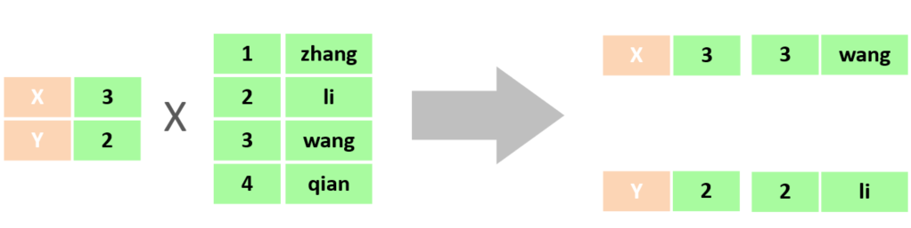
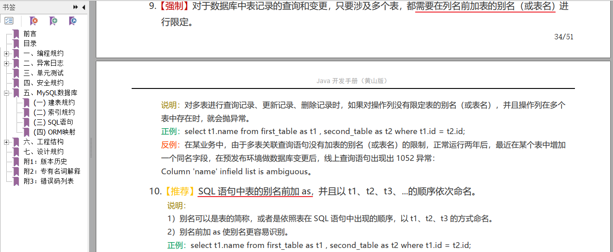
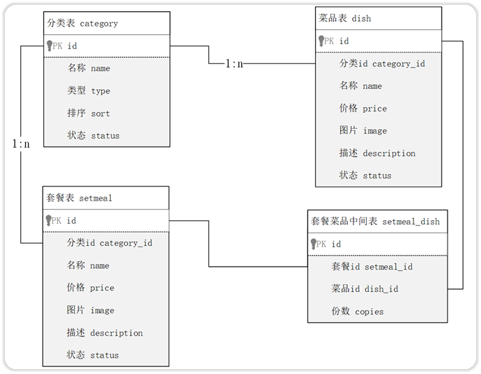
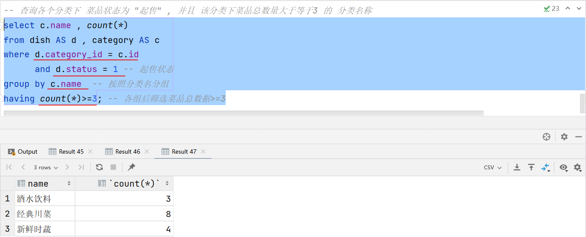

# 数据库开发-MySQL


# 1. 多表查询

## 1.1 概述

### 1.1.1 数据准备

SQL脚本：

~~~mysql
#建议：创建新的数据库
create database db04;
use db04;

-- 部门表
create table tb_dept
(
    id          int unsigned primary key auto_increment comment '主键ID',
    name        varchar(10) not null unique comment '部门名称',
    create_time datetime    not null comment '创建时间',
    update_time datetime    not null comment '修改时间'
) comment '部门表';
-- 部门表测试
insert into tb_dept (id, name, create_time, update_time)
values (1, '学工部', now(), now()),
       (2, '教研部', now(), now()),
       (3, '咨询部', now(), now()),
       (4, '就业部', now(), now()),
       (5, '人事部', now(), now());

-- 员工表
create table tb_emp
(
    id          int unsigned primary key auto_increment comment 'ID',
    username    varchar(20)      not null unique comment '用户名',
    password    varchar(32) default '123456' comment '密码',
    name        varchar(10)      not null comment '姓名',
    gender      tinyint unsigned not null comment '性别, 说明: 1 男, 2 女',
    image       varchar(300) comment '图像',
    job         tinyint unsigned comment '职位, 说明: 1 班主任,2 讲师, 3 学工主管, 4 教研主管, 5 咨询师',
    entrydate   date comment '入职时间',
    dept_id     int unsigned comment '部门ID',
    create_time datetime         not null comment '创建时间',
    update_time datetime         not null comment '修改时间'
) comment '员工表';
-- 员工表测试数据
INSERT INTO tb_emp(id, username, password, name, gender, image, job, entrydate,dept_id, create_time, update_time) 
VALUES 
(1,'jinyong','123456','金庸',1,'1.jpg',4,'2000-01-01',2,now(),now()),
(2,'zhangwuji','123456','张无忌',1,'2.jpg',2,'2015-01-01',2,now(),now()),
(3,'yangxiao','123456','杨逍',1,'3.jpg',2,'2008-05-01',2,now(),now()),
(4,'weiyixiao','123456','韦一笑',1,'4.jpg',2,'2007-01-01',2,now(),now()),
(5,'changyuchun','123456','常遇春',1,'5.jpg',2,'2012-12-05',2,now(),now()),
(6,'xiaozhao','123456','小昭',2,'6.jpg',3,'2013-09-05',1,now(),now()),
(7,'jixiaofu','123456','纪晓芙',2,'7.jpg',1,'2005-08-01',1,now(),now()),
(8,'zhouzhiruo','123456','周芷若',2,'8.jpg',1,'2014-11-09',1,now(),now()),
(9,'dingminjun','123456','丁敏君',2,'9.jpg',1,'2011-03-11',1,now(),now()),
(10,'zhaomin','123456','赵敏',2,'10.jpg',1,'2013-09-05',1,now(),now()),
(11,'luzhangke','123456','鹿杖客',1,'11.jpg',5,'2007-02-01',3,now(),now()),
(12,'hebiweng','123456','鹤笔翁',1,'12.jpg',5,'2008-08-18',3,now(),now()),
(13,'fangdongbai','123456','方东白',1,'13.jpg',5,'2012-11-01',3,now(),now()),
(14,'zhangsanfeng','123456','张三丰',1,'14.jpg',2,'2002-08-01',2,now(),now()),
(15,'yulianzhou','123456','俞莲舟',1,'15.jpg',2,'2011-05-01',2,now(),now()),
(16,'songyuanqiao','123456','宋远桥',1,'16.jpg',2,'2007-01-01',2,now(),now()),
(17,'chenyouliang','123456','陈友谅',1,'17.jpg',NULL,'2015-03-21',NULL,now(),now());
~~~


### 1.1.2 介绍

多表查询：查询时从多张表中获取所需数据

> 单表查询的SQL语句：select  字段列表  from  表名;
>
> 那么要执行多表查询，只需要使用逗号分隔多张表即可，如： select   字段列表  from  表1, 表2;

查询用户表和部门表中的数据：

~~~mysql
select * from  tb_emp , tb_dept;
~~~

  

此时,我们看到查询结果中包含了大量的结果集，总共85条记录，而这其实就是员工表所有的记录(17行)与部门表所有记录(5行)的所有组合情况，这种现象称之为笛卡尔积。

笛卡尔积：笛卡尔乘积是指在数学中，两个集合(A集合和B集合)的所有组合情况。


> 在多表查询时，需要消除无效的笛卡尔积，只保留表关联部分的数据



在SQL语句中，如何去除无效的笛卡尔积呢？只需要给多表查询加上连接查询的条件即可。

~~~mysql
select * from tb_emp , tb_dept where tb_emp.dept_id = tb_dept.id ;
~~~


> 由于id为17的员工，没有dept_id字段值，所以在多表查询时，根据连接查询的条件并没有查询到。


### 1.1.3 分类

多表查询可以分为：

1. 连接查询

   - 内连接：相当于查询A、B交集部分数据

    

2. 外连接

   - 左外连接：查询左表所有数据(包括两张表交集部分数据)

   - 右外连接：查询右表所有数据(包括两张表交集部分数据)

3. 子查询


## 1.2 内连接

内连接查询：查询两表或多表中交集部分数据。

内连接从语法上可以分为：

- 隐式内连接

- 显式内连接

隐式内连接语法：

``` mysql
select  字段列表   from   表1 , 表2   where  条件 ... ;
```

显式内连接语法：

``` mysql
select  字段列表   from   表1  [ inner ]  join 表2  on  连接条件 ... ;
```


案例：查询员工的姓名及所属的部门名称

- 隐式内连接实现

~~~mysql
select tb_emp.name , tb_dept.name -- 分别查询两张表中的数据
from tb_emp , tb_dept -- 关联两张表
where tb_emp.dept_id = tb_dept.id; -- 消除笛卡尔积
~~~

- 显式内连接实现

~~~mysql
select tb_emp.name , tb_dept.name
from tb_emp inner join tb_dept
on tb_emp.dept_id = tb_dept.id;
~~~


多表查询时给表起别名：

- tableA  as  别名1  ,  tableB  as  别名2 ;

- tableA  别名1  ,  tableB  别名2 ;



使用了别名的多表查询：

~~~mysql
select emp.name , dept.name
from tb_emp emp inner join tb_dept dept
on emp.dept_id = dept.id;
~~~

> 注意事项:
>
> 一旦为表起了别名，就不能再使用表名来指定对应的字段了，此时只能够使用别名来指定字段。


## 1.3 外连接

外连接分为两种：左外连接 和 右外连接。

左外连接语法结构：

```mysql
select  字段列表   from   表1  left  [ outer ]  join 表2  on  连接条件 ... ;
```

> 左外连接相当于查询表1(左表)的所有数据，当然也包含表1和表2交集部分的数据。

右外连接语法结构：

```mysql
select  字段列表   from   表1  right  [ outer ]  join 表2  on  连接条件 ... ;
```

> 右外连接相当于查询表2(右表)的所有数据，当然也包含表1和表2交集部分的数据。


案例：查询员工表中所有员工的姓名, 和对应的部门名称

~~~mysql
-- 左外连接：以left join关键字左边的表为主表，查询主表中所有数据，以及和主表匹配的右边表中的数据
select emp.name , dept.name
from tb_emp AS emp left join tb_dept AS dept 
     on emp.dept_id = dept.id;
~~~


案例：查询部门表中所有部门的名称, 和对应的员工名称 

~~~mysql
-- 右外连接
select dept.name , emp.name
from tb_emp AS emp right join  tb_dept AS dept
     on emp.dept_id = dept.id;
~~~


> 注意事项：
>
> 左外连接和右外连接是可以相互替换的，只需要调整连接查询时SQL语句中表的先后顺序就可以了。而我们在日常开发使用时，更偏向于左外连接。


## 1.4 子查询

### 1.4.1 介绍

SQL语句中嵌套select语句，称为嵌套查询，又称子查询。

```sql
SELECT  *  FROM   t1   WHERE  column1 =  ( SELECT  column1  FROM  t2 ... );
```

> 子查询外部的语句可以是insert / update / delete / select 的任何一个，最常见的是 select。


根据子查询结果的不同分为：

1. 标量子查询（子查询结果为单个值[一行一列]）

2. 列子查询（子查询结果为一列，但可以是多行）

3. 行子查询（子查询结果为一行，但可以是多列）

4. 表子查询（子查询结果为多行多列[相当于子查询结果是一张表]）

子查询可以书写的位置：

1. where之后
2. from之后
3. select之后


### 1.4.2 标量子查询

子查询返回的结果是单个值(数字、字符串、日期等)，最简单的形式，这种子查询称为标量子查询。

常用的操作符： =   <>   >    >=    <   <=   


案例1：查询"教研部"的所有员工信息

> 可以将需求分解为两步：
>
> 1. 查询 "教研部" 部门ID
> 2. 根据 "教研部" 部门ID，查询员工信息

```mysql
-- 1.查询"教研部"部门ID
select id from tb_dept where name = '教研部';    #查询结果：2
-- 2.根据"教研部"部门ID, 查询员工信息
select * from tb_emp where dept_id = 2;

-- 合并出上两条SQL语句
select * from tb_emp where dept_id = (select id from tb_dept where name = '教研部');
```


案例2：查询在 "方东白" 入职之后的员工信息

> 可以将需求分解为两步：
>
> 1. 查询 方东白 的入职日期
> 2. 查询 指定入职日期之后入职的员工信息

```mysql
-- 1.查询"方东白"的入职日期
select entrydate from tb_emp where name = '方东白';     #查询结果：2012-11-01
-- 2.查询指定入职日期之后入职的员工信息
select * from tb_emp where entrydate > '2012-11-01';

-- 合并以上两条SQL语句
select * from tb_emp where entrydate > (select entrydate from tb_emp where name = '方东白');
```


### 1.4.3 列子查询

子查询返回的结果是一列(可以是多行)，这种子查询称为列子查询。

常用的操作符：

| **操作符** | **描述**                     |
| ---------- | ---------------------------- |
| IN         | 在指定的集合范围之内，多选一 |
| NOT IN     | 不在指定的集合范围之内       |

案例：查询"教研部"和"咨询部"的所有员工信息

> 分解为以下两步：
>
> 1. 查询 "销售部" 和 "市场部" 的部门ID
> 2. 根据部门ID, 查询员工信息

```mysql
-- 1.查询"销售部"和"市场部"的部门ID
select id from tb_dept where name = '教研部' or name = '咨询部';    #查询结果：3,2
-- 2.根据部门ID, 查询员工信息
select * from tb_emp where dept_id in (3,2);

-- 合并以上两条SQL语句
select * from tb_emp where dept_id in (select id from tb_dept where name = '教研部' or name = '咨询部');
```


### 1.4.4 行子查询

子查询返回的结果是一行(可以是多列)，这种子查询称为行子查询。

常用的操作符：= 、<> 、IN 、NOT IN


案例：查询与"韦一笑"的入职日期及职位都相同的员工信息 

> 可以拆解为两步进行： 
>
> 1. 查询 "韦一笑" 的入职日期 及 职位
> 2. 查询与"韦一笑"的入职日期及职位相同的员工信息 

```mysql
-- 查询"韦一笑"的入职日期 及 职位
select entrydate , job from tb_emp where name = '韦一笑';  #查询结果： 2007-01-01 , 2
-- 查询与"韦一笑"的入职日期及职位相同的员工信息
select * from tb_emp where (entrydate,job) = ('2007-01-01',2);

-- 合并以上两条SQL语句
select * from tb_emp where (entrydate,job) = (select entrydate , job from tb_emp where name = '韦一笑');
```


### 1.4.5 表子查询

子查询返回的结果是多行多列，常作为临时表，这种子查询称为表子查询。


案例：查询入职日期是 "2006-01-01" 之后的员工信息 , 及其部门信息

> 分解为两步执行：
>
> 1. 查询入职日期是 "2006-01-01" 之后的员工信息
> 2. 基于查询到的员工信息，在查询对应的部门信息

~~~mysql
select * from emp where entrydate > '2006-01-01';

select e.*, d.* from (select * from emp where entrydate > '2006-01-01') e left join dept d on e.dept_id = d.id ;
~~~


## 1.5 案例

基于之前设计的多表案例的表结构，我们来完成今天的多表查询案例需求。

**准备环境**

将资料中准备好的多表查询的数据准备的SQL脚本导入数据库中。

 

- 分类表：category
- 菜品表：dish
- 套餐表：setmeal
- 套餐菜品关系表：setmeal_dish

 


**需求实现**

1. 查询价格低于 10元 的菜品的名称 、价格 及其 菜品的分类名称

~~~mysql
/*查询技巧：
     明确1：查询需要用到哪些字段
        菜品名称、菜品价格 、 菜品分类名
     明确2：查询的字段分别归属于哪张表
        菜品表：[菜品名称、菜品价格]
        分类表：[分类名]
     明确3：如查多表，建立表与表之间的关联
        菜品表.caategory_id = 分类表.id
     其他：（其他条件、其他要求）
        价格 < 10
*/
select d.name , d.price , c.name
from dish AS d , category AS c
where d.category_id = c.id
      and d.price < 10;
~~~


2. 查询所有价格在 10元(含)到50元(含)之间 且 状态为"起售"的菜品名称、价格及其分类名称 (即使菜品没有分类 , 也要将菜品查询出来)

~~~mysql
select d.name , d.price, c.name
from dish AS d left join category AS c on d.category_id = c.id
where d.price between 10 and 50
      and d.status = 1;
~~~


3. 查询每个分类下最贵的菜品, 展示出分类的名称、最贵的菜品的价格 

~~~mysql
select c.name , max(d.price)
from dish AS d , category AS c
where d.category_id = c.id
group by c.name;
~~~


4. 查询各个分类下 菜品状态为 "起售" , 并且 该分类下菜品总数量大于等于3 的 分类名称

~~~mysql
/*查询技巧：
     明确1：查询需要用到哪些字段
        分类名称、菜品总数量
     明确2：查询用到的字段分别归属于哪张表
        分类表：[分类名]
        菜品表：[菜品状态]
     明确3：如查多表，建立表与表之间的关联
        菜品表.caategory_id = 分类表.id
     其他：（其他条件、其他要求）
        条件：菜品状态 = 1 (1表示起售)
        分组：分类名
        分组后条件： 总数量 >= 3
*/
select c.name , count(*)
from dish AS d , category AS c
where d.category_id = c.id
      and d.status = 1 -- 起售状态
group by c.name  -- 按照分类名分组
having count(*)>=3; -- 各组后筛选菜品总数据>=3
~~~




5. 查询出 "商务套餐A" 中包含了哪些菜品 （展示出套餐名称、价格, 包含的菜品名称、价格、份数）

~~~mysql
select s.name, s.price, d.name, d.price, sd.copies
from setmeal AS s , setmeal_dish AS sd , dish AS d
where s.id = sd.setmeal_id and sd.dish_id = d.id
      and s.name='商务套餐A';
~~~


6. 查询出低于菜品平均价格的菜品信息 (展示出菜品名称、菜品价格)

~~~mysql
-- 1.计算菜品平均价格
select avg(price) from dish;    -- 查询结果：37.736842
-- 2.查询出低于菜品平均价格的菜品信息
select * from dish where price < 37.736842;

-- 合并以上两条SQL语句
select * from dish where price < (select avg(price) from dish);
~~~


# 2. 事务

场景：学工部整个部门解散了，该部门及部门下的员工都需要删除了。

- 操作：

  ```sql
  -- 删除学工部
  delete from dept where id = 1;  -- 删除成功
  
  -- 删除学工部的员工
  delete from emp where dept_id = 1; -- 删除失败（操作过程中出现错误：造成删除没有成功）
  ```

- 问题：如果删除部门成功了，而删除该部门的员工时失败了，此时就造成了数据的不一致。

​	要解决上述的问题，就需要通过数据库中的事务来解决。


## 2.1 介绍

在实际的业务开发中，有些业务操作要多次访问数据库。一个业务要发送多条SQL语句给数据库执行。需要将多次访问数据库的操作视为一个整体来执行，要么所有的SQL语句全部执行成功。如果其中有一条SQL语句失败，就进行事务的回滚，所有的SQL语句全部执行失败。

简而言之：事务是一组操作的集合，它是一个不可分割的工作单位。事务会把所有的操作作为一个整体一起向系统提交或撤销操作请求，即这些操作要么同时成功，要么同时失败。

事务作用：保证在一个事务中多次操作数据库表中数据时，要么全都成功,要么全都失败。


## 2.2 操作

MYSQL中有两种方式进行事务的操作：

1. 自动提交事务：即执行一条sql语句提交一次事务。（默认MySQL的事务是自动提交）
2. 手动提交事务：先开启，再提交 

事务操作有关的SQL语句：

| SQL语句                        | 描述             |
| ------------------------------ | ---------------- |
| start transaction;  /  begin ; | 开启手动控制事务 |
| commit;                        | 提交事务         |
| rollback;                      | 回滚事务         |

> 手动提交事务使用步骤：
>
> - 第1种情况：开启事务  =>  执行SQL语句   =>  成功  =>  提交事务
> - 第2种情况：开启事务  =>  执行SQL语句   =>  失败  =>  回滚事务


使用事务控制删除部门和删除该部门下的员工的操作：

```sql
-- 开启事务
start transaction ;

-- 删除学工部
delete from tb_dept where id = 1;

-- 删除学工部的员工
delete from tb_emp where dept_id = 1;
```

- 上述的这组SQL语句，如果如果执行成功，则提交事务

```sql
-- 提交事务 (成功时执行)
commit ;
```

- 上述的这组SQL语句，如果如果执行失败，则回滚事务

```sql
-- 回滚事务 (出错时执行)
rollback ;
```


## 2.3 四大特性

面试题：事务有哪些特性？

- 原子性（Atomicity）：事务是不可分割的最小单元，要么全部成功，要么全部失败。
- 一致性（Consistency）：事务完成时，必须使所有的数据都保持一致状态。
- 隔离性（Isolation）：数据库系统提供的隔离机制，保证事务在不受外部并发操作影响的独立环境下运行。
- 持久性（Durability）：事务一旦提交或回滚，它对数据库中的数据的改变就是永久的。

> 事务的四大特性简称为：ACID


- **原子性（Atomicity）** ：原子性是指事务包装的一组sql是一个不可分割的工作单元，事务中的操作要么全部成功，要么全部失败。

- **一致性（Consistency）**：一个事务完成之后数据都必须处于一致性状态。

​		如果事务成功的完成，那么数据库的所有变化将生效。

​		如果事务执行出现错误，那么数据库的所有变化将会被回滚(撤销)，返回到原始状态。

- **隔离性（Isolation）**：多个用户并发的访问数据库时，一个用户的事务不能被其他用户的事务干扰，多个并发的事务之间要相互隔离。

​		一个事务的成功或者失败对于其他的事务是没有影响。

- **持久性（Durability）**：一个事务一旦被提交或回滚，它对数据库的改变将是永久性的，哪怕数据库发生异常，重启之后数据亦然存在。


# 3. 索引

## 3.1 介绍 

索引(index)：是帮助数据库高效获取数据的数据结构 。

- 简单来讲，就是使用索引可以提高查询的效率。


测试没有使用索引的查询：


添加索引后查询：

~~~mysql
-- 添加索引
create index idx_sku_sn on tb_sku (sn);  #在添加索引时，也需要消耗时间

-- 查询数据（使用了索引）
select * from tb_sku where sn = '100000003145008';
~~~


优点：

1. 提高数据查询的效率，降低数据库的IO成本。
2. 通过索引列对数据进行排序，降低数据排序的成本，降低CPU消耗。

缺点：

1. 索引会占用存储空间。
2. 索引大大提高了查询效率，同时却也降低了insert、update、delete的效率。


## 3.2 结构

MySQL数据库支持的索引结构有很多，如：Hash索引、B+Tree索引、Full-Text索引等。

我们平常所说的索引，如果没有特别指明，都是指默认的 B+Tree 结构组织的索引。

在没有了解B+Tree结构前，我们先回顾下之前所学习的树结构：

> 二叉查找树：左边的子节点比父节点小，右边的子节点比父节点大

 

> 当我们向二叉查找树保存数据时，是按照从大到小(或从小到大)的顺序保存的，此时就会形成一个单向链表，搜索性能会打折扣。

 

> 可以选择平衡二叉树或者是红黑树来解决上述问题。（红黑树也是一棵平衡的二叉树）


> 但是在Mysql数据库中并没有使用二叉搜索数或二叉平衡数或红黑树来作为索引的结构。

思考：采用二叉搜索树或者是红黑树来作为索引的结构有什么问题？

<details>
    <summary>答案</summary>
    最大的问题就是在数据量大的情况下，树的层级比较深，会影响检索速度。因为不管是二叉搜索数还是红黑数，一个节点下面只能有两个子节点。此时在数据量大的情况下，就会造成数的高度比较高，树的高度一旦高了，检索速度就会降低。
</details>


> 说明：如果数据结构是红黑树，那么查询1000万条数据，根据计算树的高度大概是23左右，这样确实比之前的方式快了很多，但是如果高并发访问，那么一个用户有可能需要23次磁盘IO，那么100万用户，那么会造成效率极其低下。所以为了减少红黑树的高度，那么就得增加树的宽度，就是不再像红黑树一样每个节点只能保存一个数据，可以引入另外一种数据结构，一个节点可以保存多个数据，这样宽度就会增加从而降低树的高度。这种数据结构例如BTree就满足。

下面我们来看看B+Tree(多路平衡搜索树)结构中如何避免这个问题：


B+Tree结构：

- 每一个节点，可以存储多个key（有n个key，就有n个指针）
- 节点分为：叶子节点、非叶子节点
  - 叶子节点，就是最后一层子节点，所有的数据都存储在叶子节点上
  - 非叶子节点，不是树结构最下面的节点，用于索引数据，存储的的是：key+指针
- 为了提高范围查询效率，叶子节点形成了一个双向链表，便于数据的排序及区间范围查询


> **拓展：**
>
> 非叶子节点都是由key+指针域组成的，一个key占8字节，一个指针占6字节，而一个节点总共容量是16KB，那么可以计算出一个节点可以存储的元素个数：16*1024字节 / (8+6)=1170个元素。
>
> - 查看mysql索引节点大小：show global status like 'innodb_page_size';    -- 节点大小：16384
>
> 当根节点中可以存储1170个元素，那么根据每个元素的地址值又会找到下面的子节点，每个子节点也会存储1170个元素，那么第二层即第二次IO的时候就会找到数据大概是：1170*1170=135W。也就是说B+Tree数据结构中只需要经历两次磁盘IO就可以找到135W条数据。
>
> 对于第二层每个元素有指针，那么会找到第三层，第三层由key+数据组成，假设key+数据总大小是1KB，而每个节点一共能存储16KB，所以一个第三层一个节点大概可以存储16个元素(即16条记录)。那么结合第二层每个元素通过指针域找到第三层的节点，第二层一共是135W个元素，那么第三层总元素大小就是：135W*16结果就是2000W+的元素个数。
>
> 结合上述分析B+Tree有如下优点：
>
> - 千万条数据，B+Tree可以控制在小于等于3的高度
> - 所有的数据都存储在叶子节点上，并且底层已经实现了按照索引进行排序，还可以支持范围查询，叶子节点是一个双向链表，支持从小到大或者从大到小查找


## 3.3 语法

**创建索引**

~~~mysql
create  [ unique ]  index 索引名 on  表名 (字段名,... ) ;
~~~

案例：为tb_emp表的name字段建立一个索引

~~~mysql
create index idx_emp_name on tb_emp(name);
~~~


> 在创建表时，如果添加了主键和唯一约束，就会默认创建：主键索引、唯一约束
>
> 


**查看索引**

~~~mysql
show  index  from  表名;
~~~

案例：查询 tb_emp 表的索引信息

~~~mysql
show  index  from  tb_emp;
~~~


**删除索引**

~~~mysql
drop  index  索引名  on  表名;
~~~

案例：删除 tb_emp 表中name字段的索引

~~~mysql
drop index idx_emp_name on tb_emp;
~~~


> 注意事项：
>
> - 主键字段，在建表时，会自动创建主键索引
>
> - 添加唯一约束时，数据库实际上会添加唯一索引


