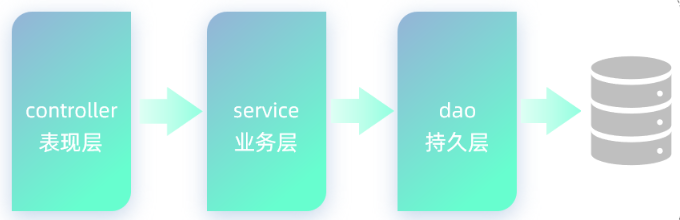
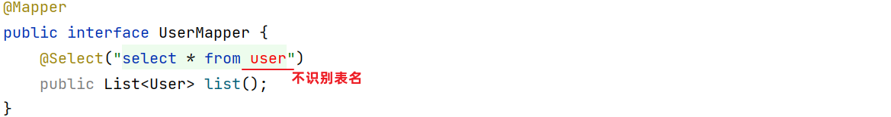

# Mybatis入门


## 前言

在前面我们学习MySQL数据库时，都是利用图形化客户端工具(如：idea、datagrip)，来操作数据库的。

> 在客户端工具中，编写增删改查的SQL语句，发给MySQL数据库管理系统，由数据库管理系统执行SQL语句并返回执行结果。
>
> 增删改操作：返回受影响行数
>
> 查询操作：返回结果集(查询的结果)

我们做为后端程序开发人员，通常会使用Java程序来完成对数据库的操作。Java程序操作数据库，现在主流的方式是：Mybatis。

什么是MyBatis?

- MyBatis是一款优秀的 **持久层** **框架**，用于简化JDBC的开发。

- MyBatis本是 Apache的一个开源项目iBatis，2010年这个项目由apache迁移到了google code，并且改名为MyBatis 。2013年11月迁移到Github。

- 官网：https://mybatis.org/mybatis-3/zh/index.html 

在上面我们提到了两个词：一个是持久层，另一个是框架。

- 持久层：指的是就是数据访问层(dao)，是用来操作数据库的。

 

- 框架：是一个半成品软件，是一套可重用的、通用的、软件基础代码模型。在框架的基础上进行软件开发更加高效、规范、通用、可拓展。


Mybatis课程安排：

- Mybatis入门

- Mybatis基础增删改查

- Mybatis动态SQL

接下来，我们就通过一个入门程序，让大家快速感受一下通过Mybatis如何来操作数据库。


## 1. 快速入门

需求：使用Mybatis查询所有用户数据。


### 1.1 入门程序分析

以前我们是在图形化客户端工具中编写SQL查询代码，发送给数据库执行，数据库执行后返回操作结果。

 


图形化工具会把数据库执行的查询结果，使用表格的形式展现出来

 


现在使用Mybatis操作数据库，就是在Mybatis中编写SQL查询代码，发送给数据库执行，数据库执行后返回结果。


 Mybatis会把数据库执行的查询结果，使用实体类封装起来（一行记录对应一个实体类对象）


Mybatis操作数据库的步骤：

1. 准备工作(创建springboot工程、数据库表user、实体类User)

2. 引入Mybatis的相关依赖，配置Mybatis(数据库连接信息)

3. 编写SQL语句(注解/XML)


### 1.2 入门程序实现

#### 1.2.1 准备工作

##### 1.2.1.1 创建springboot工程

创建springboot工程，并导入 mybatis的起步依赖、mysql的驱动包。


> 项目工程创建完成后，自动在pom.xml文件中，导入Mybatis依赖和MySQL驱动依赖

~~~xml
<!-- 仅供参考：只粘贴了pom.xml中部分内容 -->
<dependencies>
        <!-- mybatis起步依赖 -->
        <dependency>
            <groupId>org.mybatis.spring.boot</groupId>
            <artifactId>mybatis-spring-boot-starter</artifactId>
            <version>2.3.0</version>
        </dependency>

        <!-- mysql驱动包依赖 -->
        <dependency>
            <groupId>com.mysql</groupId>
            <artifactId>mysql-connector-j</artifactId>
            <scope>runtime</scope>
        </dependency>
        
        <!-- spring单元测试 (集成了junit) -->
        <dependency>
            <groupId>org.springframework.boot</groupId>
            <artifactId>spring-boot-starter-test</artifactId>
            <scope>test</scope>
        </dependency>
</dependencies>
~~~


##### 1.2.1.2 数据准备

创建用户表user，并创建对应的实体类User。

- 用户表：

```sql
-- 用户表
create table user(
    id int unsigned primary key auto_increment comment 'ID',
    name varchar(100) comment '姓名',
    age tinyint unsigned comment '年龄',
    gender tinyint unsigned comment '性别, 1:男, 2:女',
    phone varchar(11) comment '手机号'
) comment '用户表';

-- 测试数据
insert into user(id, name, age, gender, phone) VALUES (null,'白眉鹰王',55,'1','18800000000');
insert into user(id, name, age, gender, phone) VALUES (null,'金毛狮王',45,'1','18800000001');
insert into user(id, name, age, gender, phone) VALUES (null,'青翼蝠王',38,'1','18800000002');
insert into user(id, name, age, gender, phone) VALUES (null,'紫衫龙王',42,'2','18800000003');
insert into user(id, name, age, gender, phone) VALUES (null,'光明左使',37,'1','18800000004');
insert into user(id, name, age, gender, phone) VALUES (null,'光明右使',48,'1','18800000005');
```

 

- 实体类

  - 实体类的属性名与表中的字段名一一对应。

```java
public class User {
    private Integer id;   //id（主键）
    private String name;  //姓名
    private Short age;    //年龄
    private Short gender; //性别
    private String phone; //手机号
    
    //省略GET, SET方法
}
```


#### 1.2.2 配置Mybatis

> 在之前使用图形化客户端工具，连接MySQL数据库时，需要配置：
>
> 
>
> 连接数据库的四大参数：
>
> - MySQL驱动类 
> - 登录名
> - 密码
> - 数据库连接字符串

基于上述分析，在Mybatis中要连接数据库，同样也需要以上4个参数配置。

在springboot项目中，可以编写application.properties文件，配置数据库连接信息。我们要连接数据库，就需要配置数据库连接的基本信息，包括：driver-class-name、url 、username，password。

> 在入门程序中，大家可以直接这么配置，后面会介绍什么是驱动。


application.properties:

```properties
#驱动类名称
spring.datasource.driver-class-name=com.mysql.cj.jdbc.Driver
#数据库连接的url
spring.datasource.url=jdbc:mysql://localhost:3306/mybatis
#连接数据库的用户名
spring.datasource.username=root
#连接数据库的密码
spring.datasource.password=1234
```

> 上述的配置，可以直接复制过去，不要敲错了。 全部都是 spring.datasource.xxxx 开头。


#### 1.2.3 编写SQL语句

在创建出来的springboot工程中，在引导类所在包下，在创建一个包 mapper。在mapper包下创建一个接口 UserMapper ，这是一个持久层接口（Mybatis的持久层接口规范一般都叫 XxxMapper）。


UserMapper：

~~~java
import com.itheima.pojo.User;
import org.apache.ibatis.annotations.Mapper;
import org.apache.ibatis.annotations.Select;
import java.util.List;

@Mapper
public interface UserMapper {
    
    //查询所有用户数据
    @Select("select id, name, age, gender, phone from user")
    public List<User> list();
    
}
~~~

> @Mapper注解：表示是mybatis中的Mapper接口
>
> - 程序运行时：框架会自动生成接口的实现类对象(代理对象)，并给交Spring的IOC容器管理
>
>  @Select注解：代表的就是select查询，用于书写select查询语句


#### 1.2.4 单元测试

在创建出来的SpringBoot工程中，在src下的test目录下，已经自动帮我们创建好了测试类 ，并且在测试类上已经添加了注解 @SpringBootTest，代表该测试类已经与SpringBoot整合。 

该测试类在运行时，会自动通过引导类加载Spring的环境（IOC容器）。我们要测试那个bean对象，就可以直接通过@Autowired注解直接将其注入进行，然后就可以测试了。 

测试类代码如下： 

```java
@SpringBootTest
public class MybatisQuickstartApplicationTests {
	
    @Autowired
    private UserMapper userMapper;
	
    @Test
    public void testList(){
        List<User> userList = userMapper.list();
        for (User user : userList) {
            System.out.println(user);
        }
    }

}
```

> 运行结果：
>
> ~~~
> User{id=1, name='白眉鹰王', age=55, gender=1, phone='18800000000'}
> User{id=2, name='金毛狮王', age=45, gender=1, phone='18800000001'}
> User{id=3, name='青翼蝠王', age=38, gender=1, phone='18800000002'}
> User{id=4, name='紫衫龙王', age=42, gender=2, phone='18800000003'}
> User{id=5, name='光明左使', age=37, gender=1, phone='18800000004'}
> User{id=6, name='光明右使', age=48, gender=1, phone='18800000005'}
> ~~~


### 1.3 解决SQL警告与提示

默认我们在UserMapper接口上加的@Select注解中编写SQL语句是没有提示的。 如果想让idea给我们提示对应的SQL语句，我们需要在IDEA中配置与MySQL数据库的链接。 

默认我们在UserMapper接口上的@Select注解中编写SQL语句是没有提示的。如果想让idea给出提示，可以做如下配置：


配置完成之后，发现SQL语句中的关键字有提示了，但还存在不识别表名(列名)的情况：



> 产生原因：Idea和数据库没有建立连接，不识别表信息
>
> 解决方案：在Idea中配置MySQL数据库连接

 

> 在配置的时候指定连接那个数据库，如上图所示连接的就是mybatis数据库。


## 2. JDBC介绍(了解)

### 2.1 介绍

通过Mybatis的快速入门，我们明白了，通过Mybatis可以很方便的进行数据库的访问操作。但是大家要明白，其实java语言操作数据库呢，只能通过一种方式：使用sun公司提供的 JDBC 规范。

> Mybatis框架，就是对原始的JDBC程序的封装。 

那到底什么是JDBC呢，接下来，我们就来介绍一下。

JDBC： ( Java DataBase Connectivity )，就是使用Java语言操作关系型数据库的一套API。

 


> 本质：
>
> - sun公司官方定义的一套操作所有关系型数据库的规范，即接口。
>
> - 各个数据库厂商去实现这套接口，提供数据库驱动jar包。
>
> - 我们可以使用这套接口(JDBC)编程，真正执行的代码是驱动jar包中的实现类。


### 2.2 代码

下面我们看看原始的JDBC程序是如何操作数据库的。操作步骤如下：

1. 注册驱动
2. 获取连接对象
3. 执行SQL语句，返回执行结果
4. 处理执行结果
5. 释放资源

> 在pom.xml文件中已引入MySQL驱动依赖，我们直接编写JDBC代码即可

JDBC具体代码实现：

```java
import com.itheima.pojo.User;
import org.junit.jupiter.api.Test;
import java.sql.Connection;
import java.sql.DriverManager;
import java.sql.ResultSet;
import java.sql.Statement;
import java.util.ArrayList;
import java.util.List;

public class JdbcTest {
    @Test
    public void testJdbc() throws Exception {
        //1. 注册驱动
        Class.forName("com.mysql.cj.jdbc.Driver");

        //2. 获取数据库连接
        String url="jdbc:mysql://127.0.0.1:3306/mybatis";
        String username = "root";
        String password = "1234";
        Connection connection = DriverManager.getConnection(url, username, password);

        //3. 执行SQL
        Statement statement = connection.createStatement(); //操作SQL的对象
        String sql="select id,name,age,gender,phone from user";
        ResultSet rs = statement.executeQuery(sql);//SQL查询结果会封装在ResultSet对象中

        List<User> userList = new ArrayList<>();//集合对象（用于存储User对象）
        //4. 处理SQL执行结果
        while (rs.next()){
            //取出一行记录中id、name、age、gender、phone下的数据
            int id = rs.getInt("id");
            String name = rs.getString("name");
            short age = rs.getShort("age");
            short gender = rs.getShort("gender");
            String phone = rs.getString("phone");
            //把一行记录中的数据，封装到User对象中
            User user = new User(id,name,age,gender,phone);
            userList.add(user);//User对象添加到集合
        }
        //5. 释放资源
        statement.close();
        connection.close();
        rs.close();

        //遍历集合
        for (User user : userList) {
            System.out.println(user);
        }
    }
}
```

> DriverManager(类)：数据库驱动管理类。
>
> - 作用：
>
>   1. 注册驱动
>
>   2. 创建java代码和数据库之间的连接，即获取Connection对象
>
> Connection(接口)：建立数据库连接的对象
>
> - 作用：用于建立java程序和数据库之间的连接
>
> Statement(接口)： 数据库操作对象(执行SQL语句的对象)。
>
> - 作用：用于向数据库发送sql语句
>
> ResultSet(接口)：结果集对象（一张虚拟表）
>
> - 作用：sql查询语句的执行结果会封装在ResultSet中

通过上述代码，我们看到直接基于JDBC程序来操作数据库，代码实现非常繁琐，所以在项目开发中，我们很少使用。  在项目开发中，通常会使用Mybatis这类的高级技术来操作数据库，从而简化数据库操作、提高开发效率。


### 2.3 问题分析

原始的JDBC程序，存在以下几点问题：

1. 数据库链接的四要素(驱动、链接、用户名、密码)全部硬编码在java代码中
2. 查询结果的解析及封装非常繁琐
3. 每一次查询数据库都需要获取连接,操作完毕后释放连接, 资源浪费, 性能降低


### 2.4 技术对比

分析了JDBC的缺点之后，我们再来看一下在mybatis中，是如何解决这些问题的：

1. 数据库连接四要素(驱动、链接、用户名、密码)，都配置在springboot默认的配置文件 application.properties中

2. 查询结果的解析及封装，由mybatis自动完成映射封装，我们无需关注

3. 在mybatis中使用了数据库连接池技术，从而避免了频繁的创建连接、销毁连接而带来的资源浪费。


> 使用SpringBoot+Mybatis的方式操作数据库，能够提升开发效率、降低资源浪费

而对于Mybatis来说，我们在开发持久层程序操作数据库时，需要重点关注以下两个方面：

1. application.properties

   ~~~properties
   #驱动类名称
   spring.datasource.driver-class-name=com.mysql.cj.jdbc.Driver
   #数据库连接的url
   spring.datasource.url=jdbc:mysql://localhost:3306/mybatis
   #连接数据库的用户名
   spring.datasource.username=root
   #连接数据库的密码
   spring.datasource.password=1234
   ~~~

2. Mapper接口（编写SQL语句）

   ~~~java
   @Mapper
   public interface UserMapper {
       @Select("select id, name, age, gender, phone from user")
       public List<User> list();
   }
   ~~~

   

 


## 3. 数据库连接池

在前面我们所讲解的mybatis中，使用了数据库连接池技术，避免频繁的创建连接、销毁连接而带来的资源浪费。

下面我们就具体的了解下数据库连接池。

### 3.1 介绍


> 没有使用数据库连接池：
>
> - 客户端执行SQL语句：要先创建一个新的连接对象，然后执行SQL语句，SQL语句执行后又需要关闭连接对象从而释放资源，每次执行SQL时都需要创建连接、销毁链接，这种频繁的重复创建销毁的过程是比较耗费计算机的性能。


数据库连接池是个容器，负责分配、管理数据库连接(Connection)

- 程序在启动时，会在数据库连接池(容器)中，创建一定数量的Connection对象

允许应用程序重复使用一个现有的数据库连接，而不是再重新建立一个

- 客户端在执行SQL时，先从连接池中获取一个Connection对象，然后在执行SQL语句，SQL语句执行完之后，释放Connection时就会把Connection对象归还给连接池（Connection对象可以复用）

释放空闲时间超过最大空闲时间的连接，来避免因为没有释放连接而引起的数据库连接遗漏

- 客户端获取到Connection对象了，但是Connection对象并没有去访问数据库(处于空闲)，数据库连接池发现Connection对象的空闲时间 > 连接池中预设的最大空闲时间，此时数据库连接池就会自动释放掉这个连接对象

数据库连接池的好处：

1. 资源重用
2. 提升系统响应速度
3. 避免数据库连接遗漏


### 3.2 产品

要怎么样实现数据库连接池呢？

- 官方(sun)提供了数据库连接池标准（javax.sql.DataSource接口）

  - 功能：获取连接 

    ~~~java
    public Connection getConnection() throws SQLException;
    ~~~

  - 第三方组织必须按照DataSource接口实现

常见的数据库连接池：

* C3P0
* DBCP
* Druid
* Hikari (springboot默认)

现在使用更多的是：Hikari、Druid  （性能更优越）

- Hikari（追光者） [默认的连接池] 

 

* Druid（德鲁伊）

  * Druid连接池是阿里巴巴开源的数据库连接池项目 

  * 功能强大，性能优秀，是Java语言最好的数据库连接池之一

​		

如果我们想把默认的数据库连接池切换为Druid数据库连接池，只需要完成以下两步操作即可：

> 参考官方地址：https://github.com/alibaba/druid/tree/master/druid-spring-boot-starter

1. 在pom.xml文件中引入依赖

```xml
<dependency>
    <!-- Druid连接池依赖 -->
    <groupId>com.alibaba</groupId>
    <artifactId>druid-spring-boot-starter</artifactId>
    <version>1.2.8</version>
</dependency>
```

2. 在application.properties中引入数据库连接配置

方式1：

~~~properties
spring.datasource.druid.driver-class-name=com.mysql.cj.jdbc.Driver
spring.datasource.druid.url=jdbc:mysql://localhost:3306/mybatis
spring.datasource.druid.username=root
spring.datasource.druid.password=1234
~~~

方式2：

~~~properties
spring.datasource.driver-class-name=com.mysql.cj.jdbc.Driver
spring.datasource.url=jdbc:mysql://localhost:3306/mybatis
spring.datasource.username=root
spring.datasource.password=1234
~~~


## 4. lombok

### 4.1 介绍

Lombok是一个实用的Java类库，可以通过简单的注解来简化和消除一些必须有但显得很臃肿的Java代码。


> 通过注解的形式自动生成构造器、getter/setter、equals、hashcode、toString等方法，并可以自动化生成日志变量，简化java开发、提高效率。

| **注解**            | **作用**                                                     |
| ------------------- | ------------------------------------------------------------ |
| @Getter/@Setter     | 为所有的属性提供get/set方法                                  |
| @ToString           | 会给类自动生成易阅读的  toString 方法                        |
| @EqualsAndHashCode  | 根据类所拥有的非静态字段自动重写 equals 方法和  hashCode 方法 |
| @Data               | 提供了更综合的生成代码功能（@Getter  + @Setter + @ToString + @EqualsAndHashCode） |
| @NoArgsConstructor  | 为实体类生成无参的构造器方法                                 |
| @AllArgsConstructor | 为实体类生成除了static修饰的字段之外带有各参数的构造器方法。 |


### 4.2 使用

第1步：在pom.xml文件中引入依赖

```xml
<!-- 在springboot的父工程中，已经集成了lombok并指定了版本号，故当前引入依赖时不需要指定version -->
<dependency>
    <groupId>org.projectlombok</groupId>
    <artifactId>lombok</artifactId>
</dependency>
```

第2步：在实体类上添加注解

```java
import lombok.Data;

@Data
public class User {
    private Integer id;
    private String name;
    private Short age;
    private Short gender;
    private String phone;
}
```

> 在实体类上添加了@Data注解，那么这个类在编译时期，就会生成getter/setter、equals、hashcode、toString等方法。
>
> 

说明：@Data注解中不包含全参构造方法，通常在实体类上，还会添加上：全参构造、无参构造

~~~java
import lombok.Data;

@Data //getter方法、setter方法、toString方法、hashCode方法、equals方法
@NoArgsConstructor //无参构造
@AllArgsConstructor//全参构造
public class User {
    private Integer id;
    private String name;
    private Short age;
    private Short gender;
    private String phone;
}
~~~


Lombok的注意事项：

- Lombok会在编译时，会自动生成对应的java代码
- 在使用lombok时，还需要安装一个lombok的插件（新版本的IDEA中自带）


