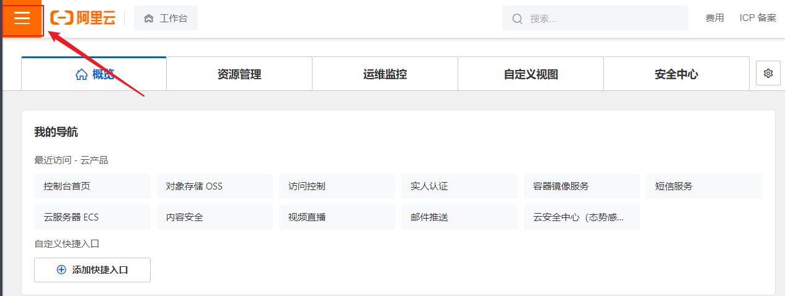

## 云存储解决方案-阿里云OSS 

### 1. 阿里云OSS简介 	

​	阿里云对象存储服务（Object Storage Service，简称OSS）为您提供基于网络的数据存取服务。使用OSS，您可以通过网络随时存储和调用包括文本、图片、音频和视频等在内的各种非结构化数据文件。
阿里云OSS将数据文件以对象（object）的形式上传到存储空间（bucket）中。

​	您可以进行以下操作：

- 创建一个或者多个存储空间，向每个存储空间中添加一个或多个文件。
- 通过获取已上传文件的地址进行文件的分享和下载。
- 通过修改存储空间或文件的属性或元信息来设置相应的访问权限。
- 在阿里云管理控制台执行基本和高级OSS任务。
- 使用阿里云开发工具包或直接在应用程序中进行RESTful API调用执行基本和高级OSS任务


### 2. OSS开通 

（1）打开https://www.aliyun.com/ ，申请阿里云账号并完成实名认证。

  


（2）充值 (可以不用做)


（3）开通OSS

登录阿里云官网。 点击右上角的控制台。

 

将鼠标移至产品，找到并单击对象存储OSS，打开OSS产品详情页面。在OSS产品详情页中的单击立即开通。

 

 

 


开通服务后，在OSS产品详情页面单击管理控制台直接进入OSS管理控制台界面。您也可以单击位于官网首页右上方菜单栏的控制台，进入阿里云管理控制台首页，然后单击左侧的对象存储OSS菜单进入[OSS管理控制台界面](https://oss.console.aliyun.com/overview)。


（4）创建存储空间

新建Bucket，命名为 hmleadnews ，读写权限为 **==公共读==**

  


### 3. OSS快速入门 

[参考文档官方](https://help.aliyun.com/document_detail/32009.html?spm=a2c4g.11186623.6.919.7c264562C2Fjfs)

（1）创建测试工程，引入依赖

```xml
<dependency>
    <groupId>com.aliyun.oss</groupId>
    <artifactId>aliyun-sdk-oss</artifactId>
    <version>3.15.1</version>
</dependency>
```


（2）新建类和main方法

```java
import org.junit.jupiter.api.Test;
import com.aliyun.oss.ClientException;
import com.aliyun.oss.OSS;
import com.aliyun.oss.OSSClientBuilder;
import com.aliyun.oss.OSSException;
import java.io.FileInputStream;
import java.io.InputStream;

public class AliOssTest {

    @Test
    public void testOss(){
        // Endpoint以华东1（杭州）为例，其它Region请按实际情况填写。
        String endpoint = "https://oss-cn-hangzhou.aliyuncs.com";
        // 阿里云账号AccessKey拥有所有API的访问权限，风险很高。强烈建议您创建并使用RAM用户进行API访问或日常运维，请登录RAM控制台创建RAM用户。
        String accessKeyId = "---------------------";
        String accessKeySecret = "-----------------------";
        // 填写Bucket名称，例如examplebucket。
        String bucketName = "-----------";
        // 填写Object完整路径，完整路径中不能包含Bucket名称，例如exampledir/exampleobject.txt。
        String objectName = "0001.jpg";
        // 填写本地文件的完整路径，例如D:\\localpath\\examplefile.txt。
        // 如果未指定本地路径，则默认从示例程序所属项目对应本地路径中上传文件流。
        String filePath= "C:\\Users\\Administrator\\Pictures\\Saved Pictures\\10.jpg";

        // 创建OSSClient实例。
        OSS ossClient = new OSSClientBuilder().build(endpoint, accessKeyId, accessKeySecret);

        try {
            InputStream inputStream = new FileInputStream(filePath);
            // 创建PutObject请求。
            ossClient.putObject(bucketName, objectName, inputStream);
        } catch (OSSException oe) {
            System.out.println("Caught an OSSException, which means your request made it to OSS, "
                    + "but was rejected with an error response for some reason.");
            System.out.println("Error Message:" + oe.getErrorMessage());
            System.out.println("Error Code:" + oe.getErrorCode());
            System.out.println("Request ID:" + oe.getRequestId());
            System.out.println("Host ID:" + oe.getHostId());
        } catch (Exception ce) {
            System.out.println("Caught an ClientException, which means the client encountered "
                    + "a serious internal problem while trying to communicate with OSS, "
                    + "such as not being able to access the network.");
            System.out.println("Error Message:" + ce.getMessage());
        } finally {
            if (ossClient != null) {
                ossClient.shutdown();
            }
        }
    }
}
```


### 4. 获取AccessKeyId

 


