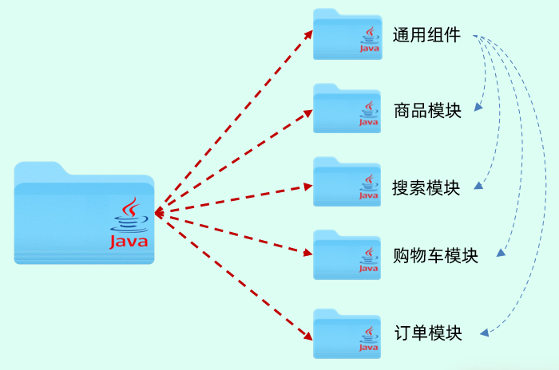
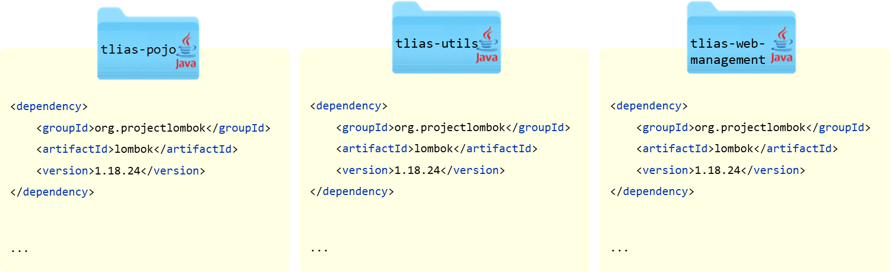
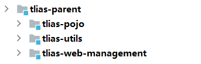
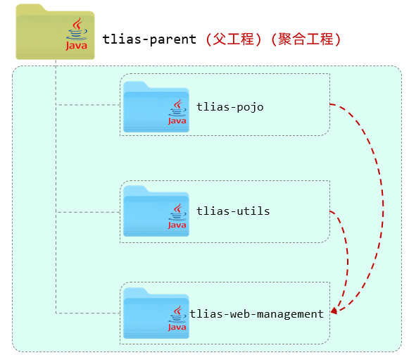

# Maven高级

Web开发讲解完毕之后，我们再来学习Maven高级。其实在前面的课程当中，我们已经学习了Maven。

我们讲到 **Maven 是一款构建和管理 Java 项目的工具**。经过前面 10 多天 web 开发的学习，相信大家对于 Maven 这款工具的基本使用应该没什么问题了。我们掌握了 Maven 工具的基本使用之后，其实对于一些简单的项目的构建及管理基本上就没什么问题了。

但是如果我们需要开发一些中大型的项目，此时仅凭我们前面所学习的 Maven 的基础知识就比较难以应对了。所以我们接下来还需要学习 Maven 提供的一些高级的功能，这些功能在构建和管理 Java 项目的时候用的也是非常多的。


Maven高级内容包括:

- 分模块设计与开发
- 继承与聚合
- 私服


## 1. 分模块设计与开发

### 1.1 介绍

所谓分模块设计，顾名思义指的就是我们在设计一个 Java 项目的时候，将一个 Java 项目拆分成多个模块进行开发。


**1). 未分模块设计的问题**

 

如果项目不分模块，也就意味着所有的业务代码是不是都写在这一个 Java 项目当中。随着这个项目的业务扩张，项目当中的业务功能可能会越来越多。

假如我们开发的是一个大型的电商项目，里面可能就包括了商品模块的功能、搜索模块的功能、购物车模块、订单模块、用户中心等等。这些所有的业务代码我们都在一个 Java 项目当中编写。

此时大家可以试想一下，假如我们开发的是一个大型的电商网站，这个项目组至少几十号甚至几百号开发人员，这些开发人员全部操作这一个 Java 项目。此时大家就会发现我们项目管理和维护起来将会非常的困难。而且大家再来看，假如在我们的项目当中，我们自己定义了一些通用的工具类以及通用的组件，而公司还有其他的项目组，其他项目组也想使用我们所封装的这些组件和工具类，其实是非常不方便的。因为 Java 项目当中包含了当前项目的所有业务代码，所以就造成了这里面所封装的一些组件会难以复用。


**总结起来，主要两点问题：不方便项目的维护和管理、项目中的通用组件难以复用。**


**2). 分模块设计**

分模块设计我们在进行项目设计阶段，就可以将一个大的项目拆分成若干个模块，每一个模块都是独立的。

 

比如我们可以将商品的相关功能放在商品模块当中，搜索的相关业务功能我都封装在搜索模块当中，还有像购物车模块、订单模块。而为了组件的复用，我们也可以将项目当中的实体类、工具类以及我们定义的通用的组件都单独的抽取到一个模块当中。

如果当前这个模块，比如订单模块需要用到这些实体类以及工具类或者这些通用组件，此时直接在订单模块当中引入工具类的坐标就可以了。这样我们就将一个项目拆分成了若干个模块儿，这就是分模块儿设计。


分模块儿设计之后，大家再来看。我们在进行项目管理的时候，我就可以几个人一组，几个人来负责订单模块儿，另外几个人来负责购物车模块儿，这样更加便于项目的管理以及项目的后期维护。

而且分模块设计之后，如果我们需要用到另外一个模块的功能，我们直接依赖模块就可以了。比如商品模块、搜索模块、购物车订单模块都需要依赖于通用组件当中封装的一些工具类，我只需要引入通用组件的坐标就可以了。


**分模块设计就是将项目按照功能/结构拆分成若干个子模块，方便项目的管理维护、拓展，也方便模块键的相互调用、资源共享。**


### 1.2 实践

#### 1.2.1 分析

好，我们明白了什么是分模块设计以及分模块设计的优势之后，接下来我们就来看一下我们之前所开发的案例工程。

我们可以看到在这个项目当中，除了我们所开发的部门管理以及员工管理、登录认证等相关业务功能以外，我们是不是也定义了一些实体类，也就是pojo包下存放的一些类，像分页结果的封装类PageBean、 统一响应结果Result，我们还定义了一些通用的工具类，像Jwts、阿里云OSS操作的工具类等等。

如果在当前公司的其他项目组当中，也想使用我们所封装的这些公共的组件，该怎么办？大家可以思考一下。

- 方案一：直接依赖我们当前项目 tlias-web-management ，但是存在两大缺点：

  - 这个项目当中包含所有的业务功能代码，而想共享的资源，仅仅是pojo下的实体类，以及 utils 下的工具类。如果全部都依赖进来，项目在启动时将会把所有的类都加载进来，会**影响性能**。
  - 如果直接把这个项目都依赖进来了，那也就意味着我们所有的业务代码都对外公开了，这个是非常**不安全**的。

- 方案二：分模块设计

  - 将pojo包下的实体类，抽取到一个maven模块中 tlias-pojo
  - 将utils包下的工具类，抽取到一个maven模块中 tlias-utils
  - 其他的业务代码，放在tlias-web-management这个模块中，在该模块中需要用到实体类pojo、工具类utils，直接引入对应的依赖即可。

   

​	

> ​	**注意：分模块开发需要先针对模块功能进行设计，再进行编码。不会先将工程开发完毕，然后进行拆分。**
>
> ​	PS：当前我们是为了演示分模块开发，所以是基于我们前面开发的案例项目进行拆分的，实际中都是分模块设计，然后再开发的。


#### 1.2.2 实现

思路我们分析完毕，接下来，我们就根据我们分析的思路，按照如下模块进行拆分：

**1. 创建maven模块 tlias-pojo，存放实体类**

A. 创建一个正常的Maven模块，模块名tlias-pojo

  


B. 然后在tlias-pojo中创建一个包 com.itheima.pojo (和原来案例项目中的pojo包名一致)

 


C. 将原来案例项目 tlias-web-management 中的pojo包下的实体类，复制到tlias-pojo模块中

 


D. 在 tlias-pojo 模块的pom.xml文件中引入依赖

```xml
<dependencies>
    <dependency>
        <groupId>org.projectlombok</groupId>
        <artifactId>lombok</artifactId>
        <version>1.18.24</version>
    </dependency>
</dependencies>
```


E. 删除原有案例项目tlias-web-management的pojo包【直接删除不要犹豫，我们已经将该模块拆分出去了】，然后在pom.xml中引入 tlias-pojo的依赖

```xml
<dependency>
    <groupId>com.itheima</groupId>
    <artifactId>tlias-pojo</artifactId>
    <version>1.0-SNAPSHOT</version>
</dependency>
```


**2. 创建Maven模块 tlias-utils，存放相关工具类**

A. 创建一个正常的Maven模块，模块名tlias-utils

   


B. 然后在 tlias-utils 中创建一个包 com.itheima.utils (和原来案例项目中的utils包名一致)

 


C. 将原来案例项目 tlias-web-management 中的utils包下的实体类，复制到tlias-utils模块中

 


D. 在 tlias-utils 模块的pom.xml文件中引入依赖

```xml
<dependencies>
    <!--JWT令牌-->
    <dependency>
        <groupId>io.jsonwebtoken</groupId>
        <artifactId>jjwt</artifactId>
        <version>0.9.1</version>
    </dependency>

    <!--阿里云OSS-->
    <dependency>
        <groupId>com.aliyun.oss</groupId>
        <artifactId>aliyun-sdk-oss</artifactId>
        <version>3.15.1</version>
    </dependency>
    <dependency>
        <groupId>javax.xml.bind</groupId>
        <artifactId>jaxb-api</artifactId>
        <version>2.3.1</version>
    </dependency>
    <dependency>
        <groupId>javax.activation</groupId>
        <artifactId>activation</artifactId>
        <version>1.1.1</version>
    </dependency>
    <!-- no more than 2.3.3-->
    <dependency>
        <groupId>org.glassfish.jaxb</groupId>
        <artifactId>jaxb-runtime</artifactId>
        <version>2.3.3</version>
    </dependency>

    <!--WEB开发-->
    <dependency>
        <groupId>org.springframework.boot</groupId>
        <artifactId>spring-boot-starter-web</artifactId>
        <version>2.7.5</version>
    </dependency>

    <dependency>
        <groupId>org.projectlombok</groupId>
        <artifactId>lombok</artifactId>
        <version>1.18.24</version>
    </dependency>
</dependencies>
```


E. 删除原有案例项目tlias-web-management的utils包【直接删除不要犹豫，我们已经将该模块拆分出去了】，然后在pom.xml中引入 tlias-utils的依赖

```xml
<dependency>
    <groupId>com.itheima</groupId>
    <artifactId>tlias-utils</artifactId>
    <version>1.0-SNAPSHOT</version>
</dependency>
```


**到此呢，就已经完成了模块的拆分，拆分出了 tlias-pojo、tlias-utils、tlias-web-management ，如果其他项目中需要用到 pojo，或者 utils工具类，就可以直接引入依赖。** 


### 1.3 总结

> 1). 什么是分模块设计：将项目按照功能拆分成若干个子模块

> 2). 为什么要分模块设计：方便项目的管理维护、扩展，也方便模块间的相互调用，资源共享

> 3). 注意事项：分模块设计需要先针对模块功能进行设计，再进行编码。不会先将工程开发完毕，然后进行拆分


## 2. 继承与聚合

在案例项目分模块开发之后啊，我们会看到tlias-pojo、tlias-utils、tlias-web-management中都引入了一个依赖 lombok 的依赖。我们在三个模块中分别配置了一次。

 

如果是做一个大型的项目，这三个模块当中重复的依赖可能会很多很多。如果每一个 Maven 模块里面，我们都来单独的配置一次，功能虽然能实现，但是配置是比较**繁琐**的。

而接下来我们要讲解的 Maven 的继承用来解决这问题的。


### 2.1 继承

我们可以再创建一个父工程 tlias-parent ，然后让上述的三个模块 tlias-pojo、tlias-utils、tlias-web-management 都来继承这个父工程 。 然后再将各个模块中都共有的依赖，都提取到父工程 tlias-parent中进行配置，只要子工程继承了父工程，依赖它也会继承下来，这样就无需在各个子工程中进行配置了。

 


- 概念：继承描述的是两个工程间的关系，与java中的继承相似，子工程可以继承父工程中的配置信息，常见于依赖关系的继承。

- 作用：简化依赖配置、统一管理依赖

- 实现：

  ```xml
  <parent>
      <groupId>...</groupId>
      <artifactId>...</artifactId>
      <version>...</version>
      <relativePath>....</relativePath>
  </parent>
  ```


这是我们在这里先介绍一下什么是继承以及继承的作用，以及在 maven 当中如何来实现这层继承关系。接下来我们就来创建这样一个 parent 父工程，我们就可以将各个子工程当中共有的这部分依赖统一的定义在父工程 parent 当中，从而来简化子工程的依赖配置。接下来我们来看一下具体的操作步骤。


我们在这里先介绍一下什么是继承以及继承的作用，以及在 maven 当中如何来实现这层继承关系。接下来我们就来创建这样一个 parent 父工程，我们就可以将各个子工程当中共有的这部分依赖，统一的定义在父工程 parent 当中，从而来简化子工程的依赖配置。


#### 2.1.1 继承关系

##### 2.1.1.1 思路分析

我们当前的项目 tlias-web-management，还稍微有一点特殊，因为是一个springboot项目，而所有的springboot项目都有一个统一的父工程，就是spring-boot-starter-parent。 与java语言类似，Maven不支持多继承，一个maven项目只能继承一个父工程，如果继承了spring-boot-starter-parent，就没法继承我们自己定义的父工程 tlias-parent了。

那我们怎么来解决这个问题呢？

那此时，大家可以想一下，Java虽然不支持多继承，但是可以支持多重继承，比如：A 继承 B， B 继承C。 那在Maven中也是支持多重继承的，所以呢，我们就可以让 我们自己创建的三个模块，都继承tlias-parent，而tlias-parent 再继承 spring-boot-starter-parent，就可以了。 具体结构如下：

 


##### 2.1.1.2 实现

1). 创建maven模块 tlias-parent ，该工程为父工程，设置打包方式pom(默认jar)。

​	  

工程结构如下：

 

父工程tlias-parent的pom.xml文件配置如下：

```xml
<parent>
    <groupId>org.springframework.boot</groupId>
    <artifactId>spring-boot-starter-parent</artifactId>
    <version>2.7.5</version>
    <relativePath/> <!-- lookup parent from repository -->
</parent>

<groupId>com.itheima</groupId>
<artifactId>tlias-parent</artifactId>
<version>1.0-SNAPSHOT</version>
<packaging>pom</packaging>
```


> Maven打包方式：
>
> - jar：普通模块打包，springboot项目基本都是jar包（内嵌tomcat运行）
> - war：普通web程序打包，需要部署在外部的tomcat服务器中运行
> - pom：父工程或聚合工程，该模块不写代码，仅进行依赖管理


2). 在子工程的pom.xml文件中，配置继承关系。

```xml
<parent>
    <groupId>com.itheima</groupId>
    <artifactId>tlias-parent</artifactId>
    <version>1.0-SNAPSHOT</version>
    <relativePath>../tlias-parent/pom.xml</relativePath>
</parent>

<artifactId>tlias-utils</artifactId>
<version>1.0-SNAPSHOT</version>
```

这里是以 tlias-utils 为例，指定了其父工程。其他的模块，都是相同的配置方式。


> 注意：
>
> - 在子工程中，配置了继承关系之后，坐标中的groupId是可以省略的，因为会自动继承父工程的 。
> - relativePath指定父工程的pom文件的相对位置（如果不指定，将从本地仓库/远程仓库查找该工程）。
>   -  ../ 代表的上一级目录


3). 在父工程中配置各个工程共有的依赖（子工程会自动继承父工程的依赖）。

```xml
<dependencies>
    <dependency>
        <groupId>org.projectlombok</groupId>
        <artifactId>lombok</artifactId>
        <version>1.18.24</version>
    </dependency>
</dependencies>
```

此时，我们已经将各个子工程中共有的依赖（lombok），都定义在了父工程中，子工程中的这一项依赖，就可以直接删除了。删除之后，我们会看到父工程中配置的依赖 lombok，子工程直接继承下来了。

 


> **工程结构说明：**
>
> - 我们当前的项目结构为：
>
>    
>
>   因为我们是项目开发完毕之后，给大家基于现有项目拆分的各个模块，tlias-web-management已经存在了，然后再创建各个模块与父工程，所以父工程与模块之间是平级的。
>
>   
>
> - 而实际项目中，可能还会见到下面的工程结构：
>
>    
>
>   而在真实的企业开发中，都是先设计好模块之后，再开始创建模块，开发项目。 那此时呢，一般都会先创建父工程 tlias-parent，然后将创建的各个子模块，都放在父工程parent下面。 这样层级结构会更加清晰一些。 
>
>   ​	
>
>   **PS：上面两种工程结构，都是可以正常使用的，没有一点问题。 只不过，第二种结构，看起来，父子工程结构更加清晰、更加直观。**


#### 2.1.2 版本锁定

##### 2.1.2.1 场景

如果项目中各个模块中都公共的这部分依赖，我们可以直接定义在父工程中，从而简化子工程的配置。 然而在项目开发中，还有一部分依赖，并不是各个模块都共有的，可能只是其中的一小部分模块中使用到了这个依赖。

比如：在tlias-web-management、tlias-web-system、tlias-web-report这三个子工程中，都使用到了jwt的依赖。 但是 tlias-pojo、tlias-utils中并不需要这个依赖，那此时，这个依赖，我们不会直接配置在父工程 tlias-parent中，而是哪个模块需要，就在哪个模块中配置。

而由于是一个项目中的多个模块，那多个模块中，我们要使用的同一个依赖的版本要一致，这样便于项目依赖的统一管理。比如：这个jwt依赖，我们都使用的是 0.9.1 这个版本。

 

那假如说，我们项目要升级，要使用到jwt最新版本 0.9.2 中的一个新功能，那此时需要将依赖的版本升级到0.9.2，那此时该怎么做呢 ？

第一步：去找当前项目中所有的模块的pom.xml配置文件，看哪些模块用到了jwt的依赖。

第二步：找到这个依赖之后，将其版本version，更换为 0.9.2。


**问题：如果项目拆分的模块比较多，每一次更换版本，我们都得找到这个项目中的每一个模块，一个一个的更改。 很容易就会出现，遗漏掉一个模块，忘记更换版本的情况。**


那我们又该如何来解决这个问题，如何来统一管理各个依赖的版本呢？ 

答案：Maven的版本锁定功能。


##### 2.1.2.2 介绍

在maven中，可以在父工程的pom文件中通过 `<dependencyManagement>` 来统一管理依赖版本。

父工程：

```xml
<!--统一管理依赖版本-->
<dependencyManagement>
    <dependencies>
        <!--JWT令牌-->
        <dependency>
            <groupId>io.jsonwebtoken</groupId>
            <artifactId>jjwt</artifactId>
            <version>0.9.1</version>
        </dependency>
    </dependencies>
</dependencyManagement>
```

子工程：

```xml
<dependencies>
    <!--JWT令牌-->
    <dependency>
        <groupId>io.jsonwebtoken</groupId>
        <artifactId>jjwt</artifactId>
    </dependency>
</dependencies>
```


> 注意：
>
> - 在父工程中所配置的 `<dependencyManagement>` 只能统一管理依赖版本，并不会将这个依赖直接引入进来。 这点和 `<dependencies>` 是不同的。
>
> - 子工程要使用这个依赖，还是需要引入的，只是此时就无需指定 `<version>` 版本号了，父工程统一管理。变更依赖版本，只需在父工程中统一变更。


##### 2.1.2.3 实现

接下来，我们就可以将tlias-utils模块中单独配置的依赖，将其版本统一交给 tlias-parent 进行统一管理。

具体步骤如下：

1). tlias-parent 中的配置

```xml
<!--统一管理依赖版本-->
<dependencyManagement>
    <dependencies>
        <!--JWT令牌-->
        <dependency>
            <groupId>io.jsonwebtoken</groupId>
            <artifactId>jjwt</artifactId>
            <version>0.9.1</version>
        </dependency>

        <!--阿里云OSS-->
        <dependency>
            <groupId>com.aliyun.oss</groupId>
            <artifactId>aliyun-sdk-oss</artifactId>
            <version>3.15.1</version>
        </dependency>
        <dependency>
            <groupId>javax.xml.bind</groupId>
            <artifactId>jaxb-api</artifactId>
            <version>2.3.1</version>
        </dependency>
        <dependency>
            <groupId>javax.activation</groupId>
            <artifactId>activation</artifactId>
            <version>1.1.1</version>
        </dependency>
        <!-- no more than 2.3.3-->
        <dependency>
            <groupId>org.glassfish.jaxb</groupId>
            <artifactId>jaxb-runtime</artifactId>
            <version>2.3.3</version>
        </dependency>
    </dependencies>
</dependencyManagement>
```


2). tlias-utils中的pom.xml配置

如果依赖的版本已经在父工程进行了统一管理，所以在子工程中就无需再配置依赖的版本了。

```xml
<dependencies>
    <!--JWT令牌-->
    <dependency>
        <groupId>io.jsonwebtoken</groupId>
        <artifactId>jjwt</artifactId>
    </dependency>

    <!--阿里云OSS-->
    <dependency>
        <groupId>com.aliyun.oss</groupId>
        <artifactId>aliyun-sdk-oss</artifactId>
    </dependency>
    <dependency>
        <groupId>javax.xml.bind</groupId>
        <artifactId>jaxb-api</artifactId>
    </dependency>
    <dependency>
        <groupId>javax.activation</groupId>
        <artifactId>activation</artifactId>
    </dependency>
    <!-- no more than 2.3.3-->
    <dependency>
        <groupId>org.glassfish.jaxb</groupId>
        <artifactId>jaxb-runtime</artifactId>
    </dependency>

    <!--WEB开发-->
    <dependency>
        <groupId>org.springframework.boot</groupId>
        <artifactId>spring-boot-starter-web</artifactId>
    </dependency>
</dependencies>
```


> 我们之所以，在springboot项目中很多时候，引入依赖坐标，都不需要指定依赖的版本 `<version>` ，是因为在父工程 spring-boot-starter-parent中已经通过 `<dependencyManagement>`对依赖的版本进行了统一的管理维护。


##### 2.1.2.4 属性配置

我们也可以通过自定义属性及属性引用的形式，在父工程中将依赖的版本号进行集中管理维护。 具体语法为：

1). 自定义属性

```xml
<properties>
	<lombok.version>1.18.24</lombok.version>
</properties>
```


2). 引用属性

```xml
<dependency>
    <groupId>org.projectlombok</groupId>
    <artifactId>lombok</artifactId>
    <version>${lombok.version}</version>
</dependency>
```


接下来，我们就可以在父工程中，将所有的版本号，都集中管理维护起来。

```xml
<properties>
    <maven.compiler.source>11</maven.compiler.source>
    <maven.compiler.target>11</maven.compiler.target>

    <lombok.version>1.18.24</lombok.version>
    <jjwt.version>0.9.1</jjwt.version>
    <aliyun.oss.version>3.15.1</aliyun.oss.version>
    <jaxb.version>2.3.1</jaxb.version>
    <activation.version>1.1.1</activation.version>
    <jaxb.runtime.version>2.3.3</jaxb.runtime.version>
</properties>


<dependencies>
    <dependency>
        <groupId>org.projectlombok</groupId>
        <artifactId>lombok</artifactId>
        <version>${lombok.version}</version>
    </dependency>
</dependencies>

<!--统一管理依赖版本-->
<dependencyManagement>
    <dependencies>
        <!--JWT令牌-->
        <dependency>
            <groupId>io.jsonwebtoken</groupId>
            <artifactId>jjwt</artifactId>
            <version>${jjwt.version}</version>
        </dependency>

        <!--阿里云OSS-->
        <dependency>
            <groupId>com.aliyun.oss</groupId>
            <artifactId>aliyun-sdk-oss</artifactId>
            <version>${aliyun.oss.version}</version>
        </dependency>
        <dependency>
            <groupId>javax.xml.bind</groupId>
            <artifactId>jaxb-api</artifactId>
            <version>${jaxb.version}</version>
        </dependency>
        <dependency>
            <groupId>javax.activation</groupId>
            <artifactId>activation</artifactId>
            <version>${activation.version}</version>
        </dependency>
        <!-- no more than 2.3.3-->
        <dependency>
            <groupId>org.glassfish.jaxb</groupId>
            <artifactId>jaxb-runtime</artifactId>
            <version>${jaxb.runtime.version}</version>
        </dependency>
    </dependencies>
</dependencyManagement>
```

版本集中管理之后，我们要想修改依赖的版本，就只需要在父工程中自定义属性的位置，修改对应的属性值即可。


> **面试题：`<dependencyManagement>` 与 `<dependencies>` 的区别是什么?**
>
> - `<dependencies>` 是直接依赖，在父工程配置了依赖，子工程会直接继承下来。 
> - `<dependencyManagement>` 是统一管理依赖版本，不会直接依赖，还需要在子工程中引入所需依赖(无需指定版本)


### 2.2 聚合

分模块设计与开发之后啊，我们的项目被拆分为多个模块，而模块之间的关系，可能错综复杂。 那就比如我们当前的案例项目，结构如下（相对还是比较简单的）：

 

此时，tlias-web-management 模块的父工程是 tlias-parent，该模块又依赖了tlias-pojo、tlias-utils模块。 那此时，我们要想将 tlias-web-management 模块打包，是比较繁琐的。因为在进行项目打包时，maven会从本地仓库中来查找tlias-parent父工程，以及它所依赖的模块tlias-pojo、tlias-utils，而本地仓库目前是没有这几个依赖的。

所以，我们再打包tlias-web-management 模块前，需要将 tlias-parent、tlias-pojo、tlias-utils分别执行install生命周期安装到maven的本地仓库，然后再针对于 tlias-web-management 模块执行package进行打包操作。


那此时，大家试想一下，如果开发一个大型项目，拆分的模块很多，模块之间的依赖关系错综复杂，那此时要进行项目的打包、安装操作，是非常繁琐的。 而我们接下来，要讲解的maven的聚合就是来解决这个问题的，通过maven的聚合就可以轻松实现项目的一键构建（清理、编译、测试、打包、安装等）。

#### 2.2.1 介绍

 

- **聚合：**将多个模块组织成一个整体，同时进行项目的构建。
- **聚合工程：**一个不具有业务功能的“空”工程（有且仅有一个pom文件） 【PS：一般来说，继承关系中的父工程与聚合关系中的聚合工程是同一个】
- **作用：**快速构建项目（无需根据依赖关系手动构建，直接在聚合工程上构建即可）


#### 2.2.2 实现

在maven中，我们可以在聚合工程中通过 `<moudules>` 设置当前聚合工程所包含的子模块的名称。我们可以在 tlias-parent中，添加如下配置，来指定当前聚合工程，需要聚合的模块：

```java
<!--聚合其他模块-->
<modules>
    <module>../tlias-pojo</module>
    <module>../tlias-utils</module>
    <module>../tlias-web-management</module>
</modules>
```


那此时，我们要进行编译、打包、安装操作，就无需在每一个模块上操作了。只需要在聚合工程上，统一进行操作就可以了。


**测试：**执行在聚合工程 tlias-parent 中执行 package 打包指令

 

那 tlias-parent 中所聚合的其他模块全部都会执行 package 指令，这就是通过聚合实现项目的一键构建（一键清理clean、一键编译compile、一键测试test、一键打包package、一键安装install等）。


### 2.3 继承与聚合对比

- **作用**

  - 聚合用于快速构建项目

  - 继承用于简化依赖配置、统一管理依赖

- **相同点：**

  - 聚合与继承的pom.xml文件打包方式均为pom，通常将两种关系制作到同一个pom文件中

  - 聚合与继承均属于设计型模块，并无实际的模块内容

- **不同点：**

  - 聚合是在聚合工程中配置关系，聚合可以感知到参与聚合的模块有哪些

  - 继承是在子模块中配置关系，父模块无法感知哪些子模块继承了自己


## 3. 私服

前面我们在讲解多模块开发的时候，我们讲到我们所拆分的模块是可以在同一个公司各个项目组之间进行资源共享的。这个模块的资源共享，就需要通过我们接下来所讲解的 Maven 的私服来实现。

首先我们先介绍一下什么是私服，以及它的作用是什么。再来介绍一下我们如何将每位模块打包上传到私服，以及从私服当中来下载。


### 3.1 场景

在介绍什么是私服之前，我们先来分析一下同一个公司，两个项目组之间如何基于私服进行资源的共享。


假设现在有两个团队，A 和 B。 A 开发了一个模块 tlias-utils，模块开发完毕之后，将模块打成jar包，并安装到了A的本地仓库。

 


那此时，该公司的B团队开发项目时，要想使用 tlias-utils 中提供的工具类，该怎么办呢？ 对于maven项目来说，是不是在pom.xml文件中引入 tlias-utils的坐标就可以了呢？

  

大家可以思考一下，当B团队在maven项目的pom.xml配置文件中引入了依赖的坐标之后，maven是如何查找这个依赖的？ 查找顺序为：

1). 本地仓库：本地仓库中是没有这个依赖jar包的。

2). 远程中央仓库：由于该模块时自己公司开发的，远程仓库中也没有这个依赖。


因为目前tlias-utils这个依赖，还在A的本地仓库中的。 B电脑上的maven项目，是不可能找得到A电脑上maven本地仓库的jar包的。  那此时，大家可能会有一个想法：因为A和B都会连接中央仓库，我们可以将A本地仓库的jar包，直接上传到中央仓库，然后B从中央仓库中下载tlias-utils这个依赖。

 

这个想法很美好，但是现实很残酷。这个方案是行不通的，因为中央仓库全球只有一个，不是什么人都可以往中央仓库中来上传jar包的，我们是没有权限操作的。


那此时，maven的私服就出场了，私服其实就是架设在公司局域网内部的一台服务器，就是一种特殊的远程仓库。

有了私服之后，各个团队就可以直接来连接私服了。 A 连接上私服之后，他就可以把jar包直接上传到私服当中。我公司自己内部搭建的服务器，我是不是有权限操作呀，把jar包上传到私服之后，我让 B 团队的所有开发人员也连接同一台私服。连接上这一台私服之后，他就会根据坐标的信息，直接从私服当中将对应的jar包下载到自己的本地仓库，这样就可以使用到依赖当中所提供的一些工具类了。这样我们就可以通过私服来完成资源的共享。

 

而如果我们在项目中需要使用其他第三方提供的依赖，如果本地仓库没有，也会自动连接私服下载，如果私服没有，私服此时会自动连接中央仓库，去中央仓库中下载依赖，然后将下载的依赖存储在私服仓库及本地仓库中。


### 3.2 介绍

- **私服：**是一种特殊的远程仓库，它是架设在局域网内的仓库服务，用来代理位于外部的中央仓库，用于解决团队内部的资源共享与资源同步问题。
- **依赖查找顺序：**
  - 本地仓库
  - 私服仓库
  - 中央仓库
- **注意事项：**私服在企业项目开发中，一个项目/公司，只需要一台即可（无需我们自己搭建，会使用即可）。

 


### 3.3 资源上传与下载

#### 3.3.1 步骤分析

 

资源上传与下载，我们需要做三步配置，执行一条指令。

第一步配置：在maven的配置文件中配置访问私服的用户名、密码。

第二步配置：在maven的配置文件中配置连接私服的地址(url地址)。

第三步配置：在项目的pom.xml文件中配置上传资源的位置(url地址)。


配置好了上述三步之后，要上传资源到私服仓库，就执行执行maven生命周期：deploy。


> 私服仓库说明：
>
> - RELEASE：存储自己开发的RELEASE发布版本的资源。
> - SNAPSHOT：存储自己开发的SNAPSHOT发布版本的资源。
> - Central：存储的是从中央仓库下载下来的依赖。

> 项目版本说明：
>
> - RELEASE(发布版本)：功能趋于稳定、当前更新停止，可以用于发行的版本，存储在私服中的RELEASE仓库中。
> - SNAPSHOT(快照版本)：功能不稳定、尚处于开发中的版本，即快照版本，存储在私服的SNAPSHOT仓库中。


#### 3.3.2 具体操作

为了模拟企业开发，这里我准备好了一台服务器（192.168.150.101），私服已经搭建好了，我们可以访问私服测试：http://192.168.150.101:8081

 


私服准备好了之后，我们要做如下几步配置：


**1.设置私服的访问用户名/密码（在自己maven安装目录下的conf/settings.xml中的servers中配置）**

```xml
<server>
    <id>maven-releases</id>
    <username>admin</username>
    <password>admin</password>
</server>
    
<server>
    <id>maven-snapshots</id>
    <username>admin</username>
    <password>admin</password>
</server>
```


**2.设置私服依赖下载的仓库组地址（在自己maven安装目录下的conf/settings.xml中的mirrors、profiles中配置）**

```xml
<mirror>
    <id>maven-public</id>
    <mirrorOf>*</mirrorOf>
    <url>http://192.168.150.101:8081/repository/maven-public/</url>
</mirror>
```

```xml
<profile>
    <id>allow-snapshots</id>
        <activation>
        	<activeByDefault>true</activeByDefault>
        </activation>
    <repositories>
        <repository>
            <id>maven-public</id>
            <url>http://192.168.150.101:8081/repository/maven-public/</url>
            <releases>
            	<enabled>true</enabled>
            </releases>
            <snapshots>
            	<enabled>true</enabled>
            </snapshots>
        </repository>
    </repositories>
</profile>
```


**3.IDEA的maven工程的pom文件中配置上传（发布）地址(直接在tlias-parent中配置发布地址)**

```xml
<distributionManagement>
    <!-- release版本的发布地址 -->
    <repository>
        <id>maven-releases</id>
        <url>http://192.168.150.101:8081/repository/maven-releases/</url>
    </repository>

    <!-- snapshot版本的发布地址 -->
    <snapshotRepository>
        <id>maven-snapshots</id>
        <url>http://192.168.150.101:8081/repository/maven-snapshots/</url>
    </snapshotRepository>
</distributionManagement>
```


配置完成之后，我们就可以在tlias-parent中执行**deploy**生命周期，将项目发布到私服仓库中。 


通过日志，我们可以看到，这几个模块打的jar包确实已经上传到了私服仓库中（由于当前我们的项目是SNAPSHOT版本，所以jar包是上传到了snapshot仓库中）。

那接下来，我们再来打开私服来看一下：

 

我们看到，我们项目中的这几个模块，在私服中都有了。 那接下来，当其他项目组的开发人员在项目中，就可以直接通过依赖的坐标，就可以完成引入对应的依赖，此时本地仓库没有，就会自动从私服仓库中下载。


> 备注说明：
>
> - 课上演示的时候，为了模拟真实的线上环境，老师使用了一台服务器192.168.150.101，并在服务器上安装了maven的私服。 而这台服务器大家并不能直接访问。
>
> - 同学们如果要测试使用私服进行资源的上传和下载。可以参照如下步骤，启动给大家准备的本地私服操作：
>   - 解压： 资料中提供的压缩包  apache-maven-nexus.zip
>   - 进入目录： apache-maven-nexus\nexus-3.39.0-01\bin
>
>   - 启动服务：双击 start.bat 
>   - 访问服务：localhost:8081
>   - 私服配置说明：将上述配置私服信息的 192.168.150.101 改为 localhost 


